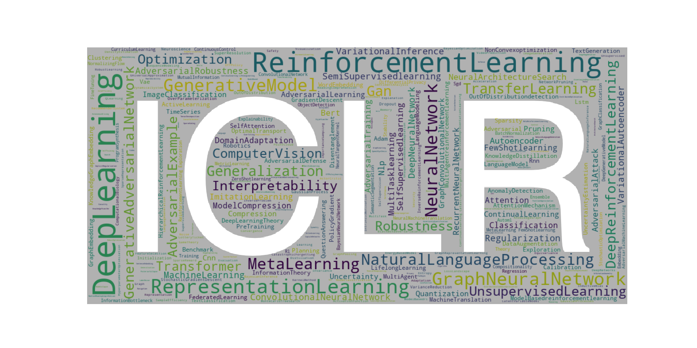
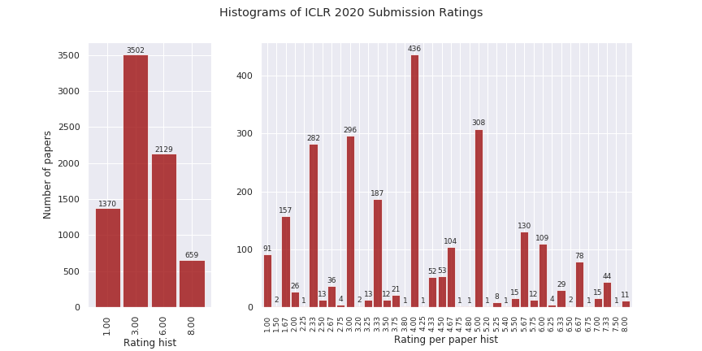
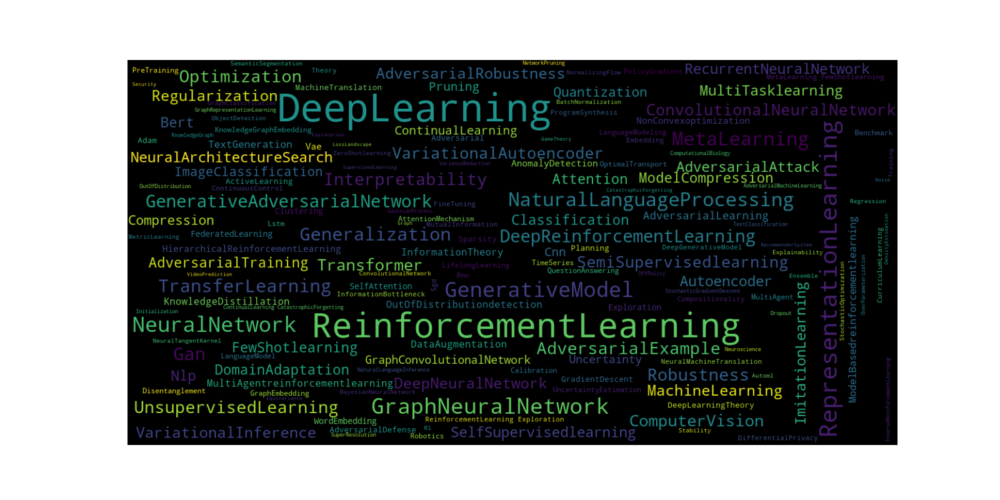
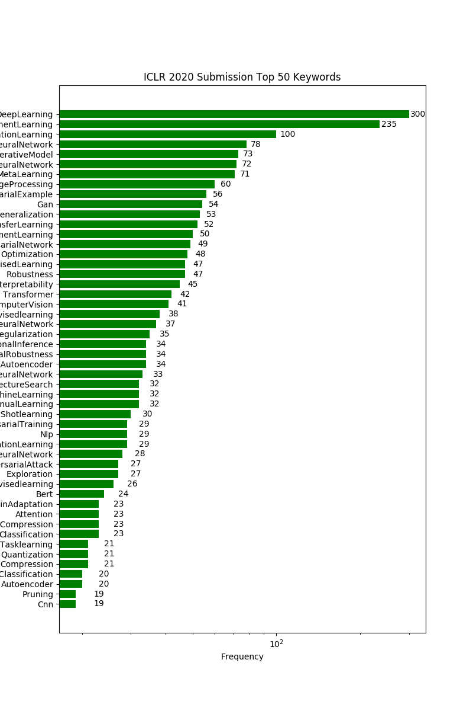
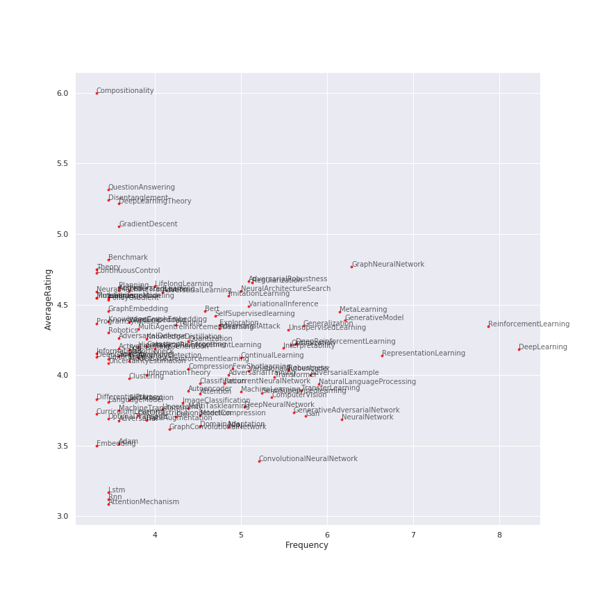
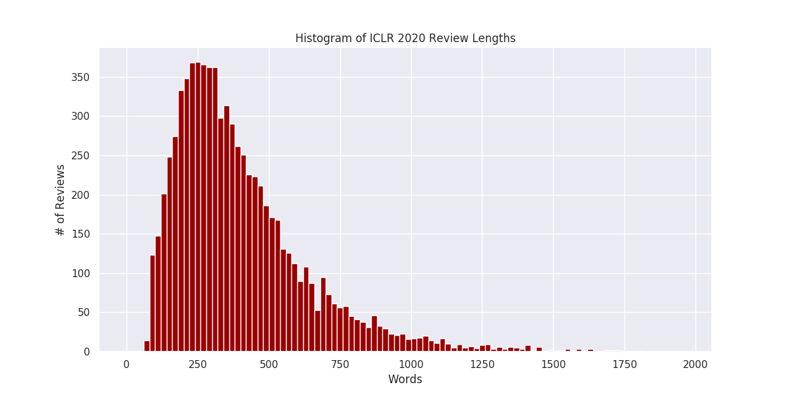
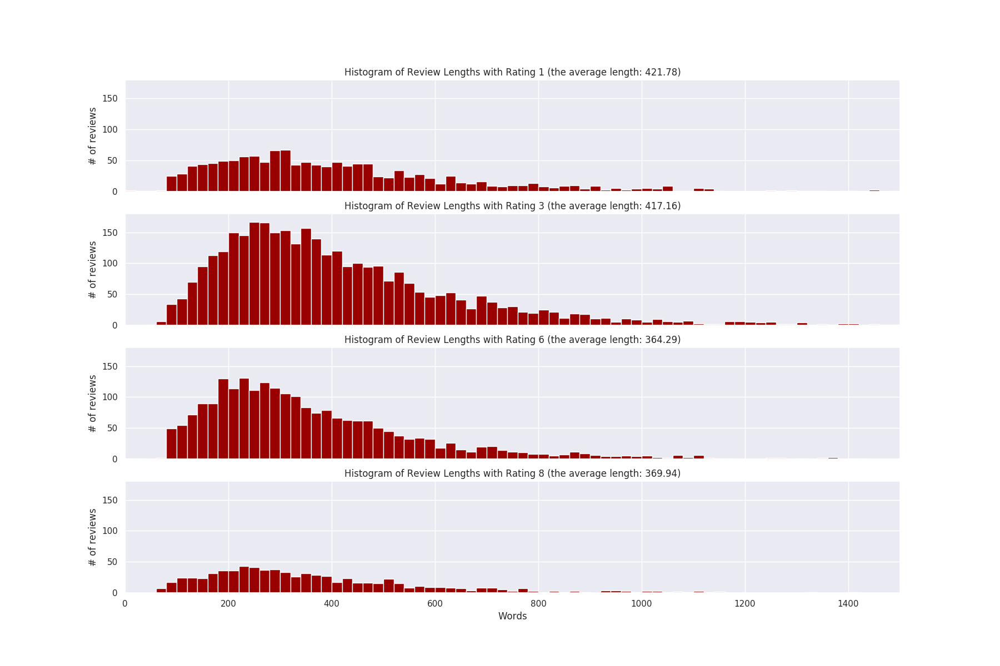

# Crawl and Visualize ICLR 2020 OpenReview Data

<p align="center">
    
</p>

## Descriptions

This Jupyter Notebook contains the data crawled from ICLR 2020 OpenReview webpages and their visualizations. The list of submissions (sorted by the average ratings) can be found [here](#Data).

## Prerequisites

- Python3.6
- [selenium](https://selenium-python.readthedocs.io/)
- [pyvirtualdisplay](https://pypi.org/project/PyVirtualDisplay/) (run on a headless device)
- [numpy](https://numpy.org/)
- [h5py](https://www.h5py.org/)
- [matplotlib](https://matplotlib.org/)
- [seaborn](https://seaborn.pydata.org/)
- [pandas](https://pandas.pydata.org/)
- [imageio](https://pypi.org/project/imageio/)
- [wordcloud](https://pypi.org/project/wordcloud/)

## Visualizations 

### Rating distribution

The distribution of reviewer ratings centers around 4 (mean: 3.9063).

<p align="center">
    
</p>

You can compute how many papers are beaten by yours with

```python
# See how many papers are beaten by yours
def PR(rating_mean, your_rating):
    pr = np.sum(your_rating > np.array(rating_mean))/len(rating_mean)*100
    return pr
my_rating = (6+6+3)/3.  # your average rating here
print('Your papar ({:.2f}) beats {:.2f}% of submissions based on the ratings.'.format(
          my_rating, PR(rating_mean, my_rating)))

#            accept rate       orals     posters
# ICLR 2017: 39.1% (198/507)    15         183
# ICLR 2018: 32.0% (314/981)    23         291
# ICLR 2019: 31.4% (500/1591)   24         476
# ICLR 2020: ?     (?/2594)
```
[Output]
```
Your papar (5.00) beats 69.97% of submissions based on the ratings.
```

### Word clouds

The word clouds formed by keywords of submissions show the hot topics including **deep learning**, **reinforcement learning**, **representation learning**, **generative models**, **graph neural network**, etc.
<p align="center">
    
</p>

This figure is plotted with python [word cloud generator](https://github.com/amueller/word_cloud) 

```python
from wordcloud import WordCloud
wordcloud = WordCloud(max_font_size=64, max_words=160, 
                      width=1280, height=640,
                      background_color="black").generate(' '.join(keywords))
plt.figure(figsize=(16, 8))
plt.imshow(wordcloud, interpolation="bilinear")
plt.axis("off")
plt.show()
```

### Frequent keywords

The top 50 common keywords and their frequency.

<p align="center">
    
</p>

The average reviewer ratings and the frequency of keywords indicate that to maximize your chance to get higher ratings would be using the keywords such as **compositionality**, **deep learning theory**, or **gradient descent**.

<p align="center">
    
</p>

### Review length histogram

The average review length is 395.36 words. The histogram is as follows.

<p align="center">
    
</p>

<p align="center">
    
</p>

## How it works

See [How to install Selenium and ChromeDriver on Ubuntu](#Install).

To crawl data from dynamic websites such as OpenReview, a headless web simulator can be created by

```python
from selenium import webdriver
from selenium.webdriver.chrome.options import Options
executable_path = '/Users/waltersun/Desktop/chromedriver'  # path to your executable browser
options = Options()
options.add_argument("--headless")
browser = webdriver.Chrome(options=options, executable_path=executable_path)  
```

Then, we can get the content from a webpage

```python
browser.get(url)
```

To know what content we to crawl, we need to inspect the webpage layout.

<p align="center">
    
</p>

I chose to get the content by

```python
key = browser.find_elements_by_class_name("note_content_field")
value = browser.find_elements_by_class_name("note_content_value")
```

The data includes the abstract, keywords, TL; DR, comments.

## <a id="Install"></a>Installing Selenium and ChromeDriver on Ubuntu
The following content is hugely borrowed from a nice [post](https://christopher.su/2015/selenium-chromedriver-ubuntu/) written by Christopher Su.

- Install Google Chrome for Debian/Ubuntu

```
sudo apt-get install libxss1 libappindicator1 libindicator7
wget https://dl.google.com/linux/direct/google-chrome-stable_current_amd64.deb

sudo dpkg -i google-chrome*.deb
sudo apt-get install -f
```

- Install `xvfb` to run Chrome on a headless device

```
sudo apt-get install xvfb
```

- Install ChromeDriver for 64-bit Linux

```
sudo apt-get install unzip  # If you don't have unzip package

wget -N http://chromedriver.storage.googleapis.com/2.26/chromedriver_linux64.zip
unzip chromedriver_linux64.zip
chmod +x chromedriver

sudo mv -f chromedriver /usr/local/share/chromedriver
sudo ln -s /usr/local/share/chromedriver /usr/local/bin/chromedriver
sudo ln -s /usr/local/share/chromedriver /usr/bin/chromedriver
```

If your system is 32-bit, please find the ChromeDriver releases [here](http://chromedriver.storage.googleapis.com/) and modify the above download command.

- Install Python dependencies (Selenium and pyvirtualdisplay)

```
pip install pyvirtualdisplay selenium
```

- Test your setup in Python

```python
from pyvirtualdisplay import Display
from selenium import webdriver

display = Display(visible=0, size=(1024, 1024))
display.start()
browser = webdriver.Chrome()
browser.get('http://shaohua0116.github.io/')
print(browser.title)
print(browser.find_element_by_class_name('bio').text)
```

## <a id="Data"></a>All ICLR 2020 OpenReview data
Collected at 2019-11-07 12:12:38.951798

Number of submissions: 2594 (withdrawn/desk reject submissions: 67)

| Rank | Average Rating | Title | Ratings | Variance | Decision |
| --- | --- | --- | --- | --- | --- |
| 1 | 8.00 | [Recurrent Hierarchical Topic-guided Neural Language Models](https://openreview.net/forum?id=Byl1W1rtvH) | 8, 8, 8 | 0.00 | N/A |
| 2 | 8.00 | [A Causal View On Robustness Of Neural Networks](https://openreview.net/forum?id=Hkxvl0EtDH) | 8, 8 | 0.00 | N/A |
| 3 | 8.00 | [Freelb: Enhanced Adversarial Training For Language Understanding](https://openreview.net/forum?id=BygzbyHFvB) | 8, 8 | 0.00 | N/A |
| 4 | 8.00 | [Smooth Markets: A Basic Mechanism For Organizing Gradient-based Learners](https://openreview.net/forum?id=B1xMEerYvB) | 8, 8 | 0.00 | N/A |
| 5 | 8.00 | [Cater: A Diagnostic Dataset For Compositional Actions & Temporal Reasoning](https://openreview.net/forum?id=HJgzt2VKPB) | 8, 8, 8 | 0.00 | N/A |
| 6 | 8.00 | [Gendice: Generalized Offline Estimation Of Stationary Values](https://openreview.net/forum?id=HkxlcnVFwB) | 8, 8, 8 | 0.00 | N/A |
| 7 | 8.00 | [Dynamics-aware Unsupervised Skill Discovery](https://openreview.net/forum?id=HJgLZR4KvH) | 8, 8, 8 | 0.00 | N/A |
| 8 | 8.00 | [On The "steerability" Of Generative Adversarial Networks](https://openreview.net/forum?id=HylsTT4FvB) | 8, 8, 8 | 0.00 | N/A |
| 9 | 8.00 | [Backpack: Packing More Into Backprop](https://openreview.net/forum?id=BJlrF24twB) | 8, 8, 8 | 0.00 | N/A |
| 10 | 8.00 | [A Theory Of Usable Information Under Computational Constraints](https://openreview.net/forum?id=r1eBeyHFDH) | 8, 8 | 0.00 | N/A |
| 11 | 8.00 | [Depth-width Trade-offs For Relu Networks Via Sharkovsky's Theorem](https://openreview.net/forum?id=BJe55gBtvH) | 8, 8 | 0.00 | N/A |
| 12 | 7.50 | [Optimal Strategies Against Generative Attacks](https://openreview.net/forum?id=BkgzMCVtPB) | 6, 8, 8, 8 | 0.87 | N/A |
| 13 | 7.33 | [Assemblenet: Searching For Multi-stream Neural Connectivity In Video Architectures](https://openreview.net/forum?id=SJgMK64Ywr) | 6, 8, 8 | 0.94 | N/A |
| 14 | 7.33 | [An Algorithm-agnostic Nas Benchmark](https://openreview.net/forum?id=HJxyZkBKDr) | 8, 6, 8 | 0.94 | N/A |
| 15 | 7.33 | [Kaleidoscope: An Efficient, Learnable Representation For All Structured Linear Maps](https://openreview.net/forum?id=BkgrBgSYDS) | 8, 8, 6 | 0.94 | N/A |
| 16 | 7.33 | [On The Convergence Of Fedavg On Non-iid Data](https://openreview.net/forum?id=HJxNAnVtDS) | 6, 8, 8 | 0.94 | N/A |
| 17 | 7.33 | [Enhancing Adversarial Defense By K-winners-take-all](https://openreview.net/forum?id=Skgvy64tvr) | 8, 6, 8 | 0.94 | N/A |
| 18 | 7.33 | [Learning To Balance: Bayesian Meta-learning For Imbalanced And Out-of-distribution Tasks](https://openreview.net/forum?id=rkeZIJBYvr) | 8, 8, 6 | 0.94 | N/A |
| 19 | 7.33 | [Massively Multilingual Sparse Word Representations](https://openreview.net/forum?id=HyeYTgrFPB) | 6, 8, 8 | 0.94 | N/A |
| 20 | 7.33 | [Learning Robust Representations Via Multi-view Information Bottleneck](https://openreview.net/forum?id=B1xwcyHFDr) | 6, 8, 8 | 0.94 | N/A |
| 21 | 7.33 | [When Do Variational Autoencoders Know What They Don't Know?](https://openreview.net/forum?id=Skg7VAEKDS) | 6, 8, 8 | 0.94 | N/A |
| 22 | 7.33 | [Convolutional Conditional Neural Processes](https://openreview.net/forum?id=Skey4eBYPS) | 6, 8, 8 | 0.94 | N/A |
| 23 | 7.33 | [Cross-lingual Alignment Vs Joint Training: A Comparative Study And A Simple Unified Framework](https://openreview.net/forum?id=S1l-C0NtwS) | 6, 8, 8 | 0.94 | N/A |
| 24 | 7.33 | [How Much Position Information Do Convolutional Neural Networks Encode?](https://openreview.net/forum?id=rJeB36NKvB) | 8, 6, 8 | 0.94 | N/A |
| 25 | 7.33 | [Intensity-free Learning Of Temporal Point Processes](https://openreview.net/forum?id=HygOjhEYDH) | 8, 6, 8 | 0.94 | N/A |
| 26 | 7.33 | [Ddsp: Differentiable Digital Signal Processing](https://openreview.net/forum?id=B1x1ma4tDr) | 8, 6, 8 | 0.94 | N/A |
| 27 | 7.33 | [Gradient Descent Maximizes The Margin Of Homogeneous Neural Networks](https://openreview.net/forum?id=SJeLIgBKPS) | 8, 8, 6 | 0.94 | N/A |
| 28 | 7.33 | [Adversarial Training And Provable Defenses: Bridging The Gap](https://openreview.net/forum?id=SJxSDxrKDr) | 8, 6, 8 | 0.94 | N/A |
| 29 | 7.33 | [Directional Message Passing For Molecular Graphs](https://openreview.net/forum?id=B1eWbxStPH) | 6, 8, 8 | 0.94 | N/A |
| 30 | 7.33 | [Energy-based Models For Atomic-resolution Protein Conformations](https://openreview.net/forum?id=S1e_9xrFvS) | 6, 8, 8 | 0.94 | N/A |
| 31 | 7.33 | [Sumo: Unbiased Estimation Of Log Marginal Probability For Latent Variable Models](https://openreview.net/forum?id=SylkYeHtwr) | 6, 8, 8 | 0.94 | N/A |
| 32 | 7.33 | [Harnessing The Power Of Infinitely Wide Deep Nets On Small-data Tasks](https://openreview.net/forum?id=rkl8sJBYvH) | 8, 6, 8 | 0.94 | N/A |
| 33 | 7.33 | [Mirror-generative Neural Machine Translation](https://openreview.net/forum?id=HkxQRTNYPH) | 8, 8, 6 | 0.94 | N/A |
| 34 | 7.33 | [Harnessing Structures For Value-based Planning And Reinforcement Learning](https://openreview.net/forum?id=rklHqRVKvH) | 6, 8, 8 | 0.94 | N/A |
| 35 | 7.33 | [Understanding And Robustifying Differentiable Architecture Search](https://openreview.net/forum?id=H1gDNyrKDS) | 8, 8, 6 | 0.94 | N/A |
| 36 | 7.33 | [Graph Neural Networks Exponentially Lose Expressive Power For Node Classification](https://openreview.net/forum?id=S1ldO2EFPr) | 8, 6, 8 | 0.94 | N/A |
| 37 | 7.33 | [Restricting The Flow: Information Bottlenecks For Attribution](https://openreview.net/forum?id=S1xWh1rYwB) | 8, 6, 8 | 0.94 | N/A |
| 38 | 7.33 | [Rna Secondary Structure Prediction By Learning Unrolled Algorithms](https://openreview.net/forum?id=S1eALyrYDH) | 8, 8, 6 | 0.94 | N/A |
| 39 | 7.33 | [Disentangling Neural Mechanisms For Perceptual Grouping](https://openreview.net/forum?id=HJxrVA4FDS) | 6, 8, 8 | 0.94 | N/A |
| 40 | 7.33 | [Network Deconvolution](https://openreview.net/forum?id=rkeu30EtvS) | 6, 8, 8 | 0.94 | N/A |
| 41 | 7.33 | [Generalization Of Two-layer Neural Networks: An Asymptotic Viewpoint](https://openreview.net/forum?id=H1gBsgBYwH) | 8, 6, 8 | 0.94 | N/A |
| 42 | 7.33 | [On Mutual Information Maximization For Representation Learning](https://openreview.net/forum?id=rkxoh24FPH) | 8, 8, 6 | 0.94 | N/A |
| 43 | 7.33 | [Geometric Analysis Of Nonconvex Optimization Landscapes For Overcomplete Learning](https://openreview.net/forum?id=rygixkHKDH) | 6, 8, 8 | 0.94 | N/A |
| 44 | 7.33 | [Scaling Autoregressive Video Models](https://openreview.net/forum?id=rJgsskrFwH) | 6, 8, 8 | 0.94 | N/A |
| 45 | 7.33 | [High Fidelity Speech Synthesis With Adversarial Networks](https://openreview.net/forum?id=r1gfQgSFDr) | 8, 6, 8 | 0.94 | N/A |
| 46 | 7.33 | [Differentiable Reasoning Over A Virtual Knowledge Base](https://openreview.net/forum?id=SJxstlHFPH) | 6, 8, 8 | 0.94 | N/A |
| 47 | 7.33 | [Thieves On Sesame Street! Model Extraction Of Bert-based Apis](https://openreview.net/forum?id=Byl5NREFDr) | 6, 8, 8 | 0.94 | N/A |
| 48 | 7.33 | [Physics-aware Difference Graph Networks For Sparsely-observed Dynamics](https://openreview.net/forum?id=r1gelyrtwH) | 8, 8, 6 | 0.94 | N/A |
| 49 | 7.33 | [Albert: A Lite Bert For Self-supervised Learning Of Language Representations](https://openreview.net/forum?id=H1eA7AEtvS) | 8, 8, 6 | 0.94 | N/A |
| 50 | 7.33 | [Seed Rl: Scalable And Efficient Deep-rl With Accelerated Central Inference](https://openreview.net/forum?id=rkgvXlrKwH) | 8, 6, 8 | 0.94 | N/A |
| 51 | 7.33 | [The Logical Expressiveness Of Graph Neural Networks](https://openreview.net/forum?id=r1lZ7AEKvB) | 6, 8, 8 | 0.94 | N/A |
| 52 | 7.33 | [Reconstructing Continuous Distributions Of 3d Protein Structure From Cryo-em Images](https://openreview.net/forum?id=SJxUjlBtwB) | 6, 8, 8 | 0.94 | N/A |
| 53 | 7.33 | [Learning Hierarchical Discrete Linguistic Units From Visually-grounded Speech](https://openreview.net/forum?id=B1elCp4KwH) | 6, 8, 8 | 0.94 | N/A |
| 54 | 7.33 | [Meta-learning With Warped Gradient Descent](https://openreview.net/forum?id=rkeiQlBFPB) | 6, 8, 8 | 0.94 | N/A |
| 55 | 7.33 | [Disagreement-regularized Imitation Learning](https://openreview.net/forum?id=rkgbYyHtwB) | 6, 8, 8 | 0.94 | N/A |
| 56 | 7.33 | [Online And Stochastic Optimization Beyond Lipschitz Continuity: A Riemannian Approach](https://openreview.net/forum?id=rkxZyaNtwB) | 8, 8, 6 | 0.94 | N/A |
| 57 | 7.00 | [On Bonus Based Exploration Methods In The Arcade Learning Environment](https://openreview.net/forum?id=BJewlyStDr) | 8, 6 | 1.00 | N/A |
| 58 | 7.00 | [Spectral Embedding Of Regularized Block Models](https://openreview.net/forum?id=H1l_0JBYwS) | 8, 6 | 1.00 | N/A |
| 59 | 7.00 | [And The Bit Goes Down: Revisiting The Quantization Of Neural Networks](https://openreview.net/forum?id=rJehVyrKwH) | 8, 6, 8, 6 | 1.00 | N/A |
| 60 | 7.00 | [Memo: A Deep Network For Flexible Combination Of Episodic Memories](https://openreview.net/forum?id=rJxlc0EtDr) | 6, 8 | 1.00 | N/A |
| 61 | 7.00 | [Order Learning And Its Application To Age Estimation](https://openreview.net/forum?id=HygsuaNFwr) | 6, 8 | 1.00 | N/A |
| 62 | 7.00 | [Biologically Inspired Sleep Algorithm For Increased Generalization And Adversarial Robustness In Deep Neural Networks](https://openreview.net/forum?id=r1xGnA4Kvr) | 6, 8 | 1.00 | N/A |
| 63 | 7.00 | [Vq-wav2vec: Self-supervised Learning Of Discrete Speech Representations](https://openreview.net/forum?id=rylwJxrYDS) | 8, 6, 8, 6 | 1.00 | N/A |
| 64 | 7.00 | [Sensible Adversarial Learning](https://openreview.net/forum?id=rJlf_RVKwr) | 8, 6 | 1.00 | N/A |
| 65 | 7.00 | [At Stability's Edge: How To Adjust Hyperparameters To Preserve Minima Selection In Asynchronous Training Of Neural Networks?](https://openreview.net/forum?id=Bkeb7lHtvH) | 6, 8 | 1.00 | N/A |
| 66 | 7.00 | [Quantum Algorithms For Deep Convolutional Neural Networks](https://openreview.net/forum?id=Hygab1rKDS) | 6, 8, 8, 6 | 1.00 | N/A |
| 67 | 7.00 | [Explanation By Progressive Exaggeration](https://openreview.net/forum?id=H1xFWgrFPS) | 6, 8 | 1.00 | N/A |
| 68 | 7.00 | [Sliced Cramer Synaptic Consolidation For Preserving Deeply Learned Representations](https://openreview.net/forum?id=BJge3TNKwH) | 6, 8 | 1.00 | N/A |
| 69 | 7.00 | [Collaborative Inter-agent Knowledge Distillation For Reinforcement Learning](https://openreview.net/forum?id=BkeYSlrYwH) | 6, 8 | 1.00 | N/A |
| 70 | 7.00 | [Split Lbi For Deep Learning: Structural Sparsity Via Differential Inclusion Paths](https://openreview.net/forum?id=SkxUrTVKDH) | 6, 8 | 1.00 | N/A |
| 71 | 7.00 | [Double Neural Counterfactual Regret Minimization](https://openreview.net/forum?id=ByedzkrKvH) | 8, 6 | 1.00 | N/A |
| 72 | 6.75 | [An Inductive Bias For Distances: Neural Nets That Respect The Triangle Inequality](https://openreview.net/forum?id=HJeiDpVFPr) | 8, 8, 3, 8 | 2.17 | N/A |
| 73 | 6.67 | [Implementation Matters In Deep Rl: A Case Study On Ppo And Trpo](https://openreview.net/forum?id=r1etN1rtPB) | 6, 8, 6 | 0.94 | N/A |
| 74 | 6.67 | [Contrastive Learning Of Structured World Models](https://openreview.net/forum?id=H1gax6VtDB) | 6, 6, 8 | 0.94 | N/A |
| 75 | 6.67 | [Doubly Robust Bias Reduction In Infinite Horizon Off-policy Estimation](https://openreview.net/forum?id=S1glGANtDr) | 6, 8, 6 | 0.94 | N/A |
| 76 | 6.67 | [Clevrer: Collision Events For Video Representation And Reasoning](https://openreview.net/forum?id=HkxYzANYDB) | 6, 8, 6 | 0.94 | N/A |
| 77 | 6.67 | [Can Gradient Clipping Mitigate Label Noise?](https://openreview.net/forum?id=rklB76EKPr) | 6, 6, 8 | 0.94 | N/A |
| 78 | 6.67 | [Snode: Spectral Discretization Of Neural Odes For System Identification](https://openreview.net/forum?id=Sye0XkBKvS) | 6, 6, 8 | 0.94 | N/A |
| 79 | 6.67 | [Intrinsically Motivated Discovery Of Diverse Patterns In Self-organizing Systems](https://openreview.net/forum?id=rkg6sJHYDr) | 6, 6, 8 | 0.94 | N/A |
| 80 | 6.67 | [Asymptotics Of Wide Networks From Feynman Diagrams](https://openreview.net/forum?id=S1gFvANKDS) | 8, 6, 6 | 0.94 | N/A |
| 81 | 6.67 | [Decoupling Representation And Classifier For Long-tailed Recognition](https://openreview.net/forum?id=r1gRTCVFvB) | 6, 8, 6 | 0.94 | N/A |
| 82 | 6.67 | [On Identifiability In Transformers](https://openreview.net/forum?id=BJg1f6EFDB) | 6, 8, 6 | 0.94 | N/A |
| 83 | 6.67 | [A Function Space View Of Bounded Norm Infinite Width Relu Nets: The Multivariate Case](https://openreview.net/forum?id=H1lNPxHKDH) | 6, 6, 8 | 0.94 | N/A |
| 84 | 6.67 | [Mathematical Reasoning In Latent Space](https://openreview.net/forum?id=Ske31kBtPr) | 8, 6, 6 | 0.94 | N/A |
| 85 | 6.67 | [Intriguing Properties Of Adversarial Training At Scale](https://openreview.net/forum?id=HyxJhCEFDS) | 6, 8, 6 | 0.94 | N/A |
| 86 | 6.67 | [Hilloc: Lossless Image Compression With Hierarchical Latent Variable Models](https://openreview.net/forum?id=r1lZgyBYwS) | 6, 6, 8 | 0.94 | N/A |
| 87 | 6.67 | [Discriminative Particle Filter Reinforcement Learning For Complex Partial Observations](https://openreview.net/forum?id=HJl8_eHYvS) | 8, 6, 6 | 0.94 | N/A |
| 88 | 6.67 | [A Mutual Information Maximization Perspective Of Language Representation Learning](https://openreview.net/forum?id=Syx79eBKwr) | 6, 6, 8 | 0.94 | N/A |
| 89 | 6.67 | [Measuring Compositional Generalization: A Comprehensive Method On Realistic Data](https://openreview.net/forum?id=SygcCnNKwr) | 6, 8, 6 | 0.94 | N/A |
| 90 | 6.67 | [Learning From Rules Generalizing Labeled Exemplars](https://openreview.net/forum?id=SkeuexBtDr) | 6, 8, 6 | 0.94 | N/A |
| 91 | 6.67 | [Tranquil Clouds: Neural Networks For Learning Temporally Coherent Features In Point Clouds](https://openreview.net/forum?id=BJeKh3VYDH) | 6, 8, 6 | 0.94 | N/A |
| 92 | 6.67 | [A Closer Look At Deep Policy Gradients](https://openreview.net/forum?id=ryxdEkHtPS) | 6, 6, 8 | 0.94 | N/A |
| 93 | 6.67 | [Provable Robustness Against All Adversarial -perturbations For](https://openreview.net/forum?id=rklk_ySYPB) | 6, 8, 6 | 0.94 | N/A |
| 94 | 6.67 | [Hamiltonian Generative Networks](https://openreview.net/forum?id=HJenn6VFvB) | 8, 6, 6 | 0.94 | N/A |
| 95 | 6.67 | [Pay Attention To Features, Transfer Learn Faster Cnns](https://openreview.net/forum?id=ryxyCeHtPB) | 8, 6, 6 | 0.94 | N/A |
| 96 | 6.67 | [Intrinsic Motivation For Encouraging Synergistic Behavior](https://openreview.net/forum?id=SJleNCNtDH) | 6, 8, 6 | 0.94 | N/A |
| 97 | 6.67 | [Structbert: Incorporating Language Structures Into Pre-training For Deep Language Understanding](https://openreview.net/forum?id=BJgQ4lSFPH) | 6, 8, 6 | 0.94 | N/A |
| 98 | 6.67 | [Learning To Learn By Zeroth-order Oracle](https://openreview.net/forum?id=ryxz8CVYDH) | 6, 8, 6 | 0.94 | N/A |
| 99 | 6.67 | [Batch-shaping For Learning Conditional Channel Gated Networks](https://openreview.net/forum?id=Bke89JBtvB) | 6, 6, 8 | 0.94 | N/A |
| 100 | 6.67 | [What Can Neural Networks Reason About?](https://openreview.net/forum?id=rJxbJeHFPS) | 6, 6, 8 | 0.94 | N/A |
| 101 | 6.67 | [Learning To Learn Kernels With Variational Random Features](https://openreview.net/forum?id=rJebgkSFDB) | 8, 6, 6 | 0.94 | N/A |
| 102 | 6.67 | [Pretrained Encyclopedia: Weakly Supervised Knowledge-pretrained Language Model](https://openreview.net/forum?id=BJlzm64tDH) | 6, 6, 8 | 0.94 | N/A |
| 103 | 6.67 | [Abductive Commonsense Reasoning](https://openreview.net/forum?id=Byg1v1HKDB) | 6, 8, 6 | 0.94 | N/A |
| 104 | 6.67 | [Neural Symbolic Reader: Scalable Integration Of Distributed And Symbolic Representations For Reading Comprehension](https://openreview.net/forum?id=ryxjnREFwH) | 6, 6, 8 | 0.94 | N/A |
| 105 | 6.67 | [Diverse Trajectory Forecasting With Determinantal Point Processes](https://openreview.net/forum?id=ryxnY3NYPS) | 8, 6, 6 | 0.94 | N/A |
| 106 | 6.67 | [On The Interaction Between Supervision And Self-play In Emergent Communication](https://openreview.net/forum?id=rJxGLlBtwH) | 6, 8, 6 | 0.94 | N/A |
| 107 | 6.67 | [Safe Policy Learning For Continuous Control](https://openreview.net/forum?id=HkxeThNFPH) | 6, 8, 6 | 0.94 | N/A |
| 108 | 6.67 | [Rényi Fair Inference](https://openreview.net/forum?id=HkgsUJrtDB) | 6, 6, 8 | 0.94 | N/A |
| 109 | 6.67 | [Scalable Model Compression By Entropy Penalized Reparameterization](https://openreview.net/forum?id=HkgxW0EYDS) | 6, 8, 6 | 0.94 | N/A |
| 110 | 6.67 | [Revisiting Self-training For Neural Sequence Generation](https://openreview.net/forum?id=SJgdnAVKDH) | 6, 6, 8 | 0.94 | N/A |
| 111 | 6.67 | [You Can Teach An Old Dog New Tricks! On Training Knowledge Graph Embeddings](https://openreview.net/forum?id=BkxSmlBFvr) | 8, 6, 6 | 0.94 | N/A |
| 112 | 6.67 | [Deepsphere: A Graph-based Spherical Cnn](https://openreview.net/forum?id=B1e3OlStPB) | 8, 6, 6 | 0.94 | N/A |
| 113 | 6.67 | [Learning Expensive Coordination: An Event-based Deep Rl Approach](https://openreview.net/forum?id=ryeG924twB) | 6, 8, 6 | 0.94 | N/A |
| 114 | 6.67 | [Learning To Control Pdes With Differentiable Physics](https://openreview.net/forum?id=HyeSin4FPB) | 6, 8, 6 | 0.94 | N/A |
| 115 | 6.67 | [Principled Weight Initialization For Hypernetworks](https://openreview.net/forum?id=H1lma24tPB) | 8, 6, 6 | 0.94 | N/A |
| 116 | 6.67 | [Learned Step Size Quantization](https://openreview.net/forum?id=rkgO66VKDS) | 6, 6, 8 | 0.94 | N/A |
| 117 | 6.67 | [Emergence Of Functional And Structural Properties Of The Head Direction System By Optimization Of Recurrent Neural Networks](https://openreview.net/forum?id=HklSeREtPB) | 6, 8, 6 | 0.94 | N/A |
| 118 | 6.67 | [Model Based Reinforcement Learning For Atari](https://openreview.net/forum?id=S1xCPJHtDB) | 6, 8, 6 | 0.94 | N/A |
| 119 | 6.67 | [The Ingredients Of Real World Robotic Reinforcement Learning](https://openreview.net/forum?id=rJe2syrtvS) | 6, 8, 6 | 0.94 | N/A |
| 120 | 6.67 | [Differentiation Of Blackbox Combinatorial Solvers](https://openreview.net/forum?id=BkevoJSYPB) | 6, 8, 6 | 0.94 | N/A |
| 121 | 6.67 | [On The Geometry And Learning Low-dimensional Embeddings For Directed Graphs](https://openreview.net/forum?id=SkxQp1StDH) | 6, 6, 8 | 0.94 | N/A |
| 122 | 6.67 | [Decoding As Dynamic Programming For Recurrent Autoregressive Models](https://openreview.net/forum?id=HklOo0VFDH) | 6, 6, 8 | 0.94 | N/A |
| 123 | 6.67 | [Poly-encoders: Architectures And Pre-training Strategies For Fast And Accurate Multi-sentence Scoring](https://openreview.net/forum?id=SkxgnnNFvH) | 6, 6, 8 | 0.94 | N/A |
| 124 | 6.67 | [Breaking Certified Defenses: Semantic Adversarial Examples With Spoofed Robustness Certificates](https://openreview.net/forum?id=HJxdTxHYvB) | 6, 8, 6 | 0.94 | N/A |
| 125 | 6.67 | [Latent Normalizing Flows For Many-to-many Cross Domain Mappings](https://openreview.net/forum?id=SJxE8erKDH) | 6, 6, 8 | 0.94 | N/A |
| 126 | 6.67 | [Reinforced Genetic Algorithm Learning For Optimizing Computation Graphs](https://openreview.net/forum?id=rkxDoJBYPB) | 8, 6, 6 | 0.94 | N/A |
| 127 | 6.67 | [Truth Or Backpropaganda? An Empirical Investigation Of Deep Learning Theory](https://openreview.net/forum?id=HyxyIgHFvr) | 6, 6, 8 | 0.94 | N/A |
| 128 | 6.67 | [Simple And Effective Regularization Methods For Training On Noisily Labeled Data With Generalization Guarantee](https://openreview.net/forum?id=Hke3gyHYwH) | 6, 8, 6 | 0.94 | N/A |
| 129 | 6.67 | [Understanding And Improving Information Transfer In Multi-task Learning](https://openreview.net/forum?id=SylzhkBtDB) | 8, 6, 6 | 0.94 | N/A |
| 130 | 6.67 | [On The Equivalence Between Node Embeddings And Structural Graph Representations](https://openreview.net/forum?id=SJxzFySKwH) | 6, 8, 6 | 0.94 | N/A |
| 131 | 6.67 | [Sqil: Imitation Learning Via Reinforcement Learning With Sparse Rewards](https://openreview.net/forum?id=S1xKd24twB) | 8, 6, 6 | 0.94 | N/A |
| 132 | 6.67 | [Deep Learning For Symbolic Mathematics](https://openreview.net/forum?id=S1eZYeHFDS) | 6, 8, 6 | 0.94 | N/A |
| 133 | 6.67 | [Inductive Representation Learning On Temporal Graphs](https://openreview.net/forum?id=rJeW1yHYwH) | 6, 6, 8 | 0.94 | N/A |
| 134 | 6.67 | [Data-dependent Gaussian Prior Objective For Language Generation](https://openreview.net/forum?id=S1efxTVYDr) | 6, 8, 6 | 0.94 | N/A |
| 135 | 6.67 | [Reformer: The Efficient Transformer](https://openreview.net/forum?id=rkgNKkHtvB) | 8, 6, 6 | 0.94 | N/A |
| 136 | 6.67 | [Consistency Regularization For Generative Adversarial Networks](https://openreview.net/forum?id=S1lxKlSKPH) | 8, 6, 6 | 0.94 | N/A |
| 137 | 6.67 | [Where Is The Information In A Deep Network?](https://openreview.net/forum?id=BkgHWkrtPB) | 6, 8, 6 | 0.94 | N/A |
| 138 | 6.67 | [Toward Amortized Ranking-critical Training For Collaborative Filtering](https://openreview.net/forum?id=HJxR7R4FvS) | 6, 6, 8 | 0.94 | N/A |
| 139 | 6.67 | [Continual Learning With Hypernetworks](https://openreview.net/forum?id=SJgwNerKvB) | 6, 8, 6 | 0.94 | N/A |
| 140 | 6.67 | [Scale-equivariant Steerable Networks](https://openreview.net/forum?id=HJgpugrKPS) | 6, 6, 8 | 0.94 | N/A |
| 141 | 6.67 | [Distributed Bandit Learning: Near-optimal Regret With Efficient Communication](https://openreview.net/forum?id=SJxZnR4YvB) | 8, 6, 6 | 0.94 | N/A |
| 142 | 6.67 | [A Neural Dirichlet Process Mixture Model For Task-free Continual Learning](https://openreview.net/forum?id=SJxSOJStPr) | 8, 6, 6 | 0.94 | N/A |
| 143 | 6.67 | [Cyclical Stochastic Gradient Mcmc For Bayesian Deep Learning](https://openreview.net/forum?id=rkeS1RVtPS) | 6, 6, 8 | 0.94 | N/A |
| 144 | 6.67 | [Improving Evolutionary Strategies With Generative Neural Networks](https://openreview.net/forum?id=SJlDDnVKwS) | 6, 6, 8 | 0.94 | N/A |
| 145 | 6.67 | [Why Gradient Clipping Accelerates Training: A Theoretical Justification For Adaptivity](https://openreview.net/forum?id=BJgnXpVYwS) | 6, 6, 8 | 0.94 | N/A |
| 146 | 6.67 | [Reducing Transformer Depth On Demand With Structured Dropout](https://openreview.net/forum?id=SylO2yStDr) | 6, 6, 8 | 0.94 | N/A |
| 147 | 6.67 | [Sequential Latent Knowledge Selection For Knowledge-grounded Dialogue](https://openreview.net/forum?id=Hke0K1HKwr) | 8, 6, 6 | 0.94 | N/A |
| 148 | 6.67 | [Learning To Plan In High Dimensions Via Neural Exploration-exploitation Trees](https://openreview.net/forum?id=rJgJDAVKvB) | 8, 6, 6 | 0.94 | N/A |
| 149 | 6.67 | [Disentanglement Through Nonlinear Ica With General Incompressible-flow Networks (gin)](https://openreview.net/forum?id=rygeHgSFDH) | 8, 6, 6 | 0.94 | N/A |
| 150 | 6.67 | [Mixed-curvature Variational Autoencoders](https://openreview.net/forum?id=S1g6xeSKDS) | 6, 6, 8 | 0.94 | N/A |
| 151 | 6.50 | [Dynamic Time Lag Regression: Predicting What & When](https://openreview.net/forum?id=SkxybANtDB) | 8, 6, 6, 6 | 0.87 | N/A |
| 152 | 6.50 | [Deepv2d: Video To Depth With Differentiable Structure From Motion](https://openreview.net/forum?id=HJeO7RNKPr) | 6, 6, 6, 8 | 0.87 | N/A |
| 153 | 6.33 | [Explain Your Move: Understanding Agent Actions Using Focused Feature Saliency](https://openreview.net/forum?id=SJgzLkBKPB) | 3, 8, 8 | 2.36 | N/A |
| 154 | 6.33 | [Triple Wins: Boosting Accuracy, Robustness And Efficiency Together By Enabling Input-adaptive Inference](https://openreview.net/forum?id=rJgzzJHtDB) | 3, 8, 8 | 2.36 | N/A |
| 155 | 6.33 | [Finite Depth And Width Corrections To The Neural Tangent Kernel](https://openreview.net/forum?id=SJgndT4KwB) | 3, 8, 8 | 2.36 | N/A |
| 156 | 6.33 | [Your Classifier Is Secretly An Energy Based Model And You Should Treat It Like One](https://openreview.net/forum?id=Hkxzx0NtDB) | 3, 8, 8 | 2.36 | N/A |
| 157 | 6.33 | [Counterfactuals Uncover The Modular Structure Of Deep Generative Models](https://openreview.net/forum?id=SJxDDpEKvH) | 8, 3, 8 | 2.36 | N/A |
| 158 | 6.33 | [Stable Rank Normalization For Improved Generalization In Neural Networks And Gans](https://openreview.net/forum?id=H1enKkrFDB) | 3, 8, 8 | 2.36 | N/A |
| 159 | 6.33 | [Generating Valid Euclidean Distance Matrices](https://openreview.net/forum?id=Skl3SkSKDr) | 8, 3, 8 | 2.36 | N/A |
| 160 | 6.33 | [Is A Good Representation Sufficient For Sample Efficient Reinforcement Learning?](https://openreview.net/forum?id=r1genAVKPB) | 8, 8, 3 | 2.36 | N/A |
| 161 | 6.33 | [Learning Disentangled Representations For Counterfactual Regression](https://openreview.net/forum?id=HkxBJT4YvB) | 8, 8, 3 | 2.36 | N/A |
| 162 | 6.33 | [A Meta-transfer Objective For Learning To Disentangle Causal Mechanisms](https://openreview.net/forum?id=ryxWIgBFPS) | 3, 8, 8 | 2.36 | N/A |
| 163 | 6.33 | [Accelerating Sgd With Momentum For Over-parameterized Learning](https://openreview.net/forum?id=r1gixp4FPH) | 8, 8, 3 | 2.36 | N/A |
| 164 | 6.33 | [Unbiased Contrastive Divergence Algorithm For Training Energy-based Latent Variable Models](https://openreview.net/forum?id=r1eyceSYPr) | 3, 8, 8 | 2.36 | N/A |
| 165 | 6.33 | [Encoder-agnostic Adaptation For Conditional Language Generation](https://openreview.net/forum?id=B1xq264YvH) | 3, 8, 8 | 2.36 | N/A |
| 166 | 6.33 | [Decentralized Distributed Ppo: Mastering Pointgoal Navigation](https://openreview.net/forum?id=H1gX8C4YPr) | 3, 8, 8 | 2.36 | N/A |
| 167 | 6.33 | [Polylogarithmic Width Suffices For Gradient Descent To Achieve Arbitrarily Small Test Error With Shallow Relu Networks](https://openreview.net/forum?id=HygegyrYwH) | 8, 3, 8 | 2.36 | N/A |
| 168 | 6.33 | [Fantastic Generalization Measures And Where To Find Them](https://openreview.net/forum?id=SJgIPJBFvH) | 8, 3, 8 | 2.36 | N/A |
| 169 | 6.33 | [Measuring And Improving The Use Of Graph Information In Graph Neural Networks](https://openreview.net/forum?id=rkeIIkHKvS) | 8, 3, 8 | 2.36 | N/A |
| 170 | 6.33 | [Learning-augmented Data Stream Algorithms](https://openreview.net/forum?id=HyxJ1xBYDH) | 3, 8, 8 | 2.36 | N/A |
| 171 | 6.33 | [Classification-based Anomaly Detection For General Data](https://openreview.net/forum?id=H1lK_lBtvS) | 8, 8, 3 | 2.36 | N/A |
| 172 | 6.33 | [Mogrifier Lstm](https://openreview.net/forum?id=SJe5P6EYvS) | 3, 8, 8 | 2.36 | N/A |
| 173 | 6.33 | [Low-resource Knowledge-grounded Dialogue Generation](https://openreview.net/forum?id=rJeIcTNtvS) | 3, 8, 8 | 2.36 | N/A |
| 174 | 6.33 | [Fast Task Inference With Variational Intrinsic Successor Features](https://openreview.net/forum?id=BJeAHkrYDS) | 8, 3, 8 | 2.36 | N/A |
| 175 | 6.33 | [Variational Template Machine For Data-to-text Generation](https://openreview.net/forum?id=HkejNgBtPB) | 8, 3, 8 | 2.36 | N/A |
| 176 | 6.33 | [Gauge Equivariant Spherical Cnns](https://openreview.net/forum?id=HJeYSxHFDS) | 3, 8, 8 | 2.36 | N/A |
| 177 | 6.33 | [Sparse Coding With Gated Learned Ista](https://openreview.net/forum?id=BygPO2VKPH) | 8, 8, 3 | 2.36 | N/A |
| 178 | 6.33 | [Observational Overfitting In Reinforcement Learning](https://openreview.net/forum?id=HJli2hNKDH) | 3, 8, 8 | 2.36 | N/A |
| 179 | 6.33 | [Minimizing Flops To Learn Efficient Sparse Representations](https://openreview.net/forum?id=SygpC6Ntvr) | 8, 3, 8 | 2.36 | N/A |
| 180 | 6.33 | [Deep Batch Active Learning By Diverse, Uncertain Gradient Lower Bounds](https://openreview.net/forum?id=ryghZJBKPS) | 8, 3, 8 | 2.36 | N/A |
| 181 | 6.33 | [Coherent Gradients: An Approach To Understanding Generalization In Gradient Descent-based Optimization](https://openreview.net/forum?id=ryeFY0EFwS) | 8, 8, 3 | 2.36 | N/A |
| 182 | 6.25 | [Utilizing Edge Features In Graph Neural Networks Via Variational Information Maximization](https://openreview.net/forum?id=BygZK2VYvB) | 3, 8, 8, 6 | 2.05 | N/A |
| 183 | 6.25 | [Geometric Insights Into The Convergence Of Nonlinear Td Learning](https://openreview.net/forum?id=SJezGp4YPr) | 8, 3, 6, 8 | 2.05 | N/A |
| 184 | 6.25 | [Improved Sample Complexities For Deep Neural Networks And Robust Classification Via An All-layer Margin](https://openreview.net/forum?id=HJe_yR4Fwr) | 6, 8, 8, 3 | 2.05 | N/A |
| 185 | 6.25 | [Dream To Control: Learning Behaviors By Latent Imagination](https://openreview.net/forum?id=S1lOTC4tDS) | 8, 3, 6, 8 | 2.05 | N/A |
| 186 | 6.00 | [Adversarial Policies: Attacking Deep Reinforcement Learning](https://openreview.net/forum?id=HJgEMpVFwB) | 6, 6, 6 | 0.00 | N/A |
| 187 | 6.00 | [Sampling-free Learning Of Bayesian Quantized Neural Networks](https://openreview.net/forum?id=rylVHR4FPB) | 6, 6, 6 | 0.00 | N/A |
| 188 | 6.00 | [Economy Statistical Recurrent Units For Inferring Nonlinear Granger Causality](https://openreview.net/forum?id=SyxV9ANFDH) | 6, 6, 6 | 0.00 | N/A |
| 189 | 6.00 | [Understanding Generalization In Recurrent Neural Networks](https://openreview.net/forum?id=rkgg6xBYDH) | 6, 6, 6 | 0.00 | N/A |
| 190 | 6.00 | [Stochastic Conditional Generative Networks With Basis Decomposition](https://openreview.net/forum?id=S1lSapVtwS) | 6, 6, 6 | 0.00 | N/A |
| 191 | 6.00 | [Vid2game: Controllable Characters Extracted From Real-world Videos](https://openreview.net/forum?id=SkxBUpEKwH) | 6, 6, 6 | 0.00 | N/A |
| 192 | 6.00 | [Actor-critic Provably Finds Nash Equilibria Of Linear-quadratic Mean-field Games](https://openreview.net/forum?id=H1lhqpEYPr) | 6, 6, 6 | 0.00 | N/A |
| 193 | 6.00 | [Deep Double Descent: Where Bigger Models And More Data Hurt](https://openreview.net/forum?id=B1g5sA4twr) | 6, 6 | 0.00 | N/A |
| 194 | 6.00 | [Using Hindsight To Anchor Past Knowledge In Continual Learning](https://openreview.net/forum?id=Hke12T4KPS) | 6, 6, 6 | 0.00 | N/A |
| 195 | 6.00 | [An Exponential Learning Rate Schedule For Batch Normalized Networks](https://openreview.net/forum?id=rJg8TeSFDH) | 6, 6 | 0.00 | N/A |
| 196 | 6.00 | [Option Discovery Using Deep Skill Chaining](https://openreview.net/forum?id=B1gqipNYwH) | 6, 6, 6 | 0.00 | N/A |
| 197 | 6.00 | [Learning Video Representations Using Contrastive Bidirectional Transformer](https://openreview.net/forum?id=rJgRMkrtDr) | 6, 6, 6 | 0.00 | N/A |
| 198 | 6.00 | [Continual Learning With Bayesian Neural Networks For Non-stationary Data](https://openreview.net/forum?id=SJlsFpVtDB) | 6, 6, 6 | 0.00 | N/A |
| 199 | 6.00 | [Multi-agent Reinforcement Learning For Networked System Control](https://openreview.net/forum?id=Syx7A3NFvH) | 6, 6, 6 | 0.00 | N/A |
| 200 | 6.00 | [Glad: Learning Sparse Graph Recovery](https://openreview.net/forum?id=BkxpMTEtPB) | 6, 6 | 0.00 | N/A |
| 201 | 6.00 | [Generative Imputation And Stochastic Prediction](https://openreview.net/forum?id=B1em9h4KDS) | 6, 6, 6 | 0.00 | N/A |
| 202 | 6.00 | [Defensive Tensorization: Randomized Tensor Parametrization For Robust Neural Networks](https://openreview.net/forum?id=r1gEXgBYDH) | 6, 6, 6 | 0.00 | N/A |
| 203 | 6.00 | [Hierarchical Foresight: Self-supervised Learning Of Long-horizon Tasks Via Visual Subgoal Generation](https://openreview.net/forum?id=H1gzR2VKDH) | 6, 6 | 0.00 | N/A |
| 204 | 6.00 | [Unpaired Point Cloud Completion On Real Scans Using Adversarial Training](https://openreview.net/forum?id=HkgrZ0EYwB) | 6, 6, 6 | 0.00 | N/A |
| 205 | 6.00 | [Dynamic Model Pruning With Feedback](https://openreview.net/forum?id=SJem8lSFwB) | 6, 6, 6 | 0.00 | N/A |
| 206 | 6.00 | [Differentially Private Meta-learning](https://openreview.net/forum?id=rJgqMRVYvr) | 6, 6 | 0.00 | N/A |
| 207 | 6.00 | [Robust And Interpretable Blind Image Denoising Via Bias-free Convolutional Neural Networks](https://openreview.net/forum?id=HJlSmC4FPS) | 6, 6, 6 | 0.00 | N/A |
| 208 | 6.00 | [Imitation Learning Via Off-policy Distribution Matching](https://openreview.net/forum?id=Hyg-JC4FDr) | 6, 6, 6 | 0.00 | N/A |
| 209 | 6.00 | [On Universal Equivariant Set Networks](https://openreview.net/forum?id=HkxTwkrKDB) | 6, 6, 6 | 0.00 | N/A |
| 210 | 6.00 | [Learning To Link](https://openreview.net/forum?id=S1eRbANtDB) | 6, 6, 6 | 0.00 | N/A |
| 211 | 6.00 | [Are Transformers Universal Approximators Of Sequence-to-sequence Functions?](https://openreview.net/forum?id=ByxRM0Ntvr) | 6, 6, 6 | 0.00 | N/A |
| 212 | 6.00 | [A Closer Look At The Approximation Capabilities Of Neural Networks](https://openreview.net/forum?id=rkevSgrtPr) | 6, 6, 6 | 0.00 | N/A |
| 213 | 6.00 | [Measuring The Reliability Of Reinforcement Learning Algorithms](https://openreview.net/forum?id=SJlpYJBKvH) | 6, 6, 6 | 0.00 | N/A |
| 214 | 6.00 | [Vimpnn: A Physics Informed Neural Network For Estimating Potential Energies Of Out-of-equilibrium Systems](https://openreview.net/forum?id=HJl8SgHtwr) | 6, 6 | 0.00 | N/A |
| 215 | 6.00 | [Remixmatch: Semi-supervised Learning With Distribution Matching And Augmentation Anchoring](https://openreview.net/forum?id=HklkeR4KPB) | 6, 6, 6 | 0.00 | N/A |
| 216 | 6.00 | [Quantifying The Cost Of Reliable Photo Authentication Via High-performance Learned Lossy Representations](https://openreview.net/forum?id=HyxG3p4twS) | 6, 6, 6 | 0.00 | N/A |
| 217 | 6.00 | [Projection Based Constrained Policy Optimization](https://openreview.net/forum?id=rke3TJrtPS) | 6, 6, 6 | 0.00 | N/A |
| 218 | 6.00 | [Composition-based Multi-relational Graph Convolutional Networks](https://openreview.net/forum?id=BylA_C4tPr) | 6, 6, 6 | 0.00 | N/A |
| 219 | 6.00 | [Causal Discovery With Reinforcement Learning](https://openreview.net/forum?id=S1g2skStPB) | 6, 6, 6 | 0.00 | N/A |
| 220 | 6.00 | [Discourse-based Evaluation Of Language Understanding](https://openreview.net/forum?id=B1em8TVtPr) | 6, 6, 6 | 0.00 | N/A |
| 221 | 6.00 | [Graphsaint: Graph Sampling Based Inductive Learning Method](https://openreview.net/forum?id=BJe8pkHFwS) | 6, 6, 6 | 0.00 | N/A |
| 222 | 6.00 | [Cophy: Counterfactual Learning Of Physical Dynamics](https://openreview.net/forum?id=SkeyppEFvS) | 6, 6, 6 | 0.00 | N/A |
| 223 | 6.00 | [Multiplicative Interactions And Where To Find Them](https://openreview.net/forum?id=rylnK6VtDH) | 6, 6, 6 | 0.00 | N/A |
| 224 | 6.00 | [Towards Fast Adaptation Of Neural Architectures With Meta Learning](https://openreview.net/forum?id=r1eowANFvr) | 6, 6, 6 | 0.00 | N/A |
| 225 | 6.00 | [Off-policy Actor-critic With Shared Experience Replay](https://openreview.net/forum?id=HygaikBKvS) | 6, 6, 6 | 0.00 | N/A |
| 226 | 6.00 | [Query2box: Reasoning Over Knowledge Graphs In Vector Space Using Box Embeddings](https://openreview.net/forum?id=BJgr4kSFDS) | 6, 6, 6 | 0.00 | N/A |
| 227 | 6.00 | [Hyper-sagnn: A Self-attention Based Graph Neural Network For Hypergraphs](https://openreview.net/forum?id=ryeHuJBtPH) | 6, 6 | 0.00 | N/A |
| 228 | 6.00 | [Cross-domain Few-shot Classification Via Learned Feature-wise Transformation](https://openreview.net/forum?id=SJl5Np4tPr) | 6, 6, 6 | 0.00 | N/A |
| 229 | 6.00 | [Slomo: Improving Communication-efficient Distributed Sgd With Slow Momentum](https://openreview.net/forum?id=SkxJ8REYPH) | 6, 6, 6 | 0.00 | N/A |
| 230 | 6.00 | [Cm3: Cooperative Multi-goal Multi-stage Multi-agent Reinforcement Learning](https://openreview.net/forum?id=S1lEX04tPr) | 6, 6, 6 | 0.00 | N/A |
| 231 | 6.00 | [Graph Convolutional Networks For Learning With Few Clean And Many Noisy Labels](https://openreview.net/forum?id=Bke6vTVYwH) | 6, 6 | 0.00 | N/A |
| 232 | 6.00 | [Strategies For Pre-training Graph Neural Networks](https://openreview.net/forum?id=HJlWWJSFDH) | 6, 6, 6 | 0.00 | N/A |
| 233 | 6.00 | [In Search For A Sat-friendly Binarized Neural Network Architecture](https://openreview.net/forum?id=SJx-j64FDr) | 6, 6, 6 | 0.00 | N/A |
| 234 | 6.00 | [Last-iterate Convergence Rates For Min-max Optimization](https://openreview.net/forum?id=SylGpT4FPS) | 6, 6, 6 | 0.00 | N/A |
| 235 | 6.00 | [Curvature Graph Network](https://openreview.net/forum?id=BylEqnVFDB) | 6, 6, 6 | 0.00 | N/A |
| 236 | 6.00 | [To Relieve Your Headache Of Training An Mrf, Take Advil](https://openreview.net/forum?id=Sylgsn4Fvr) | 6, 6, 6 | 0.00 | N/A |
| 237 | 6.00 | [Training Binary Neural Networks With Real-to-binary Convolutions](https://openreview.net/forum?id=BJg4NgBKvH) | 6, 6, 6, 6 | 0.00 | N/A |
| 238 | 6.00 | [Locality And Compositionality In Zero-shot Learning](https://openreview.net/forum?id=Hye_V0NKwr) | 6, 6, 6 | 0.00 | N/A |
| 239 | 6.00 | [Extreme Tensoring For Low-memory Preconditioning](https://openreview.net/forum?id=SklKcRNYDH) | 6, 6, 6 | 0.00 | N/A |
| 240 | 6.00 | [Analysis Of Video Feature Learning In Two-stream Cnns On The Example Of Zebrafish Swim Bout Classification](https://openreview.net/forum?id=rJgQkT4twH) | 6, 6, 6 | 0.00 | N/A |
| 241 | 6.00 | [Beyond Linearization: On Quadratic And Higher-order Approximation Of Wide Neural Networks](https://openreview.net/forum?id=rkllGyBFPH) | 6, 6, 6 | 0.00 | N/A |
| 242 | 6.00 | [V-mpo: On-policy Maximum A Posteriori Policy Optimization For Discrete And Continuous Control](https://openreview.net/forum?id=SylOlp4FvH) | 6, 6, 6 | 0.00 | N/A |
| 243 | 6.00 | [Mlmodelscope: A Distributed Platform For Ml Model Evaluation And Benchmarking At Scale](https://openreview.net/forum?id=ryx2wp4tvS) | 6, 6 | 0.00 | N/A |
| 244 | 6.00 | [Consistency-based Semi-supervised Active Learning: Towards Minimizing Labeling Budget](https://openreview.net/forum?id=HJl8SkBYPr) | 6, 6 | 0.00 | N/A |
| 245 | 6.00 | [Automated Curriculum Generation Through Setter-solver Interactions](https://openreview.net/forum?id=H1e0Wp4KvH) | 6, 6, 6 | 0.00 | N/A |
| 246 | 6.00 | [The Effect Of Residual Architecture On The Per-layer Gradient Of Deep Networks](https://openreview.net/forum?id=H1eArT4tPH) | 6, 6, 6 | 0.00 | N/A |
| 247 | 6.00 | [Neural Communication Systems With Bandwidth-limited Channel](https://openreview.net/forum?id=rJgD2ySFDr) | 6, 6 | 0.00 | N/A |
| 248 | 6.00 | [The Intriguing Role Of Module Criticality In The Generalization Of Deep Networks](https://openreview.net/forum?id=S1e4jkSKvB) | 6, 6 | 0.00 | N/A |
| 249 | 6.00 | [Dividemix: Learning With Noisy Labels As Semi-supervised Learning](https://openreview.net/forum?id=HJgExaVtwr) | 6, 6, 6 | 0.00 | N/A |
| 250 | 6.00 | [Distance-based Learning From Errors For Confidence Calibration](https://openreview.net/forum?id=BJeB5hVtvB) | 6, 6, 6 | 0.00 | N/A |
| 251 | 6.00 | [Federated Learning With Matched Averaging](https://openreview.net/forum?id=BkluqlSFDS) | 6, 6, 6 | 0.00 | N/A |
| 252 | 6.00 | [Drawing Early-bird Tickets: Toward More Efficient Training Of Deep Networks](https://openreview.net/forum?id=BJxsrgStvr) | 6, 6, 6 | 0.00 | N/A |
| 253 | 6.00 | [Deformable Kernels: Adapting Effective Receptive Fields For Object Deformation](https://openreview.net/forum?id=SkxSv6VFvS) | 6, 6, 6 | 0.00 | N/A |
| 254 | 6.00 | [Selection Via Proxy: Efficient Data Selection For Deep Learning](https://openreview.net/forum?id=HJg2b0VYDr) | 6, 6 | 0.00 | N/A |
| 255 | 6.00 | [Understanding The Limitations Of Variational Mutual Information Estimators](https://openreview.net/forum?id=B1x62TNtDS) | 6, 6, 6 | 0.00 | N/A |
| 256 | 6.00 | [Meta-graph: Few Shot Link Prediction Via Meta Learning](https://openreview.net/forum?id=BJepcaEtwB) | 6, 6, 6 | 0.00 | N/A |
| 257 | 6.00 | [Pseudo-lidar++: Accurate Depth For 3d Object Detection In Autonomous Driving](https://openreview.net/forum?id=BJedHRVtPB) | 6, 6, 6 | 0.00 | N/A |
| 258 | 6.00 | [Prediction Poisoning: Towards Defenses Against Dnn Model Stealing Attacks](https://openreview.net/forum?id=SyevYxHtDB) | 6, 6 | 0.00 | N/A |
| 259 | 6.00 | [Compression Based Bound For Non-compressed Network: Unified Generalization Error Analysis Of Large Compressible Deep Neural Network](https://openreview.net/forum?id=ByeGzlrKwH) | 6, 6, 6 | 0.00 | N/A |
| 260 | 6.00 | [Distributed Online Optimization With Long-term Constraints](https://openreview.net/forum?id=Syee1pVtDS) | 6, 6, 6 | 0.00 | N/A |
| 261 | 6.00 | [Bounds On Over-parameterization For Guaranteed Existence Of Descent Paths In Shallow Relu Networks](https://openreview.net/forum?id=BkgXHTNtvS) | 6, 6 | 0.00 | N/A |
| 262 | 6.00 | [On Generalization Error Bounds Of Noisy Gradient Methods For Non-convex Learning](https://openreview.net/forum?id=SkxxtgHKPS) | 6, 6, 6 | 0.00 | N/A |
| 263 | 6.00 | [Meta Reinforcement Learning With Autonomous Inference Of Subtask Dependencies](https://openreview.net/forum?id=HkgsWxrtPB) | 6, 6, 6 | 0.00 | N/A |
| 264 | 6.00 | [On Computation And Generalization Of Gener- Ative Adversarial Imitation Learning](https://openreview.net/forum?id=BJl-5pNKDB) | 6, 6, 6 | 0.00 | N/A |
| 265 | 6.00 | [Reweighted Proximal Pruning For Large-scale Language Representation](https://openreview.net/forum?id=r1gBOxSFwr) | 6, 6, 6 | 0.00 | N/A |
| 266 | 6.00 | [Unrestricted Adversarial Examples Via Semantic Manipulation](https://openreview.net/forum?id=Sye_OgHFwH) | 6, 6, 6 | 0.00 | N/A |
| 267 | 6.00 | [Expected Information Maximization: Using The I-projection For Mixture Density Estimation](https://openreview.net/forum?id=ByglLlHFDS) | 6, 6, 6 | 0.00 | N/A |
| 268 | 6.00 | [Lipschitz Lifelong Reinforcement Learning](https://openreview.net/forum?id=BylalAEtvB) | 6 | 0.00 | N/A |
| 269 | 6.00 | [U-gat-it: Unsupervised Generative Attentional Networks With Adaptive Layer-instance Normalization For Image-to-image Translation](https://openreview.net/forum?id=BJlZ5ySKPH) | 6, 6, 6 | 0.00 | N/A |
| 270 | 6.00 | [Adjustable Real-time Style Transfer](https://openreview.net/forum?id=HJe_Z04Yvr) | 6, 6 | 0.00 | N/A |
| 271 | 6.00 | [Adversarial Example Detection And Classification With Asymmetrical Adversarial Training](https://openreview.net/forum?id=SJeQEp4YDH) | 6, 6, 6 | 0.00 | N/A |
| 272 | 6.00 | [Caql: Continuous Action Q-learning](https://openreview.net/forum?id=BkxXe0Etwr) | 6, 6 | 0.00 | N/A |
| 273 | 6.00 | [Deep Orientation Uncertainty Learning Based On A Bingham Loss](https://openreview.net/forum?id=ryloogSKDS) | 6, 6 | 0.00 | N/A |
| 274 | 6.00 | [Towards A Deep Network Architecture For Structured Smoothness](https://openreview.net/forum?id=Hklr204Fvr) | 6, 6 | 0.00 | N/A |
| 275 | 6.00 | [Deep Semi-supervised Anomaly Detection](https://openreview.net/forum?id=HkgH0TEYwH) | 6, 6, 6 | 0.00 | N/A |
| 276 | 6.00 | [Roberta: A Robustly Optimized Bert Pretraining Approach](https://openreview.net/forum?id=SyxS0T4tvS) | 6, 6, 6 | 0.00 | N/A |
| 277 | 6.00 | [Logan: Latent Optimisation For Generative Adversarial Networks](https://openreview.net/forum?id=rJeU_1SFvr) | 6, 6 | 0.00 | N/A |
| 278 | 6.00 | [Stochastic Auc Maximization With Deep Neural Networks](https://openreview.net/forum?id=HJepXaVYDr) | 6, 6, 6 | 0.00 | N/A |
| 279 | 6.00 | [Physics-as-inverse-graphics: Unsupervised Physical Parameter Estimation From Video](https://openreview.net/forum?id=BJeKwTNFvB) | 6, 6, 6 | 0.00 | N/A |
| 280 | 6.00 | [Deephoyer: Learning Sparser Neural Network With Differentiable Scale-invariant Sparsity Measures](https://openreview.net/forum?id=rylBK34FDS) | 6, 6, 6 | 0.00 | N/A |
| 281 | 6.00 | [The Implicit Bias Of Depth: How Incremental Learning Drives Generalization](https://openreview.net/forum?id=H1lj0nNFwB) | 6, 6 | 0.00 | N/A |
| 282 | 6.00 | [Unsupervised Clustering Using Pseudo-semi-supervised Learning](https://openreview.net/forum?id=rJlnxkSYPS) | 6, 6, 6 | 0.00 | N/A |
| 283 | 6.00 | [Theory And Evaluation Metrics For Learning Disentangled Representations](https://openreview.net/forum?id=HJgK0h4Ywr) | 6, 6, 6 | 0.00 | N/A |
| 284 | 6.00 | [Deep Imitative Models For Flexible Inference, Planning, And Control](https://openreview.net/forum?id=Skl4mRNYDr) | 6, 6, 6 | 0.00 | N/A |
| 285 | 6.00 | [Neural Networks Are A Priori Biased Towards Boolean Functions With Low Entropy](https://openreview.net/forum?id=Skgeip4FPr) | 6, 6 | 0.00 | N/A |
| 286 | 6.00 | [A Stochastic Derivative Free Optimization Method With Momentum](https://openreview.net/forum?id=HylAoJSKvH) | 6, 6, 6 | 0.00 | N/A |
| 287 | 6.00 | [Exploring Model-based Planning With Policy Networks](https://openreview.net/forum?id=H1exf64KwH) | 6, 6, 6 | 0.00 | N/A |
| 288 | 6.00 | [Influence-based Multi-agent Exploration](https://openreview.net/forum?id=BJgy96EYvr) | 6, 6, 6 | 0.00 | N/A |
| 289 | 6.00 | [Enabling Deep Spiking Neural Networks With Hybrid Conversion And Spike Timing Dependent Backpropagation](https://openreview.net/forum?id=B1xSperKvH) | 6, 6 | 0.00 | N/A |
| 290 | 6.00 | [Masked Based Unsupervised Content Transfer](https://openreview.net/forum?id=BJe-91BtvH) | 6, 6, 6 | 0.00 | N/A |
| 291 | 6.00 | [Lagrangian Fluid Simulation With Continuous Convolutions](https://openreview.net/forum?id=B1lDoJSYDH) | 6, 6, 6 | 0.00 | N/A |
| 292 | 6.00 | [Fsnet: Compression Of Deep Convolutional Neural Networks By Filter Summary](https://openreview.net/forum?id=S1xtORNFwH) | 6, 6 | 0.00 | N/A |
| 293 | 6.00 | [On The Variance Of The Adaptive Learning Rate And Beyond](https://openreview.net/forum?id=rkgz2aEKDr) | 6, 6, 6 | 0.00 | N/A |
| 294 | 6.00 | [Kernelized Wasserstein Natural Gradient](https://openreview.net/forum?id=Hklz71rYvS) | 6, 6, 6 | 0.00 | N/A |
| 295 | 5.75 | [Unveiling Hidden Biases In Deep Networks With Classification Images And Spike Triggered Analysis](https://openreview.net/forum?id=H1ebhnEYDH) | 6, 6, 8, 3 | 1.79 | N/A |
| 296 | 5.75 | [Encoding Word Order In Complex Embeddings](https://openreview.net/forum?id=Hke-WTVtwr) | 8, 3, 6, 6 | 1.79 | N/A |
| 297 | 5.75 | [A Mention-pair Model Of Annotation With Nonparametric User Communities](https://openreview.net/forum?id=HygiDTVKPr) | 6, 6, 8, 3 | 1.79 | N/A |
| 298 | 5.75 | [Span Recovery For Deep Neural Networks With Applications To Input Obfuscation](https://openreview.net/forum?id=B1guLAVFDB) | 3, 6, 8, 6 | 1.79 | N/A |
| 299 | 5.75 | [Towards Verified Robustness Under Text Deletion Interventions](https://openreview.net/forum?id=SyxhVkrYvr) | 3, 6, 8, 6 | 1.79 | N/A |
| 300 | 5.75 | [Conditional Invertible Neural Networks For Guided Image Generation](https://openreview.net/forum?id=SyxC9TEtPH) | 8, 3, 6, 6 | 1.79 | N/A |
| 301 | 5.75 | [Maximum Likelihood Constraint Inference For Inverse Reinforcement Learning](https://openreview.net/forum?id=BJliakStvH) | 8, 6, 3, 6 | 1.79 | N/A |
| 302 | 5.75 | [Mutual Information Gradient Estimation For Representation Learning](https://openreview.net/forum?id=ByxaUgrFvH) | 6, 3, 6, 8 | 1.79 | N/A |
| 303 | 5.75 | [Dynamics-aware Embeddings](https://openreview.net/forum?id=BJgZGeHFPH) | 3, 6, 6, 8 | 1.79 | N/A |
| 304 | 5.75 | [Image-guided Neural Object Rendering](https://openreview.net/forum?id=Hyg9anEFPS) | 6, 3, 8, 6 | 1.79 | N/A |
| 305 | 5.75 | [Learning Compositional Koopman Operators For Model-based Control](https://openreview.net/forum?id=H1ldzA4tPr) | 3, 6, 6, 8 | 1.79 | N/A |
| 306 | 5.75 | [Learning The Difference That Makes A Difference With Counterfactually-augmented Data](https://openreview.net/forum?id=Sklgs0NFvr) | 8, 6, 1, 8 | 2.86 | N/A |
| 307 | 5.67 | [Depth-adaptive Transformer](https://openreview.net/forum?id=SJg7KhVKPH) | 8, 6, 3 | 2.05 | N/A |
| 308 | 5.67 | [Self-adversarial Learning With Comparative Discrimination For Text Generation](https://openreview.net/forum?id=B1l8L6EtDS) | 3, 6, 8 | 2.05 | N/A |
| 309 | 5.67 | [Variational Autoencoders For Highly Multivariate Spatial Point Processes Intensities](https://openreview.net/forum?id=B1lj20NFDS) | 6, 8, 3 | 2.05 | N/A |
| 310 | 5.67 | [Neural Network Branching For Neural Network Verification](https://openreview.net/forum?id=B1evfa4tPB) | 6, 3, 8 | 2.05 | N/A |
| 311 | 5.67 | [Domain Adaptive Multiflow Networks](https://openreview.net/forum?id=rJxycxHKDS) | 8, 6, 3 | 2.05 | N/A |
| 312 | 5.67 | [Ride: Rewarding Impact-driven Exploration For Procedurally-generated Environments](https://openreview.net/forum?id=rkg-TJBFPB) | 3, 6, 8 | 2.05 | N/A |
| 313 | 5.67 | [Discovering Motor Programs By Recomposing Demonstrations](https://openreview.net/forum?id=rkgHY0NYwr) | 3, 6, 8 | 2.05 | N/A |
| 314 | 5.67 | [Bertscore: Evaluating Text Generation With Bert](https://openreview.net/forum?id=SkeHuCVFDr) | 6, 3, 8 | 2.05 | N/A |
| 315 | 5.67 | [Implicit Bias Of Gradient Descent Based Adversarial Training On Separable Data](https://openreview.net/forum?id=HkgTTh4FDH) | 6, 8, 3 | 2.05 | N/A |
| 316 | 5.67 | [B-spline Cnns On Lie Groups](https://openreview.net/forum?id=H1gBhkBFDH) | 6, 3, 8 | 2.05 | N/A |
| 317 | 5.67 | [Symplectic Ode-net: Learning Hamiltonian Dynamics With Control](https://openreview.net/forum?id=ryxmb1rKDS) | 3, 8, 6 | 2.05 | N/A |
| 318 | 5.67 | [Learning Transport Cost From Subset Correspondence](https://openreview.net/forum?id=SJlRUkrFPS) | 8, 6, 3 | 2.05 | N/A |
| 319 | 5.67 | [Neural Oblivious Decision Ensembles For Deep Learning On Tabular Data](https://openreview.net/forum?id=r1eiu2VtwH) | 3, 8, 6 | 2.05 | N/A |
| 320 | 5.67 | [Fspool: Learning Set Representations With Featurewise Sort Pooling](https://openreview.net/forum?id=HJgBA2VYwH) | 6, 8, 3 | 2.05 | N/A |
| 321 | 5.67 | [Universal Approximation With Deep Narrow Networks](https://openreview.net/forum?id=B1xGGTEtDH) | 3, 6, 8 | 2.05 | N/A |
| 322 | 5.67 | [Denoising And Regularization Via Exploiting The Structural Bias Of Convolutional Generators](https://openreview.net/forum?id=HJeqhA4YDS) | 3, 8, 6 | 2.05 | N/A |
| 323 | 5.67 | [A Latent Morphology Model For Open-vocabulary Neural Machine Translation](https://openreview.net/forum?id=BJxSI1SKDH) | 8, 3, 6 | 2.05 | N/A |
| 324 | 5.67 | [Empirical Studies On The Properties Of Linear Regions In Deep Neural Networks](https://openreview.net/forum?id=SkeFl1HKwr) | 8, 6, 3 | 2.05 | N/A |
| 325 | 5.67 | [Mixout: Effective Regularization To Finetune Large-scale Pretrained Language Models](https://openreview.net/forum?id=HkgaETNtDB) | 3, 8, 6 | 2.05 | N/A |
| 326 | 5.67 | [Training Individually Fair Ml Models With Sensitive Subspace Robustness](https://openreview.net/forum?id=B1gdkxHFDH) | 8, 6, 3 | 2.05 | N/A |
| 327 | 5.67 | [Continuous Meta-learning Without Tasks](https://openreview.net/forum?id=r1l1myStwr) | 8, 6, 3 | 2.05 | N/A |
| 328 | 5.67 | [Universal Approximation With Certified Networks](https://openreview.net/forum?id=B1gX8kBtPr) | 6, 8, 3 | 2.05 | N/A |
| 329 | 5.67 | [Lambdanet: Probabilistic Type Inference Using Graph Neural Networks](https://openreview.net/forum?id=Hkx6hANtwH) | 3, 8, 6 | 2.05 | N/A |
| 330 | 5.67 | [Automated Relational Meta-learning](https://openreview.net/forum?id=rklp93EtwH) | 3, 6, 8 | 2.05 | N/A |
| 331 | 5.67 | [A Deep Recurrent Neural Network Via Unfolding Reweighted L1-l1 Minimization](https://openreview.net/forum?id=B1eYlgBYPH) | 8, 6, 3 | 2.05 | N/A |
| 332 | 5.67 | [Deep Neuroethology Of A Virtual Rodent](https://openreview.net/forum?id=SyxrxR4KPS) | 6, 3, 8 | 2.05 | N/A |
| 333 | 5.67 | [Learning Heuristics For Quantified Boolean Formulas Through Reinforcement Learning](https://openreview.net/forum?id=BJluxREKDB) | 6, 8, 3 | 2.05 | N/A |
| 334 | 5.67 | [Neural Policy Gradient Methods: Global Optimality And Rates Of Convergence](https://openreview.net/forum?id=BJgQfkSYDS) | 3, 6, 8 | 2.05 | N/A |
| 335 | 5.67 | [Efficient Bi-directional Verification Of Relu Networks Via Quadratic Programming](https://openreview.net/forum?id=Bkx4AJSFvB) | 6, 8, 3 | 2.05 | N/A |
| 336 | 5.67 | [Learning To Group: A Bottom-up Framework For 3d Part Discovery In Unseen Categories](https://openreview.net/forum?id=rkl8dlHYvB) | 3, 6, 8 | 2.05 | N/A |
| 337 | 5.67 | [Making Sense Of Reinforcement Learning And Probabilistic Inference](https://openreview.net/forum?id=S1xitgHtvS) | 6, 3, 8 | 2.05 | N/A |
| 338 | 5.67 | [Transferable Perturbations Of Deep Feature Distributions](https://openreview.net/forum?id=rJxAo2VYwr) | 8, 1, 8 | 3.30 | N/A |
| 339 | 5.67 | [Nas Evaluation Is Frustratingly Hard](https://openreview.net/forum?id=HygrdpVKvr) | 8, 8, 1 | 3.30 | N/A |
| 340 | 5.67 | [Watch, Try, Learn: Meta-learning From Demonstrations And Rewards](https://openreview.net/forum?id=SJg5J6NtDr) | 8, 3, 6 | 2.05 | N/A |
| 341 | 5.67 | [Robust Training With Ensemble Consensus](https://openreview.net/forum?id=ryxOUTVYDH) | 8, 6, 3 | 2.05 | N/A |
| 342 | 5.67 | [Gradientless Descent: High-dimensional Zeroth-order Optimization](https://openreview.net/forum?id=Skep6TVYDB) | 3, 8, 6 | 2.05 | N/A |
| 343 | 5.67 | [A Novel Analysis Framework Of Lower Complexity Bounds For Finite-sum Optimization](https://openreview.net/forum?id=SygD31HFvB) | 6, 8, 3 | 2.05 | N/A |
| 344 | 5.67 | [Towards Stable And Efficient Training Of Verifiably Robust Neural Networks](https://openreview.net/forum?id=Skxuk1rFwB) | 8, 3, 6 | 2.05 | N/A |
| 345 | 5.67 | [Detecting And Diagnosing Adversarial Images With Class-conditional Capsule Reconstructions](https://openreview.net/forum?id=Skgy464Kvr) | 6, 8, 3 | 2.05 | N/A |
| 346 | 5.67 | [Test-time Training For Out-of-distribution Generalization](https://openreview.net/forum?id=HyezmlBKwr) | 3, 6, 8 | 2.05 | N/A |
| 347 | 5.67 | [Neurquri: Neural Question Requirement Inspector For Answerability Prediction In Machine Reading Comprehension](https://openreview.net/forum?id=ryxgsCVYPr) | 6, 3, 8 | 2.05 | N/A |
| 348 | 5.67 | [Capsules With Inverted Dot-product Attention Routing](https://openreview.net/forum?id=HJe6uANtwH) | 3, 8, 6 | 2.05 | N/A |
| 349 | 5.67 | [Adversarially Robust Representations With Smooth Encoders](https://openreview.net/forum?id=H1gfFaEYDS) | 8, 3, 6 | 2.05 | N/A |
| 350 | 5.67 | [Iterative Energy-based Projection On A Normal Data Manifold For Anomaly Localization](https://openreview.net/forum?id=HJx81ySKwr) | 8, 6, 3 | 2.05 | N/A |
| 351 | 5.67 | [Snow: Subscribing To Knowledge Via Channel Pooling For Transfer & Lifelong Learning](https://openreview.net/forum?id=rJxtgJBKDr) | 8, 6, 3 | 2.05 | N/A |
| 352 | 5.67 | [Permutation Equivariant Models For Compositional Generalization In Language](https://openreview.net/forum?id=SylVNerFvr) | 8, 3, 6 | 2.05 | N/A |
| 353 | 5.67 | [Robust Local Features For Improving The Generalization Of Adversarial Training](https://openreview.net/forum?id=H1lZJpVFvr) | 8, 3, 6 | 2.05 | N/A |
| 354 | 5.67 | [Meta-rcnn: Meta Learning For Few-shot Object Detection](https://openreview.net/forum?id=B1xmOgrFPS) | 8, 3, 6 | 2.05 | N/A |
| 355 | 5.67 | [Meta Dropout: Learning To Perturb Latent Features For Generalization](https://openreview.net/forum?id=BJgd81SYwr) | 6, 8, 3 | 2.05 | N/A |
| 356 | 5.67 | [Dba: Distributed Backdoor Attacks Against Federated Learning](https://openreview.net/forum?id=rkgyS0VFvr) | 6, 8, 3 | 2.05 | N/A |
| 357 | 5.67 | [Fooling Detection Alone Is Not Enough: Adversarial Attack Against Multiple Object Tracking](https://openreview.net/forum?id=rJl31TNYPr) | 8, 3, 6 | 2.05 | N/A |
| 358 | 5.67 | [Wasserstein Adversarial Regularization (war) On Label Noise](https://openreview.net/forum?id=SJldu6EtDS) | 6, 8, 3 | 2.05 | N/A |
| 359 | 5.67 | [Geom-gcn: Geometric Graph Convolutional Networks](https://openreview.net/forum?id=S1e2agrFvS) | 6, 8, 3 | 2.05 | N/A |
| 360 | 5.67 | [Single Path One-shot Neural Architecture Search With Uniform Sampling](https://openreview.net/forum?id=r1gPoCEKvH) | 3, 6, 8 | 2.05 | N/A |
| 361 | 5.67 | [Prediction, Consistency, Curvature: Representation Learning For Locally-linear Control](https://openreview.net/forum?id=BJxG_0EtDS) | 3, 8, 6 | 2.05 | N/A |
| 362 | 5.67 | [Monet: Debiasing Graph Embeddings Via The Metadata-orthogonal Training Unit](https://openreview.net/forum?id=rkx3-04FwB) | 3, 6, 8 | 2.05 | N/A |
| 363 | 5.67 | [Cost-effective Testing Of A Deep Learning Model Through Input Reduction](https://openreview.net/forum?id=S1xCcpNYPr) | 3, 6, 8 | 2.05 | N/A |
| 364 | 5.67 | [The Function Of Contextual Illusions](https://openreview.net/forum?id=H1gB4RVKvB) | 3, 6, 8 | 2.05 | N/A |
| 365 | 5.67 | [A Signal Propagation Perspective For Pruning Neural Networks At Initialization](https://openreview.net/forum?id=HJeTo2VFwH) | 6, 8, 3 | 2.05 | N/A |
| 366 | 5.67 | [Electra: Pre-training Text Encoders As Discriminators Rather Than Generators](https://openreview.net/forum?id=r1xMH1BtvB) | 6, 8, 3 | 2.05 | N/A |
| 367 | 5.67 | [Bridging Mode Connectivity In Loss Landscapes And Adversarial Robustness](https://openreview.net/forum?id=SJgwzCEKwH) | 6, 8, 3 | 2.05 | N/A |
| 368 | 5.67 | [Robust Instruction-following In A Situated Agent Via Transfer-learning From Text](https://openreview.net/forum?id=rklraTNFwB) | 6, 3, 8 | 2.05 | N/A |
| 369 | 5.67 | [Towards Stabilizing Batch Statistics In Backward Propagation Of Batch Normalization](https://openreview.net/forum?id=SkgGjRVKDS) | 3, 8, 6 | 2.05 | N/A |
| 370 | 5.67 | [Efficient Transformer For Mobile Applications](https://openreview.net/forum?id=ByeMPlHKPH) | 6, 8, 3 | 2.05 | N/A |
| 371 | 5.67 | [Enhancing Attention With Explicit Phrasal Alignments](https://openreview.net/forum?id=BygPq6VFvS) | 8, 3, 6 | 2.05 | N/A |
| 372 | 5.67 | [Inductive Matrix Completion Based On Graph Neural Networks](https://openreview.net/forum?id=ByxxgCEYDS) | 6, 8, 3 | 2.05 | N/A |
| 373 | 5.67 | [Rotation-invariant Clustering Of Functional Cell Types In Primary Visual Cortex](https://openreview.net/forum?id=rklr9kHFDB) | 8, 3, 6 | 2.05 | N/A |
| 374 | 5.67 | [Improving Multi-manifold Gans With A Learned Noise Prior](https://openreview.net/forum?id=HJlISCEKvB) | 6, 8, 3 | 2.05 | N/A |
| 375 | 5.67 | [Guiding Program Synthesis By Learning To Generate Examples](https://openreview.net/forum?id=BJl07ySKvS) | 8, 3, 6 | 2.05 | N/A |
| 376 | 5.67 | [On Robustness Of Neural Ordinary Differential Equations](https://openreview.net/forum?id=B1e9Y2NYvS) | 6, 8, 3 | 2.05 | N/A |
| 377 | 5.67 | [Distributionally Robust Neural Networks](https://openreview.net/forum?id=ryxGuJrFvS) | 6, 8, 3 | 2.05 | N/A |
| 378 | 5.67 | [Skew-fit: State-covering Self-supervised Reinforcement Learning](https://openreview.net/forum?id=r1gIdySFPH) | 6, 8, 3 | 2.05 | N/A |
| 379 | 5.67 | [Fasterseg: Searching For Faster Real-time Semantic Segmentation](https://openreview.net/forum?id=BJgqQ6NYvB) | 3, 8, 6 | 2.05 | N/A |
| 380 | 5.67 | [Self-supervised Learning Of Appliance Usage](https://openreview.net/forum?id=B1lJzyStvS) | 8, 3, 6 | 2.05 | N/A |
| 381 | 5.67 | [Self: Learning To Filter Noisy Labels With Self-ensembling](https://openreview.net/forum?id=HkgsPhNYPS) | 3, 8, 6 | 2.05 | N/A |
| 382 | 5.67 | [Topological Autoencoders](https://openreview.net/forum?id=HkgtJRVFPS) | 3, 8, 6 | 2.05 | N/A |
| 383 | 5.67 | [Spike-based Causal Inference For Weight Alignment](https://openreview.net/forum?id=rJxWxxSYvB) | 8, 6, 3 | 2.05 | N/A |
| 384 | 5.67 | [Graph Neural Networks For Reasoning 2-quantified Boolean Formulas](https://openreview.net/forum?id=SJl28R4YPr) | 3, 8, 6 | 2.05 | N/A |
| 385 | 5.67 | [Towards Simplicity In Deep Reinforcement Learning: Streamlined Off-policy Learning](https://openreview.net/forum?id=SJl47yBYPS) | 3, 8, 6 | 2.05 | N/A |
| 386 | 5.67 | [The Asymptotic Spectrum Of The Hessian Of Dnn Throughout Training](https://openreview.net/forum?id=SkgscaNYPS) | 3, 8, 6 | 2.05 | N/A |
| 387 | 5.67 | [A Probabilistic Formulation Of Unsupervised Text Style Transfer](https://openreview.net/forum?id=HJlA0C4tPS) | 8, 6, 3 | 2.05 | N/A |
| 388 | 5.67 | [Black-box Adversarial Attack With Transferable Model-based Embedding](https://openreview.net/forum?id=SJxhNTNYwB) | 6, 8, 3 | 2.05 | N/A |
| 389 | 5.67 | [Variational Recurrent Models For Solving Partially Observable Control Tasks](https://openreview.net/forum?id=r1lL4a4tDB) | 6, 3, 8 | 2.05 | N/A |
| 390 | 5.67 | [Task-relevant Adversarial Imitation Learning](https://openreview.net/forum?id=S1x2PCNKDB) | 6, 3, 8 | 2.05 | N/A |
| 391 | 5.67 | [Autoq: Automated Kernel-wise Neural Network Quantization](https://openreview.net/forum?id=rygfnn4twS) | 6, 8, 3 | 2.05 | N/A |
| 392 | 5.67 | [Learning Similarity Metrics For Numerical Simulations](https://openreview.net/forum?id=Hyl9ahVFwH) | 6, 8, 3 | 2.05 | N/A |
| 393 | 5.67 | [Emergent Tool Use From Multi-agent Autocurricula](https://openreview.net/forum?id=SkxpxJBKwS) | 3, 8, 6 | 2.05 | N/A |
| 394 | 5.67 | [Lazy-cfr: Fast And Near-optimal Regret Minimization For Extensive Games With Imperfect Information](https://openreview.net/forum?id=rJx4p3NYDB) | 3, 6, 8 | 2.05 | N/A |
| 395 | 5.67 | [Robust Subspace Recovery Layer For Unsupervised Anomaly Detection](https://openreview.net/forum?id=rylb3eBtwr) | 3, 8, 6 | 2.05 | N/A |
| 396 | 5.67 | [Improving Adversarial Robustness Requires Revisiting Misclassified Examples](https://openreview.net/forum?id=rklOg6EFwS) | 8, 3, 6 | 2.05 | N/A |
| 397 | 5.67 | [Adaptive Correlated Monte Carlo For Contextual Categorical Sequence Generation](https://openreview.net/forum?id=r1lOgyrKDS) | 3, 6, 8 | 2.05 | N/A |
| 398 | 5.67 | [Self-labelling Via Simultaneous Clustering And Representation Learning](https://openreview.net/forum?id=Hyx-jyBFPr) | 8, 3, 6 | 2.05 | N/A |
| 399 | 5.67 | [Making Efficient Use Of Demonstrations To Solve Hard Exploration Problems](https://openreview.net/forum?id=SygKyeHKDH) | 3, 8, 6 | 2.05 | N/A |
| 400 | 5.67 | [On Variational Learning Of Controllable Representations For Text Without Supervision](https://openreview.net/forum?id=Hkex2a4FPr) | 6, 3, 8 | 2.05 | N/A |
| 401 | 5.67 | [Learning From Explanations With Neural Module Execution Tree](https://openreview.net/forum?id=rJlUt0EYwS) | 3, 8, 6 | 2.05 | N/A |
| 402 | 5.67 | [Sign Bits Are All You Need For Black-box Attacks](https://openreview.net/forum?id=SygW0TEFwH) | 8, 3, 6 | 2.05 | N/A |
| 403 | 5.67 | [Posterior Sampling For Multi-agent Reinforcement Learning: Solving Extensive Games With Imperfect Information](https://openreview.net/forum?id=Syg-ET4FPS) | 6, 3, 8 | 2.05 | N/A |
| 404 | 5.67 | [Understanding The Functional And Structural Differences Across Excitatory And Inhibitory Neurons](https://openreview.net/forum?id=S1xsG0VYvB) | 3, 6, 8 | 2.05 | N/A |
| 405 | 5.67 | [Genesis: Generative Scene Inference And Sampling With Object-centric Latent Representations](https://openreview.net/forum?id=BkxfaTVFwH) | 3, 6, 8 | 2.05 | N/A |
| 406 | 5.67 | [Diagnosing The Environment Bias In Vision-and-language Navigation](https://openreview.net/forum?id=S1eYKlrYvr) | 6, 3, 8 | 2.05 | N/A |
| 407 | 5.67 | [Cross Domain Imitation Learning](https://openreview.net/forum?id=S1gV6AVKwB) | 8, 6, 3 | 2.05 | N/A |
| 408 | 5.67 | [Sadam: A Variant Of Adam For Strongly Convex Functions](https://openreview.net/forum?id=rye5YaEtPr) | 3, 6, 8 | 2.05 | N/A |
| 409 | 5.67 | [Kernel And Rich Regimes In Overparametrized Models](https://openreview.net/forum?id=Byg9bxrtwS) | 3, 6, 8 | 2.05 | N/A |
| 410 | 5.67 | [Defending Against Physically Realizable Attacks On Image Classification](https://openreview.net/forum?id=H1xscnEKDr) | 3, 6, 8 | 2.05 | N/A |
| 411 | 5.67 | [Provable Benefit Of Orthogonal Initialization In Optimizing Deep Linear Networks](https://openreview.net/forum?id=rkgqN1SYvr) | 6, 3, 8 | 2.05 | N/A |
| 412 | 5.67 | [Ensemble Distribution Distillation](https://openreview.net/forum?id=BygSP6Vtvr) | 6, 3, 8 | 2.05 | N/A |
| 413 | 5.67 | [Never Give Up: Learning Directed Exploration Strategies](https://openreview.net/forum?id=Sye57xStvB) | 6, 3, 8 | 2.05 | N/A |
| 414 | 5.67 | [Angular Visual Hardness](https://openreview.net/forum?id=HkxJHlrFvr) | 8, 8, 1 | 3.30 | N/A |
| 415 | 5.67 | [Deep Network Classification By Scattering And Homotopy Dictionary Learning](https://openreview.net/forum?id=SJxWS64FwH) | 8, 3, 6 | 2.05 | N/A |
| 416 | 5.67 | [Learning Execution Through Neural Code Fusion](https://openreview.net/forum?id=SJetQpEYvB) | 3, 8, 6 | 2.05 | N/A |
| 417 | 5.67 | [Mirror Descent View For Neural Network Quantization](https://openreview.net/forum?id=r1lUl6NFDH) | 8, 6, 3 | 2.05 | N/A |
| 418 | 5.67 | [Towards Hierarchical Importance Attribution: Explaining Compositional Semantics For Neural Sequence Models](https://openreview.net/forum?id=BkxRRkSKwr) | 6, 3, 8 | 2.05 | N/A |
| 419 | 5.67 | [Modeling Winner-take-all Competition In Sparse Binary Projections](https://openreview.net/forum?id=BklHF6VtPB) | 6, 8, 3 | 2.05 | N/A |
| 420 | 5.67 | [Training Generative Adversarial Networks From Incomplete Observations Using Factorised Discriminators](https://openreview.net/forum?id=Hye1RJHKwB) | 6, 8, 3 | 2.05 | N/A |
| 421 | 5.67 | [A Random Matrix Perspective On Mixtures Of Nonlinearities In High Dimensions](https://openreview.net/forum?id=BJx7N1SKvB) | 6, 3, 8 | 2.05 | N/A |
| 422 | 5.67 | [Pc-darts: Partial Channel Connections For Memory-efficient Architecture Search](https://openreview.net/forum?id=BJlS634tPr) | 3, 6, 8 | 2.05 | N/A |
| 423 | 5.67 | [Meta-dataset: A Dataset Of Datasets For Learning To Learn From Few Examples](https://openreview.net/forum?id=rkgAGAVKPr) | 3, 6, 8 | 2.05 | N/A |
| 424 | 5.67 | [Word2ket: Space-efficient Word Embeddings Inspired By Quantum Entanglement](https://openreview.net/forum?id=HkxARkrFwB) | 3, 8, 6 | 2.05 | N/A |
| 425 | 5.67 | [Variational Hetero-encoder Randomized Gans For Joint Image-text Modeling](https://openreview.net/forum?id=H1x5wRVtvS) | 6, 8, 3 | 2.05 | N/A |
| 426 | 5.67 | [Monotonic Multihead Attention](https://openreview.net/forum?id=Hyg96gBKPS) | 3, 8, 6 | 2.05 | N/A |
| 427 | 5.67 | [Learning Representations For Binary-classification Without Backpropagation](https://openreview.net/forum?id=Bke61krFvS) | 8, 6, 3 | 2.05 | N/A |
| 428 | 5.67 | [Accelerating Reinforcement Learning Through Gpu Atari Emulation](https://openreview.net/forum?id=HJgS7p4FPH) | 8, 1, 8 | 3.30 | N/A |
| 429 | 5.67 | [Nas-bench-1shot1: Benchmarking And Dissecting One-shot Neural Architecture Search](https://openreview.net/forum?id=SJx9ngStPH) | 8, 8, 1 | 3.30 | N/A |
| 430 | 5.67 | [Symplectic Recurrent Neural Networks](https://openreview.net/forum?id=BkgYPREtPr) | 8, 6, 3 | 2.05 | N/A |
| 431 | 5.67 | [A New Pointwise Convolution In Deep Neural Networks Through Extremely Fast And Non Parametric Transforms](https://openreview.net/forum?id=H1l0O6EYDH) | 3, 8, 6 | 2.05 | N/A |
| 432 | 5.67 | [Meta-learning Without Memorization](https://openreview.net/forum?id=BklEFpEYwS) | 6, 3, 8 | 2.05 | N/A |
| 433 | 5.67 | [Learning To Explore Using Active Neural Mapping](https://openreview.net/forum?id=HklXn1BKDH) | 8, 3, 6 | 2.05 | N/A |
| 434 | 5.67 | [Uncertainty-guided Continual Learning With Bayesian Neural Networks](https://openreview.net/forum?id=HklUCCVKDB) | 8, 6, 3 | 2.05 | N/A |
| 435 | 5.67 | [Watch The Unobserved: A Simple Approach To Parallelizing Monte Carlo Tree Search](https://openreview.net/forum?id=BJlQtJSKDB) | 6, 3, 8 | 2.05 | N/A |
| 436 | 5.67 | [Unsupervised Progressive Learning And The Stam Architecture](https://openreview.net/forum?id=Skxw-REFwS) | 6, 8, 3 | 2.05 | N/A |
| 437 | 5.50 | [Rapid Learning Or Feature Reuse? Towards Understanding The Effectiveness Of Maml](https://openreview.net/forum?id=rkgMkCEtPB) | 3, 8 | 2.50 | N/A |
| 438 | 5.50 | [A Bi-diffusion Based Layer-wise Sampling Method For Deep Learning In Large Graphs](https://openreview.net/forum?id=B1xRGkHYDS) | 3, 8 | 2.50 | N/A |
| 439 | 5.50 | [Neural Tangent Kernels, Transportation Mappings, And Universal Approximation](https://openreview.net/forum?id=HklQYxBKwS) | 8, 3 | 2.50 | N/A |
| 440 | 5.50 | [Sub-policy Adaptation For Hierarchical Reinforcement Learning](https://openreview.net/forum?id=ByeWogStDS) | 3, 8 | 2.50 | N/A |
| 441 | 5.50 | [Multitask Soft Option Learning](https://openreview.net/forum?id=BkeDGJBKvB) | 3, 8 | 2.50 | N/A |
| 442 | 5.50 | [I Am Going Mad: Maximum Discrepancy Competition For Comparing Classifiers Adaptively](https://openreview.net/forum?id=rJehNT4YPr) | 3, 8 | 2.50 | N/A |
| 443 | 5.50 | [Knowledge Consistency Between Neural Networks And Beyond](https://openreview.net/forum?id=BJeS62EtwH) | 8, 3 | 2.50 | N/A |
| 444 | 5.50 | [Svqn: Sequential Variational Soft Q-learning Networks](https://openreview.net/forum?id=r1xPh2VtPB) | 3, 8 | 2.50 | N/A |
| 445 | 5.50 | [Cln2inv: Learning Loop Invariants With Continuous Logic Networks](https://openreview.net/forum?id=HJlfuTEtvB) | 3, 8 | 2.50 | N/A |
| 446 | 5.50 | [Learning Semantic Correspondences From Noisy Data-text Pairs By Local-to-global Alignments](https://openreview.net/forum?id=Byx_GeSKPS) | 8, 3 | 2.50 | N/A |
| 447 | 5.50 | [Ae-ot: A New Generative Model Based On Extended Semi-discrete Optimal Transport](https://openreview.net/forum?id=HkldyTNYwH) | 8, 3 | 2.50 | N/A |
| 448 | 5.50 | [Language Gans Falling Short](https://openreview.net/forum?id=BJgza6VtPB) | 3, 8 | 2.50 | N/A |
| 449 | 5.50 | [Ridge Regression: Structure, Cross-validation, And Sketching](https://openreview.net/forum?id=HklRwaEKwB) | 3, 8 | 2.50 | N/A |
| 450 | 5.50 | [Pairnorm: Tackling Oversmoothing In Gnns](https://openreview.net/forum?id=rkecl1rtwB) | 3, 8 | 2.50 | N/A |
| 451 | 5.50 | [Adaptive Generation Of Programming Puzzles](https://openreview.net/forum?id=HJeRveHKDH) | 3, 8 | 2.50 | N/A |
| 452 | 5.40 | [Statistically Consistent Saliency Estimation](https://openreview.net/forum?id=BJlrZyrKDB) | 6, 8, 6, 6, 1 | 2.33 | N/A |
| 453 | 5.25 | [Shifted And Squeezed 8-bit Floating Point Format For Low-precision Training Of Deep Neural Networks](https://openreview.net/forum?id=Bkxe2AVtPS) | 6, 8, 1, 6 | 2.59 | N/A |
| 454 | 5.25 | [Wyner Vae: A Variational Autoencoder With Succinct Common Representation Learning](https://openreview.net/forum?id=r1g1CAEKDH) | 6, 3, 6, 6 | 1.30 | N/A |
| 455 | 5.25 | [Implicit Competitive Regularization In Gans](https://openreview.net/forum?id=SkxaueHFPB) | 1, 8, 6, 6 | 2.59 | N/A |
| 456 | 5.25 | [Training Neural Networks For And By Interpolation](https://openreview.net/forum?id=BJevJCVYvB) | 6, 6, 6, 3 | 1.30 | N/A |
| 457 | 5.25 | [Compressed Sensing With Deep Image Prior And Learned Regularization](https://openreview.net/forum?id=Hkl_sAVtwr) | 6, 3, 6, 6 | 1.30 | N/A |
| 458 | 5.25 | [Learning To Guide Random Search](https://openreview.net/forum?id=B1gHokBKwS) | 3, 6, 6, 6 | 1.30 | N/A |
| 459 | 5.25 | [Unsupervised Distillation Of Syntactic Information From Contextualized Word Representations](https://openreview.net/forum?id=HJlRFlHFPS) | 1, 6, 8, 6 | 2.59 | N/A |
| 460 | 5.25 | [Visual Representation Learning With 3d View-constrastive Inverse Graphics Networks](https://openreview.net/forum?id=BJxt60VtPr) | 3, 6, 6, 6 | 1.30 | N/A |
| 461 | 5.20 | [Modelling Biological Assays With Adaptive Deep Kernel Learning](https://openreview.net/forum?id=Syeu8CNYvS) | 6, 8, 3, 3, 6 | 1.94 | N/A |
| 462 | 5.00 | [Ted: A Pretrained Unsupervised Summarization Model With Theme Modeling And Denoising](https://openreview.net/forum?id=Syxwsp4KDB) | 6, 6, 3 | 1.41 | N/A |
| 463 | 5.00 | [Optimal Binary Quantization For Deep Neural Networks](https://openreview.net/forum?id=S1gTwJSKvr) | 6, 6, 3 | 1.41 | N/A |
| 464 | 5.00 | [Non-linear System Identification From Partial Observations Via Iterative Smoothing And Learning](https://openreview.net/forum?id=B1gR3ANFPS) | 6, 6, 3 | 1.41 | N/A |
| 465 | 5.00 | [Neural Stored-program Memory](https://openreview.net/forum?id=rkxxA24FDr) | 6, 6, 3 | 1.41 | N/A |
| 466 | 5.00 | [A Closer Look At The Optimization Landscapes Of Generative Adversarial Networks](https://openreview.net/forum?id=HJeVnCEKwH) | 3, 6, 6 | 1.41 | N/A |
| 467 | 5.00 | [Learning To Generate Grounded Visual Captions Without Localization Supervision](https://openreview.net/forum?id=SylR6n4tPS) | 6, 6, 3 | 1.41 | N/A |
| 468 | 5.00 | [Crafting Data-free Universal Adversaries With Dilate Loss](https://openreview.net/forum?id=HJxVC1SYwr) | 3, 6, 3, 8 | 2.12 | N/A |
| 469 | 5.00 | [Deep Learning Of Determinantal Point Processes Via Proper Spectral Sub-gradient](https://openreview.net/forum?id=rkeIq2VYPr) | 6, 1, 8 | 2.94 | N/A |
| 470 | 5.00 | [Graph Warp Module: An Auxiliary Module For Boosting The Power Of Graph Neural Networks In Molecular Graph Analysis](https://openreview.net/forum?id=S1l66nNFvB) | 6, 3, 6 | 1.41 | N/A |
| 471 | 5.00 | [Parallel Scheduled Sampling](https://openreview.net/forum?id=HkedQp4tPr) | 6, 3, 6 | 1.41 | N/A |
| 472 | 5.00 | [Learning From Imperfect Annotations: An End-to-end Approach](https://openreview.net/forum?id=rJlVdREKDS) | 6, 3, 6 | 1.41 | N/A |
| 473 | 5.00 | [Tensorized Embedding Layers For Efficient Model Compression](https://openreview.net/forum?id=S1e4Q6EtDH) | 6, 3, 6 | 1.41 | N/A |
| 474 | 5.00 | [Project And Forget: Solving Large Scale Metric Constrained Problems](https://openreview.net/forum?id=SJeX2aVFwH) | 6, 3, 6 | 1.41 | N/A |
| 475 | 5.00 | [Rgbd-gan: Unsupervised 3d Representation Learning From Natural Image Datasets Via Rgbd Image Synthesis](https://openreview.net/forum?id=HyxjNyrtPr) | 6, 3, 6 | 1.41 | N/A |
| 476 | 5.00 | [Learning Numeral Embedding](https://openreview.net/forum?id=Syg6jTNtDH) | 6, 3, 6 | 1.41 | N/A |
| 477 | 5.00 | [A Theoretical Analysis Of The Number Of Shots In Few-shot Learning](https://openreview.net/forum?id=HkgB2TNYPS) | 3, 6, 6 | 1.41 | N/A |
| 478 | 5.00 | [Target-embedding Autoencoders For Supervised Representation Learning](https://openreview.net/forum?id=BygXFkSYDH) | 3, 8, 3, 6 | 2.12 | N/A |
| 479 | 5.00 | [Towards Effective 2-bit Quantization: Pareto-optimal Bit Allocation For Deep Cnns Compression](https://openreview.net/forum?id=H1eKT1SFvH) | 1, 6, 8 | 2.94 | N/A |
| 480 | 5.00 | [Contrastive Representation Distillation](https://openreview.net/forum?id=SkgpBJrtvS) | 6, 6, 3 | 1.41 | N/A |
| 481 | 5.00 | [Towards Neural Networks That Provably Know When They Don't Know](https://openreview.net/forum?id=ByxGkySKwH) | 6, 6, 3 | 1.41 | N/A |
| 482 | 5.00 | [Progressive Memory Banks For Incremental Domain Adaptation](https://openreview.net/forum?id=BkepbpNFwr) | 3, 6, 6 | 1.41 | N/A |
| 483 | 5.00 | [Independence-aware Advantage Estimation](https://openreview.net/forum?id=B1eP504YDr) | 3, 6, 6 | 1.41 | N/A |
| 484 | 5.00 | [Graph Constrained Reinforcement Learning For Natural Language Action Spaces](https://openreview.net/forum?id=B1x6w0EtwH) | 6, 6, 3 | 1.41 | N/A |
| 485 | 5.00 | [Conditional Learning Of Fair Representations](https://openreview.net/forum?id=Hkekl0NFPr) | 3, 6, 6 | 1.41 | N/A |
| 486 | 5.00 | [Neural Networks For Principal Component Analysis: A New Loss Function Provably Yields Ordered Exact Eigenvectors](https://openreview.net/forum?id=ByeVWkBYPH) | 3, 6, 6 | 1.41 | N/A |
| 487 | 5.00 | [Learning Entailment-based Sentence Embeddings From Natural Language Inference](https://openreview.net/forum?id=BkxackSKvH) | 6, 3, 6 | 1.41 | N/A |
| 488 | 5.00 | [Differentiable Learning Of Numerical Rules In Knowledge Graphs](https://openreview.net/forum?id=rJleKgrKwS) | 6, 6, 3 | 1.41 | N/A |
| 489 | 5.00 | [Waveflow: A Compact Flow-based Model For Raw Audio](https://openreview.net/forum?id=Skeh1krtvH) | 3, 6, 6 | 1.41 | N/A |
| 490 | 5.00 | [Gradient Regularization For Quantization Robustness](https://openreview.net/forum?id=ryxK0JBtPr) | 3, 6, 6 | 1.41 | N/A |
| 491 | 5.00 | [How To 0wn The Nas In Your Spare Time](https://openreview.net/forum?id=S1erpeBFPB) | 6, 3, 6 | 1.41 | N/A |
| 492 | 5.00 | [Learning To Combat Compounding-error In Model-based Reinforcement Learning](https://openreview.net/forum?id=S1g_S0VYvr) | 6, 1, 8 | 2.94 | N/A |
| 493 | 5.00 | [Relation-based Generalized Zero-shot Classification With The Domain Discriminator On The Shared Representation](https://openreview.net/forum?id=BJl8ZlHFwr) | 6, 3, 6 | 1.41 | N/A |
| 494 | 5.00 | [R2d2: Reuse & Reduce Via Dynamic Weight Diffusion For Training Efficient Nlp Models](https://openreview.net/forum?id=H1lTQ1rFvS) | 6, 6, 3 | 1.41 | N/A |
| 495 | 5.00 | [Deep 3d Pan Via Local Adaptive "t-shaped" Convolutions With Global And Local Adaptive Dilations](https://openreview.net/forum?id=B1gF56VYPH) | 3, 6, 6 | 1.41 | N/A |
| 496 | 5.00 | [Extracting And Leveraging Feature Interaction Interpretations](https://openreview.net/forum?id=BkgnhTEtDS) | 6, 3, 6 | 1.41 | N/A |
| 497 | 5.00 | [Hallucinative Topological Memory For Zero-shot Visual Planning](https://openreview.net/forum?id=BkgF4kSFPB) | 6, 8, 1 | 2.94 | N/A |
| 498 | 5.00 | [Ranking Policy Gradient](https://openreview.net/forum?id=rJld3hEYvS) | 6, 3, 6 | 1.41 | N/A |
| 499 | 5.00 | [Stochastic Latent Residual Video Prediction](https://openreview.net/forum?id=HyeqPJHYvH) | 3, 6, 6 | 1.41 | N/A |
| 500 | 5.00 | [Bayesian Inference For Large Scale Image Classification](https://openreview.net/forum?id=rklFh34Kwr) | 6, 3, 6 | 1.41 | N/A |
| 501 | 5.00 | [An Explicitly Relational Neural Network Architecture](https://openreview.net/forum?id=S1l6ITVKPS) | 6, 3, 6 | 1.41 | N/A |
| 502 | 5.00 | [Co-attentive Equivariant Neural Networks: Focusing Equivariance On Transformations Co-ocurring In Data](https://openreview.net/forum?id=r1g6ogrtDr) | 6, 6, 3 | 1.41 | N/A |
| 503 | 5.00 | [Are Powerful Graph Neural Nets Necessary? A Dissection On Graph Classification](https://openreview.net/forum?id=BJxQxeBYwH) | 6, 6, 3 | 1.41 | N/A |
| 504 | 5.00 | [Amata: An Annealing Mechanism For Adversarial Training Acceleration](https://openreview.net/forum?id=S1xI_TEtwS) | 3, 6, 6 | 1.41 | N/A |
| 505 | 5.00 | [Accelerated Variance Reduced Stochastic Extragradient Method For Sparse Machine Learning Problems](https://openreview.net/forum?id=BklDO1HYPS) | 6, 1, 8 | 2.94 | N/A |
| 506 | 5.00 | [Effective Use Of Variational Embedding Capacity In Expressive End-to-end Speech Synthesis](https://openreview.net/forum?id=SJgBQaVKwH) | 3, 6, 6 | 1.41 | N/A |
| 507 | 5.00 | [On Understanding Knowledge Graph Representation](https://openreview.net/forum?id=SygcSlHFvS) | 6, 3, 6 | 1.41 | N/A |
| 508 | 5.00 | [A Baseline For Few-shot Image Classification](https://openreview.net/forum?id=rylXBkrYDS) | 6, 3, 6 | 1.41 | N/A |
| 509 | 5.00 | [Learning To Move With Affordance Maps](https://openreview.net/forum?id=BJgMFxrYPB) | 3, 6, 6 | 1.41 | N/A |
| 510 | 5.00 | [Hypermodels For Exploration](https://openreview.net/forum?id=ryx6WgStPB) | 6, 3, 6 | 1.41 | N/A |
| 511 | 5.00 | [Variational Hyper Rnn For Sequence Modeling](https://openreview.net/forum?id=SylUiREKvB) | 6, 6, 3 | 1.41 | N/A |
| 512 | 5.00 | [From Inference To Generation: End-to-end Fully Self-supervised Generation Of Human Face From Speech](https://openreview.net/forum?id=H1guaREYPr) | 6, 3, 6 | 1.41 | N/A |
| 513 | 5.00 | [Local Label Propagation For Large-scale Semi-supervised Learning](https://openreview.net/forum?id=B1x2eCNFvH) | 6, 3, 6 | 1.41 | N/A |
| 514 | 5.00 | [Meta-learning Curiosity Algorithms](https://openreview.net/forum?id=BygdyxHFDS) | 3, 6, 6 | 1.41 | N/A |
| 515 | 5.00 | [Confidence Scores Make Instance-dependent Label-noise Learning Possible](https://openreview.net/forum?id=SyevDaVYwr) | 8, 1, 6 | 2.94 | N/A |
| 516 | 5.00 | [Vl-bert: Pre-training Of Generic Visual-linguistic Representations](https://openreview.net/forum?id=SygXPaEYvH) | 6, 6, 3 | 1.41 | N/A |
| 517 | 5.00 | [Sticking To The Facts: Confident Decoding For Faithful Data-to-text Generation](https://openreview.net/forum?id=HkxU2pNYPH) | 3, 8, 3, 6 | 2.12 | N/A |
| 518 | 5.00 | [Noisy Machines: Understanding Noisy Neural Networks And Enhancing Robustness To Analog Hardware Errors Using Distillation](https://openreview.net/forum?id=BklxN0NtvB) | 3, 6, 6 | 1.41 | N/A |
| 519 | 5.00 | [Pac Confidence Sets For Deep Neural Networks Via Calibrated Prediction](https://openreview.net/forum?id=BJxVI04YvB) | 6, 6, 3 | 1.41 | N/A |
| 520 | 5.00 | [Budgeted Training: Rethinking Deep Neural Network Training Under Resource Constraints](https://openreview.net/forum?id=HyxLRTVKPH) | 3, 6, 6 | 1.41 | N/A |
| 521 | 5.00 | [Ladder Polynomial Neural Networks](https://openreview.net/forum?id=HJxN0CNFPB) | 6, 6, 3 | 1.41 | N/A |
| 522 | 5.00 | [Four Things Everyone Should Know To Improve Batch Normalization](https://openreview.net/forum?id=HJx8HANFDH) | 6, 6, 3 | 1.41 | N/A |
| 523 | 5.00 | [Dynamic Self-training Framework For Graph Convolutional Networks](https://openreview.net/forum?id=SJgCEpVtvr) | 6, 6, 3 | 1.41 | N/A |
| 524 | 5.00 | [Combining Q-learning And Search With Amortized Value Estimates](https://openreview.net/forum?id=SkeAaJrKDS) | 6, 3, 6 | 1.41 | N/A |
| 525 | 5.00 | [Estimating Counterfactual Treatment Outcomes Over Time Through Adversarially Balanced Representations](https://openreview.net/forum?id=BJg866NFvB) | 8, 1, 6 | 2.94 | N/A |
| 526 | 5.00 | [Controlling Generative Models With Continuous Factors Of Variations](https://openreview.net/forum?id=H1laeJrKDB) | 1, 8, 6 | 2.94 | N/A |
| 527 | 5.00 | [Training Recurrent Neural Networks Online By Learning Explicit State Variables](https://openreview.net/forum?id=SJgmR0NKPr) | 3, 6, 6 | 1.41 | N/A |
| 528 | 5.00 | [Pitfalls Of In-domain Uncertainty Estimation And Ensembling In Deep Learning](https://openreview.net/forum?id=BJxI5gHKDr) | 6, 1, 8 | 2.94 | N/A |
| 529 | 5.00 | [Effective And Robust Detection Of Adversarial Examples Via Benford-fourier Coefficients](https://openreview.net/forum?id=ryeK6nNFDr) | 3, 6, 6 | 1.41 | N/A |
| 530 | 5.00 | [The Local Elasticity Of Neural Networks](https://openreview.net/forum?id=HJxMYANtPH) | 6, 6, 3 | 1.41 | N/A |
| 531 | 5.00 | [Infograph: Unsupervised And Semi-supervised Graph-level Representation Learning Via Mutual Information Maximization](https://openreview.net/forum?id=r1lfF2NYvH) | 6, 3, 6 | 1.41 | N/A |
| 532 | 5.00 | [Semanticadv: Generating Adversarial Examples Via Attribute-conditional Image Editing](https://openreview.net/forum?id=r1l-VeSKwS) | 6, 3, 6 | 1.41 | N/A |
| 533 | 5.00 | [Learning The Arrow Of Time For Problems In Reinforcement Learning](https://openreview.net/forum?id=rylJkpEtwS) | 6, 1, 8 | 2.94 | N/A |
| 534 | 5.00 | [From Variational To Deterministic Autoencoders](https://openreview.net/forum?id=S1g7tpEYDS) | 6, 6, 3 | 1.41 | N/A |
| 535 | 5.00 | [A Stochastic Trust Region Method For Non-convex Minimization](https://openreview.net/forum?id=HkxJpnVtPr) | 3, 8, 6, 3 | 2.12 | N/A |
| 536 | 5.00 | [Compositional Continual Language Learning](https://openreview.net/forum?id=rklnDgHtDS) | 1, 8, 6 | 2.94 | N/A |
| 537 | 5.00 | [Compressive Transformers For Long-range Sequence Modelling](https://openreview.net/forum?id=SylKikSYDH) | 3, 6, 6 | 1.41 | N/A |
| 538 | 5.00 | [Min-max Optimization Without Gradients: Convergence And Applications To Adversarial Ml](https://openreview.net/forum?id=rylkma4twr) | 6, 6, 3 | 1.41 | N/A |
| 539 | 5.00 | [Es-maml: Simple Hessian-free Meta Learning](https://openreview.net/forum?id=S1exA2NtDB) | 8, 6, 1 | 2.94 | N/A |
| 540 | 5.00 | [Effects Of Linguistic Labels On Learned Visual Representations In Convolutional Neural Networks: Labels Matter!](https://openreview.net/forum?id=r1xH5xHYwH) | 6, 3, 6 | 1.41 | N/A |
| 541 | 5.00 | [Differentiable Hebbian Consolidation For Continual Learning](https://openreview.net/forum?id=BJlA6eBtvH) | 6, 6, 3 | 1.41 | N/A |
| 542 | 5.00 | [Beyond Gans: Transforming Without A Target Distribution](https://openreview.net/forum?id=H1lDSCEYPH) | 3, 6, 6 | 1.41 | N/A |
| 543 | 5.00 | [A Target-agnostic Attack On Deep Models: Exploiting Security Vulnerabilities Of Transfer Learning](https://openreview.net/forum?id=BylVcTNtDS) | 3, 6, 6 | 1.41 | N/A |
| 544 | 5.00 | [One-shot Pruning Of Recurrent Neural Networks By Jacobian Spectrum Evaluation](https://openreview.net/forum?id=r1e9GCNKvH) | 6, 3, 6 | 1.41 | N/A |
| 545 | 5.00 | [Towards Understanding The Spectral Bias Of Deep Learning](https://openreview.net/forum?id=BJg15lrKvS) | 6, 6, 3 | 1.41 | N/A |
| 546 | 5.00 | [On Layer Normalization In The Transformer Architecture](https://openreview.net/forum?id=B1x8anVFPr) | 6, 3, 6 | 1.41 | N/A |
| 547 | 5.00 | [Lightpaff: A Two-stage Distillation Framework For Pre-training And Fine-tuning](https://openreview.net/forum?id=B1xv9pEKDS) | 6, 3, 6 | 1.41 | N/A |
| 548 | 5.00 | [Advectivenet: An Eulerian-lagrangian Fluidic Reservoir For Point Cloud Processing](https://openreview.net/forum?id=H1eqQeHFDS) | 6, 6, 3 | 1.41 | N/A |
| 549 | 5.00 | [Infinite-horizon Differentiable Model Predictive Control](https://openreview.net/forum?id=ryxC6kSYPr) | 6, 3, 6 | 1.41 | N/A |
| 550 | 5.00 | [Discrepancy Ratio: Evaluating Model Performance When Even Experts Disagree On The Truth](https://openreview.net/forum?id=Byg-wJSYDS) | 6, 3, 6 | 1.41 | N/A |
| 551 | 5.00 | [Conservative Uncertainty Estimation By Fitting Prior Networks](https://openreview.net/forum?id=BJlahxHYDS) | 3, 6, 6 | 1.41 | N/A |
| 552 | 5.00 | [Learning To Recognize The Unseen Visual Predicates](https://openreview.net/forum?id=rJecSyHtDS) | 6, 3, 6 | 1.41 | N/A |
| 553 | 5.00 | [Learning To Reach Goals Without Reinforcement Learning](https://openreview.net/forum?id=ByxoqJrtvr) | 6, 3, 6 | 1.41 | N/A |
| 554 | 5.00 | [Reducing Computation In Recurrent Networks By Selectively Updating State Neurons](https://openreview.net/forum?id=SkeP3yBFDS) | 6, 6, 3 | 1.41 | N/A |
| 555 | 5.00 | [The Break-even Point On The Optimization Trajectories Of Deep Neural Networks](https://openreview.net/forum?id=r1g87C4KwB) | 3, 6, 6 | 1.41 | N/A |
| 556 | 5.00 | [Mixup Inference: Better Exploiting Mixup To Defend Adversarial Attacks](https://openreview.net/forum?id=ByxtC2VtPB) | 6, 6, 3 | 1.41 | N/A |
| 557 | 5.00 | [Rapp: Novelty Detection With Reconstruction Along Projection Pathway](https://openreview.net/forum?id=HkgeGeBYDB) | 6, 6, 3 | 1.41 | N/A |
| 558 | 5.00 | [Novelty Detection Via Blurring](https://openreview.net/forum?id=ByeNra4FDB) | 6, 6, 3 | 1.41 | N/A |
| 559 | 5.00 | [Detecting Extrapolation With Local Ensembles](https://openreview.net/forum?id=BJl6bANtwH) | 6, 6, 3 | 1.41 | N/A |
| 560 | 5.00 | [Comparing Fine-tuning And Rewinding In Neural Network Pruning](https://openreview.net/forum?id=S1gSj0NKvB) | 6, 6, 3 | 1.41 | N/A |
| 561 | 5.00 | [Phase Transitions For The Information Bottleneck In Representation Learning](https://openreview.net/forum?id=HJloElBYvB) | 6, 3, 6 | 1.41 | N/A |
| 562 | 5.00 | [Adversarial Autoaugment](https://openreview.net/forum?id=ByxdUySKvS) | 6, 6, 3 | 1.41 | N/A |
| 563 | 5.00 | [Tree-structured Attention With Hierarchical Accumulation](https://openreview.net/forum?id=HJxK5pEYvr) | 6, 3, 6 | 1.41 | N/A |
| 564 | 5.00 | [Scheduled Intrinsic Drive: A Hierarchical Take On Intrinsically Motivated Exploration](https://openreview.net/forum?id=SklSQgHFDS) | 3, 6, 8, 3 | 2.12 | N/A |
| 565 | 5.00 | [Customizing Sequence Generation With Multi-task Dynamical Systems](https://openreview.net/forum?id=Bkln2a4tPB) | 6, 3, 6 | 1.41 | N/A |
| 566 | 5.00 | [Once For All: Train One Network And Specialize It For Efficient Deployment](https://openreview.net/forum?id=HylxE1HKwS) | 6, 6, 3 | 1.41 | N/A |
| 567 | 5.00 | [Generalizing Reinforcement Learning To Unseen Actions](https://openreview.net/forum?id=rkx35lHKwB) | 3, 6, 6 | 1.41 | N/A |
| 568 | 5.00 | [Passnet: Learning Pass Probability Surfaces From Single-location Labels. An Architecture For Visually-interpretable Soccer Analytics](https://openreview.net/forum?id=r1xxKJBKvr) | 1, 6, 8 | 2.94 | N/A |
| 569 | 5.00 | [Nesterov Accelerated Gradient And Scale Invariance For Adversarial Attacks](https://openreview.net/forum?id=SJlHwkBYDH) | 3, 6, 6 | 1.41 | N/A |
| 570 | 5.00 | [Do Deep Neural Networks For Segmentation Understand Insideness?](https://openreview.net/forum?id=ryevtyHtPr) | 3, 6, 6 | 1.41 | N/A |
| 571 | 5.00 | [Model-based Reinforcement Learning For Biological Sequence Design](https://openreview.net/forum?id=HklxbgBKvr) | 6, 3, 6 | 1.41 | N/A |
| 572 | 5.00 | [Meta-learning By Hallucinating Useful Examples](https://openreview.net/forum?id=rJx8I1rFwr) | 6, 6, 3 | 1.41 | N/A |
| 573 | 5.00 | [On The Relationship Between Self-attention And Convolutional Layers](https://openreview.net/forum?id=HJlnC1rKPB) | 6, 3, 6 | 1.41 | N/A |
| 574 | 5.00 | [The Dynamics Of Signal Propagation In Gated Recurrent Neural Networks](https://openreview.net/forum?id=S1g490VKvB) | 1, 8, 6 | 2.94 | N/A |
| 575 | 5.00 | [Videoflow: A Conditional Flow-based Model For Stochastic Video Generation](https://openreview.net/forum?id=rJgUfTEYvH) | 6, 6, 3 | 1.41 | N/A |
| 576 | 5.00 | [Incorporating Bert Into Neural Machine Translation](https://openreview.net/forum?id=Hyl7ygStwB) | 6, 3, 6 | 1.41 | N/A |
| 577 | 5.00 | [Evo-nas: Evolutionary-neural Hybrid Agent For Architecture Search](https://openreview.net/forum?id=BkeYdyHYPS) | 6, 3, 6 | 1.41 | N/A |
| 578 | 5.00 | [How The Choice Of Activation Affects Training Of Overparametrized Neural Nets](https://openreview.net/forum?id=rkgfdeBYvH) | 6, 8, 1 | 2.94 | N/A |
| 579 | 5.00 | [Metapix: Few-shot Video Retargeting](https://openreview.net/forum?id=SJx1URNKwH) | 3, 6, 6 | 1.41 | N/A |
| 580 | 5.00 | [Undersensitivity In Neural Reading Comprehension](https://openreview.net/forum?id=HkgxheBFDS) | 6, 3, 6 | 1.41 | N/A |
| 581 | 5.00 | [Gradient Perturbation Is Underrated For Differentially Private Convex Optimization](https://openreview.net/forum?id=rJgVwTVtvS) | 6, 3, 6 | 1.41 | N/A |
| 582 | 5.00 | [Efficient Riemannian Optimization On The Stiefel Manifold Via The Cayley Transform](https://openreview.net/forum?id=HJxV-ANKDH) | 6, 3, 6 | 1.41 | N/A |
| 583 | 5.00 | [Cross-domain Cascaded Deep Translation](https://openreview.net/forum?id=BJe4JJBYwS) | 3, 6, 6 | 1.41 | N/A |
| 584 | 5.00 | [Transferring Optimality Across Data Distributions Via Homotopy Methods](https://openreview.net/forum?id=S1gEIerYwH) | 6, 8, 1 | 2.94 | N/A |
| 585 | 5.00 | [Learning Nearly Decomposable Value Functions Via Communication Minimization](https://openreview.net/forum?id=HJx-3grYDB) | 6, 6, 3 | 1.41 | N/A |
| 586 | 5.00 | [Retrieving Signals In The Frequency Domain With Deep Complex Extractors](https://openreview.net/forum?id=BylB4kBtwB) | 6, 3, 6 | 1.41 | N/A |
| 587 | 5.00 | [Optimizing Data Usage Via Differentiable Rewards](https://openreview.net/forum?id=BJxt2aVFPr) | 6, 6, 3 | 1.41 | N/A |
| 588 | 5.00 | [Constant Curvature Graph Convolutional Networks](https://openreview.net/forum?id=BJg73xHtvr) | 6, 8, 1 | 2.94 | N/A |
| 589 | 5.00 | [Sparse And Structured Visual Attention](https://openreview.net/forum?id=r1e8WTEYPB) | 6, 3, 6 | 1.41 | N/A |
| 590 | 5.00 | [Multipolar: Multi-source Policy Aggregation For Transfer Reinforcement Learning Between Diverse Environmental Dynamics](https://openreview.net/forum?id=Byx9p2EtDH) | 6, 6, 3 | 1.41 | N/A |
| 591 | 5.00 | [Enhancing The Transformer With Explicit Relational Encoding For Math Problem Solving](https://openreview.net/forum?id=B1xfElrKPr) | 3, 6, 6 | 1.41 | N/A |
| 592 | 5.00 | [Multi-agent Interactions Modeling With Correlated Policies](https://openreview.net/forum?id=B1gZV1HYvS) | 6, 3, 6 | 1.41 | N/A |
| 593 | 5.00 | [Sample Efficient Policy Gradient Methods With Recursive Variance Reduction](https://openreview.net/forum?id=HJlxIJBFDr) | 6, 6, 3 | 1.41 | N/A |
| 594 | 5.00 | [Adversarial Robustness As A Prior For Learned Representations](https://openreview.net/forum?id=rygvFyrKwH) | 8, 1, 6 | 2.94 | N/A |
| 595 | 5.00 | [Structpool: Structured Graph Pooling Via Conditional Random Fields](https://openreview.net/forum?id=BJxg_hVtwH) | 6, 6, 3 | 1.41 | N/A |
| 596 | 5.00 | [A Framework For Robustness Certification Of Smoothed Classifiers Using F-divergences](https://openreview.net/forum?id=SJlKrkSFPH) | 6, 6, 3 | 1.41 | N/A |
| 597 | 5.00 | [Unsupervised Disentanglement Of Pose, Appearance And Background From Images And Videos](https://openreview.net/forum?id=ryen_CEFwr) | 6, 6, 3 | 1.41 | N/A |
| 598 | 5.00 | [Hoppity: Learning Graph Transformations To Detect And Fix Bugs In Programs](https://openreview.net/forum?id=SJeqs6EFvB) | 6, 8, 1 | 2.94 | N/A |
| 599 | 5.00 | [Information Plane Analysis Of Deep Neural Networks Via Matrix--based Renyi's Entropy And Tensor Kernels](https://openreview.net/forum?id=B1l0wp4tvr) | 6, 6, 3 | 1.41 | N/A |
| 600 | 5.00 | [Subgraph Attention For Node Classification And Hierarchical Graph Pooling](https://openreview.net/forum?id=H1e552VKPr) | 1, 8, 6 | 2.94 | N/A |
| 601 | 5.00 | [Deep Audio Prior](https://openreview.net/forum?id=B1l1qnEFwH) | 6, 6, 3 | 1.41 | N/A |
| 602 | 5.00 | [Decentralized Deep Learning With Arbitrary Communication Compression](https://openreview.net/forum?id=SkgGCkrKvH) | 6, 6, 3 | 1.41 | N/A |
| 603 | 5.00 | [Higher-order Function Networks For Learning Composable 3d Object Representations](https://openreview.net/forum?id=HJgfDREKDB) | 6, 3, 6 | 1.41 | N/A |
| 604 | 5.00 | [Automatically Discovering And Learning New Visual Categories With Ranking Statistics](https://openreview.net/forum?id=BJl2_nVFPB) | 6, 6, 3 | 1.41 | N/A |
| 605 | 5.00 | [Switched Linear Projections And Inactive State Sensitivity For Deep Neural Network Interpretability](https://openreview.net/forum?id=SyxjVRVKDB) | 3, 6, 6 | 1.41 | N/A |
| 606 | 5.00 | [The Intriguing Effects Of Focal Loss On The Calibration Of Deep Neural Networks](https://openreview.net/forum?id=SJxTZeHFPH) | 6, 6, 3 | 1.41 | N/A |
| 607 | 5.00 | [Global Graph Curvature](https://openreview.net/forum?id=ByeDl1BYvH) | 3, 6, 6 | 1.41 | N/A |
| 608 | 5.00 | [Adversarially Robust Transfer Learning](https://openreview.net/forum?id=ryebG04YvB) | 1, 8, 6 | 2.94 | N/A |
| 609 | 5.00 | [Attributed Graph Learning With 2-d Graph Convolution](https://openreview.net/forum?id=B1gNKxrYPB) | 6, 6, 3 | 1.41 | N/A |
| 610 | 5.00 | [Iterative Target Augmentation For Effective Conditional Generation](https://openreview.net/forum?id=rylztAEYvr) | 6, 3, 6 | 1.41 | N/A |
| 611 | 5.00 | [Rethinking The Security Of Skip Connections In Resnet-like Neural Networks](https://openreview.net/forum?id=BJlRs34Fvr) | 6, 3, 6 | 1.41 | N/A |
| 612 | 5.00 | [The Sooner The Better: Investigating Structure Of Early Winning Lottery Tickets](https://openreview.net/forum?id=BJlNs0VYPB) | 6, 6, 3 | 1.41 | N/A |
| 613 | 5.00 | [Difference-seeking Generative Adversarial Network--unseen Sample Generation](https://openreview.net/forum?id=rygjmpVFvB) | 6, 6, 3 | 1.41 | N/A |
| 614 | 5.00 | [Self-supervised Gan Compression](https://openreview.net/forum?id=Skl8EkSFDr) | 3, 6, 6 | 1.41 | N/A |
| 615 | 5.00 | [Data-independent Neural Pruning Via Coresets](https://openreview.net/forum?id=H1gmHaEKwB) | 6, 6, 3 | 1.41 | N/A |
| 616 | 5.00 | [Generalization Through Memorization: Nearest Neighbor Language Models](https://openreview.net/forum?id=HklBjCEKvH) | 6, 6, 3 | 1.41 | N/A |
| 617 | 5.00 | [Quaternion Equivariant Capsule Networks For 3d Point Clouds](https://openreview.net/forum?id=B1xtd1HtPS) | 6, 6, 3 | 1.41 | N/A |
| 618 | 5.00 | [Online Meta-critic Learning For Off-policy Actor-critic Methods](https://openreview.net/forum?id=H1lKd6NYPS) | 6, 6, 3 | 1.41 | N/A |
| 619 | 5.00 | [Certified Robustness For Top-k Predictions Against Adversarial Perturbations Via Randomized Smoothing](https://openreview.net/forum?id=BkeWw6VFwr) | 6, 3, 6 | 1.41 | N/A |
| 620 | 5.00 | [Lipschitz Constant Estimation For Neural Networks Via Sparse Polynomial Optimization](https://openreview.net/forum?id=rJe4_xSFDB) | 3, 6, 6 | 1.41 | N/A |
| 621 | 5.00 | [Transformer-xh: Multi-hop Question Answering With Extra Hop Attention](https://openreview.net/forum?id=r1eIiCNYwS) | 6, 6, 3 | 1.41 | N/A |
| 622 | 5.00 | [Surrogate-based Constrained Langevin Sampling With Applications To Optimal Material Configuration Design](https://openreview.net/forum?id=H1l_gA4KvH) | 6, 6, 3 | 1.41 | N/A |
| 623 | 5.00 | [Goal-conditioned Video Prediction](https://openreview.net/forum?id=B1g79grKPr) | 6, 6, 3 | 1.41 | N/A |
| 624 | 5.00 | [Population-guided Parallel Policy Search For Reinforcement Learning](https://openreview.net/forum?id=rJeINp4KwH) | 6, 6, 3 | 1.41 | N/A |
| 625 | 5.00 | [Attributes Obfuscation With Complex-valued Features](https://openreview.net/forum?id=S1xFl64tDr) | 6, 3, 6 | 1.41 | N/A |
| 626 | 5.00 | [Unsupervised Domain Adaptation Through Self-supervision](https://openreview.net/forum?id=S1lF8xHYwS) | 6, 3, 6 | 1.41 | N/A |
| 627 | 5.00 | [Why Does The Vqa Model Answer No?: Improving Reasoning Through Visual And Linguistic Inference](https://openreview.net/forum?id=HJlvCR4KDS) | 3, 6, 6 | 1.41 | N/A |
| 628 | 5.00 | [Copy That! Editing Sequences By Copying Spans](https://openreview.net/forum?id=SklM1xStPB) | 6, 3, 6 | 1.41 | N/A |
| 629 | 5.00 | [Reinforcement Learning With Competitive Ensembles Of Information-constrained Primitives](https://openreview.net/forum?id=ryxgJTEYDr) | 6, 3, 6 | 1.41 | N/A |
| 630 | 5.00 | [Blockswap: Fisher-guided Block Substitution For Network Compression On A Budget](https://openreview.net/forum?id=SklkDkSFPB) | 6, 3, 6 | 1.41 | N/A |
| 631 | 5.00 | [Provenance Detection Through Learning Transformation-resilient Watermarking](https://openreview.net/forum?id=S1gmvyHFDS) | 8, 6, 1 | 2.94 | N/A |
| 632 | 5.00 | [A Finite-time Analysis Of Q-learning With Neural Network Function Approximation](https://openreview.net/forum?id=B1xxAJHFwS) | 6, 6, 3 | 1.41 | N/A |
| 633 | 5.00 | [Manifold Learning And Alignment With Generative Adversarial Networks](https://openreview.net/forum?id=r1eCukHYDH) | 3, 6, 6 | 1.41 | N/A |
| 634 | 5.00 | [Inductive And Unsupervised Representation Learning On Graph Structured Objects](https://openreview.net/forum?id=rkem91rtDB) | 6, 6, 3 | 1.41 | N/A |
| 635 | 5.00 | [Don't Use Large Mini-batches, Use Local Sgd](https://openreview.net/forum?id=B1eyO1BFPr) | 6, 6, 3 | 1.41 | N/A |
| 636 | 5.00 | [Model-augmented Actor-critic: Backpropagating Through Paths](https://openreview.net/forum?id=Skln2A4YDB) | 3, 6, 6 | 1.41 | N/A |
| 637 | 5.00 | [Augmenting Non-collaborative Dialog Systems With Explicit Semantic And Strategic Dialog History](https://openreview.net/forum?id=ryxQuANKPB) | 6, 3, 6 | 1.41 | N/A |
| 638 | 5.00 | [Incremental Rnn: A Dynamical View.](https://openreview.net/forum?id=HylpqA4FwS) | 3, 6, 6 | 1.41 | N/A |
| 639 | 5.00 | [Deep Audio Priors Emerge From Harmonic Convolutional Networks](https://openreview.net/forum?id=rygjHxrYDB) | 3, 6, 6 | 1.41 | N/A |
| 640 | 5.00 | [Multi-scale Attributed Node Embedding](https://openreview.net/forum?id=HJxiMAVtPH) | 3, 6, 6 | 1.41 | N/A |
| 641 | 5.00 | [The Visual Task Adaptation Benchmark](https://openreview.net/forum?id=BJena3VtwS) | 3, 6, 6 | 1.41 | N/A |
| 642 | 5.00 | [Multilingual Alignment Of Contextual Word Representations](https://openreview.net/forum?id=r1xCMyBtPS) | 6, 6, 3 | 1.41 | N/A |
| 643 | 5.00 | [Blockwise Self-attention For Long Document Understanding](https://openreview.net/forum?id=H1gpET4YDB) | 6, 3, 6 | 1.41 | N/A |
| 644 | 5.00 | [Small-gan: Speeding Up Gan Training Using Core-sets](https://openreview.net/forum?id=rkeNr6EKwB) | 6, 3, 6 | 1.41 | N/A |
| 645 | 5.00 | [Learning Efficient Parameter Server Synchronization Policies For Distributed Sgd](https://openreview.net/forum?id=rJxX8T4Kvr) | 6, 3, 6 | 1.41 | N/A |
| 646 | 5.00 | [Egomap: Projective Mapping And Structured Egocentric Memory For Deep Rl](https://openreview.net/forum?id=S1gfu3EtDr) | 6, 3, 6 | 1.41 | N/A |
| 647 | 5.00 | [Keep Doing What Worked: Behavior Modelling Priors For Offline Reinforcement Learning](https://openreview.net/forum?id=rke7geHtwH) | 6, 6, 3 | 1.41 | N/A |
| 648 | 5.00 | [Jelly Bean World: A Testbed For Never-ending Learning](https://openreview.net/forum?id=Byx_YAVYPH) | 6, 6, 3 | 1.41 | N/A |
| 649 | 5.00 | [Chameleon: Adaptive Code Optimization For Expedited Deep Neural Network Compilation](https://openreview.net/forum?id=rygG4AVFvH) | 3, 6, 6 | 1.41 | N/A |
| 650 | 5.00 | [Optimal Unsupervised Domain Translation](https://openreview.net/forum?id=H1eRYxHYPB) | 6, 6, 3 | 1.41 | N/A |
| 651 | 5.00 | [Black-box Off-policy Estimation For Infinite-horizon Reinforcement Learning](https://openreview.net/forum?id=S1ltg1rFDS) | 3, 6, 6 | 1.41 | N/A |
| 652 | 5.00 | [Improving Neural Language Generation With Spectrum Control](https://openreview.net/forum?id=ByxY8CNtvr) | 6, 3, 6 | 1.41 | N/A |
| 653 | 5.00 | [How Noise Affects The Hessian Spectrum In Overparameterized Neural Networks](https://openreview.net/forum?id=Hklcm0VYDS) | 6, 3, 6 | 1.41 | N/A |
| 654 | 5.00 | [Abstract Diagrammatic Reasoning With Multiplex Graph Networks](https://openreview.net/forum?id=ByxQB1BKwH) | 6, 3, 6 | 1.41 | N/A |
| 655 | 5.00 | [Rigging The Lottery: Making All Tickets Winners](https://openreview.net/forum?id=ryg7vA4tPB) | 3, 6, 6 | 1.41 | N/A |
| 656 | 5.00 | [Fast Neural Network Adaptation Via Parameters Remapping](https://openreview.net/forum?id=rklTmyBKPH) | 6, 6, 3 | 1.41 | N/A |
| 657 | 5.00 | [Sequence-level Intrinsic Exploration Model For Partially Observable Domains](https://openreview.net/forum?id=H1eCR34FPB) | 6, 3, 6 | 1.41 | N/A |
| 658 | 5.00 | [Falcon: Fast And Lightweight Convolution For Compressing And Accelerating Cnn](https://openreview.net/forum?id=BylXi3NKvS) | 3, 6, 6 | 1.41 | N/A |
| 659 | 5.00 | [Why Do These Match? Explaining The Behavior Of Image Similarity Models](https://openreview.net/forum?id=S1l_ZlrFvS) | 3, 6, 6 | 1.41 | N/A |
| 660 | 5.00 | [Atomnas: Fine-grained End-to-end Neural Architecture Search](https://openreview.net/forum?id=BylQSxHFwr) | 3, 6, 6 | 1.41 | N/A |
| 661 | 5.00 | [State-only Imitation With Transition Dynamics Mismatch](https://openreview.net/forum?id=HJgLLyrYwB) | 6, 6, 3 | 1.41 | N/A |
| 662 | 5.00 | [Progressive Learning And Disentanglement Of Hierarchical Representations](https://openreview.net/forum?id=SJxpsxrYPS) | 1, 6, 8 | 2.94 | N/A |
| 663 | 5.00 | [Localized Meta-learning: A Pac-bayes Analysis For Meta-leanring Beyond Global Prior](https://openreview.net/forum?id=r1gIwgSYwr) | 6, 8, 3, 3 | 2.12 | N/A |
| 664 | 5.00 | [Functional Vs. Parametric Equivalence Of Relu Networks](https://openreview.net/forum?id=Bylx-TNKvH) | 6, 8, 1 | 2.94 | N/A |
| 665 | 5.00 | [Residual Energy-based Models For Text Generation](https://openreview.net/forum?id=B1l4SgHKDH) | 8, 1, 6 | 2.94 | N/A |
| 666 | 5.00 | [Neural Clustering Processes](https://openreview.net/forum?id=ryxF80NYwS) | 3, 6, 6 | 1.41 | N/A |
| 667 | 5.00 | [Learning De-biased Representations With Biased Representations](https://openreview.net/forum?id=SJeHwJSYvH) | 3, 6, 6 | 1.41 | N/A |
| 668 | 5.00 | [Captaingan: Navigate Through Embedding Space For Better Text Generation](https://openreview.net/forum?id=H1gy1erYDH) | 3, 6, 6 | 1.41 | N/A |
| 669 | 5.00 | [Learning To Retrieve Reasoning Paths Over Wikipedia Graph For Question Answering](https://openreview.net/forum?id=SJgVHkrYDH) | 6, 3, 6 | 1.41 | N/A |
| 670 | 5.00 | [Quantifying Point-prediction Uncertainty In Neural Networks Via Residual Estimation With An I/o Kernel](https://openreview.net/forum?id=rkxNh1Stvr) | 6, 3, 8, 3 | 2.12 | N/A |
| 671 | 5.00 | [Query-efficient Meta Attack To Deep Neural Networks](https://openreview.net/forum?id=Skxd6gSYDS) | 3, 6, 6 | 1.41 | N/A |
| 672 | 5.00 | [Learning To Prove Theorems By Learning To Generate Theorems](https://openreview.net/forum?id=BJxiqxSYPB) | 3, 6, 6 | 1.41 | N/A |
| 673 | 5.00 | [From English To Foreign Languages: Transferring Pre-trained Language Models](https://openreview.net/forum?id=Bkle6T4YvB) | 3, 6, 6 | 1.41 | N/A |
| 674 | 5.00 | [Frequency-based Search-control In Dyna](https://openreview.net/forum?id=B1gskyStwr) | 3, 6, 6 | 1.41 | N/A |
| 675 | 5.00 | [Demystifying Inter-class Disentanglement](https://openreview.net/forum?id=Hyl9xxHYPr) | 3, 6, 6 | 1.41 | N/A |
| 676 | 5.00 | [An Information Theoretic Approach To Distributed Representation Learning](https://openreview.net/forum?id=H1gyy1BtDS) | 3, 6, 8, 3 | 2.12 | N/A |
| 677 | 5.00 | [Value-driven Hindsight Modelling](https://openreview.net/forum?id=rJxBa1HFvS) | 6, 6, 3 | 1.41 | N/A |
| 678 | 5.00 | [Multi-stage Influence Function](https://openreview.net/forum?id=r1geR1BKPr) | 6, 3, 6 | 1.41 | N/A |
| 679 | 5.00 | [Binaryduo: Reducing Gradient Mismatch In Binary Activation Network By Coupling Binary Activations](https://openreview.net/forum?id=r1x0lxrFPS) | 6, 3, 6 | 1.41 | N/A |
| 680 | 5.00 | [Self-attentional Credit Assignment For Transfer In Reinforcement Learning](https://openreview.net/forum?id=B1xybgSKwB) | 6, 6, 3 | 1.41 | N/A |
| 681 | 5.00 | [Aggregating Explanation Methods For Neural Networks Stabilizes Explanations](https://openreview.net/forum?id=B1xeZJHKPB) | 8, 1, 6 | 2.94 | N/A |
| 682 | 5.00 | [Tabfact: A Large-scale Dataset For Table-based Fact Verification](https://openreview.net/forum?id=rkeJRhNYDH) | 6, 6, 3 | 1.41 | N/A |
| 683 | 5.00 | [Batchensemble: An Alternative Approach To Efficient Ensemble And Lifelong Learning](https://openreview.net/forum?id=Sklf1yrYDr) | 6, 6, 3 | 1.41 | N/A |
| 684 | 5.00 | [Finding And Visualizing Weaknesses Of Deep Reinforcement Learning Agents](https://openreview.net/forum?id=rylvYaNYDH) | 8, 6, 1 | 2.94 | N/A |
| 685 | 5.00 | [Mixture-of-experts Variational Autoencoder For Clustering And Generating From Similarity-based Representations](https://openreview.net/forum?id=SJgs8TVtvr) | 6, 6, 3 | 1.41 | N/A |
| 686 | 5.00 | [Mean-field Behaviour Of Neural Tangent Kernel For Deep Neural Networks](https://openreview.net/forum?id=r1eCy0NtDH) | 3, 6, 6 | 1.41 | N/A |
| 687 | 5.00 | [Neural Machine Translation With Universal Visual Representation](https://openreview.net/forum?id=Byl8hhNYPS) | 6, 6, 3 | 1.41 | N/A |
| 688 | 5.00 | [Tensor Decompositions For Temporal Knowledge Base Completion](https://openreview.net/forum?id=rke2P1BFwS) | 6, 6, 3 | 1.41 | N/A |
| 689 | 5.00 | [Temporal Probabilistic Asymmetric Multi-task Learning](https://openreview.net/forum?id=HygN634KvH) | 3, 6, 6 | 1.41 | N/A |
| 690 | 5.00 | [Large Batch Optimization For Deep Learning: Training Bert In 76 Minutes](https://openreview.net/forum?id=Syx4wnEtvH) | 6, 8, 1 | 2.94 | N/A |
| 691 | 5.00 | [Neural Approximation Of An Auto-regressive Process Through Confidence Guided Sampling](https://openreview.net/forum?id=SkloDJSFPH) | 6, 3, 6 | 1.41 | N/A |
| 692 | 5.00 | [Understanding The Limitations Of Conditional Generative Models](https://openreview.net/forum?id=r1lPleBFvH) | 6, 6, 3 | 1.41 | N/A |
| 693 | 5.00 | [Normlime: A New Feature Importance Metric For Explaining Deep Neural Networks](https://openreview.net/forum?id=ryxn8RNtvr) | 6, 6, 3 | 1.41 | N/A |
| 694 | 5.00 | [Learning To Contextually Aggregate Multi-source Supervision For Sequence Labeling](https://openreview.net/forum?id=HJe9cR4KvB) | 3, 6, 6 | 1.41 | N/A |
| 695 | 5.00 | [Towards Better Understanding Of Adaptive Gradient Algorithms In Generative Adversarial Nets](https://openreview.net/forum?id=SJxIm0VtwH) | 6, 6, 3 | 1.41 | N/A |
| 696 | 5.00 | [Implementing Inductive Bias For Different Navigation Tasks Through Diverse Rnn Attrractors](https://openreview.net/forum?id=Byx4NkrtDS) | 3, 6, 6 | 1.41 | N/A |
| 697 | 5.00 | [Enhanced Convolutional Neural Tangent Kernels](https://openreview.net/forum?id=BkgNqkHFPr) | 3, 6, 6 | 1.41 | N/A |
| 698 | 5.00 | [Uniter: Learning Universal Image-text Representations](https://openreview.net/forum?id=S1eL4kBYwr) | 6, 3, 6 | 1.41 | N/A |
| 699 | 5.00 | [Functional Regularisation For Continual Learning With Gaussian Processes](https://openreview.net/forum?id=HkxCzeHFDB) | 6, 6, 3 | 1.41 | N/A |
| 700 | 5.00 | [A Learning-based Iterative Method For Solving Vehicle Routing Problems](https://openreview.net/forum?id=BJe1334YDH) | 6, 3, 6 | 1.41 | N/A |
| 701 | 5.00 | [Robustness Verification For Transformers](https://openreview.net/forum?id=BJxwPJHFwS) | 6, 6, 3 | 1.41 | N/A |
| 702 | 5.00 | [Amrl: Aggregated Memory For Reinforcement Learning](https://openreview.net/forum?id=Bkl7bREtDr) | 6, 3, 6 | 1.41 | N/A |
| 703 | 5.00 | [Neural Execution Of Graph Algorithms](https://openreview.net/forum?id=SkgKO0EtvS) | 1, 6, 8 | 2.94 | N/A |
| 704 | 5.00 | [A Simple And Effective Framework For Pairwise Deep Metric Learning](https://openreview.net/forum?id=SJl3CANKvB) | 3, 6, 6 | 1.41 | N/A |
| 705 | 5.00 | [Generalized Clustering By Learning To Optimize Expected Normalized Cuts](https://openreview.net/forum?id=BklLVAEKvH) | 6, 6, 3 | 1.41 | N/A |
| 706 | 5.00 | [Contrastive Multiview Coding](https://openreview.net/forum?id=BkgStySKPB) | 6, 6, 3 | 1.41 | N/A |
| 707 | 5.00 | [Why Not To Use Zero Imputation? Correcting Sparsity Bias In Training Neural Networks](https://openreview.net/forum?id=BylsKkHYvH) | 6, 6, 3 | 1.41 | N/A |
| 708 | 5.00 | [Graph Convolutional Reinforcement Learning](https://openreview.net/forum?id=HkxdQkSYDB) | 6, 6, 3 | 1.41 | N/A |
| 709 | 5.00 | [Scoring-aggregating-planning: Learning Task-agnostic Priors From Interactions And Sparse Rewards For Zero-shot Generalization](https://openreview.net/forum?id=HyeuP2EtDB) | 3, 6, 6 | 1.41 | N/A |
| 710 | 5.00 | [Discovering The Compositional Structure Of Vector Representations With Role Learning Networks](https://openreview.net/forum?id=BklMDCVtvr) | 6, 3, 6 | 1.41 | N/A |
| 711 | 5.00 | [Optimal Attacks On Reinforcement Learning Policies](https://openreview.net/forum?id=rkxuWaVYDB) | 6, 6, 3 | 1.41 | N/A |
| 712 | 5.00 | [On Solving Minimax Optimization Locally: A Follow-the-ridge Approach](https://openreview.net/forum?id=Hkx7_1rKwS) | 6, 3, 6 | 1.41 | N/A |
| 713 | 5.00 | [Towards Feature Space Adversarial Attack](https://openreview.net/forum?id=S1eqj1SKvr) | 3, 6, 6 | 1.41 | N/A |
| 714 | 5.00 | [Efficient Content-based Sparse Attention With Routing Transformers](https://openreview.net/forum?id=B1gjs6EtDr) | 6, 6, 3 | 1.41 | N/A |
| 715 | 5.00 | [A Generalized Training Approach For Multiagent Learning](https://openreview.net/forum?id=Bkl5kxrKDr) | 3, 6, 6 | 1.41 | N/A |
| 716 | 5.00 | [Generalized Natural Language Grounded Navigation Via Environment-agnostic Multitask Learning](https://openreview.net/forum?id=HkxzNpNtDS) | 6, 3, 6 | 1.41 | N/A |
| 717 | 5.00 | [Learning Temporal Coherence Via Self-supervision For Gan-based Video Generation](https://openreview.net/forum?id=r1ltgp4FwS) | 3, 6, 8, 3 | 2.12 | N/A |
| 718 | 5.00 | [Multi-scale Representation Learning For Spatial Feature Distributions Using Grid Cells](https://openreview.net/forum?id=rJljdh4KDH) | 6, 6, 3 | 1.41 | N/A |
| 719 | 5.00 | [Vild: Variational Imitation Learning With Diverse-quality Demonstrations](https://openreview.net/forum?id=SJgNkpVFPr) | 6, 3, 6 | 1.41 | N/A |
| 720 | 5.00 | [Weakly-supervised Knowledge Graph Alignment With Adversarial Learning](https://openreview.net/forum?id=SygfNCEYDH) | 3, 6, 6 | 1.41 | N/A |
| 721 | 5.00 | [Curvature-based Robustness Certificates Against Adversarial Examples](https://openreview.net/forum?id=Skgq1ANFDB) | 6, 6, 3 | 1.41 | N/A |
| 722 | 5.00 | [Rethinking The Hyperparameters For Fine-tuning](https://openreview.net/forum?id=B1g8VkHFPH) | 3, 6, 6 | 1.41 | N/A |
| 723 | 5.00 | [Unsupervised Learning Of Efficient And Robust Speech Representations](https://openreview.net/forum?id=HJe-blSYvH) | 6, 3, 6 | 1.41 | N/A |
| 724 | 5.00 | [Precision Gating: Improving Neural Network Efficiency With Dynamic Dual-precision Activations](https://openreview.net/forum?id=SJgVU0EKwS) | 6, 6, 3 | 1.41 | N/A |
| 725 | 5.00 | [Information Geometry Of Orthogonal Initializations And Training](https://openreview.net/forum?id=rkg1ngrFPr) | 3, 6, 6 | 1.41 | N/A |
| 726 | 5.00 | [Adaptive Structural Fingerprints For Graph Attention Networks](https://openreview.net/forum?id=BJxWx0NYPr) | 3, 6, 6 | 1.41 | N/A |
| 727 | 5.00 | [Action Semantics Network: Considering The Effects Of Actions In Multiagent Systems](https://openreview.net/forum?id=ryg48p4tPH) | 6, 6, 3 | 1.41 | N/A |
| 728 | 5.00 | [Evaluating The Search Phase Of Neural Architecture Search](https://openreview.net/forum?id=H1loF2NFwr) | 6, 6, 3 | 1.41 | N/A |
| 729 | 5.00 | [Blending Diverse Physical Priors With Neural Networks](https://openreview.net/forum?id=HkeQ6ANYDB) | 6, 3, 6 | 1.41 | N/A |
| 730 | 5.00 | [A Mean-field Theory For Kernel Alignment With Random Features In Generative Adverserial Networks](https://openreview.net/forum?id=Skl-fyHKPH) | 6, 6, 3 | 1.41 | N/A |
| 731 | 5.00 | [The Shape Of Data: Intrinsic Distance For Data Distributions](https://openreview.net/forum?id=HyebplHYwB) | 6, 3, 6 | 1.41 | N/A |
| 732 | 5.00 | [Locally Constant Networks](https://openreview.net/forum?id=Bke8UR4FPB) | 3, 6, 6 | 1.41 | N/A |
| 733 | 5.00 | [Cross-lingual Ability Of Multilingual Bert: An Empirical Study](https://openreview.net/forum?id=HJeT3yrtDr) | 6, 6, 3 | 1.41 | N/A |
| 734 | 5.00 | [Which Tasks Should Be Learned Together In Multi-task Learning?](https://openreview.net/forum?id=HJlTpCEKvS) | 6, 3, 6 | 1.41 | N/A |
| 735 | 5.00 | [On The Global Convergence Of Training Deep Linear Resnets](https://openreview.net/forum?id=HJxEhREKDH) | 6, 3, 6 | 1.41 | N/A |
| 736 | 5.00 | [Assessing Generalization In Td Methods For Deep Reinforcement Learning](https://openreview.net/forum?id=Hyl8yANFDB) | 6, 6, 3 | 1.41 | N/A |
| 737 | 5.00 | [Towards Physics-informed Deep Learning For Turbulent Flow Prediction](https://openreview.net/forum?id=Hkg5lAEtvS) | 6, 3, 6 | 1.41 | N/A |
| 738 | 5.00 | [Probabilistic Connection Importance Inference And Lossless Compression Of Deep Neural Networks](https://openreview.net/forum?id=HJgCF0VFwr) | 6, 6, 3 | 1.41 | N/A |
| 739 | 5.00 | [Generative Ratio Matching Networks](https://openreview.net/forum?id=SJg7spEYDS) | 6, 3, 6 | 1.41 | N/A |
| 740 | 5.00 | [Differentiable Architecture Compression](https://openreview.net/forum?id=HJgkj0NFwr) | 6, 6, 3 | 1.41 | N/A |
| 741 | 5.00 | [Adaptive Learned Bloom Filter (ada-bf): Efficient Utilization Of The Classifier](https://openreview.net/forum?id=rJlNKCNtPB) | 6, 6, 3 | 1.41 | N/A |
| 742 | 5.00 | [Self-educated Language Agent With Hindsight Experience Replay For Instruction Following](https://openreview.net/forum?id=S1g_t1StDB) | 3, 6, 6 | 1.41 | N/A |
| 743 | 5.00 | [Computation Reallocation For Object Detection](https://openreview.net/forum?id=SkxLFaNKwB) | 8, 3, 6, 3 | 2.12 | N/A |
| 744 | 5.00 | [Efficient Deep Representation Learning By Adaptive Latent Space Sampling](https://openreview.net/forum?id=Byl3HxBFwH) | 6, 6, 3 | 1.41 | N/A |
| 745 | 5.00 | [Improving Sequential Latent Variable Models With Autoregressive Flows](https://openreview.net/forum?id=HklvmlrKPB) | 6, 6, 3 | 1.41 | N/A |
| 746 | 5.00 | [Behavior Regularized Offline Reinforcement Learning](https://openreview.net/forum?id=BJg9hTNKPH) | 6, 6, 3 | 1.41 | N/A |
| 747 | 5.00 | [Generalized Zero-shot Icd Coding](https://openreview.net/forum?id=S1lBTerYwH) | 6, 6, 3 | 1.41 | N/A |
| 748 | 5.00 | [Learning To Defense By Learning To Attack](https://openreview.net/forum?id=HklsthVYDH) | 6, 6, 3 | 1.41 | N/A |
| 749 | 5.00 | [Learning Deep Graph Matching With Channel-independent Embedding And Hungarian Attention](https://openreview.net/forum?id=rJgBd2NYPH) | 6, 6, 3 | 1.41 | N/A |
| 750 | 5.00 | [Pre-trained Contextual Embedding Of Source Code](https://openreview.net/forum?id=rygoURNYvS) | 6, 3, 6 | 1.41 | N/A |
| 751 | 5.00 | [Macer: Attack-free And Scalable Robust Training Via Maximizing Certified Radius](https://openreview.net/forum?id=rJx1Na4Fwr) | 6, 6, 3 | 1.41 | N/A |
| 752 | 5.00 | [Recurrent Independent Mechanisms](https://openreview.net/forum?id=BylaUTNtPS) | 6, 6, 3 | 1.41 | N/A |
| 753 | 5.00 | [Reclor: A Reading Comprehension Dataset Requiring Logical Reasoning](https://openreview.net/forum?id=HJgJtT4tvB) | 6, 3, 6 | 1.41 | N/A |
| 754 | 5.00 | [A Fair Comparison Of Graph Neural Networks For Graph Classification](https://openreview.net/forum?id=HygDF6NFPB) | 6, 6, 3 | 1.41 | N/A |
| 755 | 5.00 | [The Curious Case Of Neural Text Degeneration](https://openreview.net/forum?id=rygGQyrFvH) | 6, 3, 6 | 1.41 | N/A |
| 756 | 5.00 | [Task-agnostic Continual Learning Via Growing Long-term Memory Networks](https://openreview.net/forum?id=rJxoi1HtPr) | 3, 6, 6 | 1.41 | N/A |
| 757 | 5.00 | [You Only Train Once: Loss-conditional Training Of Deep Networks](https://openreview.net/forum?id=HyxY6JHKwr) | 6, 6, 3 | 1.41 | N/A |
| 758 | 5.00 | [The Early Phase Of Neural Network Training](https://openreview.net/forum?id=Hkl1iRNFwS) | 3, 6, 6 | 1.41 | N/A |
| 759 | 5.00 | [Learning To Coordinate Manipulation Skills Via Skill Behavior Diversification](https://openreview.net/forum?id=ryxB2lBtvH) | 6, 3, 6 | 1.41 | N/A |
| 760 | 5.00 | [Mixed Precision Dnns: All You Need Is A Good Parametrization](https://openreview.net/forum?id=Hyx0slrFvH) | 6, 6, 3 | 1.41 | N/A |
| 761 | 5.00 | [Sharing Knowledge In Multi-task Deep Reinforcement Learning](https://openreview.net/forum?id=rkgpv2VFvr) | 3, 6, 6 | 1.41 | N/A |
| 762 | 5.00 | [Generalized Convolutional Forest Networks For Domain Generalization And Visual Recognition](https://openreview.net/forum?id=H1lxVyStPH) | 6, 3, 6 | 1.41 | N/A |
| 763 | 5.00 | [Unsupervised Model Selection For Variational Disentangled Representation Learning](https://openreview.net/forum?id=SyxL2TNtvr) | 6, 1, 8 | 2.94 | N/A |
| 764 | 5.00 | [Weakly Supervised Clustering By Exploiting Unique Class Count](https://openreview.net/forum?id=B1xIj3VYvr) | 8, 1, 6 | 2.94 | N/A |
| 765 | 5.00 | [Probing Emergent Semantics In Predictive Agents Via Question Answering](https://openreview.net/forum?id=Bylh2krYPr) | 1, 6, 8 | 2.94 | N/A |
| 766 | 5.00 | [Cat: Compression-aware Training For Bandwidth Reduction](https://openreview.net/forum?id=HkxCcJHtPr) | 6, 3, 6 | 1.41 | N/A |
| 767 | 5.00 | [What Graph Neural Networks Cannot Learn: Depth Vs Width](https://openreview.net/forum?id=B1l2bp4YwS) | 6, 1, 8 | 2.94 | N/A |
| 768 | 5.00 | [Matrix Multilayer Perceptron](https://openreview.net/forum?id=Hye5TaVtDH) | 3, 6, 6 | 1.41 | N/A |
| 769 | 5.00 | [Online Learned Continual Compression With Stacked Quantization Modules](https://openreview.net/forum?id=S1xHfxHtPr) | 6, 3, 6 | 1.41 | N/A |
| 770 | 4.80 | [Reanalysis Of Variance Reduced Temporal Difference Learning](https://openreview.net/forum?id=S1ly10EKDS) | 6, 3, 6, 3, 6 | 1.47 | N/A |
| 771 | 4.75 | [Leveraging Simple Model Predictions For Enhancing Its Performance](https://openreview.net/forum?id=HyxQbaEYPr) | 1, 6, 6, 6 | 2.17 | N/A |
| 772 | 4.67 | [A Hierarchy Of Graph Neural Networks Based On Learnable Local Features](https://openreview.net/forum?id=ryeEr0EFvS) | 3, 8, 3 | 2.36 | N/A |
| 773 | 4.67 | [On The Weaknesses Of Reinforcement Learning For Neural Machine Translation](https://openreview.net/forum?id=H1eCw3EKvH) | 8, 3, 3 | 2.36 | N/A |
| 774 | 4.67 | [Pseudo-labeling And Confirmation Bias In Deep Semi-supervised Learning](https://openreview.net/forum?id=rJel41BtDH) | 3, 3, 8 | 2.36 | N/A |
| 775 | 4.67 | [Visual Explanation For Deep Metric Learning](https://openreview.net/forum?id=S1xLuRVFvr) | 3, 8, 3 | 2.36 | N/A |
| 776 | 4.67 | [Stochastic Latent Actor-critic: Deep Reinforcement Learning With A Latent Variable Model](https://openreview.net/forum?id=HJxDugSFDB) | 3, 8, 3 | 2.36 | N/A |
| 777 | 4.67 | [Cp-gan: Towards A Better Global Landscape Of Gans](https://openreview.net/forum?id=HylA41Btwr) | 3, 3, 8 | 2.36 | N/A |
| 778 | 4.67 | [Simplified Action Decoder For Deep Multi-agent Reinforcement Learning](https://openreview.net/forum?id=B1xm3RVtwB) | 8, 3, 3 | 2.36 | N/A |
| 779 | 4.67 | [Reject Illegal Inputs: Scaling Generative Classifiers With Supervised Deep Infomax](https://openreview.net/forum?id=rkg98yBFDr) | 3, 8, 3 | 2.36 | N/A |
| 780 | 4.67 | [Iwgan: An Autoencoder Wgan For Inference](https://openreview.net/forum?id=HJg6VREFDH) | 3, 3, 8 | 2.36 | N/A |
| 781 | 4.67 | [Statistical Adaptive Stochastic Optimization](https://openreview.net/forum?id=B1gkpR4FDB) | 3, 3, 8 | 2.36 | N/A |
| 782 | 4.67 | [Visual Hide And Seek](https://openreview.net/forum?id=Skg9aAEKwH) | 8, 3, 3 | 2.36 | N/A |
| 783 | 4.67 | [Maxmin Q-learning: Controlling The Estimation Bias Of Q-learning](https://openreview.net/forum?id=Bkg0u3Etwr) | 8, 3, 3 | 2.36 | N/A |
| 784 | 4.67 | [Peer Loss Functions: Learning From Noisy Labels Without Knowing Noise Rates](https://openreview.net/forum?id=Bkgq9ANKvB) | 8, 3, 3 | 2.36 | N/A |
| 785 | 4.67 | [The Usual Suspects? Reassessing Blame For Vae Posterior Collapse](https://openreview.net/forum?id=r1lIKlSYvH) | 3, 8, 3 | 2.36 | N/A |
| 786 | 4.67 | [Ergodic Inference: Accelerate Convergence By Optimisation](https://openreview.net/forum?id=HkxZVlHYvH) | 3, 8, 3 | 2.36 | N/A |
| 787 | 4.67 | [Moniqua: Modulo Quantized Communication In Decentralized Sgd](https://openreview.net/forum?id=HyxhqhVKPB) | 8, 3, 3 | 2.36 | N/A |
| 788 | 4.67 | [Feature Map Transform Coding For Energy-efficient Cnn Inference](https://openreview.net/forum?id=BJeTCAEtDB) | 3, 8, 3 | 2.36 | N/A |
| 789 | 4.67 | [Gaussian Mrf Covariance Modeling For Efficient Black-box Adversarial Attacks](https://openreview.net/forum?id=H1g4M0EtPS) | 3, 3, 8 | 2.36 | N/A |
| 790 | 4.67 | [Fractional Graph Convolutional Networks (fgcn) For Semi-supervised Learning](https://openreview.net/forum?id=BygacxrFwS) | 8, 3, 3 | 2.36 | N/A |
| 791 | 4.67 | [Extreme Classification Via Adversarial Softmax Approximation](https://openreview.net/forum?id=rJxe3xSYDS) | 8, 3, 3 | 2.36 | N/A |
| 792 | 4.67 | [Towards Interpretable Evaluations: A Case Study Of Named Entity Recognition](https://openreview.net/forum?id=HJxTgeBtDr) | 8, 3, 3 | 2.36 | N/A |
| 793 | 4.67 | [Real Or Not Real, That Is The Question](https://openreview.net/forum?id=B1lPaCNtPB) | 8, 3, 3 | 2.36 | N/A |
| 794 | 4.67 | [Meta-learning Acquisition Functions For Transfer Learning In Bayesian Optimization](https://openreview.net/forum?id=ryeYpJSKwr) | 8, 3, 3 | 2.36 | N/A |
| 795 | 4.67 | [Rpgan: Random Paths As A Latent Space For Gan Interpretability](https://openreview.net/forum?id=BJgctpEKwr) | 8, 3, 3 | 2.36 | N/A |
| 796 | 4.67 | [Are There Any 'object Detectors' In The Hidden Layers Of Cnns Trained To Identify Objects Or Scenes?](https://openreview.net/forum?id=Skltqh4KvB) | 8, 3, 3 | 2.36 | N/A |
| 797 | 4.67 | [Representation Learning Through Latent Canonicalizations](https://openreview.net/forum?id=S1ecYANtPr) | 3, 8, 3 | 2.36 | N/A |
| 798 | 4.67 | [Natural- To Formal-language Generation Using Tensor Product Representations](https://openreview.net/forum?id=BylPSkHKvB) | 3, 3, 8 | 2.36 | N/A |
| 799 | 4.67 | [Extreme Triplet Learning: Effectively Optimizing Easy Positives And Hard Negatives](https://openreview.net/forum?id=Bylp62EKDH) | 3, 8, 3 | 2.36 | N/A |
| 800 | 4.67 | [When Does Self-supervision Improve Few-shot Learning?](https://openreview.net/forum?id=HkenPn4KPH) | 8, 3, 3 | 2.36 | N/A |
| 801 | 4.67 | [A Theoretical Analysis Of Deep Q-learning](https://openreview.net/forum?id=SJlM0JSFDr) | 3, 8, 3 | 2.36 | N/A |
| 802 | 4.67 | [Evolutionary Reinforcement Learning For Sample-efficient Multiagent Coordination](https://openreview.net/forum?id=rkxtNaNKwr) | 3, 8, 3 | 2.36 | N/A |
| 803 | 4.67 | [Projected Canonical Decomposition For Knowledge Base Completion](https://openreview.net/forum?id=ByeAK1BKPB) | 3, 8, 3 | 2.36 | N/A |
| 804 | 4.67 | [Learnable Group Transform For Time-series](https://openreview.net/forum?id=HJgepaNtDS) | 3, 8, 3 | 2.36 | N/A |
| 805 | 4.67 | [Siamese Attention Networks](https://openreview.net/forum?id=BJglA3NKwS) | 3, 3, 8 | 2.36 | N/A |
| 806 | 4.67 | [Gresnet: Graph Residual Network For Reviving Deep Gnns From Suspended Animation](https://openreview.net/forum?id=rygHq6EFwr) | 8, 3, 3 | 2.36 | N/A |
| 807 | 4.67 | [Unsupervised Data Augmentation For Consistency Training](https://openreview.net/forum?id=ByeL1R4FvS) | 3, 3, 8 | 2.36 | N/A |
| 808 | 4.67 | [Localized Generations With Deep Neural Networks For Multi-scale Structured Datasets](https://openreview.net/forum?id=Skgaia4tDH) | 8, 3, 3 | 2.36 | N/A |
| 809 | 4.67 | [Reinforcement Learning Based Graph-to-sequence Model For Natural Question Generation](https://openreview.net/forum?id=HygnDhEtvr) | 3, 3, 8 | 2.36 | N/A |
| 810 | 4.67 | [One-way Prototypical Networks](https://openreview.net/forum?id=BJgWbpEtPr) | 3, 3, 8 | 2.36 | N/A |
| 811 | 4.67 | [Single Episode Transfer For Differing Environmental Dynamics In Reinforcement Learning](https://openreview.net/forum?id=rJeQoCNYDS) | 3, 3, 8 | 2.36 | N/A |
| 812 | 4.67 | [Deep Graph Translation](https://openreview.net/forum?id=r1e0G04Kvr) | 8, 3, 3 | 2.36 | N/A |
| 813 | 4.67 | [Gato: Gates Are Not The Only Option](https://openreview.net/forum?id=BylfTySYvB) | 3, 3, 8 | 2.36 | N/A |
| 814 | 4.67 | [Knowledge Transfer Via Student-teacher Collaboration](https://openreview.net/forum?id=H1lVvgHKDr) | 3, 3, 8 | 2.36 | N/A |
| 815 | 4.67 | [Mutual Mean-teaching: Pseudo Label Refinery For Unsupervised Domain Adaptation On Person Re-identification](https://openreview.net/forum?id=rJlnOhVYPS) | 3, 8, 3 | 2.36 | N/A |
| 816 | 4.67 | [Constrained Markov Decision Processes Via Backward Value Functions](https://openreview.net/forum?id=S1lyyANYwr) | 3, 8, 3 | 2.36 | N/A |
| 817 | 4.67 | [~~Meta Decision Trees For Explainable Recommendation Systems~~](https://openreview.net/forum?id=S1ebsJrFwS) | 3, 8, 3 | 2.36 | N/A |
| 818 | 4.67 | [Improving Sat Solver Heuristics With Graph Networks And Reinforcement Learning](https://openreview.net/forum?id=B1lCn64tvS) | 3, 3, 8 | 2.36 | N/A |
| 819 | 4.67 | [Learning To Generate 3d Training Data Through Hybrid Gradient](https://openreview.net/forum?id=BklZ9A4YDr) | 3, 3, 8 | 2.36 | N/A |
| 820 | 4.67 | [Evaluating Lossy Compression Rates Of Deep Generative Models](https://openreview.net/forum?id=ryga2CNKDH) | 3, 3, 8 | 2.36 | N/A |
| 821 | 4.67 | [Logic And The 2-simplicial Transformer](https://openreview.net/forum?id=rkecJ6VFvr) | 8, 3, 3 | 2.36 | N/A |
| 822 | 4.67 | [Identity Crisis: Memorization And Generalization Under Extreme Overparameterization](https://openreview.net/forum?id=B1l6y0VFPr) | 8, 3, 3 | 2.36 | N/A |
| 823 | 4.67 | [Are Few-shot Learning Benchmarks Too Simple ?](https://openreview.net/forum?id=SygeY1SYvr) | 3, 3, 8 | 2.36 | N/A |
| 824 | 4.67 | [Equilibrium Propagation With Continual Weight Updates](https://openreview.net/forum?id=H1xJhJStPS) | 8, 3, 3 | 2.36 | N/A |
| 825 | 4.67 | [Educe: Explaining Model Decision Through Unsupervised Concepts Extraction](https://openreview.net/forum?id=S1gnxaVFDB) | 8, 3, 3 | 2.36 | N/A |
| 826 | 4.67 | [Deep Multiple Instance Learning With Gaussian Weighting](https://openreview.net/forum?id=Bklrea4KwS) | 3, 3, 8 | 2.36 | N/A |
| 827 | 4.67 | [Label Cleaning With Likelihood Ratio Test](https://openreview.net/forum?id=SJeF_h4FwB) | 3, 3, 8 | 2.36 | N/A |
| 828 | 4.67 | [Extreme Values Are Accurate And Robust In Deep Networks](https://openreview.net/forum?id=H1gHb1rFwr) | 8, 3, 3 | 2.36 | N/A |
| 829 | 4.67 | [Unsupervised Domain Adaptation With Imputation](https://openreview.net/forum?id=B1lgUkBFwr) | 3, 3, 8 | 2.36 | N/A |
| 830 | 4.67 | [Gradient Descent Can Learn Less Over-parameterized Two-layer Neural Networks On Classification Problems](https://openreview.net/forum?id=BJg641BKPH) | 3, 3, 8 | 2.36 | N/A |
| 831 | 4.67 | [Coresets For Accelerating Incremental Gradient Methods](https://openreview.net/forum?id=SygRikHtvS) | 3, 3, 8 | 2.36 | N/A |
| 832 | 4.67 | [Slm Lab: A Comprehensive Benchmark And Modular Software Framework For Reproducible Deep Reinforcement Learning](https://openreview.net/forum?id=S1gLBgBtDH) | 3, 3, 8 | 2.36 | N/A |
| 833 | 4.67 | [Dynamically Pruned Message Passing Networks For Large-scale Knowledge Graph Reasoning](https://openreview.net/forum?id=rkeuAhVKvB) | 3, 8, 3 | 2.36 | N/A |
| 834 | 4.67 | [Differentiable Bayesian Neural Network Inference For Data Streams](https://openreview.net/forum?id=rJx7wlSYvB) | 8, 3, 3 | 2.36 | N/A |
| 835 | 4.67 | [The Problem With Ddpg: Understanding Failures In Deterministic Environments With Sparse Rewards](https://openreview.net/forum?id=HyxnH64KwS) | 3, 8, 3 | 2.36 | N/A |
| 836 | 4.67 | [Mincut Pooling In Graph Neural Networks](https://openreview.net/forum?id=BkxfshNYwB) | 3, 3, 8 | 2.36 | N/A |
| 837 | 4.67 | [Mutual Exclusivity As A Challenge For Deep Neural Networks](https://openreview.net/forum?id=S1lvn0NtwH) | 3, 8, 3 | 2.36 | N/A |
| 838 | 4.67 | [Fully Polynomial-time Randomized Approximation Schemes For Global Optimization Of High-dimensional Folded Concave Penalized Generalized Linear Models](https://openreview.net/forum?id=Byx0iAEYPH) | 8, 3, 3 | 2.36 | N/A |
| 839 | 4.67 | [Augmix: A Simple Method To Improve Robustness And Uncertainty Under Data Shift](https://openreview.net/forum?id=S1gmrxHFvB) | 3, 3, 8 | 2.36 | N/A |
| 840 | 4.67 | [Convergence Behaviour Of Some Gradient-based Methods On Bilinear Zero-sum Games](https://openreview.net/forum?id=SJlVY04FwH) | 3, 8, 3 | 2.36 | N/A |
| 841 | 4.67 | [Melnet: A Generative Model For Audio In The Frequency Domain](https://openreview.net/forum?id=r1gIa0NtDH) | 8, 3, 3 | 2.36 | N/A |
| 842 | 4.67 | [Variance Reduction With Sparse Gradients](https://openreview.net/forum?id=Syx1DkSYwB) | 8, 3, 3 | 2.36 | N/A |
| 843 | 4.67 | [Kernel Of Cyclegan As A Principal Homogeneous Space](https://openreview.net/forum?id=B1eWOJHKvB) | 8, 3, 3 | 2.36 | N/A |
| 844 | 4.67 | [A Simple Randomization Technique For Generalization In Deep Reinforcement Learning](https://openreview.net/forum?id=HJgcvJBFvB) | 8, 3, 3 | 2.36 | N/A |
| 845 | 4.67 | [Neural Module Networks For Reasoning Over Text](https://openreview.net/forum?id=SygWvAVFPr) | 3, 8, 3 | 2.36 | N/A |
| 846 | 4.67 | [Probabilistic Modeling The Hidden Layers Of Deep Neural Networks](https://openreview.net/forum?id=ByxJO3VFwB) | 8, 3, 3 | 2.36 | N/A |
| 847 | 4.67 | [Editable Neural Networks](https://openreview.net/forum?id=HJedXaEtvS) | 8, 3, 3 | 2.36 | N/A |
| 848 | 4.67 | [If Maxent Rl Is The Answer, What Is The Question?](https://openreview.net/forum?id=SkxcZCNKDS) | 3, 3, 8 | 2.36 | N/A |
| 849 | 4.67 | [Training Provably Robust Models By Polyhedral Envelope Regularization](https://openreview.net/forum?id=Bkg75aVKDH) | 3, 3, 8 | 2.36 | N/A |
| 850 | 4.67 | [Improving Generalization In Meta Reinforcement Learning Using Neural Objectives](https://openreview.net/forum?id=S1evHerYPr) | 3, 3, 8 | 2.36 | N/A |
| 851 | 4.67 | [Wikimatrix: Mining 135m Parallel Sentences In 1620 Language Pairs From Wikipedia](https://openreview.net/forum?id=rkeYL1SFvH) | 3, 8, 3 | 2.36 | N/A |
| 852 | 4.67 | [Unknown-aware Deep Neural Network](https://openreview.net/forum?id=rkguLC4tPB) | 3, 3, 8 | 2.36 | N/A |
| 853 | 4.67 | [Learn To Explain Efficiently Via Neural Logic Inductive Learning](https://openreview.net/forum?id=SJlh8CEYDB) | 3, 3, 8 | 2.36 | N/A |
| 854 | 4.67 | [Learning Neural Causal Models From Unknown Interventions](https://openreview.net/forum?id=H1gN6kSFwS) | 3, 3, 8 | 2.36 | N/A |
| 855 | 4.67 | [Mildly Overparametrized Neural Nets Can Memorize Training Data Efficiently](https://openreview.net/forum?id=rkly70EKDH) | 8, 3, 3 | 2.36 | N/A |
| 856 | 4.67 | [Promoting Coordination Through Policy Regularization In Multi-agent Deep Reinforcement Learning](https://openreview.net/forum?id=BkggGREKvS) | 3, 3, 8 | 2.36 | N/A |
| 857 | 4.67 | [Gnn-film: Graph Neural Networks With Feature-wise Linear Modulation](https://openreview.net/forum?id=HJe4Cp4KwH) | 3, 3, 8 | 2.36 | N/A |
| 858 | 4.67 | [Neural-guided Symbolic Regression With Asymptotic Constraints](https://openreview.net/forum?id=S1gTAp4FDB) | 8, 3, 3 | 2.36 | N/A |
| 859 | 4.67 | [Latent Question Reformulation And Information Accumulation For Multi-hop Machine Reading](https://openreview.net/forum?id=S1x63TEYvr) | 3, 3, 8 | 2.36 | N/A |
| 860 | 4.67 | [Pure And Spurious Critical Points: A Geometric Study Of Linear Networks](https://openreview.net/forum?id=rkgOlCVYvB) | 3, 3, 8 | 2.36 | N/A |
| 861 | 4.67 | [On The Invertibility Of Invertible Neural Networks](https://openreview.net/forum?id=BJlVeyHFwH) | 8, 3, 3 | 2.36 | N/A |
| 862 | 4.67 | [Fast Is Better Than Free: Revisiting Adversarial Training](https://openreview.net/forum?id=BJx040EFvH) | 8, 3, 3 | 2.36 | N/A |
| 863 | 4.67 | [Music Source Separation In The Waveform Domain](https://openreview.net/forum?id=HJx7uJStPH) | 3, 3, 8 | 2.36 | N/A |
| 864 | 4.67 | [Geometry-aware Generation Of Adversarial And Cooperative Point Clouds](https://openreview.net/forum?id=Bklr0kBKvB) | 8, 3, 3 | 2.36 | N/A |
| 865 | 4.67 | [Continual Learning With Adaptive Weights (claw)](https://openreview.net/forum?id=Hklso24Kwr) | 3, 8, 3 | 2.36 | N/A |
| 866 | 4.67 | [Zero-shot Out-of-distribution Detection With Feature Correlations](https://openreview.net/forum?id=r1g6MCEtwr) | 3, 3, 8 | 2.36 | N/A |
| 867 | 4.67 | [Visual Imitation With Reinforcement Learning Using Recurrent Siamese Networks](https://openreview.net/forum?id=BJgdOh4Ywr) | 3, 3, 8 | 2.36 | N/A |
| 868 | 4.67 | [Learning To Anneal And Prune Proximity Graphs For Similarity Search](https://openreview.net/forum?id=HJlXC3EtwB) | 3, 3, 8 | 2.36 | N/A |
| 869 | 4.67 | [Missdeepcausal: Causal Inference From Incomplete Data Using Deep Latent Variable Models](https://openreview.net/forum?id=SylpBgrKPH) | 3, 8, 3 | 2.36 | N/A |
| 870 | 4.67 | [Improved Memory In Recurrent Neural Networks With Sequential Non-normal Dynamics](https://openreview.net/forum?id=ryx1wRNFvB) | 3, 8, 3 | 2.36 | N/A |
| 871 | 4.67 | [Improving Robustness Without Sacrificing Accuracy With Patch Gaussian Augmentation](https://openreview.net/forum?id=HkxWXkStDB) | 8, 3, 3 | 2.36 | N/A |
| 872 | 4.67 | [Gradients As Features For Deep Representation Learning](https://openreview.net/forum?id=BkeoaeHKDS) | 8, 3, 3 | 2.36 | N/A |
| 873 | 4.67 | [Meta-learning For Variational Inference](https://openreview.net/forum?id=S1lACa4YDS) | 3, 8, 3 | 2.36 | N/A |
| 874 | 4.67 | [Deep Ensembles: A Loss Landscape Perspective](https://openreview.net/forum?id=r1xZAkrFPr) | 3, 3, 8 | 2.36 | N/A |
| 875 | 4.67 | [Scelmo: Source Code Embeddings From Language Models](https://openreview.net/forum?id=ryxnJlSKvr) | 8, 3, 3 | 2.36 | N/A |
| 876 | 4.50 | [A Closer Look At Network Resolution For Efficient Network Design](https://openreview.net/forum?id=H1x-pANtDB) | 3, 6 | 1.50 | N/A |
| 877 | 4.50 | [Asgen: Answer-containing Sentence Generation To Pre-train Question Generator For Scale-up Data In Question Answering](https://openreview.net/forum?id=H1lFsREYPS) | 6, 3 | 1.50 | N/A |
| 878 | 4.50 | [Deep Graph Spectral Evolution Networks For Graph Topological Transformation](https://openreview.net/forum?id=rkxgHerKvH) | 3, 6 | 1.50 | N/A |
| 879 | 4.50 | [The Variational Bandwidth Bottleneck: Stochastic Evaluation On An Information Budget](https://openreview.net/forum?id=Hye1kTVFDS) | 6, 3 | 1.50 | N/A |
| 880 | 4.50 | [Neural Maximum Common Subgraph Detection With Guided Subgraph Extraction](https://openreview.net/forum?id=BJgcwh4FwS) | 6, 3 | 1.50 | N/A |
| 881 | 4.50 | [Time2vec: Learning A Vector Representation Of Time](https://openreview.net/forum?id=rklklCVYvB) | 8, 3, 1, 6 | 2.69 | N/A |
| 882 | 4.50 | [Leveraging Inductive Bias Of Neural Networks For Learning Without Explicit Human Annotations](https://openreview.net/forum?id=HJeIX6EKvr) | 3, 6 | 1.50 | N/A |
| 883 | 4.50 | [Prototype-assisted Adversarial Learning For Unsupervised Domain Adaptation](https://openreview.net/forum?id=Byg79h4tvB) | 6, 3 | 1.50 | N/A |
| 884 | 4.50 | [Neural Arithmetic Units](https://openreview.net/forum?id=H1gNOeHKPS) | 6, 3, 6, 3 | 1.50 | N/A |
| 885 | 4.50 | [Progressive Compressed Records: Taking A Byte Out Of Deep Learning Data](https://openreview.net/forum?id=S1e0ZlHYDB) | 3, 6, 3, 6 | 1.50 | N/A |
| 886 | 4.50 | [Relational State-space Model For Stochastic Multi-object Systems](https://openreview.net/forum?id=B1lGU64tDr) | 6, 3 | 1.50 | N/A |
| 887 | 4.50 | [Identifying Through Flows For Recovering Latent Representations](https://openreview.net/forum?id=SklOUpEYvB) | 6, 3 | 1.50 | N/A |
| 888 | 4.50 | [Visual Interpretability Alone Helps Adversarial Robustness](https://openreview.net/forum?id=Hyes70EYDB) | 3, 6 | 1.50 | N/A |
| 889 | 4.50 | [Realism Index: Interpolation In Generative Models With Arbitrary Prior](https://openreview.net/forum?id=SklVqa4YwH) | 3, 6 | 1.50 | N/A |
| 890 | 4.50 | [Deepsfm: Structure From Motion Via Deep Bundle Adjustment](https://openreview.net/forum?id=SyeD0RVtvS) | 3, 6 | 1.50 | N/A |
| 891 | 4.50 | [Stochastic Mirror Descent On Overparameterized Nonlinear Models](https://openreview.net/forum?id=Skeq30NFPr) | 3, 6 | 1.50 | N/A |
| 892 | 4.50 | [Lookahead: A Far-sighted Alternative Of Magnitude-based Pruning](https://openreview.net/forum?id=ryl3ygHYDB) | 3, 3, 6, 6 | 1.50 | N/A |
| 893 | 4.50 | [Constant Time Graph Neural Networks](https://openreview.net/forum?id=rkgKW64FPH) | 6, 3 | 1.50 | N/A |
| 894 | 4.50 | [Instance Cross Entropy For Deep Metric Learning](https://openreview.net/forum?id=BJeguTEKDB) | 8, 1 | 3.50 | N/A |
| 895 | 4.50 | [Understanding L4-based Dictionary Learning: Interpretation, Stability, And Robustness](https://openreview.net/forum?id=SJeY-1BKDS) | 6, 3 | 1.50 | N/A |
| 896 | 4.50 | [Manifold Modeling In Embedded Space: A Perspective For Interpreting "deep Image Prior"](https://openreview.net/forum?id=SJgBra4YDS) | 3, 6 | 1.50 | N/A |
| 897 | 4.50 | [Scalable Neural Learning For Verifiable Consistency With Temporal Specifications](https://openreview.net/forum?id=BklC2RNKDS) | 1, 3, 8, 6 | 2.69 | N/A |
| 898 | 4.50 | [Pruned Graph Scattering Transforms](https://openreview.net/forum?id=rJeg7TEYwB) | 3, 6 | 1.50 | N/A |
| 899 | 4.50 | [Pnat: Non-autoregressive Transformer By Position Learning](https://openreview.net/forum?id=BJe932EYwS) | 3, 6 | 1.50 | N/A |
| 900 | 4.50 | [Short And Sparse Deconvolution --- A Geometric Approach](https://openreview.net/forum?id=Byg5ZANtvH) | 3, 6 | 1.50 | N/A |
| 901 | 4.50 | [Mode Connectivity And Sparse Neural Networks](https://openreview.net/forum?id=rkeO-lrYwr) | 6, 3 | 1.50 | N/A |
| 902 | 4.50 | [Evidence-aware Entropy Decomposition For Active Deep Learning](https://openreview.net/forum?id=B1lC62EKwr) | 3, 6 | 1.50 | N/A |
| 903 | 4.50 | [Hyperbolic Discounting And Learning Over Multiple Horizons](https://openreview.net/forum?id=rkezdaEtvH) | 3, 6 | 1.50 | N/A |
| 904 | 4.50 | [Sparse Weight Activation Training](https://openreview.net/forum?id=SJgw51HFDr) | 3, 6 | 1.50 | N/A |
| 905 | 4.50 | [Adaptive Network Sparsification With Dependent Variational Beta-bernoulli Dropout](https://openreview.net/forum?id=rylfl6VFDH) | 3, 3, 6, 6 | 1.50 | N/A |
| 906 | 4.50 | [The Dual Information Bottleneck](https://openreview.net/forum?id=B1xZD1rtPr) | 3, 6 | 1.50 | N/A |
| 907 | 4.50 | [Stabilizing Darts With Amended Gradient Estimation On Architectural Parameters](https://openreview.net/forum?id=BJlgt2EYwr) | 6, 6, 3, 3 | 1.50 | N/A |
| 908 | 4.50 | [Energy-aware Neural Architecture Optimization With Fast Splitting Steepest Descent](https://openreview.net/forum?id=BygSZAVKvr) | 6, 3 | 1.50 | N/A |
| 909 | 4.50 | [Unsupervised Representation Learning By Predicting Random Distances](https://openreview.net/forum?id=rkgIW1HKPB) | 3, 6 | 1.50 | N/A |
| 910 | 4.50 | [Multi-step Decentralized Domain Adaptation](https://openreview.net/forum?id=Hkg0olStDr) | 3, 6, 3, 6 | 1.50 | N/A |
| 911 | 4.50 | [Refining The Variational Posterior Through Iterative Optimization](https://openreview.net/forum?id=rkglZyHtvH) | 3, 3, 6, 6 | 1.50 | N/A |
| 912 | 4.50 | [Wman: Weakly-supervised Moment Alignment Network For Text-based Video Segment Retrieval](https://openreview.net/forum?id=BJx4rerFwB) | 3, 3, 6, 6 | 1.50 | N/A |
| 913 | 4.50 | [Understanding Knowledge Distillation In Non-autoregressive Machine Translation](https://openreview.net/forum?id=BygFVAEKDH) | 3, 6 | 1.50 | N/A |
| 914 | 4.50 | [Impact: Importance Weighted Asynchronous Architectures With Clipped Target Networks](https://openreview.net/forum?id=BJeGlJStPr) | 3, 3, 6, 6 | 1.50 | N/A |
| 915 | 4.50 | [Meta-learning Deep Energy-based Memory Models](https://openreview.net/forum?id=SyljQyBFDH) | 6, 6, 3, 3 | 1.50 | N/A |
| 916 | 4.50 | [Memory-based Graph Networks](https://openreview.net/forum?id=r1laNeBYPB) | 6, 6, 3, 3 | 1.50 | N/A |
| 917 | 4.50 | [Rl-lim: Reinforcement Learning-based Locally Interpretable Modeling](https://openreview.net/forum?id=BJx8Fh4KPB) | 3, 6 | 1.50 | N/A |
| 918 | 4.50 | [Ils-summ: Iterated Local Search For Unsupervised Video Summarization](https://openreview.net/forum?id=BJegjn4FPB) | 6, 3 | 1.50 | N/A |
| 919 | 4.50 | [Encoding Musical Style With Transformer Autoencoders](https://openreview.net/forum?id=Hkg9HgBYwH) | 6, 3 | 1.50 | N/A |
| 920 | 4.50 | [Retrospection: Leveraging The Past For Efficient Training Of Deep Neural Networks](https://openreview.net/forum?id=H1eY00VFDB) | 3, 6 | 1.50 | N/A |
| 921 | 4.50 | [The Discriminative Jackknife: Quantifying Uncertainty In Deep Learning Via Higher-order Influence Functions](https://openreview.net/forum?id=H1xauR4Kvr) | 6, 3, 6, 3 | 1.50 | N/A |
| 922 | 4.50 | [Reinforced Active Learning For Image Segmentation](https://openreview.net/forum?id=SkgC6TNFvr) | 6, 3 | 1.50 | N/A |
| 923 | 4.50 | [Sign-opt: A Query-efficient Hard-label Adversarial Attack](https://openreview.net/forum?id=SklTQCNtvS) | 3, 6 | 1.50 | N/A |
| 924 | 4.50 | [Attacking Graph Convolutional Networks Via Rewiring](https://openreview.net/forum?id=B1eXygBFPH) | 6, 3, 3, 6 | 1.50 | N/A |
| 925 | 4.50 | [Rethinking Softmax Cross-entropy Loss For Adversarial Robustness](https://openreview.net/forum?id=Byg9A24tvB) | 6, 6, 3, 3 | 1.50 | N/A |
| 926 | 4.50 | [Convolutional Bipartite Attractor Networks](https://openreview.net/forum?id=Hke0lRNYwS) | 3, 6 | 1.50 | N/A |
| 927 | 4.50 | [Building Deep Equivariant Capsule Networks](https://openreview.net/forum?id=BJgNJgSFPS) | 6, 3 | 1.50 | N/A |
| 928 | 4.50 | [Xd: Cross-lingual Knowledge Distillation For Polyglot Sentence Embeddings](https://openreview.net/forum?id=BkePneStwH) | 3, 6, 6, 3 | 1.50 | N/A |
| 929 | 4.33 | [Latent Variables On Spheres For Sampling And Inference](https://openreview.net/forum?id=rJx2slSKDS) | 6, 1, 6 | 2.36 | N/A |
| 930 | 4.33 | [Conditional Flow Variational Autoencoders For Structured Sequence Prediction](https://openreview.net/forum?id=BklmtJBKDB) | 1, 6, 6 | 2.36 | N/A |
| 931 | 4.33 | [Unrestricted Adversarial Attacks For Semantic Segmentation](https://openreview.net/forum?id=rkx6MJSFPH) | 1, 6, 6 | 2.36 | N/A |
| 932 | 4.33 | [Overlearning Reveals Sensitive Attributes](https://openreview.net/forum?id=SJeNz04tDS) | 6, 1, 6 | 2.36 | N/A |
| 933 | 4.33 | [Augmenting Self-attention With Persistent Memory](https://openreview.net/forum?id=HklJdaNYPH) | 6, 6, 1 | 2.36 | N/A |
| 934 | 4.33 | [Episodic Reinforcement Learning With Associative Memory](https://openreview.net/forum?id=HkxjqxBYDB) | 6, 1, 6 | 2.36 | N/A |
| 935 | 4.33 | [Domain-invariant Learning Using Adaptive Filter Decomposition](https://openreview.net/forum?id=SJxHMaEtwB) | 6, 1, 6 | 2.36 | N/A |
| 936 | 4.33 | [Manigan: Text-guided Image Manipulation](https://openreview.net/forum?id=HJl6tC4KwB) | 6, 6, 1 | 2.36 | N/A |
| 937 | 4.33 | [Reflection-based Word Attribute Transfer](https://openreview.net/forum?id=HyxoX6EKvB) | 1, 6, 6 | 2.36 | N/A |
| 938 | 4.33 | [Attentive Weights Generation For Few Shot Learning Via Information Maximization](https://openreview.net/forum?id=BJxpIJHKwB) | 6, 6, 1 | 2.36 | N/A |
| 939 | 4.33 | [Deepagrel: Biologically Plausible Deep Learning Via Direct Reinforcement](https://openreview.net/forum?id=ryl4-pEKvB) | 1, 6, 6 | 2.36 | N/A |
| 940 | 4.33 | [Non-autoregressive Dialog State Tracking](https://openreview.net/forum?id=H1e_cC4twS) | 6, 1, 6 | 2.36 | N/A |
| 941 | 4.33 | [Adapt-to-learn: Policy Transfer In Reinforcement Learning](https://openreview.net/forum?id=ryeT10VKDH) | 6, 6, 1 | 2.36 | N/A |
| 942 | 4.33 | [Learning Compact Reward For Image Captioning](https://openreview.net/forum?id=Syl5o2EFPB) | 6, 1, 6 | 2.36 | N/A |
| 943 | 4.33 | [Asynchronous Multi-agent Generative Adversarial Imitation Learning](https://openreview.net/forum?id=Syx33erYwH) | 6, 6, 1 | 2.36 | N/A |
| 944 | 4.33 | [On Empirical Comparisons Of Optimizers For Deep Learning](https://openreview.net/forum?id=HygrAR4tPS) | 6, 1, 6 | 2.36 | N/A |
| 945 | 4.33 | [Redundancy-free Computation Graphs For Graph Neural Networks](https://openreview.net/forum?id=H1eF3kStPS) | 6, 1, 6 | 2.36 | N/A |
| 946 | 4.33 | [On Importance-weighted Autoencoders](https://openreview.net/forum?id=ryg7jhEtPB) | 1, 6, 6 | 2.36 | N/A |
| 947 | 4.33 | [Smoothness And Stability In Gans](https://openreview.net/forum?id=HJeOekHKwr) | 6, 6, 1 | 2.36 | N/A |
| 948 | 4.33 | [Disentangling Factors Of Variations Using Few Labels](https://openreview.net/forum?id=SygagpEKwB) | 6, 6, 1 | 2.36 | N/A |
| 949 | 4.33 | [Flat Manifold Vaes](https://openreview.net/forum?id=SkgWIxSFvr) | 6, 1, 6 | 2.36 | N/A |
| 950 | 4.33 | [Learning Likelihoods With Conditional Normalizing Flows](https://openreview.net/forum?id=rJg3zxBYwH) | 6, 6, 1 | 2.36 | N/A |
| 951 | 4.33 | [Program Guided Agent](https://openreview.net/forum?id=BkxUvnEYDH) | 6, 1, 6 | 2.36 | N/A |
| 952 | 4.33 | [Laconic Image Classification: Human Vs. Machine Performance](https://openreview.net/forum?id=rJgPFgHFwr) | 6, 6, 1 | 2.36 | N/A |
| 953 | 4.33 | [Gaussian Conditional Random Fields For Classification](https://openreview.net/forum?id=ryxC-kBYDS) | 6, 6, 1 | 2.36 | N/A |
| 954 | 4.33 | [Deep Probabilistic Subsampling For Task-adaptive Compressed Sensing](https://openreview.net/forum?id=SJeq9JBFvH) | 1, 6, 6 | 2.36 | N/A |
| 955 | 4.33 | [Benchmarking Model-based Reinforcement Learning](https://openreview.net/forum?id=H1lefTEKDS) | 6, 6, 1 | 2.36 | N/A |
| 956 | 4.33 | [Group-transformer: Towards A Lightweight Character-level Language Model](https://openreview.net/forum?id=rkxdexBYPB) | 1, 6, 6 | 2.36 | N/A |
| 957 | 4.33 | [Structural Language Models For Any-code Generation](https://openreview.net/forum?id=HylZIT4Yvr) | 1, 6, 6 | 2.36 | N/A |
| 958 | 4.33 | [Adversarial Lipschitz Regularization](https://openreview.net/forum?id=Bke_DertPB) | 1, 6, 6 | 2.36 | N/A |
| 959 | 4.33 | [Ode Analysis Of Stochastic Gradient Methods With Optimism And Anchoring For Minimax Problems And Gans](https://openreview.net/forum?id=BygIjTNtPr) | 6, 6, 1 | 2.36 | N/A |
| 960 | 4.33 | [Optimal Transport, Cyclegan, And Penalized Ls For Unsupervised Learning In Inverse Problems](https://openreview.net/forum?id=HklZUpEtvr) | 1, 6, 6 | 2.36 | N/A |
| 961 | 4.33 | [Learning To Make Generalizable And Diverse Predictions For Retrosynthesis](https://openreview.net/forum?id=BygfrANKvB) | 1, 6, 6 | 2.36 | N/A |
| 962 | 4.33 | [Mixed Precision Training With 8-bit Floating Point](https://openreview.net/forum?id=HJe88xBKPr) | 6, 6, 1 | 2.36 | N/A |
| 963 | 4.33 | [Adaptive Generation Of Unrestricted Adversarial Inputs](https://openreview.net/forum?id=rJg46kHYwH) | 6, 6, 1 | 2.36 | N/A |
| 964 | 4.33 | [Sse-pt: Sequential Recommendation Via Personalized Transformer](https://openreview.net/forum?id=HkeuD34KPH) | 6, 1, 6 | 2.36 | N/A |
| 965 | 4.33 | [Quantum Semi-supervised Kernel Learning](https://openreview.net/forum?id=ByeqyxBKvS) | 6, 6, 1 | 2.36 | N/A |
| 966 | 4.33 | [Model Ensemble-based Intrinsic Reward For Sparse Reward Reinforcement Learning](https://openreview.net/forum?id=SyxJU64twr) | 6, 6, 1 | 2.36 | N/A |
| 967 | 4.33 | [Dual Adversarial Model For Generating 3d Point Cloud](https://openreview.net/forum?id=H1lyiaVFwB) | 6, 6, 1 | 2.36 | N/A |
| 968 | 4.33 | [Exact Analysis Of Curvature Corrected Learning Dynamics In Deep Linear Networks](https://openreview.net/forum?id=ryx4TlHKDS) | 1, 6, 6 | 2.36 | N/A |
| 969 | 4.33 | [Granger Causal Structure Reconstruction From Heterogeneous Multivariate Time Series](https://openreview.net/forum?id=SJxyCRVKvB) | 6, 1, 6 | 2.36 | N/A |
| 970 | 4.33 | [Prox-sgd: Training Structured Neural Networks Under Regularization And Constraints](https://openreview.net/forum?id=HygpthEtvr) | 6, 6, 1 | 2.36 | N/A |
| 971 | 4.33 | [Improved Mutual Information Estimation](https://openreview.net/forum?id=S1lslCEYPB) | 6, 6, 1 | 2.36 | N/A |
| 972 | 4.33 | [Unsupervised Learning Of Graph Hierarchical Abstractions With Differentiable Coarsening And Optimal Transport](https://openreview.net/forum?id=Bkf4XgrKvS) | 6, 6, 1 | 2.36 | N/A |
| 973 | 4.33 | [On The Linguistic Capacity Of Real-time Counter Automata](https://openreview.net/forum?id=rylMgCNYvS) | 6, 1, 6 | 2.36 | N/A |
| 974 | 4.33 | [Empir: Ensembles Of Mixed Precision Deep Networks For Increased Robustness Against Adversarial Attacks](https://openreview.net/forum?id=HJem3yHKwH) | 1, 6, 6 | 2.36 | N/A |
| 975 | 4.33 | [Off-policy Multi-step Q-learning](https://openreview.net/forum?id=r1lczkHKPr) | 1, 6, 6 | 2.36 | N/A |
| 976 | 4.33 | [Neural Tangents: Fast And Easy Infinite Neural Networks In Python](https://openreview.net/forum?id=SklD9yrFPS) | 1, 6, 6 | 2.36 | N/A |
| 977 | 4.33 | [Gradient-free Neural Network Training By Multi-convex Alternating Optimization](https://openreview.net/forum?id=rJlYsn4YwS) | 6, 6, 1 | 2.36 | N/A |
| 978 | 4.33 | [Neural Markov Logic Networks](https://openreview.net/forum?id=SkeGvaEtPr) | 6, 6, 1 | 2.36 | N/A |
| 979 | 4.33 | [Attention Interpretability Across Nlp Tasks](https://openreview.net/forum?id=BJe-_CNKPH) | 1, 6, 6 | 2.36 | N/A |
| 980 | 4.33 | [Frequency Analysis For Graph Convolution Network](https://openreview.net/forum?id=HylthC4twr) | 6, 1, 6 | 2.36 | N/A |
| 981 | 4.25 | [On Concept-based Explanations In Deep Neural Networks](https://openreview.net/forum?id=BylWYC4KwH) | 3, 3, 3, 8 | 2.17 | N/A |
| 982 | 4.00 | [State Alignment-based Imitation Learning](https://openreview.net/forum?id=rylrdxHFDr) | 3, 8, 1 | 2.94 | N/A |
| 983 | 4.00 | [Compositional Transfer In Hierarchical Reinforcement Learning](https://openreview.net/forum?id=H1lTRJBtwB) | 3, 6, 3 | 1.41 | N/A |
| 984 | 4.00 | [Distributed Training Across The World](https://openreview.net/forum?id=SJeuueSYDH) | 6, 3, 3 | 1.41 | N/A |
| 985 | 4.00 | [Augmenting Transformers With Knn-based Composite Memory](https://openreview.net/forum?id=H1gx1CNKPH) | 3, 3, 6 | 1.41 | N/A |
| 986 | 4.00 | [Graph Inference Learning For Semi-supervised Classification](https://openreview.net/forum?id=r1evOhEKvH) | 6, 3, 3 | 1.41 | N/A |
| 987 | 4.00 | [Recurrent Neural Networks Are Universal Filters](https://openreview.net/forum?id=rJgHC2VKvB) | 6, 3, 3 | 1.41 | N/A |
| 988 | 4.00 | [Robust Few-shot Learning With Adversarially Queried Meta-learners](https://openreview.net/forum?id=SyekweSFPr) | 3, 6, 3 | 1.41 | N/A |
| 989 | 4.00 | [Infocnf: Efficient Conditional Continuous Normalizing Flow Using Adaptive Solvers](https://openreview.net/forum?id=SJgvl6EFwH) | 1, 6, 6, 3 | 2.12 | N/A |
| 990 | 4.00 | [Dynamic Sparse Training: Find Efficient Sparse Network From Scratch With Trainable Masked Layers](https://openreview.net/forum?id=SJlbGJrtDB) | 3, 6, 3 | 1.41 | N/A |
| 991 | 4.00 | [Causal Induction From Visual Observations For Goal Directed Tasks](https://openreview.net/forum?id=BJl4g0NYvB) | 6, 3, 3 | 1.41 | N/A |
| 992 | 4.00 | [Causally Correct Partial Models For Reinforcement Learning](https://openreview.net/forum?id=HyeG9yHKPr) | 6, 6, 3, 1 | 2.12 | N/A |
| 993 | 4.00 | [Distance-based Composable Representations With Neural Networks](https://openreview.net/forum?id=HJgb7lSFwS) | 6, 3, 3 | 1.41 | N/A |
| 994 | 4.00 | [Frequency Principle: Fourier Analysis Sheds Light On Deep Neural Networks](https://openreview.net/forum?id=Skgb5h4KPH) | 3, 3, 6 | 1.41 | N/A |
| 995 | 4.00 | [Bayesopt Adversarial Attack](https://openreview.net/forum?id=Hkem-lrtvH) | 6, 3, 3 | 1.41 | N/A |
| 996 | 4.00 | [Pragmatic Evaluation Of Adversarial Examples In Natural Language](https://openreview.net/forum?id=BkxmKgHtwH) | 3, 3, 6 | 1.41 | N/A |
| 997 | 4.00 | [Improved Training Of Certifiably Robust Models](https://openreview.net/forum?id=HygqFlBtPS) | 3, 3, 6 | 1.41 | N/A |
| 998 | 4.00 | [Bayesian Meta Sampling For Fast Uncertainty Adaptation](https://openreview.net/forum?id=Bkxv90EKPB) | 3, 3, 6 | 1.41 | N/A |
| 999 | 4.00 | [Gaussian Process Meta-representations Of Neural Networks](https://openreview.net/forum?id=HkxwmRVtwH) | 6, 3, 3 | 1.41 | N/A |
| 1000 | 4.00 | [A Simple And Scalable Shape Representation For 3d Reconstruction](https://openreview.net/forum?id=rJgjGxrFPS) | 3, 6, 3 | 1.41 | N/A |
| 1001 | 4.00 | [Learning Cross-context Entity Representations From Text](https://openreview.net/forum?id=HygwvC4tPH) | 3, 6, 3 | 1.41 | N/A |
| 1002 | 4.00 | [Generative Teaching Networks: Accelerating Neural Architecture Search By Learning To Generate Synthetic Training Data](https://openreview.net/forum?id=HJg_ECEKDr) | 3, 3, 6 | 1.41 | N/A |
| 1003 | 4.00 | [Neural Operator Search](https://openreview.net/forum?id=H1lxeRNYvB) | 3, 3, 6 | 1.41 | N/A |
| 1004 | 4.00 | [Behaviour Suite For Reinforcement Learning](https://openreview.net/forum?id=rygf-kSYwH) | 6, 3, 3 | 1.41 | N/A |
| 1005 | 4.00 | [Learning Difficult Perceptual Tasks With Hodgkin-huxley Networks](https://openreview.net/forum?id=H1lMogrKDH) | 3, 3, 6 | 1.41 | N/A |
| 1006 | 4.00 | [Deep Bayesian Structure Networks](https://openreview.net/forum?id=B1gXR3NtwS) | 6, 3, 3 | 1.41 | N/A |
| 1007 | 4.00 | [Newton Residual Learning](https://openreview.net/forum?id=BkxaXeHYDB) | 8, 3, 1 | 2.94 | N/A |
| 1008 | 4.00 | [Robustness And/or Redundancy Emerge In Overparametrized Deep Neural Networks](https://openreview.net/forum?id=S1xRbxHYDr) | 3, 1, 8 | 2.94 | N/A |
| 1009 | 4.00 | [Plug And Play Language Model: A Simple Baseline For Controlled Language Generation](https://openreview.net/forum?id=H1edEyBKDS) | 6, 3, 3 | 1.41 | N/A |
| 1010 | 4.00 | [Deep Hierarchical-hyperspherical Learning (dh^2l)](https://openreview.net/forum?id=r1lHAAVtwr) | 3, 6, 3 | 1.41 | N/A |
| 1011 | 4.00 | [Robust Cross-lingual Embeddings From Parallel Sentences](https://openreview.net/forum?id=SJlJSaEFwS) | 8, 1, 3 | 2.94 | N/A |
| 1012 | 4.00 | [Disentangled Representation Learning With Sequential Residual Variational Autoencoder](https://openreview.net/forum?id=Sklyn6EYvH) | 3, 1, 8 | 2.94 | N/A |
| 1013 | 4.00 | [Connecting The Dots Between Mle And Rl For Sequence Prediction](https://openreview.net/forum?id=B1gX8JrYPr) | 6, 3, 3 | 1.41 | N/A |
| 1014 | 4.00 | [Posterior Control Of Blackbox Generation](https://openreview.net/forum?id=r1gzaCEtPS) | 6, 3, 3 | 1.41 | N/A |
| 1015 | 4.00 | [Neural Architecture Search By Learning Action Space For Monte Carlo Tree Search](https://openreview.net/forum?id=SklR6aEtwH) | 6, 3, 3 | 1.41 | N/A |
| 1016 | 4.00 | [Fricative Phoneme Detection With Zero Delay](https://openreview.net/forum?id=BJxlmeBKwS) | 3, 6, 3 | 1.41 | N/A |
| 1017 | 4.00 | [Graphqa: Protein Model Quality Assessment Using Graph Convolutional Network](https://openreview.net/forum?id=HyxgBerKwB) | 3, 6, 3 | 1.41 | N/A |
| 1018 | 4.00 | [Enhancing Transformation-based Defenses Against Adversarial Attacks With A Distribution Classifier](https://openreview.net/forum?id=BkgWahEFvr) | 3, 3, 6 | 1.41 | N/A |
| 1019 | 4.00 | [Semi-supervised Semantic Dependency Parsing Using Crf Autoencoders](https://openreview.net/forum?id=BklS6ANFDH) | 3, 6, 3 | 1.41 | N/A |
| 1020 | 4.00 | [Foveabox: Beyound Anchor-based Object Detection](https://openreview.net/forum?id=HyxFF34FPr) | 3, 3, 6 | 1.41 | N/A |
| 1021 | 4.00 | [Input Complexity And Out-of-distribution Detection With Likelihood-based Generative Models](https://openreview.net/forum?id=SyxIWpVYvr) | 6, 3, 3 | 1.41 | N/A |
| 1022 | 4.00 | [Gdp: Generalized Device Placement For Dataflow Graphs](https://openreview.net/forum?id=SkxW23NtPH) | 6, 3, 3 | 1.41 | N/A |
| 1023 | 4.00 | [Deep Innovation Protection](https://openreview.net/forum?id=SygLu0VtPH) | 3, 3, 6 | 1.41 | N/A |
| 1024 | 4.00 | [Boosting Network: Learn By Growing Filters And Layers Via Splitlbi](https://openreview.net/forum?id=SylwBpNKDr) | 3, 6, 3 | 1.41 | N/A |
| 1025 | 4.00 | [Mix-review: Alleviate Forgetting In The Pretrain-finetune Framework For Neural Language Generation Models](https://openreview.net/forum?id=r1lUE04YPB) | 6, 3, 3 | 1.41 | N/A |
| 1026 | 4.00 | [Putting Machine Translation In Context With The Noisy Channel Model](https://openreview.net/forum?id=B1x1MerYPB) | 6, 3, 3 | 1.41 | N/A |
| 1027 | 4.00 | [End To End Trainable Active Contours Via Differentiable Rendering](https://openreview.net/forum?id=rkxawlHKDr) | 3, 8, 1 | 2.94 | N/A |
| 1028 | 4.00 | [Qgan: Quantize Generative Adversarial Networks To Extreme Low-bits](https://openreview.net/forum?id=HkeAepVKDH) | 3, 6, 3 | 1.41 | N/A |
| 1029 | 4.00 | [Towards Understanding The Transferability Of Deep Representations](https://openreview.net/forum?id=BylKL1SKvr) | 3, 6, 3 | 1.41 | N/A |
| 1030 | 4.00 | [Hindsight Trust Region Policy Optimization](https://openreview.net/forum?id=rylCP6NFDB) | 6, 3, 3 | 1.41 | N/A |
| 1031 | 4.00 | [Scale-equivariant Neural Networks With Decomposed Convolutional Filters](https://openreview.net/forum?id=rkgCJ64tDB) | 6, 3, 3 | 1.41 | N/A |
| 1032 | 4.00 | [Structured Object-aware Physics Prediction For Video Modeling And Planning](https://openreview.net/forum?id=B1e-kxSKDH) | 6, 3, 3 | 1.41 | N/A |
| 1033 | 4.00 | [Denoising Improves Latent Space Geometry In Text Autoencoders](https://openreview.net/forum?id=ryl3blSFPr) | 6, 3, 3 | 1.41 | N/A |
| 1034 | 4.00 | [Invertible Generative Models For Inverse Problems: Mitigating Representation Error And Dataset Bias](https://openreview.net/forum?id=BJgkbyHKDS) | 6, 3, 1, 6 | 2.12 | N/A |
| 1035 | 4.00 | [Information-theoretic Local Minima Characterization And Regularization](https://openreview.net/forum?id=BJlXgkHYvS) | 3, 1, 8 | 2.94 | N/A |
| 1036 | 4.00 | [Betanas: Balanced Training And Selective Drop For Neural Architecture Search](https://openreview.net/forum?id=HyeEIyBtvr) | 6, 3, 3 | 1.41 | N/A |
| 1037 | 4.00 | [Guided Adaptive Credit Assignment For Sample Efficient Policy Optimization](https://openreview.net/forum?id=SyxBgkBFPS) | 3, 3, 6 | 1.41 | N/A |
| 1038 | 4.00 | [Cloudlstm: A Recurrent Neural Model For Spatiotemporal Point-cloud Stream Forecasting](https://openreview.net/forum?id=BJlowyHYPr) | 6, 3, 3 | 1.41 | N/A |
| 1039 | 4.00 | [Variational Diffusion Autoencoders With Random Walk Sampling](https://openreview.net/forum?id=rkg8FJBYDS) | 1, 3, 8 | 2.94 | N/A |
| 1040 | 4.00 | [Hierarchical Graph Matching Networks For Deep Graph Similarity Learning](https://openreview.net/forum?id=rkeqn1rtDH) | 3, 3, 6 | 1.41 | N/A |
| 1041 | 4.00 | [Dynamic Scale Inference By Entropy Minimization](https://openreview.net/forum?id=SyxiRJStwr) | 3, 6, 3 | 1.41 | N/A |
| 1042 | 4.00 | [Robust Federated Learning Through Representation Matching And Adaptive Hyper-parameters](https://openreview.net/forum?id=SJeeL04KvH) | 6, 3, 3 | 1.41 | N/A |
| 1043 | 4.00 | [Fast Task Adaptation For Few-shot Learning](https://openreview.net/forum?id=ByxhOyHYwH) | 3, 1, 8 | 2.94 | N/A |
| 1044 | 4.00 | [Generative Models For Effective Ml On Private, Decentralized Datasets](https://openreview.net/forum?id=SJgaRA4FPH) | 6, 3, 3 | 1.41 | N/A |
| 1045 | 4.00 | [Resizable Neural Networks](https://openreview.net/forum?id=BJe_z1HFPr) | 3, 3, 6 | 1.41 | N/A |
| 1046 | 4.00 | [Channel Equilibrium Networks](https://openreview.net/forum?id=BJlOcR4KwS) | 3, 6, 3 | 1.41 | N/A |
| 1047 | 4.00 | [Provably Communication-efficient Data-parallel Sgd Via Nonuniform Quantization](https://openreview.net/forum?id=HyeJmlrFvH) | 3, 6, 3 | 1.41 | N/A |
| 1048 | 4.00 | [Scalable Differentially Private Data Generation Via Private Aggregation Of Teacher Ensembles](https://openreview.net/forum?id=Hkl6i0EFPH) | 8, 1, 3 | 2.94 | N/A |
| 1049 | 4.00 | [Revisit Knowledge Distillation: A Teacher-free Framework](https://openreview.net/forum?id=BJxA924YvS) | 3, 3, 6 | 1.41 | N/A |
| 1050 | 4.00 | [Domain Aggregation Networks For Multi-source Domain Adaptation](https://openreview.net/forum?id=ByljMaNKwB) | 3, 6, 3 | 1.41 | N/A |
| 1051 | 4.00 | [Robust Discriminative Representation Learning Via Gradient Rescaling: An Emphasis Regularisation Perspective](https://openreview.net/forum?id=rylUOn4Yvr) | 3, 3, 6 | 1.41 | N/A |
| 1052 | 4.00 | [Multiagent Reinforcement Learning In Games With An Iterated Dominance Solution](https://openreview.net/forum?id=ryl1r1BYDS) | 6, 3, 6, 1 | 2.12 | N/A |
| 1053 | 4.00 | [Xlda: Cross-lingual Data Augmentation For Natural Language Inference And Question Answering](https://openreview.net/forum?id=BJgAf6Etwr) | 3, 8, 1 | 2.94 | N/A |
| 1054 | 4.00 | [Deep Graph Matching Consensus](https://openreview.net/forum?id=HyeJf1HKvS) | 3, 3, 6 | 1.41 | N/A |
| 1055 | 4.00 | [Improving Gradient Estimation In Evolutionary Strategies With Past Descent Directions](https://openreview.net/forum?id=H1lOUeSFvB) | 6, 3, 3 | 1.41 | N/A |
| 1056 | 4.00 | [Depth Creates No More Spurious Local Minima In Linear Networks](https://openreview.net/forum?id=Bkx5XyrtPS) | 3, 6, 3 | 1.41 | N/A |
| 1057 | 4.00 | [Dual-module Inference For Efficient Recurrent Neural Networks](https://openreview.net/forum?id=SJe3KCNKPr) | 3, 3, 6 | 1.41 | N/A |
| 1058 | 4.00 | [Deep Reasoning Networks: Thinking Fast And Slow, For Pattern De-mixing](https://openreview.net/forum?id=HkehD3VtvS) | 3, 3, 6 | 1.41 | N/A |
| 1059 | 4.00 | [Protoattend: Attention-based Prototypical Learning](https://openreview.net/forum?id=Hyepjh4FwB) | 3, 6, 3 | 1.41 | N/A |
| 1060 | 4.00 | [Learning A Spatio-temporal Embedding For Video Instance Segmentation](https://openreview.net/forum?id=HyxTJxrtvr) | 6, 3, 3 | 1.41 | N/A |
| 1061 | 4.00 | [The Gambler's Problem And Beyond](https://openreview.net/forum?id=HyxnMyBKwB) | 6, 3, 3 | 1.41 | N/A |
| 1062 | 4.00 | [Adversarial Robustness Certificates: A Randomized Smoothing Approach](https://openreview.net/forum?id=H1lQIgrFDS) | 6, 3, 3 | 1.41 | N/A |
| 1063 | 4.00 | [Chart Auto-encoders For Manifold Structured Data](https://openreview.net/forum?id=rJeBJJBYDB) | 3, 3, 6 | 1.41 | N/A |
| 1064 | 4.00 | [Feature Partitioning For Efficient Multi-task Architectures](https://openreview.net/forum?id=B1eoyAVFwH) | 3, 3, 6 | 1.41 | N/A |
| 1065 | 4.00 | [Learning Mahalanobis Metric Spaces Via Geometric Approximation Algorithms](https://openreview.net/forum?id=SkluFgrFwH) | 3, 6, 3 | 1.41 | N/A |
| 1066 | 4.00 | [Making The Shoe Fit: Architectures, Initializations, And Tuning For Learning With Privacy](https://openreview.net/forum?id=rJg851rYwH) | 3, 3, 6 | 1.41 | N/A |
| 1067 | 4.00 | [Crossnorm: On Normalization For Off-policy Reinforcement Learning](https://openreview.net/forum?id=SyeMblBtwr) | 3, 6, 3 | 1.41 | N/A |
| 1068 | 4.00 | [New Loss Functions For Fast Maximum Inner Product Search](https://openreview.net/forum?id=BkeaxAEKvB) | 6, 3, 3 | 1.41 | N/A |
| 1069 | 4.00 | [Robust Reinforcement Learning Via Adversarial Training With Langevin Dynamics](https://openreview.net/forum?id=BJl7mxBYvB) | 6, 3, 3 | 1.41 | N/A |
| 1070 | 4.00 | [``"best-of-many-samples" Distribution Matching](https://openreview.net/forum?id=S1lk61BtvB) | 6, 3, 3 | 1.41 | N/A |
| 1071 | 4.00 | [Training Deep Neural Networks By Optimizing Over Nonlocal Paths In Hyperparameter Space](https://openreview.net/forum?id=HJlPC6NKDH) | 3, 3, 6 | 1.41 | N/A |
| 1072 | 4.00 | [Thinking While Moving: Deep Reinforcement Learning With Concurrent Control](https://openreview.net/forum?id=SJexHkSFPS) | 6, 3, 3 | 1.41 | N/A |
| 1073 | 4.00 | [Meta-q-learning](https://openreview.net/forum?id=SJeD3CEFPH) | 3, 6, 3 | 1.41 | N/A |
| 1074 | 4.00 | [Learning Curves For Deep Neural Networks: A Field Theory Perspective](https://openreview.net/forum?id=SklwGlHFvH) | 1, 8, 3 | 2.94 | N/A |
| 1075 | 4.00 | [Data-driven Approach To Encoding And Decoding 3-d Crystal Structures](https://openreview.net/forum?id=S1enmaVFvS) | 3, 1, 8 | 2.94 | N/A |
| 1076 | 4.00 | [Synthetic Vs Real: Deep Learning On Controlled Noise](https://openreview.net/forum?id=Syx-bCEFPS) | 6, 3, 3 | 1.41 | N/A |
| 1077 | 4.00 | [Role-wise Data Augmentation For Knowledge Distillation](https://openreview.net/forum?id=rJeidA4KvS) | 6, 3, 3 | 1.41 | N/A |
| 1078 | 4.00 | [Transferable Recognition-aware Image Processing](https://openreview.net/forum?id=r1xF7lSYDS) | 3, 1, 8 | 2.94 | N/A |
| 1079 | 4.00 | [Laplacian Denoising Autoencoder](https://openreview.net/forum?id=HygHtpVtPH) | 3, 3, 6 | 1.41 | N/A |
| 1080 | 4.00 | [Towards An Adversarially Robust Normalization Approach](https://openreview.net/forum?id=BJlEEaEFDS) | 6, 3, 3 | 1.41 | N/A |
| 1081 | 4.00 | [Mix & Match: Training Convnets With Mixed Image Sizes For Improved Accuracy, Speed And Scale Resiliency](https://openreview.net/forum?id=HylUPnVKvH) | 3, 3, 6 | 1.41 | N/A |
| 1082 | 4.00 | [3d-sic: 3d Semantic Instance Completion For Rgb-d Scans](https://openreview.net/forum?id=SJxjanVKDH) | 3, 3, 6 | 1.41 | N/A |
| 1083 | 4.00 | [Compositional Visual Generation With Energy Based Models](https://openreview.net/forum?id=BygZARVFDH) | 3, 6, 3 | 1.41 | N/A |
| 1084 | 4.00 | [Geometry-aware Visual Predictive Models Of Intuitive Physics](https://openreview.net/forum?id=Bklfcxrtvr) | 3, 6, 3 | 1.41 | N/A |
| 1085 | 4.00 | [Robust Anomaly Detection And Backdoor Attack Detection Via Differential Privacy](https://openreview.net/forum?id=SJx0q1rtvS) | 3, 6, 3 | 1.41 | N/A |
| 1086 | 4.00 | [Efficient Saliency Maps For Explainable Ai](https://openreview.net/forum?id=ryxf9CEKDr) | 3, 3, 6 | 1.41 | N/A |
| 1087 | 4.00 | [Stochastically Controlled Compositional Gradient For The Composition Problem](https://openreview.net/forum?id=rygRP2VYwB) | 3, 6, 3 | 1.41 | N/A |
| 1088 | 4.00 | [Understanding And Stabilizing Gans' Training Dynamics With Control Theory](https://openreview.net/forum?id=BJe7h34YDS) | 3, 3, 6 | 1.41 | N/A |
| 1089 | 4.00 | [Critical Initialisation In Continuous Approximations Of Binary Neural Networks](https://openreview.net/forum?id=rylmoxrFDH) | 3, 6, 3 | 1.41 | N/A |
| 1090 | 4.00 | [Minimally Distorted Adversarial Examples With A Fast Adaptive Boundary Attack](https://openreview.net/forum?id=HJlzxgBtwH) | 6, 3, 3 | 1.41 | N/A |
| 1091 | 4.00 | [Toward Evaluating Robustness Of Deep Reinforcement Learning With Continuous Control](https://openreview.net/forum?id=SylL0krYPS) | 3, 3, 6 | 1.41 | N/A |
| 1092 | 4.00 | [Learning Self-correctable Policies And Value Functions From Demonstrations With Negative Sampling](https://openreview.net/forum?id=rke-f6NKvS) | 3, 6, 3 | 1.41 | N/A |
| 1093 | 4.00 | [Empirical Bayes Transductive Meta-learning With Synthetic Gradients](https://openreview.net/forum?id=Hkg-xgrYvH) | 6, 3, 3 | 1.41 | N/A |
| 1094 | 4.00 | [Genn: Predicting Correlated Drug-drug Interactions With Graph Energy Neural Networks](https://openreview.net/forum?id=H1eNleBYwr) | 3, 3, 6 | 1.41 | N/A |
| 1095 | 4.00 | [Improved Training Techniques For Online Neural Machine Translation](https://openreview.net/forum?id=rke3OxSKwr) | 6, 3, 3 | 1.41 | N/A |
| 1096 | 4.00 | [Unifying Part Detection And Association For Multi-person Pose Estimation](https://openreview.net/forum?id=SJxSn0EYvS) | 3, 3, 6 | 1.41 | N/A |
| 1097 | 4.00 | [Adversarial Training Generalizes Data-dependent Spectral Norm Regularization](https://openreview.net/forum?id=S1ervgHFwS) | 1, 8, 3 | 2.94 | N/A |
| 1098 | 4.00 | [Demystifying Graph Neural Network Via Graph Filter Assessment](https://openreview.net/forum?id=r1erNxBtwr) | 3, 1, 8 | 2.94 | N/A |
| 1099 | 4.00 | [Interpretations Are Useful: Penalizing Explanations To Align Neural Networks With Prior Knowledge](https://openreview.net/forum?id=Syx7WyBtwB) | 3, 3, 6 | 1.41 | N/A |
| 1100 | 4.00 | [Graphaf: A Flow-based Autoregressive Model For Molecular Graph Generation](https://openreview.net/forum?id=S1esMkHYPr) | 3, 6, 3 | 1.41 | N/A |
| 1101 | 4.00 | [A Perturbation Analysis Of Input Transformations For Adversarial Attacks](https://openreview.net/forum?id=rkePU0VYDr) | 3, 3, 6 | 1.41 | N/A |
| 1102 | 4.00 | [Consistent Meta-reinforcement Learning Via Model Identification And Experience Relabeling](https://openreview.net/forum?id=SygSLlStwS) | 3, 3, 6 | 1.41 | N/A |
| 1103 | 4.00 | [Scalable Neural Methods For Reasoning With A Symbolic Knowledge Base](https://openreview.net/forum?id=BJlguT4YPr) | 6, 3, 3 | 1.41 | N/A |
| 1104 | 4.00 | [Graphmix: Regularized Training Of Graph Neural Networks For Semi-supervised Learning](https://openreview.net/forum?id=SkxG-CVFDH) | 6, 3, 3 | 1.41 | N/A |
| 1105 | 4.00 | [Limitations For Learning From Point Clouds](https://openreview.net/forum?id=r1x63grFvH) | 3, 3, 6 | 1.41 | N/A |
| 1106 | 4.00 | [Improved Detection Of Adversarial Attacks Via Penetration Distortion Maximization](https://openreview.net/forum?id=rJguRyBYvr) | 6, 3, 3 | 1.41 | N/A |
| 1107 | 4.00 | [A Constructive Prediction Of The Generalization Error Across Scales](https://openreview.net/forum?id=ryenvpEKDr) | 1, 3, 8 | 2.94 | N/A |
| 1108 | 4.00 | [Decaying Momentum Helps Neural Network Training](https://openreview.net/forum?id=rJeA_aVtPB) | 6, 3, 3 | 1.41 | N/A |
| 1109 | 4.00 | [Stein Self-repulsive Dynamics: Benefits From Past Samples](https://openreview.net/forum?id=H1eWGREFvB) | 3, 6, 3 | 1.41 | N/A |
| 1110 | 4.00 | [Word Embedding Re-examined: Is The Symmetrical Factorization Optimal?](https://openreview.net/forum?id=HklCk1BtwS) | 6, 3, 3 | 1.41 | N/A |
| 1111 | 4.00 | [Efficient High-dimensional Data Representation Learning Via Semi-stochastic Block Coordinate Descent Methods](https://openreview.net/forum?id=HkewNJStDr) | 6, 3, 3 | 1.41 | N/A |
| 1112 | 4.00 | [Detecting Out-of-distribution Inputs To Deep Generative Models Using Typicality](https://openreview.net/forum?id=r1lnxTEYPS) | 6, 3, 3 | 1.41 | N/A |
| 1113 | 4.00 | [Calibration, Entropy Rates, And Memory In Language Models](https://openreview.net/forum?id=B1eQcCEtDB) | 6, 3, 3 | 1.41 | N/A |
| 1114 | 4.00 | [Universal Approximations Of Permutation Invariant/equivariant Functions By Deep Neural Networks](https://openreview.net/forum?id=HkeZQJBKDB) | 6, 3, 3 | 1.41 | N/A |
| 1115 | 4.00 | [Coloring Graph Neural Networks For Node Disambiguation](https://openreview.net/forum?id=rJxt0JHKvS) | 3, 8, 1 | 2.94 | N/A |
| 1116 | 4.00 | [Differential Privacy In Adversarial Learning With Provable Robustness](https://openreview.net/forum?id=Byg-An4tPr) | 6, 3, 3 | 1.41 | N/A |
| 1117 | 4.00 | [Why Does Hierarchy (sometimes) Work So Well In Reinforcement Learning?](https://openreview.net/forum?id=rJgSk04tDH) | 3, 3, 6 | 1.41 | N/A |
| 1118 | 4.00 | [Accelerating Monte Carlo Bayesian Inference Via Approximating Predictive Uncertainty Over The Simplex](https://openreview.net/forum?id=HJlHzJBFwB) | 6, 3, 3 | 1.41 | N/A |
| 1119 | 4.00 | [Active Learning Graph Neural Networks Via Node Feature Propagation](https://openreview.net/forum?id=HylwpREtDr) | 3, 8, 1 | 2.94 | N/A |
| 1120 | 4.00 | [Stacnas: Towards Stable And Consistent Optimization For Differentiable Neural Architecture Search](https://openreview.net/forum?id=rygpAnEKDH) | 3, 3, 6 | 1.41 | N/A |
| 1121 | 4.00 | [Towards Finding Longer Proofs](https://openreview.net/forum?id=Hkeh21BKPH) | 3, 3, 6 | 1.41 | N/A |
| 1122 | 4.00 | [Point Process Flows](https://openreview.net/forum?id=rklJ2CEYPH) | 3, 6, 3 | 1.41 | N/A |
| 1123 | 4.00 | [On Unsupervised-supervised Risk And One-class Neural Networks](https://openreview.net/forum?id=S1x522NFvS) | 6, 3, 3 | 1.41 | N/A |
| 1124 | 4.00 | [Verification Of Generative-model-based Visual Transformations](https://openreview.net/forum?id=HJxRMlrtPH) | 6, 3, 3 | 1.41 | N/A |
| 1125 | 4.00 | [Generative Cleaning Networks With Quantized Nonlinear Transform For Deep Neural Network Defense](https://openreview.net/forum?id=SkxOhANKDr) | 3, 8, 1 | 2.94 | N/A |
| 1126 | 4.00 | [Attack-resistant Federated Learning With Residual-based Reweighting](https://openreview.net/forum?id=HkgAJxrYwr) | 3, 6, 3 | 1.41 | N/A |
| 1127 | 4.00 | [Unsupervised Hierarchical Graph Representation Learning With Variational Bayes](https://openreview.net/forum?id=BkgGJlBFPS) | 3, 6, 3 | 1.41 | N/A |
| 1128 | 4.00 | [Deep Automodulators](https://openreview.net/forum?id=rkeNqkBFPB) | 6, 3, 3 | 1.41 | N/A |
| 1129 | 4.00 | [Tabnet: Attentive Interpretable Tabular Learning](https://openreview.net/forum?id=BylRkAEKDH) | 6, 3, 3 | 1.41 | N/A |
| 1130 | 4.00 | [Contextual Text Style Transfer](https://openreview.net/forum?id=HkeJzANFwS) | 3, 3, 6 | 1.41 | N/A |
| 1131 | 4.00 | [Neural Text Generation With Unlikelihood Training](https://openreview.net/forum?id=SJeYe0NtvH) | 3, 6, 3 | 1.41 | N/A |
| 1132 | 4.00 | [Hybrid Weight Representation: A Quantization Method Represented With Ternary And Sparse-large Weights](https://openreview.net/forum?id=H1gZsJBYwH) | 6, 3, 3 | 1.41 | N/A |
| 1133 | 4.00 | [Softloc: Robust Temporal Localization Under Label Misalignment](https://openreview.net/forum?id=SylUzpNFDS) | 3, 6, 3 | 1.41 | N/A |
| 1134 | 4.00 | [A Boolean Task Algebra For Reinforcement Learning](https://openreview.net/forum?id=rJecbgHtDH) | 3, 6, 3 | 1.41 | N/A |
| 1135 | 4.00 | [Out-of-distribution Image Detection Using The Normalized Compression Distance](https://openreview.net/forum?id=H1livgrFvr) | 3, 3, 6 | 1.41 | N/A |
| 1136 | 4.00 | [Rtfm: Generalising To New Environment Dynamics Via Reading](https://openreview.net/forum?id=SJgob6NKvH) | 3, 6, 3 | 1.41 | N/A |
| 1137 | 4.00 | [Model-agnostic Feature Selection With Additional Mutual Information](https://openreview.net/forum?id=HJg_tkBtwS) | 3, 3, 6 | 1.41 | N/A |
| 1138 | 4.00 | [Revisiting The Generalization Of Adaptive Gradient Methods](https://openreview.net/forum?id=BJl6t64tvr) | 6, 3, 3 | 1.41 | N/A |
| 1139 | 4.00 | [Additive Powers-of-two Quantization: A Non-uniform Discretization For Neural Networks](https://openreview.net/forum?id=BkgXT24tDS) | 6, 3, 3 | 1.41 | N/A |
| 1140 | 4.00 | [Winning The Lottery With Continuous Sparsification](https://openreview.net/forum?id=BJe4oxHYPB) | 3, 3, 6 | 1.41 | N/A |
| 1141 | 4.00 | [Learning Latent State Spaces For Planning Through Reward Prediction](https://openreview.net/forum?id=ByxJjlHKwr) | 6, 3, 3 | 1.41 | N/A |
| 1142 | 4.00 | [Spectral Nonlocal Block For Neural Network](https://openreview.net/forum?id=rkgb9kSKwS) | 1, 3, 6, 6 | 2.12 | N/A |
| 1143 | 4.00 | [Synthesizing Programmatic Policies That Inductively Generalize](https://openreview.net/forum?id=S1l8oANFDH) | 6, 3, 3 | 1.41 | N/A |
| 1144 | 4.00 | [Efficient And Information-preserving Future Frame Prediction And Beyond](https://openreview.net/forum?id=B1eY_pVYvB) | 3, 6, 3 | 1.41 | N/A |
| 1145 | 4.00 | [Counterfactual Regularization For Model-based Reinforcement Learning](https://openreview.net/forum?id=rJlk71rYvH) | 3, 3, 6 | 1.41 | N/A |
| 1146 | 4.00 | [Robust Learning With Jacobian Regularization](https://openreview.net/forum?id=ryl-RTEYvB) | 3, 3, 6 | 1.41 | N/A |
| 1147 | 4.00 | [Shallow Vaes With Realnvp Prior Can Perform As Well As Deep Hierarchical Vaes](https://openreview.net/forum?id=SkeNlJSKvS) | 3, 3, 6 | 1.41 | N/A |
| 1148 | 4.00 | [Neural Outlier Rejection For Self-supervised Keypoint Learning](https://openreview.net/forum?id=Skx82ySYPH) | 3, 3, 6 | 1.41 | N/A |
| 1149 | 4.00 | [Feature-map-level Online Adversarial Knowledge Distillation](https://openreview.net/forum?id=Bkl086VYvH) | 6, 3, 3 | 1.41 | N/A |
| 1150 | 4.00 | [Data Valuation Using Reinforcement Learning](https://openreview.net/forum?id=BJx8YnEFPH) | 3, 3, 6 | 1.41 | N/A |
| 1151 | 4.00 | [Decoupling Adaptation From Modeling With Meta-optimizers For Meta Learning](https://openreview.net/forum?id=BkljIlHtvS) | 6, 3, 3 | 1.41 | N/A |
| 1152 | 4.00 | [Zeno++: Robust Fully Asynchronous Sgd](https://openreview.net/forum?id=rygHe64FDS) | 6, 3, 3 | 1.41 | N/A |
| 1153 | 4.00 | [Adasample: Adaptive Sampling Of Hard Positives For Descriptor Learning](https://openreview.net/forum?id=B1xgWpEKvH) | 3, 6, 3 | 1.41 | N/A |
| 1154 | 4.00 | [Benefits Of Overparameterization In Single-layer Latent Variable Generative Models](https://openreview.net/forum?id=rkg0_eHtDr) | 3, 6, 3 | 1.41 | N/A |
| 1155 | 4.00 | [Novelty Search In Representational Space For Sample Efficient Exploration](https://openreview.net/forum?id=SJeoE0VKDS) | 3, 6, 3 | 1.41 | N/A |
| 1156 | 4.00 | [Deep Evidential Uncertainty](https://openreview.net/forum?id=S1eSoeSYwr) | 3, 3, 6 | 1.41 | N/A |
| 1157 | 4.00 | [Fake Can Be Real In Gans](https://openreview.net/forum?id=HyxsR24tvS) | 8, 3, 1 | 2.94 | N/A |
| 1158 | 4.00 | [Quantum Algorithm For Finding The Negative Curvature Direction](https://openreview.net/forum?id=r1xpF0VYDS) | 3, 6, 3 | 1.41 | N/A |
| 1159 | 4.00 | [Explaining Time Series By Counterfactuals](https://openreview.net/forum?id=HygDF1rYDB) | 3, 6, 3 | 1.41 | N/A |
| 1160 | 4.00 | [Attraction-repulsion Actor-critic For Continuous Control Reinforcement Learning](https://openreview.net/forum?id=BJlAzTEKwS) | 1, 3, 8 | 2.94 | N/A |
| 1161 | 4.00 | [Reinforcement Learning With Chromatic Networks](https://openreview.net/forum?id=S1gKkpNKwH) | 6, 3, 3 | 1.41 | N/A |
| 1162 | 4.00 | [Advcodec: Towards A Unified Framework For Adversarial Text Generation](https://openreview.net/forum?id=rkeeoeHYvr) | 3, 6, 3 | 1.41 | N/A |
| 1163 | 4.00 | [Training Interpretable Convolutional Neural Networks Towards Class-specific Filters](https://openreview.net/forum?id=r1ltnp4KwS) | 3, 6, 3 | 1.41 | N/A |
| 1164 | 4.00 | [Dp-lssgd: An Optimization Method To Lift The Utility In Privacy-preserving Erm](https://openreview.net/forum?id=BJlG5a4FvB) | 3, 6, 3 | 1.41 | N/A |
| 1165 | 4.00 | [Is Deep Reinforcement Learning Really Superhuman On Atari? Leveling The Playing Field](https://openreview.net/forum?id=r1x_DaVKwH) | 6, 3, 3 | 1.41 | N/A |
| 1166 | 4.00 | [Low Rank Training Of Deep Neural Networks For Emerging Memory Technology](https://openreview.net/forum?id=SkeXL0NKwH) | 1, 3, 6, 6 | 2.12 | N/A |
| 1167 | 4.00 | [Exploration Via Flow-based Intrinsic Rewards](https://openreview.net/forum?id=SkxzSgStPS) | 3, 3, 6 | 1.41 | N/A |
| 1168 | 4.00 | [Bayesian Residual Policy Optimization: Scalable Bayesian Reinforcement Learning With Clairvoyant Experts](https://openreview.net/forum?id=B1grSREtDH) | 6, 3, 3 | 1.41 | N/A |
| 1169 | 4.00 | [Learning Sparsity And Quantization Jointly And Automatically For Neural Network Compression Via Constrained Optimization](https://openreview.net/forum?id=SkexAREFDH) | 3, 6, 3 | 1.41 | N/A |
| 1170 | 4.00 | [Deeppcm: Predicting Protein-ligand Binding Using Unsupervised Learned Representations](https://openreview.net/forum?id=SklEhlHtPr) | 8, 3, 1 | 2.94 | N/A |
| 1171 | 4.00 | [Adapting Pretrained Language Models For Long Document Classification](https://openreview.net/forum?id=ryxW804FPH) | 3, 6, 3 | 1.41 | N/A |
| 1172 | 4.00 | [Explaining A Black-box By Using A Deep Variational Information Bottleneck Approach](https://openreview.net/forum?id=BJlLdhNFPr) | 3, 6, 3 | 1.41 | N/A |
| 1173 | 4.00 | [Walking On The Edge: Fast, Low-distortion Adversarial Examples](https://openreview.net/forum?id=BygkQeHKwB) | 6, 3, 3 | 1.41 | N/A |
| 1174 | 4.00 | [Evolutionary Population Curriculum For Scaling Multi-agent Reinforcement Learning](https://openreview.net/forum?id=SJxbHkrKDH) | 1, 8, 3 | 2.94 | N/A |
| 1175 | 4.00 | [Adversarial Privacy Preservation Under Attribute Inference Attack](https://openreview.net/forum?id=SkxoqRNKwr) | 3, 6, 3 | 1.41 | N/A |
| 1176 | 4.00 | [What Can Learned Intrinsic Rewards Capture?](https://openreview.net/forum?id=SkgbmyHFDS) | 3, 3, 6 | 1.41 | N/A |
| 1177 | 4.00 | [Entropy Minimization In Emergent Languages](https://openreview.net/forum?id=SylVJTNKDr) | 6, 1, 3, 6 | 2.12 | N/A |
| 1178 | 4.00 | [Neural Reverse Engineering Of Stripped Binaries](https://openreview.net/forum?id=Hkg6TySFDr) | 3, 3, 6 | 1.41 | N/A |
| 1179 | 4.00 | [Visualizing Point Cloud Classifiers By Morphing Point Clouds Into Potatoes](https://openreview.net/forum?id=BJema04FvS) | 6, 3, 3 | 1.41 | N/A |
| 1180 | 4.00 | [Policy Optimization With Stochastic Mirror Descent](https://openreview.net/forum?id=SkxpDT4YvS) | 6, 3, 3 | 1.41 | N/A |
| 1181 | 4.00 | [Progressive Knowledge Distillation For Generative Modeling](https://openreview.net/forum?id=ByxV2kBYwB) | 6, 3, 3 | 1.41 | N/A |
| 1182 | 4.00 | [Deep Geometric Matrix Completion: Are We Doing It Right?](https://openreview.net/forum?id=BJxyzxrYPH) | 3, 3, 6 | 1.41 | N/A |
| 1183 | 4.00 | [Towards A Unified Min-max Framework For Adversarial Exploration And Robustness](https://openreview.net/forum?id=S1eik6EtPB) | 1, 3, 8 | 2.94 | N/A |
| 1184 | 4.00 | [Contextualized Sparse Representation With Rectified N-gram Attention For Open-domain Question Answering](https://openreview.net/forum?id=ryxgegBKwr) | 3, 3, 6 | 1.41 | N/A |
| 1185 | 4.00 | [Enforcing Physical Constraints In Neural Neural Networks Through Differentiable Pde Layer](https://openreview.net/forum?id=B1eyA3VFwS) | 3, 3, 6 | 1.41 | N/A |
| 1186 | 4.00 | [Multi-objective Neural Architecture Search Via Predictive Network Performance Optimization](https://openreview.net/forum?id=rJgffkSFPS) | 3, 6, 3 | 1.41 | N/A |
| 1187 | 4.00 | [Finding Mixed Strategy Nash Equilibrium For Continuous Games Through Deep Learning](https://openreview.net/forum?id=rygG7AEtvB) | 3, 6, 3 | 1.41 | N/A |
| 1188 | 4.00 | [Provable Filter Pruning For Efficient Neural Networks](https://openreview.net/forum?id=BJxkOlSYDH) | 3, 6, 3 | 1.41 | N/A |
| 1189 | 4.00 | [Task Level Data Augmentation For Meta-learning](https://openreview.net/forum?id=Hkx9UaNKDH) | 6, 3, 3 | 1.41 | N/A |
| 1190 | 4.00 | [On The Dynamics And Convergence Of Weight Normalization For Training Neural Networks](https://openreview.net/forum?id=HJggj3VKPH) | 6, 3, 3 | 1.41 | N/A |
| 1191 | 4.00 | [Model Imitation For Model-based Reinforcement Learning](https://openreview.net/forum?id=S1lJv0VYDr) | 3, 6, 3 | 1.41 | N/A |
| 1192 | 4.00 | [Distribution-guided Local Explanation For Black-box Classifiers](https://openreview.net/forum?id=rJgFjREtwr) | 3, 3, 6 | 1.41 | N/A |
| 1193 | 4.00 | [A Simple Approach To The Noisy Label Problem Through The Gambler's Loss](https://openreview.net/forum?id=rJxq3kHKPH) | 6, 3, 3 | 1.41 | N/A |
| 1194 | 4.00 | [Jacobian Adversarially Regularized Networks For Robustness](https://openreview.net/forum?id=Hke0V1rKPS) | 3, 6, 3 | 1.41 | N/A |
| 1195 | 4.00 | [Ahash: A Load-balanced One Permutation Hash](https://openreview.net/forum?id=rJe9fTNtPS) | 6, 3, 6, 1 | 2.12 | N/A |
| 1196 | 4.00 | [Self-supervised Speech Recognition Via Local Prior Matching](https://openreview.net/forum?id=rJlDO64KPH) | 3, 3, 6 | 1.41 | N/A |
| 1197 | 4.00 | [Monte Carlo Deep Neural Network Arithmetic](https://openreview.net/forum?id=HyePberFvH) | 6, 3, 3 | 1.41 | N/A |
| 1198 | 4.00 | [Learning Boolean Circuits With Neural Networks](https://openreview.net/forum?id=BkxtNaEYDr) | 3, 6, 3 | 1.41 | N/A |
| 1199 | 4.00 | [Exploration In Reinforcement Learning With Deep Covering Options](https://openreview.net/forum?id=SkeIyaVtwB) | 3, 3, 6 | 1.41 | N/A |
| 1200 | 4.00 | [Scaleable Input Gradient Regularization For Adversarial Robustness](https://openreview.net/forum?id=Hkl_bCVKDr) | 3, 3, 6 | 1.41 | N/A |
| 1201 | 4.00 | [Fast Machine Learning With Byzantine Workers And Servers](https://openreview.net/forum?id=B1x996EKPS) | 3, 3, 6 | 1.41 | N/A |
| 1202 | 4.00 | [Learning From Label Proportions With Consistency Regularization](https://openreview.net/forum?id=SyecdJSKvr) | 3, 6, 3 | 1.41 | N/A |
| 1203 | 4.00 | [Moet: Interpretable And Verifiable Reinforcement Learning Via Mixture Of Expert Trees](https://openreview.net/forum?id=BJlxdCVKDB) | 3, 3, 6 | 1.41 | N/A |
| 1204 | 4.00 | [Federated User Representation Learning](https://openreview.net/forum?id=Syl-_aVtvH) | 1, 3, 8 | 2.94 | N/A |
| 1205 | 4.00 | [Curriculum Loss: Robust Learning And Generalization Against Label Corruption](https://openreview.net/forum?id=rkgt0REKwS) | 6, 3, 3 | 1.41 | N/A |
| 1206 | 4.00 | [Global Concavity And Optimization In A Class Of Dynamic Discrete Choice Models](https://openreview.net/forum?id=H1efEp4Yvr) | 3, 6, 3 | 1.41 | N/A |
| 1207 | 4.00 | [Measuring Causal Influence With Back-to-back Regression: The Linear Case](https://openreview.net/forum?id=B1lKDlHtwS) | 6, 3, 3 | 1.41 | N/A |
| 1208 | 4.00 | [Exploiting Excessive Invariance Caused By Norm-bounded Adversarial Robustness](https://openreview.net/forum?id=r1eVX0EFvH) | 6, 3, 3 | 1.41 | N/A |
| 1209 | 4.00 | [Poincaré Wasserstein Autoencoder](https://openreview.net/forum?id=BJgLpaEtDS) | 3, 6, 3 | 1.41 | N/A |
| 1210 | 4.00 | [Star-convexity In Non-negative Matrix Factorization](https://openreview.net/forum?id=BylKwnEYvS) | 3, 6, 3 | 1.41 | N/A |
| 1211 | 4.00 | [Noise Regularization For Conditional Density Estimation](https://openreview.net/forum?id=rygtPhVtDS) | 3, 3, 6 | 1.41 | N/A |
| 1212 | 4.00 | [Curricularface: Adaptive Curriculum Learning Loss For Deep Face Recognition](https://openreview.net/forum?id=B1eksh4KvH) | 3, 6, 3 | 1.41 | N/A |
| 1213 | 4.00 | [Federated Adversarial Domain Adaptation](https://openreview.net/forum?id=HJezF3VYPB) | 3, 3, 6 | 1.41 | N/A |
| 1214 | 4.00 | [Multi-step Greedy Policies In Model-free Deep Reinforcement Learning](https://openreview.net/forum?id=r1l7E1HFPH) | 6, 3, 3 | 1.41 | N/A |
| 1215 | 4.00 | [Understanding Top-k Sparsification In Distributed Deep Learning](https://openreview.net/forum?id=B1gi0TEFDB) | 3, 3, 6 | 1.41 | N/A |
| 1216 | 4.00 | [Regularization Matters In Policy Optimization](https://openreview.net/forum?id=B1lqDertwr) | 6, 3, 3 | 1.41 | N/A |
| 1217 | 4.00 | [Q-learning With Ucb Exploration Is Sample Efficient For Infinite-horizon Mdp](https://openreview.net/forum?id=BkglSTNFDB) | 1, 6, 6, 3 | 2.12 | N/A |
| 1218 | 4.00 | [Hierarchical Disentangle Network For Object Representation Learning](https://openreview.net/forum?id=rkg8xTEtvB) | 6, 1, 1, 8 | 3.08 | N/A |
| 1219 | 4.00 | [Using Logical Specifications Of Objectives In Multi-objective Reinforcement Learning](https://openreview.net/forum?id=rJeuMREKwS) | 3, 3, 6 | 1.41 | N/A |
| 1220 | 4.00 | [Flexor: Trainable Fractional Quantization](https://openreview.net/forum?id=HJlQ96EtPr) | 3, 6, 3 | 1.41 | N/A |
| 1221 | 4.00 | [Gradient-based Neural Dag Learning](https://openreview.net/forum?id=rklbKA4YDS) | 3, 3, 6 | 1.41 | N/A |
| 1222 | 4.00 | [Certified Defenses For Adversarial Patches](https://openreview.net/forum?id=HyeaSkrYPH) | 3, 3, 6 | 1.41 | N/A |
| 1223 | 4.00 | [Adversarial Paritial Multi-label Learning](https://openreview.net/forum?id=rkehoAVtvS) | 3, 3, 6 | 1.41 | N/A |
| 1224 | 4.00 | [Certifying Distributional Robustness Using Lipschitz Regularisation](https://openreview.net/forum?id=H1eo9h4KPH) | 6, 3, 3 | 1.41 | N/A |
| 1225 | 4.00 | [Understanding Attention Mechanisms](https://openreview.net/forum?id=BylDrRNKvH) | 3, 3, 6 | 1.41 | N/A |
| 1226 | 4.00 | [Potential Flow Generator With Optimal Transport Regularity For Generative Models](https://openreview.net/forum?id=SkexNpNFwS) | 1, 8, 3 | 2.94 | N/A |
| 1227 | 4.00 | [Natural Image Manipulation For Autoregressive Models Using Fisher Scores](https://openreview.net/forum?id=Bye8hREtvB) | 1, 3, 8 | 2.94 | N/A |
| 1228 | 4.00 | [Estimating Gradients For Discrete Random Variables By Sampling Without Replacement](https://openreview.net/forum?id=rklEj2EFvB) | 6, 3, 3 | 1.41 | N/A |
| 1229 | 4.00 | [Composable Semi-parametric Modelling For Long-range Motion Generation](https://openreview.net/forum?id=rkl44TEtwH) | 6, 3, 3 | 1.41 | N/A |
| 1230 | 4.00 | [Identifying Weights And Architectures Of Unknown Relu Networks](https://openreview.net/forum?id=HklFUlBKPB) | 6, 6, 1, 3 | 2.12 | N/A |
| 1231 | 4.00 | [Dsreg: Using Distant Supervision As A Regularizer](https://openreview.net/forum?id=B1gXYR4YDH) | 3, 6, 3 | 1.41 | N/A |
| 1232 | 4.00 | [Carpe Diem, Seize The Samples Uncertain "at The Moment" For Adaptive Batch Selection](https://openreview.net/forum?id=BklSv34KvB) | 3, 3, 6 | 1.41 | N/A |
| 1233 | 4.00 | [Learning Space Partitions For Nearest Neighbor Search](https://openreview.net/forum?id=rkenmREFDr) | 6, 3, 3 | 1.41 | N/A |
| 1234 | 4.00 | [Combining Mixmatch And Active Learning For Better Accuracy With Fewer Labels](https://openreview.net/forum?id=HJxWl0NKPB) | 3, 3, 6 | 1.41 | N/A |
| 1235 | 4.00 | [Generative Latent Flow](https://openreview.net/forum?id=Syg7VaNYPB) | 6, 3, 3 | 1.41 | N/A |
| 1236 | 4.00 | [Adversarial Imitation Attack](https://openreview.net/forum?id=SJlVVAEKwS) | 3, 3, 6 | 1.41 | N/A |
| 1237 | 4.00 | [Blurring Structure And Learning To Optimize And Adapt Receptive Fields](https://openreview.net/forum?id=r1ghgxHtPH) | 3, 6, 3 | 1.41 | N/A |
| 1238 | 4.00 | [Cross-iteration Batch Normalization](https://openreview.net/forum?id=BylJUTEKvB) | 6, 3, 3 | 1.41 | N/A |
| 1239 | 4.00 | [Jax Md: End-to-end Differentiable, Hardware Accelerated, Molecular Dynamics In Pure Python](https://openreview.net/forum?id=r1xMnCNYvB) | 3, 3, 6 | 1.41 | N/A |
| 1240 | 4.00 | [Understanding Architectures Learnt By Cell-based Neural Architecture Search](https://openreview.net/forum?id=BJxH22EKPS) | 6, 3, 3 | 1.41 | N/A |
| 1241 | 4.00 | [Picking Winning Tickets Before Training By Preserving Gradient Flow](https://openreview.net/forum?id=SkgsACVKPH) | 3, 6, 3 | 1.41 | N/A |
| 1242 | 4.00 | [Learning Algorithmic Solutions To Symbolic Planning Tasks With A Neural Computer](https://openreview.net/forum?id=S1gNc3NtvB) | 6, 3, 3 | 1.41 | N/A |
| 1243 | 4.00 | [Instance Adaptive Adversarial Training: Improved Accuracy Tradeoffs In Neural Nets](https://openreview.net/forum?id=SyeOVTEFPH) | 3, 6, 3 | 1.41 | N/A |
| 1244 | 4.00 | [Growing Action Spaces](https://openreview.net/forum?id=Skl4LTEtDS) | 6, 3, 3 | 1.41 | N/A |
| 1245 | 4.00 | [Iterative Deep Graph Learning For Graph Neural Networks](https://openreview.net/forum?id=Bkl2UlrFwr) | 3, 6, 3 | 1.41 | N/A |
| 1246 | 4.00 | [Fair Resource Allocation In Federated Learning](https://openreview.net/forum?id=ByexElSYDr) | 3, 3, 6 | 1.41 | N/A |
| 1247 | 4.00 | [Collapsed Amortized Variational Inference For Switching Nonlinear Dynamical Systems](https://openreview.net/forum?id=BkxdqA4tvB) | 3, 6, 3 | 1.41 | N/A |
| 1248 | 4.00 | [Dasgrad: Double Adaptive Stochastic Gradient](https://openreview.net/forum?id=BkeMXR4KvS) | 3, 3, 6 | 1.41 | N/A |
| 1249 | 4.00 | [Alleviating Privacy Attacks Via Causal Learning](https://openreview.net/forum?id=Hyxfs1SYwH) | 3, 3, 6 | 1.41 | N/A |
| 1250 | 4.00 | [When Covariate-shifted Data Augmentation Increases Test Error And How To Fix It](https://openreview.net/forum?id=ByxduJBtPB) | 3, 6, 3 | 1.41 | N/A |
| 1251 | 4.00 | [Dropedge: Towards Deep Graph Convolutional Networks On Node Classification](https://openreview.net/forum?id=Hkx1qkrKPr) | 6, 3, 3 | 1.41 | N/A |
| 1252 | 4.00 | [Generating Robust Audio Adversarial Examples Using Iterative Proportional Clipping](https://openreview.net/forum?id=HJgFW6EKvH) | 6, 3, 3 | 1.41 | N/A |
| 1253 | 4.00 | [Quantitatively Disentangling And Understanding Part Information In Cnns](https://openreview.net/forum?id=B1ln0hNFDS) | 3, 3, 6 | 1.41 | N/A |
| 1254 | 4.00 | [Few-shot Learning On Graphs Via Super-classes Based On Graph Spectral Measures](https://openreview.net/forum?id=Bkeeca4Kvr) | 6, 3, 3 | 1.41 | N/A |
| 1255 | 4.00 | [Gq-net: Training Quantization-friendly Deep Networks](https://openreview.net/forum?id=Hkx3ElHYwS) | 6, 3, 3 | 1.41 | N/A |
| 1256 | 4.00 | [Nonlinearities In Activations Substantially Shape The Loss Surfaces Of Neural Networks](https://openreview.net/forum?id=B1x6BTEKwr) | 3, 6, 3 | 1.41 | N/A |
| 1257 | 4.00 | [Reinforcement Learning With Structured Hierarchical Grammar Representations Of Actions](https://openreview.net/forum?id=SJxDKerKDS) | 1, 8, 3 | 2.94 | N/A |
| 1258 | 4.00 | [Global Relational Models Of Source Code](https://openreview.net/forum?id=B1lnbRNtwr) | 3, 3, 6 | 1.41 | N/A |
| 1259 | 4.00 | [Robust Saliency Maps With Distribution-preserving Decoys](https://openreview.net/forum?id=Syl89aNYwS) | 6, 3, 3 | 1.41 | N/A |
| 1260 | 4.00 | [Differentiable Programming For Physical Simulation](https://openreview.net/forum?id=B1eB5xSFvr) | 6, 3, 3 | 1.41 | N/A |
| 1261 | 4.00 | [On The Expected Running Time Of Nonconvex Optimization With Early Stopping](https://openreview.net/forum?id=SygkSkSFDB) | 3, 3, 6 | 1.41 | N/A |
| 1262 | 4.00 | [Disentangling Style And Content In Anime Illustrations](https://openreview.net/forum?id=BJe4V1HFPr) | 3, 6, 3 | 1.41 | N/A |
| 1263 | 4.00 | [Multi-hop Question Answering Via Reasoning Chains](https://openreview.net/forum?id=ByxDJyHYPS) | 3, 3, 6 | 1.41 | N/A |
| 1264 | 4.00 | [Hierarchical Graph-to-graph Translation For Molecules](https://openreview.net/forum?id=rJeeKTNKDB) | 6, 3, 3 | 1.41 | N/A |
| 1265 | 4.00 | [Mma Training: Direct Input Space Margin Maximization Through Adversarial Training](https://openreview.net/forum?id=HkeryxBtPB) | 3, 6, 3 | 1.41 | N/A |
| 1266 | 4.00 | [Behavior-guided Reinforcement Learning](https://openreview.net/forum?id=Hklo5RNtwS) | 6, 3, 3 | 1.41 | N/A |
| 1267 | 4.00 | [Highres-net: Multi-frame Super-resolution By Recursive Fusion](https://openreview.net/forum?id=HJxJ2h4tPr) | 1, 3, 8 | 2.94 | N/A |
| 1268 | 4.00 | [Decoupling Weight Regularization From Batch Size For Model Compression](https://openreview.net/forum?id=BJlaG0VFDH) | 3, 8, 1 | 2.94 | N/A |
| 1269 | 4.00 | [Anomaly Detection And Localization In Images Using Guided Attention](https://openreview.net/forum?id=B1gikpEtwH) | 3, 3, 6 | 1.41 | N/A |
| 1270 | 4.00 | [Discriminability Distillation In Group Representation Learning](https://openreview.net/forum?id=rJgE9CEYPS) | 6, 6, 1, 3 | 2.12 | N/A |
| 1271 | 4.00 | [Adversarial Video Generation On Complex Datasets](https://openreview.net/forum?id=Byx91R4twB) | 3, 6, 3 | 1.41 | N/A |
| 1272 | 4.00 | [Multigrid Neural Memory](https://openreview.net/forum?id=ByxKo04tvr) | 6, 3, 3 | 1.41 | N/A |
| 1273 | 4.00 | [~~Conversation Generation With Concept Flow~~](https://openreview.net/forum?id=B1lOzpVtDB) | 3, 3, 6 | 1.41 | N/A |
| 1274 | 4.00 | [Compositional Languages Emerge In A Neural Iterated Learning Model](https://openreview.net/forum?id=HkePNpVKPB) | 3, 3, 6 | 1.41 | N/A |
| 1275 | 4.00 | [Mgp-atttcn: An Interpretable Machine Learning Model For The Prediction Of Sepsis](https://openreview.net/forum?id=rJgDb1SFwB) | 8, 1, 3 | 2.94 | N/A |
| 1276 | 4.00 | [Faster And Just As Accurate: A Simple Decomposition For Transformer Models](https://openreview.net/forum?id=B1gKVeBtDH) | 3, 3, 6 | 1.41 | N/A |
| 1277 | 4.00 | [Exploring Cellular Protein Localization Through Semantic Image Synthesis](https://openreview.net/forum?id=Byg9AR4YDB) | 6, 3, 3 | 1.41 | N/A |
| 1278 | 4.00 | [Wildly Unsupervised Domain Adaptation And Its Powerful And Efficient Solution](https://openreview.net/forum?id=rkl2s34twS) | 3, 8, 1 | 2.94 | N/A |
| 1279 | 4.00 | [Embodied Multimodal Multitask Learning](https://openreview.net/forum?id=r1lQQeHYPr) | 3, 3, 6 | 1.41 | N/A |
| 1280 | 4.00 | [Fast Sparse Convnets](https://openreview.net/forum?id=SkgHtkrYPH) | 3, 6, 3 | 1.41 | N/A |
| 1281 | 4.00 | [Bias-resilient Neural Network](https://openreview.net/forum?id=Bke8764twr) | 3, 1, 8 | 2.94 | N/A |
| 1282 | 4.00 | [Learning Surrogate Losses](https://openreview.net/forum?id=BkePHaVKwS) | 3, 6, 3 | 1.41 | N/A |
| 1283 | 4.00 | [Learning To Discretize: Solving 1d Scalar Conservation Laws Via Deep Reinforcement Learning](https://openreview.net/forum?id=rygBVTVFPB) | 6, 3, 3 | 1.41 | N/A |
| 1284 | 4.00 | [Deep Variational Semi-supervised Novelty Detection](https://openreview.net/forum?id=Hkxp3JHtPr) | 3, 3, 6 | 1.41 | N/A |
| 1285 | 4.00 | [Dataset Distillation](https://openreview.net/forum?id=ryxO3gBtPB) | 3, 6, 3 | 1.41 | N/A |
| 1286 | 4.00 | [Semantic Hierarchy Emerges In The Deep Generative Representations For Scene Synthesis](https://openreview.net/forum?id=Syxp-1HtvB) | 6, 3, 3 | 1.41 | N/A |
| 1287 | 4.00 | [Training Deep Networks With Stochastic Gradient Normalized By Layerwise Adaptive Second Moments](https://openreview.net/forum?id=BJepq2VtDB) | 3, 3, 6 | 1.41 | N/A |
| 1288 | 4.00 | [Semi-supervised Generative Modeling For Controllable Speech Synthesis](https://openreview.net/forum?id=rJeqeCEtvH) | 3, 6, 3 | 1.41 | N/A |
| 1289 | 4.00 | [Improving Confident-classifiers For Out-of-distribution Detection](https://openreview.net/forum?id=rJeIGkBKPS) | 6, 3, 3 | 1.41 | N/A |
| 1290 | 4.00 | [Learning To Infer User Interface Attributes From Images](https://openreview.net/forum?id=rylNJlStwB) | 8, 3, 1 | 2.94 | N/A |
| 1291 | 4.00 | [All Smiles Variational Autoencoder For Molecular Property Prediction And Optimization](https://openreview.net/forum?id=rkxUfANKwB) | 3, 6, 3 | 1.41 | N/A |
| 1292 | 4.00 | [A Simple Recurrent Unit With Reduced Tensor Product Representations](https://openreview.net/forum?id=rkgFXR4KPr) | 3, 3, 6 | 1.41 | N/A |
| 1293 | 4.00 | [Weight-space Symmetry In Neural Network Loss Landscapes Revisited](https://openreview.net/forum?id=rkxmPgrKwB) | 3, 6, 3 | 1.41 | N/A |
| 1294 | 4.00 | [Gross Decomposition: Group-size Series Decomposition For Whole Search-space Training](https://openreview.net/forum?id=rJe_cyrKPB) | 3, 6, 3 | 1.41 | N/A |
| 1295 | 4.00 | [A Generative Model For Molecular Distance Geometry](https://openreview.net/forum?id=S1x1IkHtPr) | 6, 3, 3 | 1.41 | N/A |
| 1296 | 4.00 | [Tinybert: Distilling Bert For Natural Language Understanding](https://openreview.net/forum?id=rJx0Q6EFPB) | 6, 3, 3 | 1.41 | N/A |
| 1297 | 4.00 | [A Bilingual Generative Transformer For Semantic Sentence Embedding](https://openreview.net/forum?id=SkgS2lBFPS) | 3, 6, 3 | 1.41 | N/A |
| 1298 | 4.00 | [Representation Learning With Multisets](https://openreview.net/forum?id=H1eUz1rKPr) | 6, 3, 3 | 1.41 | N/A |
| 1299 | 4.00 | [~~Restoration Of Video Frames From A Single Blurred Image With Motion Understanding~~](https://openreview.net/forum?id=HJe4ipEKDB) | 3, 6, 3 | 1.41 | N/A |
| 1300 | 4.00 | [Noisy -sparse Subspace Clustering On Dimensionality Reduced Data](https://openreview.net/forum?id=H1gjM1SFDr) | 3, 6, 3 | 1.41 | N/A |
| 1301 | 4.00 | [Scaling Up Neural Architecture Search With Big Single-stage Models](https://openreview.net/forum?id=HJe7unNFDH) | 6, 3, 3 | 1.41 | N/A |
| 1302 | 4.00 | [Safe-dnn: A Deep Neural Network With Spike Assisted Feature Extraction For Noise Robust Inference](https://openreview.net/forum?id=BJg1fgBYwH) | 3, 6, 3 | 1.41 | N/A |
| 1303 | 4.00 | [Storage Efficient And Dynamic Flexible Runtime Channel Pruning Via Deep Reinforcement Learning](https://openreview.net/forum?id=S1ewjhEFwr) | 6, 3, 3 | 1.41 | N/A |
| 1304 | 4.00 | [A Generalized Framework Of Sequence Generation With Application To Undirected Sequence Models](https://openreview.net/forum?id=BJlbo6VtDH) | 6, 3, 3 | 1.41 | N/A |
| 1305 | 4.00 | [Contextual Temperature For Language Modeling](https://openreview.net/forum?id=H1x9004YPr) | 3, 3, 6 | 1.41 | N/A |
| 1306 | 4.00 | [Improving Dirichlet Prior Network For Out-of-distribution Example Detection](https://openreview.net/forum?id=Bye4iaEFwr) | 6, 3, 3 | 1.41 | N/A |
| 1307 | 4.00 | [Optimistic Exploration Even With A Pessimistic Initialisation](https://openreview.net/forum?id=r1xGP6VYwH) | 3, 6, 3 | 1.41 | N/A |
| 1308 | 4.00 | [Self-supervised Training Of Proposal-based Segmentation Via Background Prediction](https://openreview.net/forum?id=BJxSWeSYPB) | 3, 3, 6 | 1.41 | N/A |
| 1309 | 4.00 | [N-beats: Neural Basis Expansion Analysis For Interpretable Time Series Forecasting](https://openreview.net/forum?id=r1ecqn4YwB) | 3, 6, 3 | 1.41 | N/A |
| 1310 | 4.00 | [Spikegrad: An Ann-equivalent Computation Model For Implementing Backpropagation With Spikes](https://openreview.net/forum?id=rkxs0yHFPH) | 6, 3, 3 | 1.41 | N/A |
| 1311 | 4.00 | [Keyframing The Future: Discovering Temporal Hierarchy With Keyframe-inpainter Prediction](https://openreview.net/forum?id=BklfR3EYDH) | 6, 3, 3 | 1.41 | N/A |
| 1312 | 4.00 | [Universal Modal Embedding Of Dynamics In Videos And Its Applications](https://openreview.net/forum?id=H1lkYkrKDB) | 6, 3, 3 | 1.41 | N/A |
| 1313 | 4.00 | [Compressing Bert: Studying The Effects Of Weight Pruning On Transfer Learning](https://openreview.net/forum?id=SJlPOCEKvH) | 3, 3, 6 | 1.41 | N/A |
| 1314 | 4.00 | [Learning To Solve The Credit Assignment Problem](https://openreview.net/forum?id=ByeUBANtvB) | 3, 6, 3 | 1.41 | N/A |
| 1315 | 4.00 | [Augmenting Genetic Algorithms With Deep Neural Networks For Exploring The Chemical Space](https://openreview.net/forum?id=H1lmyRNFvr) | 3, 6, 3 | 1.41 | N/A |
| 1316 | 4.00 | [Learning Calibratable Policies Using Programmatic Style-consistency](https://openreview.net/forum?id=Byx5R0NKPr) | 3, 3, 6 | 1.41 | N/A |
| 1317 | 4.00 | [Scalable And Order-robust Continual Learning With Additive Parameter Decomposition](https://openreview.net/forum?id=r1gdj2EKPB) | 8, 1, 3 | 2.94 | N/A |
| 1318 | 4.00 | [On Predictive Information Sub-optimality Of Rnns](https://openreview.net/forum?id=HklsHyBKDr) | 3, 6, 3 | 1.41 | N/A |
| 1319 | 4.00 | [Learning Function-specific Word Representations](https://openreview.net/forum?id=BkgL7kBtDH) | 3, 6, 3 | 1.41 | N/A |
| 1320 | 4.00 | [Large-scale Pretraining For Neural Machine Translation With Tens Of Billions Of Sentence Pairs](https://openreview.net/forum?id=Bkl8YR4YDB) | 3, 6, 3 | 1.41 | N/A |
| 1321 | 4.00 | [Do Image Classifiers Generalize Across Time?](https://openreview.net/forum?id=Syx9ET4YPB) | 6, 3, 3 | 1.41 | N/A |
| 1322 | 4.00 | [Pac-bayesian Neural Network Bounds](https://openreview.net/forum?id=HkgR8erKwB) | 3, 3, 6 | 1.41 | N/A |
| 1323 | 4.00 | [Learning To Rank Learning Curves](https://openreview.net/forum?id=BJxAHgSYDB) | 6, 3, 3 | 1.41 | N/A |
| 1324 | 4.00 | [Compressive Recovery Defense: A Defense Framework For And Norm Attacks.](https://openreview.net/forum?id=B1x9ITVYDr) | 6, 3, 3 | 1.41 | N/A |
| 1325 | 4.00 | [Deep Multi-view Learning Via Task-optimal Cca](https://openreview.net/forum?id=SkgRW64twr) | 6, 3, 3 | 1.41 | N/A |
| 1326 | 4.00 | [A Functional Characterization Of Randomly Initialized Gradient Descent In Deep Relu Networks](https://openreview.net/forum?id=BJl9PRVKDS) | 3, 6, 3 | 1.41 | N/A |
| 1327 | 4.00 | [Clustered Reinforcement Learning](https://openreview.net/forum?id=BylD9eSYPS) | 3, 6, 3 | 1.41 | N/A |
| 1328 | 4.00 | [Collaborative Training Of Balanced Random Forests For Open Set Domain Adaptation](https://openreview.net/forum?id=SkeJPertPS) | 6, 3, 3 | 1.41 | N/A |
| 1329 | 4.00 | [Finding Deep Local Optima Using Network Pruning](https://openreview.net/forum?id=SyeHPgHFDr) | 6, 3, 3 | 1.41 | N/A |
| 1330 | 4.00 | [Towards Interpreting Deep Neural Networks Via Understanding Layer Behaviors](https://openreview.net/forum?id=rkxMKerYwr) | 6, 3, 3 | 1.41 | N/A |
| 1331 | 4.00 | [Long-term Planning, Short-term Adjustments](https://openreview.net/forum?id=SJlbyCNtPr) | 3, 6, 3 | 1.41 | N/A |
| 1332 | 4.00 | [Collaborative Filtering With A Synthetic Feedback Loop](https://openreview.net/forum?id=HylLq2EKwS) | 3, 3, 6 | 1.41 | N/A |
| 1333 | 4.00 | [Dynamical Distance Learning For Semi-supervised And Unsupervised Skill Discovery](https://openreview.net/forum?id=H1lmhaVtvr) | 3, 6, 3 | 1.41 | N/A |
| 1334 | 4.00 | [Walking The Tightrope: An Investigation Of The Convolutional Autoencoder Bottleneck](https://openreview.net/forum?id=ryguP1BFwr) | 3, 6, 3 | 1.41 | N/A |
| 1335 | 4.00 | [Deepxml: Scalable & Accurate Deep Extreme Classification For Matching User Queries To Advertiser Bid Phrases](https://openreview.net/forum?id=SJlWyerFPS) | 6, 3, 3 | 1.41 | N/A |
| 1336 | 4.00 | [Distillation Early Stopping? Harvesting Dark Knowledge Utilizing Anisotropic Information Retrieval For Overparameterized Nn](https://openreview.net/forum?id=HJlF3h4FvB) | 1, 3, 8 | 2.94 | N/A |
| 1337 | 4.00 | [Learning With Long-term Remembering: Following The Lead Of Mixed Stochastic Gradient](https://openreview.net/forum?id=H1g6kaVKvH) | 3, 3, 6 | 1.41 | N/A |
| 1338 | 4.00 | [Meta-learning Runge-kutta](https://openreview.net/forum?id=rkesVkHtDr) | 3, 6, 3 | 1.41 | N/A |
| 1339 | 4.00 | [On The Pareto Efficiency Of Quantized Cnn](https://openreview.net/forum?id=BJeWVpNtwr) | 3, 6, 3 | 1.41 | N/A |
| 1340 | 4.00 | [Representing Unordered Data Using Multiset Automata And Complex Numbers](https://openreview.net/forum?id=SJxmfgSYDB) | 3, 6, 3 | 1.41 | N/A |
| 1341 | 4.00 | [Simple And Effective Stochastic Neural Networks](https://openreview.net/forum?id=SJxeI6EYwS) | 6, 3, 3 | 1.41 | N/A |
| 1342 | 4.00 | [Adaptive Loss Scaling For Mixed Precision Training](https://openreview.net/forum?id=rJlnfaNYvB) | 6, 3, 3 | 1.41 | N/A |
| 1343 | 4.00 | [Asymptotic Learning Curves Of Kernel Methods: Empirical Data V.s. Teacher-student Paradigm](https://openreview.net/forum?id=r1enqkBtwr) | 3, 6, 3 | 1.41 | N/A |
| 1344 | 4.00 | [Advantage Weighted Regression: Simple And Scalable Off-policy Reinforcement Learning](https://openreview.net/forum?id=H1gdF34FvS) | 6, 3, 3 | 1.41 | N/A |
| 1345 | 4.00 | [V4d: 4d Covolutional Neural Networks For Video-level Representations Learning](https://openreview.net/forum?id=SJeLopEYDH) | 3, 3, 6 | 1.41 | N/A |
| 1346 | 4.00 | [Linear Symmetric Quantization Of Neural Networks For Low-precision Integer Hardware](https://openreview.net/forum?id=H1lBj2VFPS) | 3, 6, 3 | 1.41 | N/A |
| 1347 | 4.00 | [Isolating Latent Structure With Cross-population Variational Autoencoders](https://openreview.net/forum?id=r1eWdlBFwS) | 3, 3, 6 | 1.41 | N/A |
| 1348 | 4.00 | [Adversarial Filters Of Dataset Biases](https://openreview.net/forum?id=H1g8p1BYvS) | 6, 3, 3 | 1.41 | N/A |
| 1349 | 4.00 | [Conqur: Mitigating Delusional Bias In Deep Q-learning](https://openreview.net/forum?id=ryg8WJSKPr) | 6, 3, 3 | 1.41 | N/A |
| 1350 | 4.00 | [Meta Learning Via Learned Loss](https://openreview.net/forum?id=ryesZANKPB) | 6, 3, 3 | 1.41 | N/A |
| 1351 | 4.00 | [Provable Representation Learning For Imitation Learning Via Bi-level Optimization](https://openreview.net/forum?id=HkxnclHKDr) | 3, 6, 3 | 1.41 | N/A |
| 1352 | 4.00 | [Octave Graph Convolutional Network](https://openreview.net/forum?id=HkxSOAEFDB) | 3, 3, 6 | 1.41 | N/A |
| 1353 | 4.00 | [Swoosh! Rattle! Thump! - Actions That Sound](https://openreview.net/forum?id=SJeUm1HtDH) | 3, 3, 6 | 1.41 | N/A |
| 1354 | 4.00 | [Bio-inspired Hashing For Unsupervised Similarity Search](https://openreview.net/forum?id=Bylkd0EFwr) | 3, 3, 6 | 1.41 | N/A |
| 1355 | 4.00 | [Autoslim: Towards One-shot Architecture Search For Channel Numbers](https://openreview.net/forum?id=H1gz_nNYDS) | 3, 3, 6 | 1.41 | N/A |
| 1356 | 4.00 | [Improving End-to-end Object Tracking Using Relational Reasoning](https://openreview.net/forum?id=Byl-264tvr) | 3, 3, 6 | 1.41 | N/A |
| 1357 | 4.00 | [Mist: Multiple Instance Spatial Transformer Networks](https://openreview.net/forum?id=rJeGJaEtPH) | 6, 3, 3 | 1.41 | N/A |
| 1358 | 4.00 | [Disentangling Improves Vaes' Robustness To Adversarial Attacks](https://openreview.net/forum?id=rkeZ9a4Fwr) | 3, 6, 3 | 1.41 | N/A |
| 1359 | 4.00 | [Analyzing Privacy Loss In Updates Of Natural Language Models](https://openreview.net/forum?id=B1xoserKPH) | 3, 3, 6 | 1.41 | N/A |
| 1360 | 4.00 | [Trajectory Representation Learning For Multi-task Nmrdps Planning](https://openreview.net/forum?id=rkeYvaNKPr) | 3, 3, 6 | 1.41 | N/A |
| 1361 | 4.00 | [Increasing Batch Size Through Instance Repetition Improves Generalization](https://openreview.net/forum?id=rylB0nNKDr) | 6, 3, 3 | 1.41 | N/A |
| 1362 | 4.00 | [Why Adam Beats Sgd For Attention Models](https://openreview.net/forum?id=SJx37TEtDH) | 6, 3, 3 | 1.41 | N/A |
| 1363 | 4.00 | [A Simple Technique To Enable Saliency Methods To Pass The Sanity Checks](https://openreview.net/forum?id=BJeGZxrFvS) | 3, 3, 6 | 1.41 | N/A |
| 1364 | 4.00 | [Escaping Saddle Points Faster With Stochastic Momentum](https://openreview.net/forum?id=rkeNfp4tPr) | 6, 3, 3 | 1.41 | N/A |
| 1365 | 4.00 | [On Need For Topology-aware Generative Models For Manifold-based Defenses](https://openreview.net/forum?id=r1lF_CEYwS) | 3, 6, 3 | 1.41 | N/A |
| 1366 | 4.00 | [R-transformer: Recurrent Neural Network Enhanced Transformer](https://openreview.net/forum?id=HJx4PAEYDH) | 6, 3, 3 | 1.41 | N/A |
| 1367 | 4.00 | [Unsupervised Generative 3d Shape Learning From Natural Images](https://openreview.net/forum?id=HJgKYlSKvr) | 3, 8, 1 | 2.94 | N/A |
| 1368 | 4.00 | [Powersgd: Powered Stochastic Gradient Descent Methods For Accelerated Non-convex Optimization](https://openreview.net/forum?id=rJlqoTEtDB) | 8, 3, 1 | 2.94 | N/A |
| 1369 | 4.00 | [Playing The Lottery With Rewards And Multiple Languages: Lottery Tickets In Rl And Nlp](https://openreview.net/forum?id=S1xnXRVFwH) | 3, 3, 6 | 1.41 | N/A |
| 1370 | 4.00 | [Semantically-guided Representation Learning For Self-supervised Monocular Depth](https://openreview.net/forum?id=ByxT7TNFvH) | 3, 6, 3 | 1.41 | N/A |
| 1371 | 4.00 | [Versatile Anomaly Detection With Outlier Preserving Distribution Mapping Autoencoders](https://openreview.net/forum?id=SkxV0RVYDH) | 3, 3, 6 | 1.41 | N/A |
| 1372 | 4.00 | [Temporal Difference Weighted Ensemble For Reinforcement Learning](https://openreview.net/forum?id=rkej86VYvB) | 8, 3, 1 | 2.94 | N/A |
| 1373 | 4.00 | [On The Decision Boundaries Of Deep Neural Networks: A Tropical Geometry Perspective](https://openreview.net/forum?id=BylldnNFwS) | 3, 3, 6 | 1.41 | N/A |
| 1374 | 4.00 | [Multi-dimensional Explanation Of Reviews](https://openreview.net/forum?id=B1lyZpEYvH) | 6, 3, 3 | 1.41 | N/A |
| 1375 | 4.00 | [Improving The Gating Mechanism Of Recurrent Neural Networks](https://openreview.net/forum?id=r1lnigSFDr) | 3, 6, 3 | 1.41 | N/A |
| 1376 | 4.00 | [Stochastic Neural Physics Predictor](https://openreview.net/forum?id=HkgXteBYPB) | 6, 3, 3 | 1.41 | N/A |
| 1377 | 4.00 | [Alternating Recurrent Dialog Model With Large-scale Pre-trained Language Models](https://openreview.net/forum?id=HkeSdCEtDS) | 8, 3, 1 | 2.94 | N/A |
| 1378 | 4.00 | [Learning Representations In Reinforcement Learning: An Information Bottleneck Approach](https://openreview.net/forum?id=Syl-xpNtwS) | 3, 3, 6 | 1.41 | N/A |
| 1379 | 4.00 | [Recurrent Event Network : Global Structure Inference Over Temporal Knowledge Graph](https://openreview.net/forum?id=SyeyF0VtDr) | 3, 6, 3 | 1.41 | N/A |
| 1380 | 4.00 | [Trajectory Growth Through Random Deep Relu Networks](https://openreview.net/forum?id=rkedXgrKDH) | 3, 6, 3 | 1.41 | N/A |
| 1381 | 4.00 | [Bootstrapping The Expressivity With Model-based Planning](https://openreview.net/forum?id=Hye4WaVYwr) | 3, 3, 6 | 1.41 | N/A |
| 1382 | 4.00 | [~~Natural Language Adversarial Attack And Defense In Word Level~~](https://openreview.net/forum?id=BJl_a2VYPH) | 3, 3, 6 | 1.41 | N/A |
| 1383 | 4.00 | [Learning Robust Visual Representations Using Data Augmentation Invariance](https://openreview.net/forum?id=B1elqkrKPH) | 3, 6, 3 | 1.41 | N/A |
| 1384 | 4.00 | [Deep Auto-deferring Policy For Combinatorial Optimization](https://openreview.net/forum?id=Hkexw1BtDr) | 6, 3, 3 | 1.41 | N/A |
| 1385 | 4.00 | [Learning Explainable Models Using Attribution Priors](https://openreview.net/forum?id=rygPm64tDH) | 3, 1, 8 | 2.94 | N/A |
| 1386 | 4.00 | [Lift-the-flap: What, Where And When For Context Reasoning](https://openreview.net/forum?id=ryeFzT4YPr) | 6, 3, 3 | 1.41 | N/A |
| 1387 | 4.00 | [Define: Deep Factorized Input Word Embeddings For Neural Sequence Modeling](https://openreview.net/forum?id=rJeXS04FPH) | 3, 3, 6 | 1.41 | N/A |
| 1388 | 4.00 | [A Fine-grained Spectral Perspective On Neural Networks](https://openreview.net/forum?id=HJlU-AVtvS) | 6, 3, 3 | 1.41 | N/A |
| 1389 | 4.00 | [Gradient Surgery For Multi-task Learning](https://openreview.net/forum?id=HJewiCVFPB) | 3, 3, 6 | 1.41 | N/A |
| 1390 | 4.00 | [Learning To Remember From A Multi-task Teacher](https://openreview.net/forum?id=rke5R1SFwS) | 1, 8, 3 | 2.94 | N/A |
| 1391 | 4.00 | [Neural Epitome Search For Architecture-agnostic Network Compression](https://openreview.net/forum?id=HyxjOyrKvr) | 6, 3, 3 | 1.41 | N/A |
| 1392 | 4.00 | [Reinforcement Learning With Probabilistically Complete Exploration](https://openreview.net/forum?id=BkgzqRVFDr) | 3, 6, 3 | 1.41 | N/A |
| 1393 | 4.00 | [Dimensional Reweighting Graph Convolution Networks](https://openreview.net/forum?id=SJeLO34KwS) | 3, 6, 3 | 1.41 | N/A |
| 1394 | 4.00 | [Learning Time-aware Assistance Functions For Numerical Fluid Solvers](https://openreview.net/forum?id=rketraEtPr) | 3, 3, 6 | 1.41 | N/A |
| 1395 | 4.00 | [Are Pre-trained Language Models Aware Of Phrases? Simple But Strong Baselines For Grammar Induction](https://openreview.net/forum?id=H1xPR3NtPB) | 3, 6, 3 | 1.41 | N/A |
| 1396 | 4.00 | [Poisoning Attacks With Generative Adversarial Nets](https://openreview.net/forum?id=Bke-6pVKvB) | 3, 6, 3 | 1.41 | N/A |
| 1397 | 4.00 | [Match Prediction From Group Comparison Data Using Neural Networks](https://openreview.net/forum?id=BJxYUaVtPB) | 6, 6, 3, 1 | 2.12 | N/A |
| 1398 | 4.00 | [Variational Autoencoders With Normalizing Flow Decoders](https://openreview.net/forum?id=r1eh30NFwB) | 3, 6, 3 | 1.41 | N/A |
| 1399 | 4.00 | [Generalizing Natural Language Analysis Through Span-relation Representations](https://openreview.net/forum?id=B1x_K04YwS) | 6, 3, 3 | 1.41 | N/A |
| 1400 | 4.00 | [Towards Controllable And Interpretable Face Completion Via Structure-aware And Frequency-oriented Attentive Gans](https://openreview.net/forum?id=ryxUkTVYvH) | 3, 3, 6 | 1.41 | N/A |
| 1401 | 4.00 | [Diva: Domain Invariant Variational Autoencoder](https://openreview.net/forum?id=rJxotpNYPS) | 3, 3, 6 | 1.41 | N/A |
| 1402 | 4.00 | [The Probabilistic Fault Tolerance Of Neural Networks In The Continuous Limit](https://openreview.net/forum?id=rkl_f6EFPS) | 8, 3, 1 | 2.94 | N/A |
| 1403 | 4.00 | [Sprout: Self-progressing Robust Training](https://openreview.net/forum?id=SyxGoJrtPr) | 3, 6, 3 | 1.41 | N/A |
| 1404 | 4.00 | [Learning Compact Embedding Layers Via Differentiable Product Quantization](https://openreview.net/forum?id=BJxbOlSKPr) | 3, 6, 3 | 1.41 | N/A |
| 1405 | 4.00 | [Generating Multi-sentence Abstractive Summaries Of Interleaved Texts](https://openreview.net/forum?id=BkgCv1HYvB) | 6, 3, 3 | 1.41 | N/A |
| 1406 | 4.00 | [Deep Mining: Detecting Anomalous Patterns In Neural Network Activations With Subset Scanning](https://openreview.net/forum?id=Skld1aVtPB) | 6, 3, 3 | 1.41 | N/A |
| 1407 | 4.00 | [Superbloom: Bloom Filter Meets Transformer](https://openreview.net/forum?id=SJxy5A4twS) | 3, 3, 6 | 1.41 | N/A |
| 1408 | 4.00 | [Learning Structured Communication For Multi-agent Reinforcement Learning](https://openreview.net/forum?id=BklWt24tvH) | 3, 3, 6 | 1.41 | N/A |
| 1409 | 4.00 | [Scalable Object-oriented Sequential Generative Models](https://openreview.net/forum?id=SJxrKgStDH) | 6, 3, 3 | 1.41 | N/A |
| 1410 | 4.00 | [Ceb Improves Model Robustness](https://openreview.net/forum?id=SygEukHYvB) | 3, 3, 6 | 1.41 | N/A |
| 1411 | 4.00 | [Adversarial Inductive Transfer Learning With Input And Output Space Adaptation](https://openreview.net/forum?id=ryeRn3NtPH) | 6, 3, 3 | 1.41 | N/A |
| 1412 | 4.00 | [Multi-source Multi-view Transfer Learning In Neural Topic Modeling With Pretrained Topic And Word Embeddings](https://openreview.net/forum?id=ByxODxHYwB) | 6, 3, 3 | 1.41 | N/A |
| 1413 | 4.00 | [Manas: Multi-agent Neural Architecture Search](https://openreview.net/forum?id=ryedqa4FwS) | 6, 3, 3 | 1.41 | N/A |
| 1414 | 4.00 | [Lamal: Language Modeling Is All You Need For Lifelong Language Learning](https://openreview.net/forum?id=Skgxcn4YDS) | 3, 3, 6 | 1.41 | N/A |
| 1415 | 4.00 | [Unsupervised Spatiotemporal Data Inpainting](https://openreview.net/forum?id=rylqmxBKvH) | 6, 3, 3 | 1.41 | N/A |
| 1416 | 4.00 | [Actor-critic Approach For Temporal Predictive Clustering](https://openreview.net/forum?id=r1ln504YvH) | 6, 3, 3 | 1.41 | N/A |
| 1417 | 4.00 | [Three-head Neural Network Architecture For Alphazero Learning](https://openreview.net/forum?id=BJxvH1BtDS) | 6, 3, 3 | 1.41 | N/A |
| 1418 | 3.80 | [Gram-gauss-newton Method: Learning Overparameterized Neural Networks For Regression Problems](https://openreview.net/forum?id=H1gCeyHFDS) | 6, 3, 1, 3, 6 | 1.94 | N/A |
| 1419 | 3.75 | [Risk Averse Value Expansion For Sample Efficient And Robust Policy Learning](https://openreview.net/forum?id=SJlbvp4YvS) | 3, 6, 3, 3 | 1.30 | N/A |
| 1420 | 3.75 | [Thwarting Finite Difference Adversarial Attacks With Output Randomization](https://openreview.net/forum?id=S1lDkaEFwS) | 3, 3, 6, 3 | 1.30 | N/A |
| 1421 | 3.75 | [Pipelined Training With Stale Weights Of Deep Convolutional Neural Networks](https://openreview.net/forum?id=SkgTR3VFvH) | 3, 3, 6, 3 | 1.30 | N/A |
| 1422 | 3.75 | [Probability Calibration For Knowledge Graph Embedding Models](https://openreview.net/forum?id=S1g8K1BFwS) | 3, 3, 3, 6 | 1.30 | N/A |
| 1423 | 3.75 | [Haarpooling: Graph Pooling With Compressive Haar Basis](https://openreview.net/forum?id=BJleph4KvS) | 6, 3, 3, 3 | 1.30 | N/A |
| 1424 | 3.75 | [Frontal Low-rank Random Tensors For High-order Feature Representation](https://openreview.net/forum?id=Hyx_6p4tDr) | 3, 3, 3, 6 | 1.30 | N/A |
| 1425 | 3.75 | [Meta Label Correction For Learning With Weak Supervision](https://openreview.net/forum?id=HJgQpgBKDH) | 1, 8, 3, 3 | 2.59 | N/A |
| 1426 | 3.75 | [Data-efficient Image Recognition With Contrastive Predictive Coding](https://openreview.net/forum?id=rJerHlrYwH) | 3, 3, 6, 3 | 1.30 | N/A |
| 1427 | 3.75 | [A Kolmogorov Complexity Approach To Generalization In Deep Learning](https://openreview.net/forum?id=Bke7MANKvS) | 3, 3, 8, 1 | 2.59 | N/A |
| 1428 | 3.75 | [Compressing Deep Neural Networks With Learnable Regularization](https://openreview.net/forum?id=r1e1q3VFvH) | 3, 3, 6, 3 | 1.30 | N/A |
| 1429 | 3.75 | [Compressive Hyperspherical Energy Minimization](https://openreview.net/forum?id=BJgpDyHKwH) | 3, 3, 3, 6 | 1.30 | N/A |
| 1430 | 3.75 | [Adapting Behaviour For Learning Progress](https://openreview.net/forum?id=B1gXWCVtvr) | 3, 3, 3, 6 | 1.30 | N/A |
| 1431 | 3.75 | [Mobilebert: Task-agnostic Compression Of Bert By Progressive Knowledge Transfer](https://openreview.net/forum?id=SJxjVaNKwB) | 3, 3, 3, 6 | 1.30 | N/A |
| 1432 | 3.75 | [Black Box Recursive Translations For Molecular Optimization](https://openreview.net/forum?id=rJxok1BYPr) | 6, 3, 3, 3 | 1.30 | N/A |
| 1433 | 3.75 | [Cyclic Graph Dynamic Multilayer Perceptron For Periodic Signals](https://openreview.net/forum?id=S1xSzyrYDB) | 3, 3, 6, 3 | 1.30 | N/A |
| 1434 | 3.75 | [Pcmc-net: Feature-based Pairwise Choice Markov Chains](https://openreview.net/forum?id=BJgWE1SFwS) | 6, 3, 3, 3 | 1.30 | N/A |
| 1435 | 3.75 | [Amortized Nesterov's Momentum: Robust And Lightweight Momentum For Deep Learning](https://openreview.net/forum?id=S1xJFREKvB) | 1, 3, 3, 8 | 2.59 | N/A |
| 1436 | 3.75 | [Adversarial Attacks On Copyright Detection Systems](https://openreview.net/forum?id=SJlRWC4FDB) | 6, 3, 3, 3 | 1.30 | N/A |
| 1437 | 3.75 | [Prestopping: How Does Early Stopping Help Generalization Against Label Noise?](https://openreview.net/forum?id=BklSwn4tDH) | 3, 6, 3, 3 | 1.30 | N/A |
| 1438 | 3.75 | [Mint: Matrix-interleaving For Multi-task Learning](https://openreview.net/forum?id=BJxnIxSKDr) | 6, 3, 3, 3 | 1.30 | N/A |
| 1439 | 3.75 | [Analysis And Interpretation Of Deep Cnn Representations As Perceptual Quality Features](https://openreview.net/forum?id=BJlLvnEtDB) | 3, 3, 3, 6 | 1.30 | N/A |
| 1440 | 3.50 | [Training-free Uncertainty Estimation For Neural Networks](https://openreview.net/forum?id=Sye9lyHKwB) | 1, 6, 6, 1 | 2.50 | N/A |
| 1441 | 3.50 | [Training Data Distribution Search With Ensemble Active Learning](https://openreview.net/forum?id=rkxEKp4Fwr) | 1, 6 | 2.50 | N/A |
| 1442 | 3.50 | [Regional Based Query In Graph Active Learning](https://openreview.net/forum?id=BkeHt34Fwr) | 6, 1 | 2.50 | N/A |
| 1443 | 3.50 | [Anchor & Transform: Learning Sparse Representations Of Discrete Objects](https://openreview.net/forum?id=H1epaJSYDS) | 1, 6 | 2.50 | N/A |
| 1444 | 3.50 | [Single Deep Counterfactual Regret Minimization](https://openreview.net/forum?id=ByebT3EYvr) | 1, 6 | 2.50 | N/A |
| 1445 | 3.50 | [Cover Filtration And Stable Paths In The Mapper](https://openreview.net/forum?id=SJx0oAEYwH) | 6, 1 | 2.50 | N/A |
| 1446 | 3.50 | [Curriculum Learning For Deep Generative Models With Clustering](https://openreview.net/forum?id=BklTQCEtwH) | 1, 6 | 2.50 | N/A |
| 1447 | 3.50 | [Credible Sample Elicitation By Deep Learning, For Deep Learning](https://openreview.net/forum?id=SkgQwpVYwH) | 1, 6 | 2.50 | N/A |
| 1448 | 3.50 | [Gated Channel Transformation For Visual Recognition](https://openreview.net/forum?id=SJxbu6VKDr) | 6, 1 | 2.50 | N/A |
| 1449 | 3.50 | [Scheduling The Learning Rate Via Hypergradients: New Insights And A New Algorithm](https://openreview.net/forum?id=Ske6qJSKPH) | 6, 1 | 2.50 | N/A |
| 1450 | 3.50 | [Stiffness: A New Perspective On Generalization In Neural Networks](https://openreview.net/forum?id=H1e31AEYwB) | 1, 6 | 2.50 | N/A |
| 1451 | 3.50 | [Continuous Control With Contexts, Provably](https://openreview.net/forum?id=Skg5r1BFvB) | 6, 1 | 2.50 | N/A |
| 1452 | 3.33 | [Unsupervised Temperature Scaling: Robust Post-processing Calibration For Domain Shift](https://openreview.net/forum?id=Hyg5TRNtDH) | 6, 1, 3 | 2.05 | N/A |
| 1453 | 3.33 | [Smart Ternary Quantization](https://openreview.net/forum?id=SyxhaxBKPS) | 3, 1, 6 | 2.05 | N/A |
| 1454 | 3.33 | [Empirical Confidence Estimates For Classification By Deep Neural Networks](https://openreview.net/forum?id=Hke0oa4KwS) | 6, 3, 1 | 2.05 | N/A |
| 1455 | 3.33 | [Anomaly Detection Based On Unsupervised Disentangled Representation Learning In Combination With Manifold Learning](https://openreview.net/forum?id=r1xHxgrKwr) | 6, 1, 3 | 2.05 | N/A |
| 1456 | 3.33 | [Lossless Single Image Super Resolution From Low-quality Jpg Images](https://openreview.net/forum?id=r1l0VCNKwB) | 1, 6, 3 | 2.05 | N/A |
| 1457 | 3.33 | [Frequency Pooling: Shift-equivalent And Anti-aliasing Down Sampling](https://openreview.net/forum?id=SyxD7lrFPH) | 3, 6, 1 | 2.05 | N/A |
| 1458 | 3.33 | [Conditional Generation Of Molecules From Disentangled Representations](https://openreview.net/forum?id=BkxthxHYvr) | 6, 1, 3 | 2.05 | N/A |
| 1459 | 3.33 | [Ordinary Differential Equations On Graph Networks](https://openreview.net/forum?id=SJg9z6VFDr) | 1, 3, 6 | 2.05 | N/A |
| 1460 | 3.33 | [Axial Attention In Multidimensional Transformers](https://openreview.net/forum?id=H1e5GJBtDr) | 3, 1, 6 | 2.05 | N/A |
| 1461 | 3.33 | [Towards A Unified Evaluation Of Explanation Methods Without Ground Truth](https://openreview.net/forum?id=SkxwY3NtPr) | 1, 6, 3 | 2.05 | N/A |
| 1462 | 3.33 | [Fast Bilinear Matrix Normalization Via Rank-1 Update](https://openreview.net/forum?id=HJe1gaVtwS) | 1, 3, 6 | 2.05 | N/A |
| 1463 | 3.33 | [Imitation Learning Of Robot Policies Using Language, Vision And Motion](https://openreview.net/forum?id=Bkg5LgrYwS) | 1, 3, 6 | 2.05 | N/A |
| 1464 | 3.33 | [Learning Cluster Structured Sparsity By Reweighting](https://openreview.net/forum?id=Byl28eBtwH) | 3, 6, 1 | 2.05 | N/A |
| 1465 | 3.33 | [Unsupervised Few Shot Learning Via Self-supervised Training](https://openreview.net/forum?id=Ske-ih4FPS) | 6, 1, 3 | 2.05 | N/A |
| 1466 | 3.33 | [Modeling Question Asking Using Neural Program Generation](https://openreview.net/forum?id=SylR-CEKDS) | 6, 3, 1 | 2.05 | N/A |
| 1467 | 3.33 | [Chordal-gcn: Exploiting Sparsity In Training Large-scale Graph Convolutional Networks](https://openreview.net/forum?id=rJl05AVtwB) | 3, 6, 1 | 2.05 | N/A |
| 1468 | 3.33 | [Better Knowledge Retention Through Metric Learning](https://openreview.net/forum?id=r1lEjlHKPH) | 6, 3, 1 | 2.05 | N/A |
| 1469 | 3.33 | [Learning To Represent Programs With Property Signatures](https://openreview.net/forum?id=rylHspEKPr) | 1, 6, 3 | 2.05 | N/A |
| 1470 | 3.33 | [Hydra: Preserving Ensemble Diversity For Model Distillation](https://openreview.net/forum?id=ByeaXeBFvH) | 1, 6, 3 | 2.05 | N/A |
| 1471 | 3.33 | [Hardware-aware One-shot Neural Architecture Search In Coordinate Ascent Framework](https://openreview.net/forum?id=BJe6BkHYDB) | 6, 1, 3 | 2.05 | N/A |
| 1472 | 3.33 | [Acutum: When Generalization Meets Adaptability](https://openreview.net/forum?id=S1xJ4JHFvS) | 6, 1, 3 | 2.05 | N/A |
| 1473 | 3.33 | [Regularizing Predictions Via Class-wise Self-knowledge Distillation](https://openreview.net/forum?id=BJluPerYvB) | 6, 1, 3 | 2.05 | N/A |
| 1474 | 3.33 | [Lyceum: An Efficient And Scalable Ecosystem For Robot Learning](https://openreview.net/forum?id=SyxytxBFDr) | 3, 6, 1 | 2.05 | N/A |
| 1475 | 3.33 | [Well-read Students Learn Better: On The Importance Of Pre-training Compact Models](https://openreview.net/forum?id=BJg7x1HFvB) | 3, 6, 1 | 2.05 | N/A |
| 1476 | 3.33 | [Sparse Networks From Scratch: Faster Training Without Losing Performance](https://openreview.net/forum?id=ByeSYa4KPS) | 3, 6, 1 | 2.05 | N/A |
| 1477 | 3.33 | [The Effect Of Neural Net Architecture On Gradient Confusion & Training Performance](https://openreview.net/forum?id=r1xNJ0NYDH) | 3, 6, 1 | 2.05 | N/A |
| 1478 | 3.33 | [Going Deeper With Lean Point Networks](https://openreview.net/forum?id=rJgsgCVYwS) | 3, 6, 1 | 2.05 | N/A |
| 1479 | 3.33 | [Spline Templated Based Handwriting Generation](https://openreview.net/forum?id=r1g8C04FwB) | 1, 3, 6 | 2.05 | N/A |
| 1480 | 3.33 | [Learning Reusable Options For Multi-task Reinforcement Learning](https://openreview.net/forum?id=r1lkKn4KDS) | 1, 6, 3 | 2.05 | N/A |
| 1481 | 3.33 | [On Global Feature Pooling For Fine-grained Visual Categorization](https://openreview.net/forum?id=H1lkCTVFwB) | 1, 3, 6 | 2.05 | N/A |
| 1482 | 3.33 | [Is There Mode Collapse? A Case Study On Face Generation And Its Black-box Calibration](https://openreview.net/forum?id=ryxUMREYPr) | 1, 3, 6 | 2.05 | N/A |
| 1483 | 3.33 | [The Secret Revealer: Generative Model Inversion Attacks Against Deep Neural Networks](https://openreview.net/forum?id=ByevJerKwS) | 3, 1, 6 | 2.05 | N/A |
| 1484 | 3.33 | [Annealed Denoising Score Matching: Learning Energy Based Model In High-dimensional Spaces](https://openreview.net/forum?id=HJeFmkBtvB) | 3, 1, 6 | 2.05 | N/A |
| 1485 | 3.33 | [Hippocampal Neuronal Representations In Continual Learning](https://openreview.net/forum?id=Syxi6grFwH) | 6, 3, 1 | 2.05 | N/A |
| 1486 | 3.33 | [Deep Unsupervised Feature Selection](https://openreview.net/forum?id=BylTy1HFDS) | 6, 1, 3 | 2.05 | N/A |
| 1487 | 3.33 | [Regularizing Black-box Models For Improved Interpretability](https://openreview.net/forum?id=S1xCuTNYDr) | 1, 3, 6 | 2.05 | N/A |
| 1488 | 3.33 | [Event Discovery For History Representation In Reinforcement Learning](https://openreview.net/forum?id=H1eVlgHKPr) | 1, 3, 6 | 2.05 | N/A |
| 1489 | 3.33 | [Progressive Upsampling Audio Synthesis Via Effective Adversarial Training](https://openreview.net/forum?id=Skg9jnVFvH) | 3, 6, 1 | 2.05 | N/A |
| 1490 | 3.33 | [Model-based Saliency For The Detection Of Adversarial Examples](https://openreview.net/forum?id=HJe5_6VKwS) | 3, 1, 6 | 2.05 | N/A |
| 1491 | 3.33 | [Improved Structural Discovery And Representation Learning Of Multi-agent Data](https://openreview.net/forum?id=H1ervR4FwH) | 1, 3, 6 | 2.05 | N/A |
| 1492 | 3.33 | [Robust Graph Representation Learning Via Neural Sparsification](https://openreview.net/forum?id=S1emOTNKvS) | 8, 1, 1 | 3.30 | N/A |
| 1493 | 3.33 | [Ova-inn: Continual Learning With Invertible Neural Networks](https://openreview.net/forum?id=rJxcBpNKPr) | 1, 6, 3 | 2.05 | N/A |
| 1494 | 3.33 | [End-to-end Named Entity Recognition And Relation Extraction Using Pre-trained Language Models](https://openreview.net/forum?id=rkgqm0VKwB) | 1, 3, 6 | 2.05 | N/A |
| 1495 | 3.33 | [Adapting To Label Shift With Bias-corrected Calibration](https://openreview.net/forum?id=rkx-wA4YPS) | 6, 3, 1 | 2.05 | N/A |
| 1496 | 3.33 | [Learn Interpretable Word Embeddings Efficiently With Von Mises-fisher Distribution](https://openreview.net/forum?id=Bke02gHYwB) | 1, 8, 1 | 3.30 | N/A |
| 1497 | 3.33 | [Deep Symbolic Regression](https://openreview.net/forum?id=S1gKA6NtPS) | 1, 6, 3 | 2.05 | N/A |
| 1498 | 3.33 | [Regularizing Activations In Neural Networks Via Distribution Matching With The Wassertein Metric](https://openreview.net/forum?id=rygwLgrYPB) | 6, 1, 3 | 2.05 | N/A |
| 1499 | 3.33 | [Omninet: A Unified Architecture For Multi-modal Multi-task Learning](https://openreview.net/forum?id=HJgdo6VFPH) | 3, 6, 1 | 2.05 | N/A |
| 1500 | 3.33 | [Emergence Of Compositional Language With Deep Generational Transmission](https://openreview.net/forum?id=r1gzoaNtvr) | 3, 6, 1 | 2.05 | N/A |
| 1501 | 3.33 | [Towards Interpretable Molecular Graph Representation Learning](https://openreview.net/forum?id=HyljY04YDB) | 3, 6, 1 | 2.05 | N/A |
| 1502 | 3.33 | [Learning Vector Representation Of Local Content And Matrix Representation Of Local Motion, With Implications For V1](https://openreview.net/forum?id=SyeLGlHtPS) | 6, 1, 3 | 2.05 | N/A |
| 1503 | 3.33 | [Generalization Puzzles In Deep Networks](https://openreview.net/forum?id=BkelnhNFwB) | 6, 1, 3 | 2.05 | N/A |
| 1504 | 3.33 | [Isonn: Isomorphic Neural Network For Graph Representation Learning And Classification](https://openreview.net/forum?id=rylvAA4YDB) | 1, 3, 6 | 2.05 | N/A |
| 1505 | 3.33 | [Duration-of-stay Storage Assignment Under Uncertainty](https://openreview.net/forum?id=Hkx7xRVYDr) | 3, 1, 6 | 2.05 | N/A |
| 1506 | 3.33 | [Sparse Skill Coding: Learning Behavioral Hierarchies With Sparse Codes](https://openreview.net/forum?id=Hygv3xrtDr) | 6, 1, 3 | 2.05 | N/A |
| 1507 | 3.33 | [Ellipsoidal Trust Region Methods For Neural Network Training](https://openreview.net/forum?id=BJgEd6NYPH) | 3, 6, 1 | 2.05 | N/A |
| 1508 | 3.33 | [Knowledge Hypergraphs: Prediction Beyond Binary Relations](https://openreview.net/forum?id=ryxIZR4tvS) | 1, 6, 3 | 2.05 | N/A |
| 1509 | 3.33 | [Semantics Preserving Adversarial Attacks](https://openreview.net/forum?id=SJx4O34YvS) | 1, 6, 3 | 2.05 | N/A |
| 1510 | 3.33 | [Varibad: A Very Good Method For Bayes-adaptive Deep Rl Via Meta-learning](https://openreview.net/forum?id=Hkl9JlBYvr) | 1, 8, 1 | 3.30 | N/A |
| 1511 | 3.33 | [Variational Autoencoders For Opponent Modeling In Multi-agent Systems](https://openreview.net/forum?id=BylNoaVYPS) | 6, 3, 1 | 2.05 | N/A |
| 1512 | 3.33 | [Adaptive Online Planning For Continual Lifelong Learning](https://openreview.net/forum?id=HkgFDgSYPH) | 3, 6, 1 | 2.05 | N/A |
| 1513 | 3.33 | [Rethinking Curriculum Learning With Incremental Labels And Adaptive Compensation](https://openreview.net/forum?id=H1lTUCVYvH) | 6, 1, 3 | 2.05 | N/A |
| 1514 | 3.33 | [Support-guided Adversarial Imitation Learning](https://openreview.net/forum?id=r1x3unVKPS) | 1, 3, 6 | 2.05 | N/A |
| 1515 | 3.33 | [Characterize And Transfer Attention In Graph Neural Networks](https://openreview.net/forum?id=SkeBBJrFPH) | 1, 3, 6 | 2.05 | N/A |
| 1516 | 3.33 | [Gmm-unit: Unsupervised Multi-domain And Multi-modal Image-to-image Translation Via Attribute Gaussian Mixture Modelling](https://openreview.net/forum?id=HkeFQgrFDr) | 1, 3, 6 | 2.05 | N/A |
| 1517 | 3.33 | [Topology-aware Pooling Via Graph Attention](https://openreview.net/forum?id=H1l-02VKPB) | 1, 6, 3 | 2.05 | N/A |
| 1518 | 3.33 | [D3pg: Deep Differentiable Deterministic Policy Gradients](https://openreview.net/forum?id=rkxZCJrtwS) | 6, 3, 1 | 2.05 | N/A |
| 1519 | 3.33 | [Learning From Positive And Unlabeled Data With Adversarial Training](https://openreview.net/forum?id=HygPjlrYvB) | 6, 3, 1 | 2.05 | N/A |
| 1520 | 3.33 | [~~Toward Controllable Text Content Manipulation~~](https://openreview.net/forum?id=Skg7TerKPH) | 6, 1, 3 | 2.05 | N/A |
| 1521 | 3.33 | [Graspel: Graph Spectral Learning At Scale](https://openreview.net/forum?id=BJes_xStwS) | 1, 6, 3 | 2.05 | N/A |
| 1522 | 3.33 | [Programmable Neural Network Trojan For Pre-trained Feature Extractor](https://openreview.net/forum?id=Bkgwp3NtDH) | 1, 6, 3 | 2.05 | N/A |
| 1523 | 3.33 | [Stochastic Weight Averaging In Parallel: Large-batch Training That Generalizes Well](https://openreview.net/forum?id=rygFWAEFwS) | 3, 1, 6 | 2.05 | N/A |
| 1524 | 3.33 | [Dime: An Information-theoretic Difficulty Measure For Ai Datasets](https://openreview.net/forum?id=H1lNb0NtPH) | 6, 1, 3 | 2.05 | N/A |
| 1525 | 3.33 | [A Multi-task U-net For Segmentation With Lazy Labels](https://openreview.net/forum?id=r1glygHtDB) | 3, 1, 6 | 2.05 | N/A |
| 1526 | 3.33 | [Training Deep Neural Networks With Partially Adaptive Momentum](https://openreview.net/forum?id=HklWsREKwr) | 3, 6, 1 | 2.05 | N/A |
| 1527 | 3.33 | [Graph Neural Networks For Multi-image Matching](https://openreview.net/forum?id=Hkgpnn4YvH) | 3, 1, 6 | 2.05 | N/A |
| 1528 | 3.33 | [Exploring The Correlation Between Likelihood Of Flow-based Generative Models And Image Semantics](https://openreview.net/forum?id=rkgIllBtwB) | 3, 6, 1 | 2.05 | N/A |
| 1529 | 3.33 | [Qgraph-bounded Q-learning: Stabilizing Model-free Off-policy Deep Reinforcement Learning](https://openreview.net/forum?id=HygTUxHKwH) | 1, 6, 3 | 2.05 | N/A |
| 1530 | 3.33 | [An Implicit Function Learning Approach For Parametric Modal Regression](https://openreview.net/forum?id=Bkx29TVFPr) | 6, 3, 1 | 2.05 | N/A |
| 1531 | 3.33 | [Bandlimiting Neural Networks Against Adversarial Attacks](https://openreview.net/forum?id=Skx6WaEYPH) | 6, 3, 1 | 2.05 | N/A |
| 1532 | 3.33 | [Smirl: Surprise Minimizing Rl In Entropic Environments](https://openreview.net/forum?id=H1lDbaVYvH) | 1, 6, 3 | 2.05 | N/A |
| 1533 | 3.33 | [An Empirical Study On Post-processing Methods For Word Embeddings](https://openreview.net/forum?id=Byla224KPr) | 3, 6, 1 | 2.05 | N/A |
| 1534 | 3.33 | [Molecule Property Prediction And Classification With Graph Hypernetworks](https://openreview.net/forum?id=SJgg_yHKvH) | 3, 6, 1 | 2.05 | N/A |
| 1535 | 3.33 | [Neural Embeddings For Nearest Neighbor Search Under Edit Distance](https://openreview.net/forum?id=HJlWIANtPH) | 3, 1, 6 | 2.05 | N/A |
| 1536 | 3.33 | [A Non-asymptotic Comparison Of Svrg And Sgd: Tradeoffs Between Compute And Speed](https://openreview.net/forum?id=HyleclHKvS) | 1, 6, 3 | 2.05 | N/A |
| 1537 | 3.33 | [Mutual Information Maximization For Robust Plannable Representations](https://openreview.net/forum?id=Syx9Q1rYvH) | 3, 6, 1 | 2.05 | N/A |
| 1538 | 3.33 | [Samples Are Useful? Not Always: Denoising Policy Gradient Updates Using Variance Explained](https://openreview.net/forum?id=B1g_BT4FvS) | 3, 1, 6 | 2.05 | N/A |
| 1539 | 3.33 | [Adaptive Adversarial Imitation Learning](https://openreview.net/forum?id=HklvMJSYPB) | 1, 3, 6 | 2.05 | N/A |
| 1540 | 3.33 | [Stabilizing Neural Ode Networks With Stochasticity](https://openreview.net/forum?id=Skx2iCNFwB) | 3, 1, 6 | 2.05 | N/A |
| 1541 | 3.33 | [Learning Latent Dynamics For Partially-observed Chaotic Systems](https://openreview.net/forum?id=BygMreSYPB) | 6, 1, 3 | 2.05 | N/A |
| 1542 | 3.33 | [Cross-lingual Vision-language Navigation](https://openreview.net/forum?id=rkeZO1BFDB) | 1, 3, 6 | 2.05 | N/A |
| 1543 | 3.33 | [A Critical Analysis Of Self-supervision, Or What We Can Learn From A Single Image](https://openreview.net/forum?id=B1esx6EYvr) | 3, 1, 6 | 2.05 | N/A |
| 1544 | 3.33 | [Knowledge Graph Embedding: A Probabilistic Perspective And Generalization Bounds](https://openreview.net/forum?id=SJg2j0VFPB) | 3, 1, 6 | 2.05 | N/A |
| 1545 | 3.33 | [Make Lead Bias In Your Favor: A Simple And Effective Method For News Summarization](https://openreview.net/forum?id=ryxAY34YwB) | 6, 1, 3 | 2.05 | N/A |
| 1546 | 3.33 | [Semi-supervised Autoencoding Projective Dependency Parsing](https://openreview.net/forum?id=B1lsFlrKDr) | 6, 3, 1 | 2.05 | N/A |
| 1547 | 3.33 | [Adversarial Robustness Against The Union Of Multiple Perturbation Models](https://openreview.net/forum?id=rklMnyBtPB) | 3, 1, 6 | 2.05 | N/A |
| 1548 | 3.33 | [A Novel Bayesian Estimation-based Word Embedding Model For Sentiment Analysis](https://openreview.net/forum?id=S1eRya4KDB) | 3, 1, 6 | 2.05 | N/A |
| 1549 | 3.33 | [Variance Reduced Local Sgd With Lower Communication Complexity](https://openreview.net/forum?id=S1lXnhVKPr) | 6, 1, 3 | 2.05 | N/A |
| 1550 | 3.33 | [Interpreting Video Features: A Comparison Of 3d Convolutional Networks And Convolutional Lstm Networks](https://openreview.net/forum?id=S1efAp4YvB) | 3, 1, 6 | 2.05 | N/A |
| 1551 | 3.33 | [Unifying Graph Convolutional Neural Networks And Label Propagation](https://openreview.net/forum?id=rkgdYhVtvH) | 1, 3, 6 | 2.05 | N/A |
| 1552 | 3.33 | [Fourier Networks For Uncertainty Estimates And Out-of-distribution Detection](https://openreview.net/forum?id=rkgAb1Btvr) | 1, 6, 3 | 2.05 | N/A |
| 1553 | 3.33 | [Interactive Classification By Asking Informative Questions](https://openreview.net/forum?id=rkx9_gHtvS) | 3, 1, 6 | 2.05 | N/A |
| 1554 | 3.33 | [Sparse Transformer: Concentrated Attention Through Explicit Selection](https://openreview.net/forum?id=Hye87grYDH) | 6, 3, 1 | 2.05 | N/A |
| 1555 | 3.33 | [Efficient Probabilistic Logic Reasoning With Graph Neural Networks](https://openreview.net/forum?id=rJg76kStwH) | 1, 3, 6 | 2.05 | N/A |
| 1556 | 3.33 | [Padé Activation Units: End-to-end Learning Of Flexible Activation Functions In Deep Networks](https://openreview.net/forum?id=BJlBSkHtDS) | 1, 8, 1 | 3.30 | N/A |
| 1557 | 3.33 | [Defective Convolutional Layers Learn Robust Cnns](https://openreview.net/forum?id=ryeQmCVYPS) | 6, 1, 3 | 2.05 | N/A |
| 1558 | 3.33 | [Graphs, Entities, And Step Mixture](https://openreview.net/forum?id=S1eWbkSFPS) | 3, 1, 6 | 2.05 | N/A |
| 1559 | 3.33 | [Evaluating Semantic Representations Of Source Code](https://openreview.net/forum?id=SklibJBFDB) | 1, 3, 6 | 2.05 | N/A |
| 1560 | 3.33 | [Inferring Dynamical Systems With Long-range Dependencies Through Line Attractor Regularization](https://openreview.net/forum?id=rylZKTNYPr) | 1, 6, 3 | 2.05 | N/A |
| 1561 | 3.33 | [Structural Multi-agent Learning](https://openreview.net/forum?id=SklEs2EYvS) | 6, 3, 1 | 2.05 | N/A |
| 1562 | 3.33 | [Soft Token Matching For Interpretable Low-resource Classification](https://openreview.net/forum?id=SJlNnhVYDr) | 1, 6, 3 | 2.05 | N/A |
| 1563 | 3.33 | [Attention Privileged Reinforcement Learning For Domain Transfer](https://openreview.net/forum?id=HygW26VYwS) | 6, 3, 1 | 2.05 | N/A |
| 1564 | 3.33 | [Attentive Sequential Neural Processes](https://openreview.net/forum?id=SJlEs1HKDr) | 3, 1, 6 | 2.05 | N/A |
| 1565 | 3.33 | [Utility Analysis Of Network Architectures For 3d Point Cloud Processing](https://openreview.net/forum?id=rkxxKhVYwr) | 1, 3, 6 | 2.05 | N/A |
| 1566 | 3.33 | [Improving Sample Efficiency In Model-free Reinforcement Learning From Images](https://openreview.net/forum?id=HklE01BYDB) | 1, 6, 3 | 2.05 | N/A |
| 1567 | 3.33 | [Forecasting Deep Learning Dynamics With Applications To Hyperparameter Tuning](https://openreview.net/forum?id=ByxHJeBYDB) | 1, 6, 3 | 2.05 | N/A |
| 1568 | 3.33 | [Global-local Network For Learning Depth With Very Sparse Supervision](https://openreview.net/forum?id=Hke4_JrYDr) | 3, 6, 1 | 2.05 | N/A |
| 1569 | 3.33 | [The Fairness-accuracy Landscape Of Neural Classifiers](https://openreview.net/forum?id=S1e3g1rtwB) | 3, 6, 1 | 2.05 | N/A |
| 1570 | 3.33 | [Perceptual Regularization: Visualizing And Learning Generalizable Representations](https://openreview.net/forum?id=S1e1EAEFPB) | 3, 1, 6 | 2.05 | N/A |
| 1571 | 3.33 | [Alignnet: Self-supervised Alignment Module](https://openreview.net/forum?id=H1gcw1HYPr) | 1, 6, 3 | 2.05 | N/A |
| 1572 | 3.33 | [Learning Transitional Skills With Intrinsic Motivation](https://openreview.net/forum?id=ryeRwlSYPH) | 1, 6, 3 | 2.05 | N/A |
| 1573 | 3.33 | [Partial Simulation For Imitation Learning](https://openreview.net/forum?id=SJe_D1SYvr) | 1, 6, 3 | 2.05 | N/A |
| 1574 | 3.33 | [Fast Training Of Sparse Graph Neural Networks On Dense Hardware](https://openreview.net/forum?id=BklXkCNYDB) | 6, 1, 3 | 2.05 | N/A |
| 1575 | 3.33 | [~~Generalized Transformation-based Gradient~~](https://openreview.net/forum?id=H1lqSC4YvB) | 6, 1, 3 | 2.05 | N/A |
| 1576 | 3.33 | [Low Bias Gradient Estimates For Very Deep Boolean Stochastic Networks](https://openreview.net/forum?id=Bygadh4tDB) | 6, 3, 1 | 2.05 | N/A |
| 1577 | 3.33 | [Cursor-based Adaptive Quantization For Deep Neural Network](https://openreview.net/forum?id=H1gL3RVtwr) | 1, 3, 6 | 2.05 | N/A |
| 1578 | 3.33 | [The Surprising Behavior Of Graph Neural Networks](https://openreview.net/forum?id=BkgOM1rKvr) | 1, 3, 6 | 2.05 | N/A |
| 1579 | 3.33 | [Clarel: Classification Via Retrieval Loss For Zero-shot Learning](https://openreview.net/forum?id=SJl3h2EYvS) | 1, 3, 6 | 2.05 | N/A |
| 1580 | 3.33 | [Going Beyond Token-level Pre-training For Embedding-based Large-scale Retrieval](https://openreview.net/forum?id=rkg-mA4FDr) | 1, 6, 3 | 2.05 | N/A |
| 1581 | 3.33 | [Stability And Convergence Theory For Learning Resnet: A Full Characterization](https://openreview.net/forum?id=HJe-oRVtPB) | 6, 1, 3 | 2.05 | N/A |
| 1582 | 3.33 | [Learning Deep-latent Hierarchies By Stacking Wasserstein Autoencoders](https://openreview.net/forum?id=ByeadyrtPB) | 6, 3, 1 | 2.05 | N/A |
| 1583 | 3.33 | [Measuring Calibration In Deep Learning](https://openreview.net/forum?id=r1la7krKPS) | 1, 3, 6 | 2.05 | N/A |
| 1584 | 3.33 | [Removing Input Features Via A Generative Model To Explain Their Attributions To Classifier's Decisions](https://openreview.net/forum?id=H1eLVxrKwS) | 6, 3, 1 | 2.05 | N/A |
| 1585 | 3.33 | [Solving Packing Problems By Conditional Query Learning](https://openreview.net/forum?id=BkgTwRNtPB) | 6, 1, 3 | 2.05 | N/A |
| 1586 | 3.33 | [Semi-supervised Learning By Coaching](https://openreview.net/forum?id=rJe04p4YDB) | 3, 1, 6 | 2.05 | N/A |
| 1587 | 3.33 | [Learning In Confusion: Batch Active Learning With Noisy Oracle](https://openreview.net/forum?id=SJxIkkSKwB) | 3, 6, 1 | 2.05 | N/A |
| 1588 | 3.33 | [Branched Multi-task Networks: Deciding What Layers To Share](https://openreview.net/forum?id=HJxhUpVKDr) | 1, 6, 3 | 2.05 | N/A |
| 1589 | 3.33 | [A General Upper Bound For Unsupervised Domain Adaptation](https://openreview.net/forum?id=rkerLaVtDr) | 6, 3, 1 | 2.05 | N/A |
| 1590 | 3.33 | [Certifying Neural Network Audio Classifiers](https://openreview.net/forum?id=HJxkvlBtwH) | 3, 6, 1 | 2.05 | N/A |
| 1591 | 3.33 | [Generalized Bayesian Posterior Expectation Distillation For Deep Neural Networks](https://openreview.net/forum?id=Byg_vREtvB) | 3, 6, 1 | 2.05 | N/A |
| 1592 | 3.33 | [Deep Lifetime Clustering](https://openreview.net/forum?id=SkeYUkStPr) | 3, 1, 6 | 2.05 | N/A |
| 1593 | 3.33 | [Blockwise Adaptivity: Faster Training And Better Generalization In Deep Learning](https://openreview.net/forum?id=SJlYqRNKDS) | 1, 6, 3 | 2.05 | N/A |
| 1594 | 3.33 | [Composing Task-agnostic Policies With Deep Reinforcement Learning](https://openreview.net/forum?id=H1ezFREtwH) | 6, 1, 3 | 2.05 | N/A |
| 1595 | 3.33 | [Towards Understanding The Regularization Of Adversarial Robustness On Neural Networks](https://openreview.net/forum?id=BJlkgaNKvr) | 3, 1, 6 | 2.05 | N/A |
| 1596 | 3.33 | [Dual-component Deep Domain Adaptation: A New Approach For Cross Project Software Vulnerability Detection](https://openreview.net/forum?id=BkglepEFDS) | 3, 6, 1 | 2.05 | N/A |
| 1597 | 3.33 | [Supervised Learning With Incomplete Data Via Sparse Representations](https://openreview.net/forum?id=Syx_f6EFPr) | 1, 3, 6 | 2.05 | N/A |
| 1598 | 3.33 | [Distilling Neural Networks For Faster And Greener Dependency Parsing](https://openreview.net/forum?id=Skx5ua4twS) | 1, 6, 3 | 2.05 | N/A |
| 1599 | 3.33 | [Gan: A Few-shot Learning Approach With Diverse And Discriminative Feature Synthesis](https://openreview.net/forum?id=S1eof0VKwH) | 3, 6, 1 | 2.05 | N/A |
| 1600 | 3.33 | [Optimizing Loss Landscape Connectivity Via Neuron Alignment](https://openreview.net/forum?id=B1erJJrYPH) | 3, 6, 1 | 2.05 | N/A |
| 1601 | 3.33 | [Feature-based Augmentation For Semi-supervised Learning](https://openreview.net/forum?id=BkgE2yHYDr) | 6, 3, 1 | 2.05 | N/A |
| 1602 | 3.33 | [A Copula Approach For Hyperparameter Transfer Learning](https://openreview.net/forum?id=ryx4PJrtvS) | 6, 3, 1 | 2.05 | N/A |
| 1603 | 3.33 | [A Data-efficient Mutual Information Neural Estimator For Statistical Dependency Testing](https://openreview.net/forum?id=SklOypVKvS) | 1, 3, 6 | 2.05 | N/A |
| 1604 | 3.33 | [Drasic: Distributed Recurrent Autoencoder For Scalable Image Compression](https://openreview.net/forum?id=SyxBxCNFwr) | 6, 3, 1 | 2.05 | N/A |
| 1605 | 3.33 | [Deep End-to-end Unsupervised Anomaly Detection](https://openreview.net/forum?id=Bye3P1BYwr) | 1, 6, 3 | 2.05 | N/A |
| 1606 | 3.33 | [A Shallow Feature Extraction Network With A Large Receptive Field For Stereo Matching Tasks](https://openreview.net/forum?id=H1lKNp4Fvr) | 6, 3, 1 | 2.05 | N/A |
| 1607 | 3.33 | [Defending Against Adversarial Examples By Regularized Deep Embedding](https://openreview.net/forum?id=BygpAp4Ywr) | 3, 6, 1 | 2.05 | N/A |
| 1608 | 3.33 | [Dctd: Deep Conditional Target Densities For Accurate Regression](https://openreview.net/forum?id=BJxV6A4FDH) | 1, 6, 3 | 2.05 | N/A |
| 1609 | 3.33 | [Random Matrix Theory Proves That Deep Learning Representations Of Gan-data Behave As Gaussian Mixtures](https://openreview.net/forum?id=rkgPnhNFPB) | 1, 3, 6 | 2.05 | N/A |
| 1610 | 3.33 | [Efficient Inference And Exploration For Reinforcement Learning](https://openreview.net/forum?id=rygw7aNYDS) | 6, 3, 1 | 2.05 | N/A |
| 1611 | 3.33 | [Semi-supervised Few-shot Learning With A Controlled Degree Of Task-adaptive Conditioning](https://openreview.net/forum?id=B1xpI1BFDS) | 1, 6, 3 | 2.05 | N/A |
| 1612 | 3.33 | [Deep Nonlinear Stochastic Optimal Control For Systems With Multiplicative Uncertainties](https://openreview.net/forum?id=H1gXzxHKvH) | 6, 1, 3 | 2.05 | N/A |
| 1613 | 3.33 | [Pdp: A General Neural Framework For Learning Sat Solvers](https://openreview.net/forum?id=S1xaf6VFPB) | 3, 6, 1 | 2.05 | N/A |
| 1614 | 3.33 | [Model Inversion Networks For Model-based Optimization](https://openreview.net/forum?id=SklsBJHKDS) | 1, 3, 6 | 2.05 | N/A |
| 1615 | 3.33 | [A⋆mcts: Search With Theoretical Guarantee Using Policy And Value Functions](https://openreview.net/forum?id=SJloA0EYDr) | 6, 3, 1 | 2.05 | N/A |
| 1616 | 3.33 | [A Two-stage Framework For Mathematical Expression Recognition](https://openreview.net/forum?id=rkl_Ch4YwS) | 6, 3, 1 | 2.05 | N/A |
| 1617 | 3.33 | [Amused: A Multi-stream Vector Representation Method For Use In Natural Dialogue](https://openreview.net/forum?id=rJe6t1SFDB) | 3, 1, 6 | 2.05 | N/A |
| 1618 | 3.33 | [Compositional Embeddings: Joint Perception And Comparison Of Class Label Sets](https://openreview.net/forum?id=BJx-ZeSKDB) | 1, 3, 6 | 2.05 | N/A |
| 1619 | 3.33 | [~~On The Anomalous Generalization Of Gans~~](https://openreview.net/forum?id=BJldrxBtwB) | 6, 3, 1 | 2.05 | N/A |
| 1620 | 3.33 | [Deep K-nn For Noisy Labels](https://openreview.net/forum?id=BklIxyHKDr) | 6, 1, 3 | 2.05 | N/A |
| 1621 | 3.33 | [Efficient Multivariate Bandit Algorithm With Path Planning](https://openreview.net/forum?id=H1lWzpNKvr) | 3, 6, 1 | 2.05 | N/A |
| 1622 | 3.33 | [Distilling The Knowledge Of Bert For Text Generation](https://openreview.net/forum?id=Bkgz_krKPB) | 3, 6, 1 | 2.05 | N/A |
| 1623 | 3.33 | [Rat-sql: Relation-aware Schema Encoding And Linking For Text-to-sql Parsers](https://openreview.net/forum?id=H1egcgHtvB) | 3, 1, 6 | 2.05 | N/A |
| 1624 | 3.33 | [Wasserstein-bounded Generative Adversarial Networks](https://openreview.net/forum?id=BkxgrAVFwH) | 6, 3, 1 | 2.05 | N/A |
| 1625 | 3.33 | [High Performance Rnns With Spiking Neurons](https://openreview.net/forum?id=HyxnnnVtwB) | 1, 3, 6 | 2.05 | N/A |
| 1626 | 3.33 | [Boosting Encoder-decoder Cnn For Inverse Problems](https://openreview.net/forum?id=BJevihVtwB) | 3, 1, 6 | 2.05 | N/A |
| 1627 | 3.33 | [Parallel Neural Text-to-speech](https://openreview.net/forum?id=BJeFQ0NtPS) | 1, 6, 3 | 2.05 | N/A |
| 1628 | 3.33 | [Is The Label Trustful: Training Better Deep Learning Model Via Uncertainty Mining Net](https://openreview.net/forum?id=S1ly2grtvB) | 6, 1, 3 | 2.05 | N/A |
| 1629 | 3.33 | [Tensor Graph Convolutional Networks For Prediction On Dynamic Graphs](https://openreview.net/forum?id=rylVTTVtvH) | 1, 3, 6 | 2.05 | N/A |
| 1630 | 3.33 | [Model Architecture Controls Gradient Descent Dynamics: A Combinatorial Path-based Formula](https://openreview.net/forum?id=B1xw9n4Kwr) | 1, 3, 6 | 2.05 | N/A |
| 1631 | 3.33 | [Dynamic Instance Hardness](https://openreview.net/forum?id=H1lXVJStwB) | 6, 3, 1 | 2.05 | N/A |
| 1632 | 3.33 | [Contextual Inverse Reinforcement Learning](https://openreview.net/forum?id=S1gqraNKwB) | 3, 6, 1 | 2.05 | N/A |
| 1633 | 3.33 | [Learning Generative Models Using Denoising Density Estimators](https://openreview.net/forum?id=Skl1HCNKDr) | 6, 3, 1 | 2.05 | N/A |
| 1634 | 3.33 | [Demonstration Actor Critic](https://openreview.net/forum?id=BklRFpVKPH) | 1, 3, 6 | 2.05 | N/A |
| 1635 | 3.33 | [Relevant-features Based Auxiliary Cells For Robust And Energy Efficient Deep Learning](https://openreview.net/forum?id=BJgedkStDS) | 1, 6, 3 | 2.05 | N/A |
| 1636 | 3.33 | [~~Simple But Effective Techniques To Reduce Dataset Biases~~](https://openreview.net/forum?id=SJlCK1rYwB) | 1, 6, 3 | 2.05 | N/A |
| 1637 | 3.33 | [Cross-dimensional Self-attention For Multivariate, Geo-tagged Time Series Imputation](https://openreview.net/forum?id=SJxRKT4Fwr) | 3, 1, 6 | 2.05 | N/A |
| 1638 | 3.33 | [Improved Generalization Bound Of Permutation Invariant Deep Neural Networks](https://openreview.net/forum?id=B1eiJyrtDB) | 3, 1, 6 | 2.05 | N/A |
| 1639 | 3.25 | [Extreme Value K-means Clustering](https://openreview.net/forum?id=r1lfga4KvS) | 3, 6, 1, 3 | 1.79 | N/A |
| 1640 | 3.25 | [Filter Redistribution Templates For Iteration-lessconvolutional Model Reduction](https://openreview.net/forum?id=SkxMjxHYPS) | 6, 3, 3, 1 | 1.79 | N/A |
| 1641 | 3.25 | [Lex-gan: Layered Explainable Rumor Detector Based On Generative Adversarial Networks](https://openreview.net/forum?id=S1lukyrKPr) | 1, 8, 1, 3 | 2.86 | N/A |
| 1642 | 3.25 | [Large Scale Representation Learning From Triplet Comparisons](https://openreview.net/forum?id=rklhqkHFDB) | 6, 3, 1, 3 | 1.79 | N/A |
| 1643 | 3.25 | [Bert-al: Bert For Arbitrarily Long Document Understanding](https://openreview.net/forum?id=SklnVAEFDB) | 1, 6, 3, 3 | 1.79 | N/A |
| 1644 | 3.25 | [Toward Understanding The Effect Of Loss Function On The Performance Of Knowledge Graph Embedding](https://openreview.net/forum?id=HJxKhyStPH) | 3, 1, 3, 6 | 1.79 | N/A |
| 1645 | 3.25 | [Defense Against Adversarial Examples By Encoder-assisted Search In The Latent Coding Space](https://openreview.net/forum?id=Hyg53gSYPB) | 6, 3, 3, 1 | 1.79 | N/A |
| 1646 | 3.25 | [Compression Without Quantization](https://openreview.net/forum?id=HyeG9lHYwH) | 1, 6, 3, 3 | 1.79 | N/A |
| 1647 | 3.25 | [Why Convolutional Networks Learn Oriented Bandpass Filters: A Hypothesis](https://openreview.net/forum?id=S1ekaT4tDB) | 3, 1, 3, 6 | 1.79 | N/A |
| 1648 | 3.25 | [Learning From Partially-observed Multimodal Data With Variational Autoencoders](https://openreview.net/forum?id=rylT0AVtwH) | 6, 3, 1, 3 | 1.79 | N/A |
| 1649 | 3.25 | [Finding Winning Tickets With Limited (or No) Supervision](https://openreview.net/forum?id=SJx_QJHYDB) | 3, 6, 3, 1 | 1.79 | N/A |
| 1650 | 3.25 | [Stochastic Gradient Descent With Biased But Consistent Gradient Estimators](https://openreview.net/forum?id=rygMWT4twS) | 3, 3, 6, 1 | 1.79 | N/A |
| 1651 | 3.25 | [Posterior Sampling: Make Reinforcement Learning Sample Efficient Again](https://openreview.net/forum?id=S1gINCVYDH) | 1, 6, 3, 3 | 1.79 | N/A |
| 1652 | 3.20 | [Equivariant Entity-relationship Networks](https://openreview.net/forum?id=Hkx6p6EFDr) | 3, 8, 3, 1, 1 | 2.56 | N/A |
| 1653 | 3.20 | [The Power Of Semantic Similarity Based Soft-labeling For Generalized Zero-shot Learning](https://openreview.net/forum?id=B1lmSeHKwB) | 3, 3, 3, 1, 6 | 1.60 | N/A |
| 1654 | 3.00 | [Step Size Optimization](https://openreview.net/forum?id=Sygg3JHtwB) | 3, 3 | 0.00 | N/A |
| 1655 | 3.00 | [Adversarially Robust Generalization Just Requires More Unlabeled Data](https://openreview.net/forum?id=H1gdAC4KDB) | 3, 3, 3 | 0.00 | N/A |
| 1656 | 3.00 | [Multigrain: A Unified Image Embedding For Classes And Instances](https://openreview.net/forum?id=SkeGURNtDH) | 3, 3, 3 | 0.00 | N/A |
| 1657 | 3.00 | [Graphzoom: A Multi-level Spectral Approach For Accurate And Scalable Graph Embedding](https://openreview.net/forum?id=r1lGO0EKDH) | 3, 3 | 0.00 | N/A |
| 1658 | 3.00 | [Masked Translation Model](https://openreview.net/forum?id=HygaSxHYvH) | 3, 3, 3 | 0.00 | N/A |
| 1659 | 3.00 | [A Base Model Selection Methodology For Efficient Fine-tuning](https://openreview.net/forum?id=BylT8RNKPH) | 3, 3, 3 | 0.00 | N/A |
| 1660 | 3.00 | [Improving Model Compatibility Of Generative Adversarial Networks By Boundary Calibration](https://openreview.net/forum?id=S1xJikHtDH) | 3, 3 | 0.00 | N/A |
| 1661 | 3.00 | [Removing The Representation Error Of Gan Image Priors Using The Deep Decoder](https://openreview.net/forum?id=rkegcC4YvS) | 3, 3, 3 | 0.00 | N/A |
| 1662 | 3.00 | [Tree-structured Attention Module For Image Classification](https://openreview.net/forum?id=r1xBoxBYDH) | 3, 3, 3 | 0.00 | N/A |
| 1663 | 3.00 | [Graphnvp: An Invertible Flow-based Model For Generating Molecular Graphs](https://openreview.net/forum?id=ryxQ6T4YwB) | 3, 3, 3 | 0.00 | N/A |
| 1664 | 3.00 | [Optimistic Adaptive Acceleration For Optimization](https://openreview.net/forum?id=rklw4AVtDH) | 3, 3, 3 | 0.00 | N/A |
| 1665 | 3.00 | [Searching To Exploit Memorization Effect In Learning From Corrupted Labels](https://openreview.net/forum?id=rJxqZkSFDB) | 3, 3, 3 | 0.00 | N/A |
| 1666 | 3.00 | [Fr-gan: Fair And Robust Training](https://openreview.net/forum?id=BylyV1BtDB) | 3, 3, 3 | 0.00 | N/A |
| 1667 | 3.00 | [Disentangled Gans For Controllable Generation Of High-resolution Images](https://openreview.net/forum?id=SyezSCNYPB) | 3, 3, 3 | 0.00 | N/A |
| 1668 | 3.00 | [Asynchronous Stochastic Subgradient Methods For General Nonsmooth Nonconvex Optimization](https://openreview.net/forum?id=BJlSPRVFwS) | 3, 3, 3 | 0.00 | N/A |
| 1669 | 3.00 | [Proactive Sequence Generator Via Knowledge Acquisition](https://openreview.net/forum?id=rJehf0VKwS) | 3, 3, 3 | 0.00 | N/A |
| 1670 | 3.00 | [On Weight-sharing And Bilevel Optimization In Architecture Search](https://openreview.net/forum?id=HJgRCyHFDr) | 3, 3 | 0.00 | N/A |
| 1671 | 3.00 | [Emergent Systematic Generalization In A Situated Agent](https://openreview.net/forum?id=SklGryBtwr) | 3, 3, 3 | 0.00 | N/A |
| 1672 | 3.00 | [Bridging Adversarial Samples And Adversarial Networks](https://openreview.net/forum?id=rklPITVKvS) | 3, 3, 3 | 0.00 | N/A |
| 1673 | 3.00 | [Adversarial Training With Perturbation Generator Networks](https://openreview.net/forum?id=S1xXiREKDB) | 3, 3, 3 | 0.00 | N/A |
| 1674 | 3.00 | [Spectra: Sparse Entity-centric Transitions](https://openreview.net/forum?id=HJxwvCEFvH) | 3, 3, 3 | 0.00 | N/A |
| 1675 | 3.00 | [Distilled Embedding: Non-linear Embedding Factorization Using Knowledge Distillation](https://openreview.net/forum?id=Bkga90VKDB) | 3, 3, 3 | 0.00 | N/A |
| 1676 | 3.00 | [Spatially Parallel Attention And Component Extraction For Scene Decomposition](https://openreview.net/forum?id=rkl03ySYDH) | 3, 3, 3 | 0.00 | N/A |
| 1677 | 3.00 | [Hope For The Best But Prepare For The Worst: Cautious Adaptation In Rl Agents](https://openreview.net/forum?id=BkxA5lBFvH) | 3, 3, 3 | 0.00 | N/A |
| 1678 | 3.00 | [Layer Flexible Adaptive Computation Time For Recurrent Neural Networks](https://openreview.net/forum?id=SkejkR4KDr) | 3, 3, 3 | 0.00 | N/A |
| 1679 | 3.00 | [First-order Preconditioning Via Hypergradient Descent](https://openreview.net/forum?id=Skg3104FDS) | 3, 3, 3 | 0.00 | N/A |
| 1680 | 3.00 | [Gap-aware Mitigation Of Gradient Staleness](https://openreview.net/forum?id=B1lLw6EYwB) | 3, 3, 3 | 0.00 | N/A |
| 1681 | 3.00 | [Incorporating Horizontal Connections In Convolution By Spatial Shuffling](https://openreview.net/forum?id=SkgODpVFDr) | 3, 3, 3 | 0.00 | N/A |
| 1682 | 3.00 | [Guidegan: Attention Based Spatial Guidance For Image-to-image Translation](https://openreview.net/forum?id=rJl3YC4YPH) | 3, 3, 3 | 0.00 | N/A |
| 1683 | 3.00 | [Continuous Graph Flow](https://openreview.net/forum?id=BkgZSCEtvr) | 3, 3, 3 | 0.00 | N/A |
| 1684 | 3.00 | [Learning To Transfer Learn](https://openreview.net/forum?id=H1l0e6VKDS) | 3, 3 | 0.00 | N/A |
| 1685 | 3.00 | [Mesh-free Unsupervised Learning-based Pde Solver Of Forward And Inverse Problems](https://openreview.net/forum?id=rklv-a4tDB) | 3, 3, 3 | 0.00 | N/A |
| 1686 | 3.00 | [Group-connected Multilayer Perceptron Networks](https://openreview.net/forum?id=SJg4Y3VFPS) | 3, 3 | 0.00 | N/A |
| 1687 | 3.00 | [Representation Learning For Remote Sensing: An Unsupervised Sensor Fusion Approach](https://openreview.net/forum?id=SJlVn6NKPB) | 3, 3 | 0.00 | N/A |
| 1688 | 3.00 | [Lean Images For Geo-localization](https://openreview.net/forum?id=B1xcLJrYwH) | 3, 3, 3 | 0.00 | N/A |
| 1689 | 3.00 | [Learning Latent Representations For Inverse Dynamics Using Generalized Experiences](https://openreview.net/forum?id=HylloR4YDr) | 3, 3, 3 | 0.00 | N/A |
| 1690 | 3.00 | [Quantifying Layerwise Information Discarding Of Neural Networks And Beyond](https://openreview.net/forum?id=BygG3hEYvB) | 3, 3, 3 | 0.00 | N/A |
| 1691 | 3.00 | [Non-gaussian Processes And Neural Networks At Finite Widths](https://openreview.net/forum?id=HygP3TVFvS) | 3, 3, 3 | 0.00 | N/A |
| 1692 | 3.00 | [Deep Amortized Clustering](https://openreview.net/forum?id=H1lQJ1HYwS) | 3, 3, 3 | 0.00 | N/A |
| 1693 | 3.00 | [Rethinking Deep Active Learning: Using Unlabeled Data At Model Training](https://openreview.net/forum?id=rJehllrtDS) | 3, 3, 3 | 0.00 | N/A |
| 1694 | 3.00 | [Ternary Mobilenets Via Per-layer Hybrid Filter Banks](https://openreview.net/forum?id=S1lVhxSYPH) | 3, 3, 3 | 0.00 | N/A |
| 1695 | 3.00 | [Variational Psom: Deep Probabilistic Clustering With Self-organizing Maps](https://openreview.net/forum?id=HJxJdp4YvS) | 3, 3, 3 | 0.00 | N/A |
| 1696 | 3.00 | [Convolutional Tensor-train Lstm For Long-term Video Prediction](https://openreview.net/forum?id=Hkee1JBKwB) | 3, 3, 3 | 0.00 | N/A |
| 1697 | 3.00 | [Learning To Impute: A General Framework For Semi-supervised Learning](https://openreview.net/forum?id=SkxHRySFvr) | 3, 3, 3 | 0.00 | N/A |
| 1698 | 3.00 | [Trojannet: Exposing The Danger Of Trojan Horse Attack On Neural Networks](https://openreview.net/forum?id=BJeGA6VtPS) | 3, 3, 3 | 0.00 | N/A |
| 1699 | 3.00 | [Stochastic Prototype Embeddings](https://openreview.net/forum?id=rke2HRVYvH) | 3, 3, 3 | 0.00 | N/A |
| 1700 | 3.00 | [Anomaly Detection By Deep Direct Density Ratio Estimation](https://openreview.net/forum?id=B1lpxCVYDr) | 3, 3, 3 | 0.00 | N/A |
| 1701 | 3.00 | [Context-aware Object Detection With Convolutional Neural Networks](https://openreview.net/forum?id=B1gd7REFDB) | 3, 3, 3 | 0.00 | N/A |
| 1702 | 3.00 | [Yaogan: Learning Worst-case Competitive Algorithms From Self-generated Inputs](https://openreview.net/forum?id=HygYmJBKwH) | 3, 3, 3 | 0.00 | N/A |
| 1703 | 3.00 | [Can I Trust The Explainer? Verifying Post-hoc Explanatory Methods](https://openreview.net/forum?id=S1e-0kBYPB) | 3, 3, 3 | 0.00 | N/A |
| 1704 | 3.00 | [Mem2mem: Learning To Summarize Long Texts With Memory-to-memory Transfer](https://openreview.net/forum?id=H1xTEgBKvB) | 3, 3, 3 | 0.00 | N/A |
| 1705 | 3.00 | [Autogrow: Automatic Layer Growing In Deep Convolutional Networks](https://openreview.net/forum?id=S1x0CnEtvB) | 3, 3, 3 | 0.00 | N/A |
| 1706 | 3.00 | [Towards Trustworthy Predictions From Deep Neural Networks With Fast Adversarial Calibration](https://openreview.net/forum?id=rygePJHYPH) | 3, 3, 3 | 0.00 | N/A |
| 1707 | 3.00 | [Deep Expectation-maximization In Hidden Markov Models Via Simultaneous Perturbation Stochastic Approximation](https://openreview.net/forum?id=BkxGAREYwB) | 3, 3 | 0.00 | N/A |
| 1708 | 3.00 | [Implicit Rugosity Regularization Via Data Augmentation](https://openreview.net/forum?id=HJg4qxSKPB) | 3, 3, 3 | 0.00 | N/A |
| 1709 | 3.00 | [Detecting Noisy Training Data With Loss Curves](https://openreview.net/forum?id=HyenUkrtDB) | 3, 3, 3 | 0.00 | N/A |
| 1710 | 3.00 | [Faster Neural Network Training With Data Echoing](https://openreview.net/forum?id=rJeO3aVKPB) | 3, 3, 3 | 0.00 | N/A |
| 1711 | 3.00 | [Learning Functionally Decomposed Hierarchies For Continuous Navigation Tasks](https://openreview.net/forum?id=r1nSxrKPH) | 3, 3, 3 | 0.00 | N/A |
| 1712 | 3.00 | [~~Open-set Domain Adaptation With Category-agnostic Clusters~~](https://openreview.net/forum?id=Bkgv71rtwr) | 3, 3, 3 | 0.00 | N/A |
| 1713 | 3.00 | [Fan: Focused Attention Networks](https://openreview.net/forum?id=rJlvJCVFvS) | 3, 3, 3 | 0.00 | N/A |
| 1714 | 3.00 | [Universal Safeguarded Learned Convex Optimization With Guaranteed Convergence](https://openreview.net/forum?id=HkxZigSYwS) | 3, 3, 3 | 0.00 | N/A |
| 1715 | 3.00 | [Minimizing Change In Classifier Likelihood To Mitigate Catastrophic Forgetting](https://openreview.net/forum?id=BJlLQlrFwS) | 3, 3, 3 | 0.00 | N/A |
| 1716 | 3.00 | [Selective Brain Damage: Measuring The Disparate Impact Of Model Pruning](https://openreview.net/forum?id=S1eIw0NFvr) | 3, 3, 3 | 0.00 | N/A |
| 1717 | 3.00 | [City Metro Network Expansion With Reinforcement Learning](https://openreview.net/forum?id=SJxAlgrYDr) | 3, 3, 3 | 0.00 | N/A |
| 1718 | 3.00 | [Unsupervised Learning Of Automotive 3d Crash Simulations Using Lstms](https://openreview.net/forum?id=BklekANtwr) | 3, 3, 3 | 0.00 | N/A |
| 1719 | 3.00 | [Face Super-resolution Guided By 3d Facial Priors](https://openreview.net/forum?id=HJeOHJHFPH) | 3, 3, 3 | 0.00 | N/A |
| 1720 | 3.00 | [~~Sdnet: Contextualized Attention-based Deep Network For Conversational Question Answering~~](https://openreview.net/forum?id=SJx0F2VtwB) | 3, 3, 3 | 0.00 | N/A |
| 1721 | 3.00 | [On Incorporating Semantic Prior Knowlegde In Deep Learning Through Embedding-space Constraints](https://openreview.net/forum?id=H1ggKyrYwB) | 3, 3, 3 | 0.00 | N/A |
| 1722 | 3.00 | [Generating Dialogue Responses From A Semantic Latent Space](https://openreview.net/forum?id=SyeUMRNYDr) | 3, 3, 3 | 0.00 | N/A |
| 1723 | 3.00 | [Classification Attention For Chinese Ner](https://openreview.net/forum?id=B1gUn24tPr) | 3, 3, 3 | 0.00 | N/A |
| 1724 | 3.00 | [~~Learning Multi-facet Embeddings Of Phrases And Sentences Using Sparse Coding For Unsupervised Semantic Applications~~](https://openreview.net/forum?id=HkebMlrFPS) | 3, 3, 3 | 0.00 | N/A |
| 1725 | 3.00 | [Internal-consistency Constraints For Emergent Communication](https://openreview.net/forum?id=SkgJOAEtvr) | 3, 3, 3 | 0.00 | N/A |
| 1726 | 3.00 | [Style-based Encoder Pre-training For Multi-modal Image Synthesis](https://openreview.net/forum?id=rkgrbTNtDr) | 3, 3, 3 | 0.00 | N/A |
| 1727 | 3.00 | [Imbalanced Classification Via Adversarial Minority Over-sampling](https://openreview.net/forum?id=HJxaC1rKDS) | 3, 3, 3 | 0.00 | N/A |
| 1728 | 3.00 | [Hyperparameter Tuning And Implicit Regularization In Minibatch Sgd](https://openreview.net/forum?id=ryGWhJBtDB) | 3, 3, 3 | 0.00 | N/A |
| 1729 | 3.00 | [Uncertainty-aware Prediction For Graph Neural Networks](https://openreview.net/forum?id=SyxdC6NKwH) | 3, 3, 3 | 0.00 | N/A |
| 1730 | 3.00 | [Continual Learning Via Neural Pruning](https://openreview.net/forum?id=BkeJm6VtPH) | 3, 3, 3 | 0.00 | N/A |
| 1731 | 3.00 | [Towards Understanding The True Loss Surface Of Deep Neural Networks Using Random Matrix Theory And Iterative Spectral Methods](https://openreview.net/forum?id=H1gza2NtwH) | 3, 3, 3 | 0.00 | N/A |
| 1732 | 3.00 | [Improving Visual Relation Detection Using Depth Maps](https://openreview.net/forum?id=HkxcUxrFPS) | 3, 3, 3 | 0.00 | N/A |
| 1733 | 3.00 | [Yet Another But More Efficient Black-box Adversarial Attack: Tiling And Evolution Strategies](https://openreview.net/forum?id=rygEokBKPS) | 3, 3, 3 | 0.00 | N/A |
| 1734 | 3.00 | [~~Task-agnostic Robust Encodings For Combating Adversarial Typos~~](https://openreview.net/forum?id=rkgOuJBtPS) | 3, 3, 3 | 0.00 | N/A |
| 1735 | 3.00 | [Statistical Verification Of General Perturbations By Gaussian Smoothing](https://openreview.net/forum?id=B1eZweHFwr) | 3, 3, 3 | 0.00 | N/A |
| 1736 | 3.00 | [Deep Rl For Blood Glucose Control: Lessons, Challenges, And Opportunities](https://openreview.net/forum?id=ryeN5aEYDH) | 3, 3 | 0.00 | N/A |
| 1737 | 3.00 | [Not All Features Are Equal: Feature Leveling Deep Neural Networks For Better Interpretation](https://openreview.net/forum?id=rkeZNREFDr) | 3, 3 | 0.00 | N/A |
| 1738 | 3.00 | [Pushing The Bounds Of Dropout](https://openreview.net/forum?id=rJxwDTVFDB) | 3, 3, 3 | 0.00 | N/A |
| 1739 | 3.00 | [Double-hard Debiasing: Tailoring Word Embeddings For Gender Bias Mitigation](https://openreview.net/forum?id=Hyg6neStDr) | 3, 3, 3 | 0.00 | N/A |
| 1740 | 3.00 | [Learning Scalable And Transferable Multi-robot/machine Sequential Assignment Planning Via Graph Embedding](https://openreview.net/forum?id=rJxRJeStvB) | 3, 3, 3 | 0.00 | N/A |
| 1741 | 3.00 | [Expandnets: Linear Over-parameterization To Train Compact Convolutional Networks](https://openreview.net/forum?id=B1x3EgHtwB) | 3, 3 | 0.00 | N/A |
| 1742 | 3.00 | [All Simulations Are Not Equal: Simulation Reweighing For Imperfect Information Games](https://openreview.net/forum?id=HJlyLgrFvB) | 3, 3 | 0.00 | N/A |
| 1743 | 3.00 | [Ds-vic: Unsupervised Discovery Of Decision States For Transfer In Rl](https://openreview.net/forum?id=SJeQGJrKwH) | 3, 3, 3 | 0.00 | N/A |
| 1744 | 3.00 | [Bananas: Bayesian Optimization With Neural Networks For Neural Architecture Search](https://openreview.net/forum?id=B1lxV6NFPH) | 3, 3, 3 | 0.00 | N/A |
| 1745 | 3.00 | [Object-oriented Representation Of 3d Scenes](https://openreview.net/forum?id=BJg8_xHtPr) | 3, 3, 3 | 0.00 | N/A |
| 1746 | 3.00 | [Empowering Graph Representation Learning With Paired Training And Graph Co-attention](https://openreview.net/forum?id=BJeRykBKDH) | 3, 3, 3 | 0.00 | N/A |
| 1747 | 3.00 | [Graph Residual Flow For Molecular Graph Generation](https://openreview.net/forum?id=SyepHTNFDS) | 3, 3, 3 | 0.00 | N/A |
| 1748 | 3.00 | [Towards Stable And Comprehensive Domain Alignment: Max-margin Domain-adversarial Training](https://openreview.net/forum?id=BklEF3VFPB) | 3, 3, 3 | 0.00 | N/A |
| 1749 | 3.00 | [Bosh: An Efficient Meta Algorithm For Decision-based Attacks](https://openreview.net/forum?id=ryxPbkrtvr) | 3, 3 | 0.00 | N/A |
| 1750 | 3.00 | [Elastic-infogan: Unsupervised Disentangled Representation Learning In Imbalanced Data](https://openreview.net/forum?id=S1gAO0EYwB) | 3, 3, 3 | 0.00 | N/A |
| 1751 | 3.00 | [Few-shot Regression Via Learning Sparsifying Basis Functions](https://openreview.net/forum?id=BJxDNxSFDH) | 3, 3, 3 | 0.00 | N/A |
| 1752 | 3.00 | [Toward Understanding Generalization Of Over-parameterized Deep Relu Network Trained With Sgd In Student-teacher Setting](https://openreview.net/forum?id=HJgcw0Etwr) | 3, 3, 3 | 0.00 | N/A |
| 1753 | 3.00 | [Uniloss: Unified Surrogate Loss By Adaptive Interpolation](https://openreview.net/forum?id=ryegXAVKDB) | 3, 3, 3 | 0.00 | N/A |
| 1754 | 3.00 | [Generalization Guarantees For Neural Nets Via Harnessing The Low-rankness Of Jacobian](https://openreview.net/forum?id=ryl5CJSFPS) | 3, 3, 3 | 0.00 | N/A |
| 1755 | 3.00 | [Hierarchical Image-to-image Translation With Nested Distributions Modeling](https://openreview.net/forum?id=HkljrTEKvr) | 3, 3, 3 | 0.00 | N/A |
| 1756 | 3.00 | [Implicit Λ-jeffreys Autoencoders: Taking The Best Of Both Worlds](https://openreview.net/forum?id=Syxc1yrKvr) | 3, 3, 3 | 0.00 | N/A |
| 1757 | 3.00 | [The Frechet Distance Of Training And Test Distribution Predicts The Generalization Gap](https://openreview.net/forum?id=SJgSflHKDr) | 3, 3, 3 | 0.00 | N/A |
| 1758 | 3.00 | [Quantifying Uncertainty With Gan-based Priors](https://openreview.net/forum?id=HyeAPeBFwS) | 3, 3, 3 | 0.00 | N/A |
| 1759 | 3.00 | [Out-of-distribution Detection In Few-shot Classification](https://openreview.net/forum?id=BygNAa4YPH) | 3, 3, 3 | 0.00 | N/A |
| 1760 | 3.00 | [Mxpool: Multiplex Pooling For Hierarchical Graph Representation Learning](https://openreview.net/forum?id=rke3U6NtwH) | 3, 3, 3 | 0.00 | N/A |
| 1761 | 3.00 | [Domain-agnostic Few-shot Classification By Learning Disparate Modulators](https://openreview.net/forum?id=S1xjJpNYvB) | 3, 3, 3 | 0.00 | N/A |
| 1762 | 3.00 | [Function Feature Learning Of Neural Networks](https://openreview.net/forum?id=rJgCOySYwH) | 3, 3 | 0.00 | N/A |
| 1763 | 3.00 | [Disentangled Cumulants Help Successor Representations Transfer To New Tasks](https://openreview.net/forum?id=BylUMxSFwS) | 3, 3, 3 | 0.00 | N/A |
| 1764 | 3.00 | [Unified Probabilistic Deep Continual Learning Through Generative Replay And Open Set Recognition](https://openreview.net/forum?id=rJlDoT4twr) | 3, 3 | 0.00 | N/A |
| 1765 | 3.00 | [Generating Semantic Adversarial Examples With Differentiable Rendering](https://openreview.net/forum?id=SJlRF04YwB) | 3, 3, 3 | 0.00 | N/A |
| 1766 | 3.00 | [Universal Source-free Domain Adaptation](https://openreview.net/forum?id=B1gd0nEFwS) | 3, 3, 3 | 0.00 | N/A |
| 1767 | 3.00 | [Few-shot Learning By Focusing On Differences](https://openreview.net/forum?id=B1xwv1StvS) | 3, 3, 3 | 0.00 | N/A |
| 1768 | 3.00 | [Irrationality Can Help Reward Inference](https://openreview.net/forum?id=BJlo91BYPr) | 3, 3, 3 | 0.00 | N/A |
| 1769 | 3.00 | [Learnable Higher-order Representation For Action Recognition](https://openreview.net/forum?id=ryezBaNKDB) | 3, 3, 3 | 0.00 | N/A |
| 1770 | 3.00 | [Context-gated Convolution](https://openreview.net/forum?id=B1lFkRNKDS) | 3, 3, 3 | 0.00 | N/A |
| 1771 | 3.00 | [Towards Principled Objectives For Contrastive Disentanglement](https://openreview.net/forum?id=B1lPETVFPS) | 3, 3, 3 | 0.00 | N/A |
| 1772 | 3.00 | [Qxplore: Q-learning Exploration By Maximizing Temporal Difference Error](https://openreview.net/forum?id=rkxKwJrKPS) | 3, 3, 3 | 0.00 | N/A |
| 1773 | 3.00 | [Domain-invariant Representations: A Look On Compression And Weights](https://openreview.net/forum?id=B1xGxgSYvH) | 3, 3, 3 | 0.00 | N/A |
| 1774 | 3.00 | [Attacking Lifelong Learning Models With Gradient Reversion](https://openreview.net/forum?id=SJlpy64tvB) | 3, 3, 3 | 0.00 | N/A |
| 1775 | 3.00 | [End-to-end Multi-domain Task-oriented Dialogue Systems With Multi-level Neural Belief Tracker](https://openreview.net/forum?id=rylK-kBYwr) | 3, 3, 3, 3 | 0.00 | N/A |
| 1776 | 3.00 | [Testing Robustness Against Unforeseen Adversaries](https://openreview.net/forum?id=Hyl5V0EYvB) | 3, 3, 3 | 0.00 | N/A |
| 1777 | 3.00 | [Robust Generative Adversarial Network](https://openreview.net/forum?id=HyxCRCEKwB) | 3, 3, 3 | 0.00 | N/A |
| 1778 | 3.00 | [Equivariant Neural Networks And Equivarification](https://openreview.net/forum?id=BkxDthVtvS) | 3, 3, 3 | 0.00 | N/A |
| 1779 | 3.00 | [Overparameterized Neural Networks Can Implement Associative Memory](https://openreview.net/forum?id=HylrB04YwH) | 3, 3, 3 | 0.00 | N/A |
| 1780 | 3.00 | [Graph Neural Networks For Soft Semi-supervised Learning On Hypergraphs](https://openreview.net/forum?id=ryestJBKPB) | 3, 3, 3 | 0.00 | N/A |
| 1781 | 3.00 | [Coordinated Exploration Via Intrinsic Rewards For Multi-agent Reinforcement Learning](https://openreview.net/forum?id=rkltE0VKwH) | 3, 3, 3 | 0.00 | N/A |
| 1782 | 3.00 | [Skew-explore: Learn Faster In Continuous Spaces With Sparse Rewards](https://openreview.net/forum?id=HJewxlHFwH) | 3, 3, 3 | 0.00 | N/A |
| 1783 | 3.00 | [P-bn: Towards Effective Batch Normalization In The Path Space](https://openreview.net/forum?id=BJeXaJHKvB) | 3, 3, 3 | 0.00 | N/A |
| 1784 | 3.00 | [Continual Learning Via Principal Components Projection](https://openreview.net/forum?id=SkxlElBYDS) | 3, 3, 3 | 0.00 | N/A |
| 1785 | 3.00 | [Occlusion Resistant Learning Of Intuitive Physics From Videos](https://openreview.net/forum?id=HylfPgHYvr) | 3, 3 | 0.00 | N/A |
| 1786 | 3.00 | [Lia: Latently Invertible Autoencoder With Adversarial Learning](https://openreview.net/forum?id=ryefE1SYDr) | 3, 3, 3, 3 | 0.00 | N/A |
| 1787 | 3.00 | [Extreme Language Model Compression With Optimal Subwords And Shared Projections](https://openreview.net/forum?id=S1x6ueSKPr) | 3, 3, 3 | 0.00 | N/A |
| 1788 | 3.00 | [Towards Understanding Generalization In Gradient-based Meta-learning](https://openreview.net/forum?id=SygT21SFvB) | 3, 3, 3 | 0.00 | N/A |
| 1789 | 3.00 | [Sesamebert: Attention For Anywhere](https://openreview.net/forum?id=H1lac2Vtwr) | 3, 3, 3 | 0.00 | N/A |
| 1790 | 3.00 | [Bayesian Variational Autoencoders For Unsupervised Out-of-distribution Detection](https://openreview.net/forum?id=ByggpyrFPS) | 3, 3, 3 | 0.00 | N/A |
| 1791 | 3.00 | [Muse: Multi-scale Attention Model For Sequence To Sequence Learning](https://openreview.net/forum?id=SJe-3REFwr) | 3, 3 | 0.00 | N/A |
| 1792 | 3.00 | [Neural Design Of Contests And All-pay Auctions Using Multi-agent Simulation](https://openreview.net/forum?id=Bklg1grtDr) | 3, 3, 3 | 0.00 | N/A |
| 1793 | 3.00 | [Set Functions For Time Series](https://openreview.net/forum?id=ByxCrerKvS) | 3, 3, 3 | 0.00 | N/A |
| 1794 | 3.00 | [Multi-precision Policy Enforced Training (muppet) : A Precision-switching Strategy For Quantised Fixed-point Training Of Cnns](https://openreview.net/forum?id=H1xzdlStvB) | 3, 3, 3 | 0.00 | N/A |
| 1795 | 3.00 | [Should All Cross-lingual Embeddings Speak English?](https://openreview.net/forum?id=Hkla70NFPH) | 3, 3, 3 | 0.00 | N/A |
| 1796 | 3.00 | [Power Up! Robust Graph Convolutional Network Based On Graph Powering](https://openreview.net/forum?id=BkxDxJHFDr) | 3, 3, 3 | 0.00 | N/A |
| 1797 | 3.00 | [Self-supervised State-control Through Intrinsic Mutual Information Rewards](https://openreview.net/forum?id=HygSq3VFvH) | 3, 3, 3 | 0.00 | N/A |
| 1798 | 3.00 | [Slow Thinking Enables Task-uncertain Lifelong And Sequential Few-shot Learning](https://openreview.net/forum?id=HklbIerFDS) | 3, 3, 3 | 0.00 | N/A |
| 1799 | 3.00 | [Graph Analysis And Graph Pooling In The Spatial Domain](https://openreview.net/forum?id=r1eQeCEYwB) | 3, 3, 3 | 0.00 | N/A |
| 1800 | 3.00 | [Underwhelming Generalization Improvements From Controlling Feature Attribution](https://openreview.net/forum?id=SJx0PAEFDS) | 3, 3, 3 | 0.00 | N/A |
| 1801 | 3.00 | [Instant Quantization Of Neural Networks Using Monte Carlo Methods](https://openreview.net/forum?id=B1e5NySKwH) | 3, 3, 3 | 0.00 | N/A |
| 1802 | 3.00 | [Deep Neural Forests: An Architecture For Tabular Data](https://openreview.net/forum?id=Syg9YyBFvS) | 3, 3, 3, 3 | 0.00 | N/A |
| 1803 | 3.00 | [Ros-hpl: Robotic Object Search With Hierarchical Policy Learning And Intrinsic-extrinsic Modeling](https://openreview.net/forum?id=BklxI0VtDB) | 3, 3, 3 | 0.00 | N/A |
| 1804 | 3.00 | [The Divergences Minimized By Non-saturating Gan Training](https://openreview.net/forum?id=BygY4grYDr) | 3, 3 | 0.00 | N/A |
| 1805 | 3.00 | [Continuous Convolutional Neural Network Fornonuniform Time Series](https://openreview.net/forum?id=r1e4MkSFDr) | 3, 3, 3 | 0.00 | N/A |
| 1806 | 3.00 | [Infinite-horizon Off-policy Policy Evaluation With Multiple Behavior Policies](https://openreview.net/forum?id=rkgU1gHtvr) | 3, 3, 3 | 0.00 | N/A |
| 1807 | 3.00 | [Deep Generative Classifier For Out-of-distribution Sample Detection](https://openreview.net/forum?id=HJePXkHtvS) | 3, 3, 3 | 0.00 | N/A |
| 1808 | 3.00 | [Couple-vae: Mitigating The Encoder-decoder Incompatibility In Variational Text Modeling With Coupled Deterministic Networks](https://openreview.net/forum?id=SJlo_TVKwS) | 3, 3, 3 | 0.00 | N/A |
| 1809 | 3.00 | [Good Semi-supervised Vae Requires Tighter Evidence Lower Bound](https://openreview.net/forum?id=S1ejj64YvS) | 3, 3, 3 | 0.00 | N/A |
| 1810 | 3.00 | [Efficient Exploration Via State Marginal Matching](https://openreview.net/forum?id=Hkla1eHFvS) | 3, 3, 3 | 0.00 | N/A |
| 1811 | 3.00 | [Fix-net: Pure Fixed-point Representation Of Deep Neural Networks](https://openreview.net/forum?id=rJgKzlSKPH) | 3, 3, 3 | 0.00 | N/A |
| 1812 | 3.00 | [Adversarial Interpolation Training: A Simple Approach For Improving Model Robustness](https://openreview.net/forum?id=Syejj0NYvr) | 3, 3, 3 | 0.00 | N/A |
| 1813 | 3.00 | [Higher-order Weighted Graph Convolutional Networks](https://openreview.net/forum?id=HylwpaNKPB) | 3, 3, 3 | 0.00 | N/A |
| 1814 | 3.00 | [Representational Disentanglement For Multi-domain Image Completion](https://openreview.net/forum?id=rkg_wREYDS) | 3, 3, 3 | 0.00 | N/A |
| 1815 | 3.00 | [Perceptual Generative Autoencoders](https://openreview.net/forum?id=BkxX30EFPS) | 3, 3 | 0.00 | N/A |
| 1816 | 3.00 | [Off-policy Bandits With Deficient Support](https://openreview.net/forum?id=SklcyJBtvB) | 3, 3, 3 | 0.00 | N/A |
| 1817 | 3.00 | [Bert Wears Gloves: Distilling Static Embeddings From Pretrained Contextual Representations](https://openreview.net/forum?id=SJg3T2EFvr) | 3, 3, 3 | 0.00 | N/A |
| 1818 | 3.00 | [Hierarchical Summary-to-article Generation](https://openreview.net/forum?id=Hkl8Ia4YPH) | 3, 3, 3 | 0.00 | N/A |
| 1819 | 3.00 | [Neural Phrase-to-phrase Machine Translation](https://openreview.net/forum?id=S1gtclSFvr) | 3, 3, 3 | 0.00 | N/A |
| 1820 | 3.00 | [Prune Or Quantize? Strategy For Pareto-optimally Low-cost And Accurate Cnn](https://openreview.net/forum?id=HkxAS6VFDB) | 3, 3, 3 | 0.00 | N/A |
| 1821 | 3.00 | [Quantifying Exposure Bias For Neural Language Generation](https://openreview.net/forum?id=rJg2fTNtwr) | 3, 3, 3 | 0.00 | N/A |
| 1822 | 3.00 | [An Empirical Study Of Encoders And Decoders In Graph-based Dependency Parsing](https://openreview.net/forum?id=r1ehEgHKwH) | 3, 3 | 0.00 | N/A |
| 1823 | 3.00 | [Expected Tight Bounds For Robust Deep Neural Network Training](https://openreview.net/forum?id=Syld53NtvH) | 3, 3, 3 | 0.00 | N/A |
| 1824 | 3.00 | [Layerwise Learning Rates For Object Features In Unsupervised And Supervised Neural Networks And Consequent Predictions For The Infant Visual System](https://openreview.net/forum?id=BkxoglrtvH) | 3, 3, 3 | 0.00 | N/A |
| 1825 | 3.00 | [Teacher-student Compression With Generative Adversarial Networks](https://openreview.net/forum?id=S1xipR4FPB) | 3, 3, 3 | 0.00 | N/A |
| 1826 | 3.00 | [Wasserstein Robust Reinforcement Learning](https://openreview.net/forum?id=HyxwZRNtDr) | 3, 3, 3 | 0.00 | N/A |
| 1827 | 3.00 | [Deeper Insights Into Weight Sharing In Neural Architecture Search](https://openreview.net/forum?id=ryxmrpNtvH) | 3, 3, 3 | 0.00 | N/A |
| 1828 | 3.00 | [Multi-task Adapters For On-device Audio Inference](https://openreview.net/forum?id=rkeMj3VtvB) | 3, 3, 3 | 0.00 | N/A |
| 1829 | 3.00 | [Scl: Towards Accurate Domain Adaptive Object Detection Via Gradient Detach Based Stacked Complementary Losses](https://openreview.net/forum?id=rJx5_hNFwr) | 3, 3, 3 | 0.00 | N/A |
| 1830 | 3.00 | [Metagross: Meta Gated Recursive Controller Units For Sequence Modeling](https://openreview.net/forum?id=Sygn20VtwH) | 3, 3, 3 | 0.00 | N/A |
| 1831 | 3.00 | [On Stochastic Sign Descent Methods](https://openreview.net/forum?id=rkxNelrKPB) | 3, 3, 3 | 0.00 | N/A |
| 1832 | 3.00 | [Sgd With Hardness Weighted Sampling For Distributionally Robust Deep Learning](https://openreview.net/forum?id=SyglyANFDr) | 3, 3 | 0.00 | N/A |
| 1833 | 3.00 | [Dynet: Dynamic Convolution For Accelerating Convolution Neural Networks](https://openreview.net/forum?id=SyeZIkrKwS) | 3, 3, 3 | 0.00 | N/A |
| 1834 | 3.00 | [Domain-independent Dominance Of Adaptive Methods](https://openreview.net/forum?id=HylNWkHtvB) | 3, 3, 3 | 0.00 | N/A |
| 1835 | 3.00 | [Semi-supervised Semantic Segmentation Needs Strong, High-dimensional Perturbations](https://openreview.net/forum?id=B1eBoJStwr) | 3, 3, 3 | 0.00 | N/A |
| 1836 | 3.00 | [Adascale Sgd: A Scale-invariant Algorithm For Distributed Training](https://openreview.net/forum?id=rygxdA4YPS) | 3, 3, 3 | 0.00 | N/A |
| 1837 | 3.00 | [Neural Subgraph Isomorphism Counting](https://openreview.net/forum?id=HJx-akSKPS) | 3, 3, 3 | 0.00 | N/A |
| 1838 | 3.00 | [Learning Audio Representations With Self-supervision](https://openreview.net/forum?id=r1xBk6NKwr) | 3, 3, 3 | 0.00 | N/A |
| 1839 | 3.00 | [Confidence-calibrated Adversarial Training: Towards Robust Models Generalizing Beyond The Attack Used During Training](https://openreview.net/forum?id=SJgwf04KPr) | 3, 3, 3 | 0.00 | N/A |
| 1840 | 3.00 | [Feature Selection Using Stochastic Gates](https://openreview.net/forum?id=B1lda1HtvB) | 3, 3, 3 | 0.00 | N/A |
| 1841 | 3.00 | [Robust Domain Randomization For Reinforcement Learning](https://openreview.net/forum?id=H1xSOTVtvH) | 3, 3, 3 | 0.00 | N/A |
| 1842 | 3.00 | [Certified Robustness To Adversarial Label-flipping Attacks Via Randomized Smoothing](https://openreview.net/forum?id=rkgiURVFDS) | 3, 3, 3 | 0.00 | N/A |
| 1843 | 3.00 | [Divide-and-conquer Adversarial Learning For High-resolution Image Enhancement](https://openreview.net/forum?id=BJej7kBYwS) | 3, 3, 3 | 0.00 | N/A |
| 1844 | 3.00 | [Analyzing The Role Of Model Uncertainty For Electronic Health Records](https://openreview.net/forum?id=r1xfECEKvr) | 3, 3 | 0.00 | N/A |
| 1845 | 3.00 | [Graph Neighborhood Attentive Pooling](https://openreview.net/forum?id=BkeqATVYwr) | 3, 3, 3 | 0.00 | N/A |
| 1846 | 3.00 | [Provable Convergence And Global Optimality Of Generative Adversarial Network](https://openreview.net/forum?id=H1lnZlHYDS) | 3, 3, 3 | 0.00 | N/A |
| 1847 | 3.00 | [Pruning Depthwise Separable Convolutions For Extra Efficiency Gain Of Lightweight Models](https://openreview.net/forum?id=B1g5qyHYPS) | 3, 3, 3 | 0.00 | N/A |
| 1848 | 3.00 | [Deep Interaction Processes For Time-evolving Graphs](https://openreview.net/forum?id=HyxWteSFwS) | 3, 3, 3 | 0.00 | N/A |
| 1849 | 3.00 | [Relative Pixel Prediction For Autoregressive Image Generation](https://openreview.net/forum?id=SyedHyBFwS) | 3, 3, 3 | 0.00 | N/A |
| 1850 | 3.00 | [Insights On Visual Representations For Embodied Navigation Tasks](https://openreview.net/forum?id=BkxadR4KvS) | 3, 3, 3 | 0.00 | N/A |
| 1851 | 3.00 | [Unsupervised Learning From Video With Deep Neural Embeddings](https://openreview.net/forum?id=r1lceRNYwS) | 3, 3, 3 | 0.00 | N/A |
| 1852 | 3.00 | [Robust Single-step Adversarial Training](https://openreview.net/forum?id=S1lxBR4FDr) | 3, 3, 3 | 0.00 | N/A |
| 1853 | 3.00 | [Crap: Semi-supervised Learning Via Conditional Rotation Angle Prediction](https://openreview.net/forum?id=BJxoz1rKwr) | 3, 3, 3 | 0.00 | N/A |
| 1854 | 3.00 | [Semi-supervised Semantic Segmentation Using Auxiliary Network](https://openreview.net/forum?id=BkxFi2VYvS) | 3, 3, 3 | 0.00 | N/A |
| 1855 | 3.00 | [Classification Logit Two-sample Testing By Neural Networks](https://openreview.net/forum?id=BJeI4TVYvS) | 3, 3, 3 | 0.00 | N/A |
| 1856 | 3.00 | [Do Recent Advancements In Model-based Deep Reinforcement Learning Really Improve Data Efficiency?](https://openreview.net/forum?id=Bke9u1HFwB) | 3, 3, 3 | 0.00 | N/A |
| 1857 | 3.00 | [Benchmarking Robustness In Object Detection: Autonomous Driving When Winter Is Coming](https://openreview.net/forum?id=ryljMpNtwr) | 3, 3, 3 | 0.00 | N/A |
| 1858 | 3.00 | [Exploration Based Language Learning For Text-based Games](https://openreview.net/forum?id=BygSXCNFDB) | 3, 3, 3 | 0.00 | N/A |
| 1859 | 3.00 | [Nested Learning For Multi-granular Tasks](https://openreview.net/forum?id=Byxl-04KvH) | 3, 3, 3 | 0.00 | N/A |
| 1860 | 3.00 | [Autoencoders And Generative Adversarial Networks For Imbalanced Sequence Classification](https://openreview.net/forum?id=ryxtCpNtDS) | 3, 3, 3 | 0.00 | N/A |
| 1861 | 3.00 | [Predictive Coding For Boosting Deep Reinforcement Learning With Sparse Rewards](https://openreview.net/forum?id=Hkxi2gHYvH) | 3, 3, 3 | 0.00 | N/A |
| 1862 | 3.00 | [Sgd Learns One-layer Networks In Wgans](https://openreview.net/forum?id=rJePwgSYwB) | 3, 3, 3 | 0.00 | N/A |
| 1863 | 3.00 | [Variational Inference Of Latent Hierarchical Dynamical Systems In Neuroscience: An Application To Calcium Imaging Data](https://openreview.net/forum?id=Ske066VFwS) | 3, 3, 3 | 0.00 | N/A |
| 1864 | 3.00 | [~~Mining Gans For Knowledge Transfer To Small Domains~~](https://openreview.net/forum?id=HJxYHT4tPS) | 3, 3, 3 | 0.00 | N/A |
| 1865 | 3.00 | [Side-tuning: Network Adaptation Via Additive Side Networks](https://openreview.net/forum?id=HyxakgrFvS) | 3, 3, 3 | 0.00 | N/A |
| 1866 | 3.00 | [Convergence Analysis Of A Momentum Algorithm With Adaptive Step Size For Nonconvex Optimization](https://openreview.net/forum?id=SyeYiyHFDH) | 3, 3, 3 | 0.00 | N/A |
| 1867 | 3.00 | [A Gradient-based Approach To Neural Networks Structure Learning](https://openreview.net/forum?id=Bye-sxHFwB) | 3, 3, 3 | 0.00 | N/A |
| 1868 | 3.00 | [Isbnet: Instance-aware Selective Branching Networks](https://openreview.net/forum?id=rklz16Vtvr) | 3, 3 | 0.00 | N/A |
| 1869 | 3.00 | [~~Deflecting Adversarial Attacks~~](https://openreview.net/forum?id=BJgMn0EYPB) | 3, 3, 3 | 0.00 | N/A |
| 1870 | 3.00 | [Generalized Inner Loop Meta-learning](https://openreview.net/forum?id=BygWRaVYwH) | 3, 3, 3 | 0.00 | N/A |
| 1871 | 3.00 | [Universal Adversarial Attack Using Very Few Test Examples](https://openreview.net/forum?id=HygS91rYvH) | 3, 3, 3 | 0.00 | N/A |
| 1872 | 3.00 | [Striving For Simplicity In Off-policy Deep Reinforcement Learning](https://openreview.net/forum?id=ryeUg0VFwr) | 3, 3, 3 | 0.00 | N/A |
| 1873 | 3.00 | [Nptc-net: Narrow-band Parallel Transport Convolutional Neural Network On Point Clouds](https://openreview.net/forum?id=SJl9PTNYDS) | 3, 3, 3 | 0.00 | N/A |
| 1874 | 3.00 | [Size-free Generalization Bounds For Convolutional Neural Networks](https://openreview.net/forum?id=r1e_FpNFDr) | 3, 3, 3 | 0.00 | N/A |
| 1875 | 3.00 | [Unsupervised Learning Of Node Embeddings By Detecting Communities](https://openreview.net/forum?id=Byl3K2VtwB) | 3, 3, 3 | 0.00 | N/A |
| 1876 | 3.00 | [Variational Information Bottleneck For Unsupervised Clustering: Deep Gaussian Mixture Embedding](https://openreview.net/forum?id=HyxQ3gSKvr) | 3, 3, 3 | 0.00 | N/A |
| 1877 | 3.00 | [Embodied Language Grounding With Implicit 3d Visual Feature Representations](https://openreview.net/forum?id=SJgAURVtPH) | 3, 3, 3 | 0.00 | N/A |
| 1878 | 3.00 | [~~Bridging The Domain Gap In Cross-lingual Document Classification~~](https://openreview.net/forum?id=ryeot3EYPB) | 3, 3, 3 | 0.00 | N/A |
| 1879 | 3.00 | [When Robustness Doesn’t Promote Robustness: Synthetic Vs. Natural Distribution Shifts On Imagenet](https://openreview.net/forum?id=HyxPIyrFvH) | 3, 3, 3 | 0.00 | N/A |
| 1880 | 3.00 | [Characterizing Convolutional Neural Networks With One-pixel Signature](https://openreview.net/forum?id=BkxDKREtPS) | 3, 3, 3 | 0.00 | N/A |
| 1881 | 3.00 | [The Differentiable Cross-entropy Method](https://openreview.net/forum?id=HJluEeHKwH) | 3, 3, 3 | 0.00 | N/A |
| 1882 | 3.00 | [Learning With Social Influence Through Interior Policy Differentiation](https://openreview.net/forum?id=SJeQi1HKDH) | 3, 3, 3 | 0.00 | N/A |
| 1883 | 3.00 | [Diagonal Graph Convolutional Networks With Adaptive Neighborhood Aggregation](https://openreview.net/forum?id=SkezP1HYvS) | 3, 3, 3 | 0.00 | N/A |
| 1884 | 3.00 | [Autolr: A Method For Automatic Tuning Of Learning Rate](https://openreview.net/forum?id=SkgtbaVYvH) | 3, 3 | 0.00 | N/A |
| 1885 | 3.00 | [Weighted Empirical Risk Minimization: Transfer Learning Based On Importance Sampling](https://openreview.net/forum?id=Bye2uJHYwr) | 3, 3, 3 | 0.00 | N/A |
| 1886 | 3.00 | [Pareto Optimality In No-harm Fairness](https://openreview.net/forum?id=B1e5TA4FPr) | 3, 3, 3 | 0.00 | N/A |
| 1887 | 3.00 | [Accelerated Information Gradient Flow](https://openreview.net/forum?id=BJe-unNYPr) | 3, 3 | 0.00 | N/A |
| 1888 | 3.00 | [Deep Coordination Graphs](https://openreview.net/forum?id=HklRKpEKDr) | 3, 3, 3 | 0.00 | N/A |
| 1889 | 3.00 | [A Syntax-aware Approach For Unsupervised Text Style Transfer](https://openreview.net/forum?id=Bkll_kHFPB) | 3, 3, 3 | 0.00 | N/A |
| 1890 | 3.00 | [Quantized Reinforcement Learning (quarl)](https://openreview.net/forum?id=HJeEP04KDH) | 3, 3, 3 | 0.00 | N/A |
| 1891 | 3.00 | [Improving One-shot Nas By Suppressing The Posterior Fading](https://openreview.net/forum?id=HJgJNCEKPr) | 3, 3, 3 | 0.00 | N/A |
| 1892 | 3.00 | [Knockoff-inspired Feature Selection Via Generative Models](https://openreview.net/forum?id=ryex8CEKPr) | 3, 3, 3 | 0.00 | N/A |
| 1893 | 3.00 | [Neurofabric: Identifying Ideal Topologies For Training A Priori Sparse Networks](https://openreview.net/forum?id=HJgCcCNtwH) | 3, 3, 3, 3 | 0.00 | N/A |
| 1894 | 3.00 | [Temporal-difference Learning For Nonlinear Value Function Approximation In The Lazy Training Regime](https://openreview.net/forum?id=HJghoa4YDB) | 3, 3, 3 | 0.00 | N/A |
| 1895 | 3.00 | [Simple Is Better: Training An End-to-end Contract Bridge Bidding Agent Without Human Knowledge](https://openreview.net/forum?id=SklViCEFPH) | 3, 3, 3 | 0.00 | N/A |
| 1896 | 3.00 | [On The Tunability Of Optimizers In Deep Learning](https://openreview.net/forum?id=H1gEP6NFwr) | 3, 3 | 0.00 | N/A |
| 1897 | 3.00 | [Maskconvnet: Training Efficient Convnets From Scratch Via Budget-constrained Filter Pruning](https://openreview.net/forum?id=S1gyl6Vtvr) | 3, 3, 3 | 0.00 | N/A |
| 1898 | 3.00 | [Discrete Infomax Codes For Meta-learning](https://openreview.net/forum?id=Syx5eT4KDS) | 3, 3, 3 | 0.00 | N/A |
| 1899 | 3.00 | [Language-independent Cross-lingual Contextual Representations](https://openreview.net/forum?id=HylvleBtPB) | 3, 3, 3 | 0.00 | N/A |
| 1900 | 3.00 | [How Does Lipschitz Regularization Influence Gan Training?](https://openreview.net/forum?id=HJel8aEKPB) | 3, 3, 3 | 0.00 | N/A |
| 1901 | 3.00 | [Improving Batch Normalization With Skewness Reduction For Deep Neural Networks](https://openreview.net/forum?id=ryx0nnEKwH) | 3, 3, 3 | 0.00 | N/A |
| 1902 | 3.00 | [Winning Privately: The Differentially Private Lottery Ticket Mechanism](https://openreview.net/forum?id=S1e5YC4KPS) | 3, 3, 3 | 0.00 | N/A |
| 1903 | 3.00 | [Neural Linear Bandits: Overcoming Catastrophic Forgetting Through Likelihood Matching](https://openreview.net/forum?id=r1gzdhEKvH) | 3, 3, 3 | 0.00 | N/A |
| 1904 | 3.00 | [Deep Symbolic Superoptimization Without Human Knowledge](https://openreview.net/forum?id=r1egIyBFPS) | 3, 3, 3 | 0.00 | N/A |
| 1905 | 3.00 | [Evaluations And Methods For Explanation Through Robustness Analysis](https://openreview.net/forum?id=Hye4KeSYDr) | 3, 3 | 0.00 | N/A |
| 1906 | 3.00 | [A Harmonic Structure-based Neural Network Model For Musical Pitch Detection](https://openreview.net/forum?id=S1ln1TNKvH) | 3, 3, 3 | 0.00 | N/A |
| 1907 | 3.00 | [Lattice Representation Learning](https://openreview.net/forum?id=rJlwAa4YwS) | 3, 3, 3 | 0.00 | N/A |
| 1908 | 3.00 | [Diving Into Optimization Of Topology In Neural Networks](https://openreview.net/forum?id=HyetFnEFDS) | 3, 3, 3, 3 | 0.00 | N/A |
| 1909 | 3.00 | [Reasoning-aware Graph Convolutional Network For Visual Question Answering](https://openreview.net/forum?id=SkgPvlSYwS) | 3, 3, 3 | 0.00 | N/A |
| 1910 | 3.00 | [Model-free Learning Control Of Nonlinear Stochastic Systems With Stability Guarantee](https://openreview.net/forum?id=SkeWc2EKPH) | 3, 3, 3 | 0.00 | N/A |
| 1911 | 3.00 | [Depth-recurrent Residual Connections For Super-resolution Of Real-time Renderings](https://openreview.net/forum?id=H1gW93NKvH) | 3, 3, 3 | 0.00 | N/A |
| 1912 | 3.00 | [Meta-learning With Network Pruning For Overfitting Reduction](https://openreview.net/forum?id=B1gcblSKwB) | 3, 3, 3 | 0.00 | N/A |
| 1913 | 3.00 | [Unsupervised Video-to-video Translation Via Self-supervised Learning](https://openreview.net/forum?id=HkevCyrFDS) | 3, 3, 3 | 0.00 | N/A |
| 1914 | 3.00 | [Generative Restricted Kernel Machines](https://openreview.net/forum?id=ryghPCVYvH) | 3, 3, 3 | 0.00 | N/A |
| 1915 | 3.00 | [Top-down Training For Neural Networks](https://openreview.net/forum?id=rJg8NertPr) | 3, 3 | 0.00 | N/A |
| 1916 | 3.00 | [Automatically Learning Feature Crossing From Model Interpretation For Tabular Data](https://openreview.net/forum?id=Sye2s2VtDr) | 3, 3, 3 | 0.00 | N/A |
| 1917 | 3.00 | [Kronecker Attention Networks](https://openreview.net/forum?id=Hyx_h64Yvr) | 3, 3, 3 | 0.00 | N/A |
| 1918 | 3.00 | [Deep 3d-zoom Net: Unsupervised Learning Of Photo-realistic 3d-zoom](https://openreview.net/forum?id=HylohJrKPS) | 3, 3, 3 | 0.00 | N/A |
| 1919 | 3.00 | [Understanding Why Neural Networks Generalize Well Through Gsnr Of Parameters](https://openreview.net/forum?id=HyevIJStwH) | 3, 3 | 0.00 | N/A |
| 1920 | 3.00 | [Patchvae: Learning Local Latent Codes For Recognition](https://openreview.net/forum?id=r1x1kJHKDH) | 3, 3, 3 | 0.00 | N/A |
| 1921 | 3.00 | [Transfer Active Learning For Graph Neural Networks](https://openreview.net/forum?id=BklOXeBFDS) | 3, 3, 3 | 0.00 | N/A |
| 1922 | 3.00 | [Real Or Fake: An Empirical Study And Improved Model For Fake Face Detection](https://openreview.net/forum?id=HyxcZT4KwB) | 3, 3, 3 | 0.00 | N/A |
| 1923 | 3.00 | [Uwgan: Underwater Gan For Real-world Underwater Color Restoration And Dehazing](https://openreview.net/forum?id=HkgMxkHtPH) | 3, 3, 3 | 0.00 | N/A |
| 1924 | 3.00 | [Global Momentum Compression For Sparse Communication In Distributed Sgd](https://openreview.net/forum?id=ryedjkSFwr) | 3, 3, 3 | 0.00 | N/A |
| 1925 | 3.00 | [From Here To There: Video Inbetweening Using Direct 3d Convolutions](https://openreview.net/forum?id=S1epu2EtPB) | 3, 3, 3 | 0.00 | N/A |
| 1926 | 3.00 | [Gumbel-matrix Routing For Flexible Multi-task Learning](https://openreview.net/forum?id=S1lHfxBFDH) | 3, 3, 3 | 0.00 | N/A |
| 1927 | 3.00 | [Unsupervised Intuitive Physics From Past Experiences](https://openreview.net/forum?id=SJlOq34Kwr) | 3, 3, 3 | 0.00 | N/A |
| 1928 | 3.00 | [Unifying Question Answering, Text Classification, And Regression Via Span Extraction](https://openreview.net/forum?id=HketzTNYwS) | 3, 3, 3 | 0.00 | N/A |
| 1929 | 3.00 | [Contribution Of Internal Reflection In Language Emergence With An Under-restricted Situation](https://openreview.net/forum?id=BylQm1HKvB) | 3, 3 | 0.00 | N/A |
| 1930 | 3.00 | [Robust Reinforcement Learning With Wasserstein Constraint](https://openreview.net/forum?id=HkeeITEYDr) | 3, 3, 3 | 0.00 | N/A |
| 1931 | 3.00 | [Task-based Top-down Modulation Network For Multi-task-learning Applications](https://openreview.net/forum?id=BklBp6EYvB) | 3, 3, 3 | 0.00 | N/A |
| 1932 | 3.00 | [Dynamic Graph Message Passing Networks](https://openreview.net/forum?id=BJgcxxSKvr) | 3, 3, 3 | 0.00 | N/A |
| 1933 | 3.00 | [Domain Adaptation Through Label Propagation: Learning Clustered And Aligned Features](https://openreview.net/forum?id=HJgY6R4YPH) | 3, 3, 3 | 0.00 | N/A |
| 1934 | 3.00 | [Topic Models With Survival Supervision: Archetypal Analysis And Neural Approaches](https://openreview.net/forum?id=rJg9OANFwS) | 3, 3, 3 | 0.00 | N/A |
| 1935 | 3.00 | [A Coordinate-free Construction Of Scalable Natural Gradient](https://openreview.net/forum?id=H1lBYCEFDB) | 3, 3, 3 | 0.00 | N/A |
| 1936 | 3.00 | [Deep Gradient Boosting -- Layer-wise Input Normalization Of Neural Networks](https://openreview.net/forum?id=BkxzsT4Yvr) | 3, 3, 3 | 0.00 | N/A |
| 1937 | 3.00 | [Regulatory Focus: Promotion And Prevention Inclinations In Policy Search](https://openreview.net/forum?id=SJefPkSFPr) | 3, 3, 3 | 0.00 | N/A |
| 1938 | 3.00 | [End-to-end Input Selection For Deep Neural Networks](https://openreview.net/forum?id=HkgbKaEtvB) | 3, 3, 3 | 0.00 | N/A |
| 1939 | 3.00 | [Multi-task Learning Via Scale Aware Feature Pyramid Networks And Effective Joint Head](https://openreview.net/forum?id=r1ezqaEFPr) | 3, 3 | 0.00 | N/A |
| 1940 | 3.00 | [Multi-agent Hierarchical Reinforcement Learning For Humanoid Navigation](https://openreview.net/forum?id=B1ldb6NKDr) | 3, 3, 3 | 0.00 | N/A |
| 1941 | 3.00 | [Reducing Sentiment Bias In Language Models Via Counterfactual Evaluation](https://openreview.net/forum?id=S1l2IyrYPr) | 3, 3, 3 | 0.00 | N/A |
| 1942 | 3.00 | [Rotationout As A Regularization Method For Neural Network](https://openreview.net/forum?id=r1e7M6VYwH) | 3, 3, 3 | 0.00 | N/A |
| 1943 | 3.00 | [Hierarchical Complement Objective Training](https://openreview.net/forum?id=SyxQh3EFDr) | 3, 3, 3 | 0.00 | N/A |
| 1944 | 3.00 | [Dropgrad: Gradient Dropout Regularization For Meta-learning](https://openreview.net/forum?id=r1x3R6NtwB) | 3, 3, 3 | 0.00 | N/A |
| 1945 | 3.00 | [Effect Of Top-down Connections In Hierarchical Sparse Coding](https://openreview.net/forum?id=rJlcLaVFvB) | 3, 3, 3 | 0.00 | N/A |
| 1946 | 3.00 | [A Bayes-optimal View On Adversarial Examples](https://openreview.net/forum?id=H1l3s6NtvH) | 3, 3, 3 | 0.00 | N/A |
| 1947 | 3.00 | [Variable Complexity In The Univariate And Multivariate Structural Causal Model](https://openreview.net/forum?id=BJlPLlrFvH) | 3, 3 | 0.00 | N/A |
| 1948 | 3.00 | [Meta Module Network For Compositional Visual Reasoning](https://openreview.net/forum?id=S1xFm6VKDH) | 3, 3, 3 | 0.00 | N/A |
| 1949 | 3.00 | [Way Off-policy Batch Deep Reinforcement Learning Of Human Preferences In Dialog](https://openreview.net/forum?id=rJl5rRVFvH) | 3, 3, 3 | 0.00 | N/A |
| 1950 | 2.75 | [Understanding Isomorphism Bias In Graph Data Sets](https://openreview.net/forum?id=rJlUhhVYvS) | 3, 1, 1, 6 | 2.05 | N/A |
| 1951 | 2.75 | [Wide Neural Networks Are Interpolating Kernel Methods: Impact Of Initialization On Generalization](https://openreview.net/forum?id=rJxvD3VKvr) | 3, 1, 6, 1 | 2.05 | N/A |
| 1952 | 2.75 | [Representing Model Uncertainty Of Neural Networks In Sparse Information Form](https://openreview.net/forum?id=Bkxd9JBYPH) | 6, 3, 1, 1 | 2.05 | N/A |
| 1953 | 2.75 | [Uncertainty-aware Variational-recurrent Imputation Network For Clinical Time Series](https://openreview.net/forum?id=ryg2wlSFwS) | 1, 6, 1, 3 | 2.05 | N/A |
| 1954 | 2.67 | [Encoder-decoder Network As Loss Function For Summarization](https://openreview.net/forum?id=SylkzaEYPS) | 1, 6, 1 | 2.36 | N/A |
| 1955 | 2.67 | [Extractor-attention Network: A New Attention Network With Hybrid Encoders For Chinese Text Classification](https://openreview.net/forum?id=H1xtU6VtwH) | 1, 6, 1 | 2.36 | N/A |
| 1956 | 2.67 | [Continual Deep Learning By Functional Regularisation Of Memorable Past](https://openreview.net/forum?id=r1xjgxBFPB) | 1, 6, 1 | 2.36 | N/A |
| 1957 | 2.67 | [Goten: Gpu-outsourcing Trusted Execution Of Neural Network Training And Prediction](https://openreview.net/forum?id=S1xRnxSYwS) | 1, 6, 1 | 2.36 | N/A |
| 1958 | 2.67 | [Boosting Generative Models By Leveraging Cascaded Meta-models](https://openreview.net/forum?id=Hke2Rh4Kvr) | 1, 6, 1 | 2.36 | N/A |
| 1959 | 2.67 | [Shape Features Improve General Model Robustness](https://openreview.net/forum?id=SJlPZlStwS) | 1, 6, 1 | 2.36 | N/A |
| 1960 | 2.67 | [Mim: Mutual Information Machine](https://openreview.net/forum?id=BJl9ZTVKwB) | 6, 1, 1 | 2.36 | N/A |
| 1961 | 2.67 | [~~On Solving Cooperative Decentralized Marl Problems With Sparse Reinforcements~~](https://openreview.net/forum?id=SJe2YxBtPB) | 1, 6, 1 | 2.36 | N/A |
| 1962 | 2.67 | [Deep Multivariate Mixture Of Gaussians For Object Detection Under Occlusion](https://openreview.net/forum?id=H1lpE0VFPS) | 6, 1, 1 | 2.36 | N/A |
| 1963 | 2.67 | [Using Objective Bayesian Methods To Determine The Optimal Degree Of Curvature Within The Loss Landscape](https://openreview.net/forum?id=HygXkJHtvB) | 1, 6, 1 | 2.36 | N/A |
| 1964 | 2.67 | [Selfish Emergent Communication](https://openreview.net/forum?id=B1liIlBKvS) | 1, 6, 1 | 2.36 | N/A |
| 1965 | 2.67 | [Exploratory Not Explanatory: Counterfactual Analysis Of Saliency Maps For Deep Rl](https://openreview.net/forum?id=rkl3m1BFDB) | 1, 1, 6 | 2.36 | N/A |
| 1966 | 2.67 | [Do-autoencoder: Learning And Intervening Bivariate Causal Mechanisms In Images](https://openreview.net/forum?id=r1e7NgrYvH) | 6, 1, 1 | 2.36 | N/A |
| 1967 | 2.67 | [Balancing Cost And Benefit With Tied-multi Transformers](https://openreview.net/forum?id=BygKZkBtDH) | 6, 1, 1 | 2.36 | N/A |
| 1968 | 2.67 | [Lstod: Latent Spatial-temporal Origin-destination Prediction Model And Its Applications In Ride-sharing Platforms](https://openreview.net/forum?id=BkgZxpVFvH) | 1, 6, 1 | 2.36 | N/A |
| 1969 | 2.67 | [Continual Density Ratio Estimation (cdre): A New Method For Evaluating Generative Models In Continual Learning](https://openreview.net/forum?id=HJemQJBKDr) | 6, 1, 1 | 2.36 | N/A |
| 1970 | 2.67 | [Natural Language State Representation For Reinforcement Learning](https://openreview.net/forum?id=S1gV36NKPS) | 1, 6, 1 | 2.36 | N/A |
| 1971 | 2.67 | [Basisvae: Orthogonal Latent Space For Deep Disentangled Representation](https://openreview.net/forum?id=S1gEFkrtvH) | 1, 6, 1 | 2.36 | N/A |
| 1972 | 2.67 | [Adagan: Adaptive Gan For Many-to-many Non-parallel Voice Conversion](https://openreview.net/forum?id=HJlk-eHFwH) | 6, 1, 1 | 2.36 | N/A |
| 1973 | 2.67 | [Unifying Graph Convolutional Networks As Matrix Factorization](https://openreview.net/forum?id=HJxf53EtDr) | 1, 1, 6 | 2.36 | N/A |
| 1974 | 2.67 | [~~Improving And Stabilizing Deep Energy-based Learning~~](https://openreview.net/forum?id=HkxHXJrtPr) | 1, 1, 6 | 2.36 | N/A |
| 1975 | 2.67 | [Spatial Information Is Overrated For Image Classification](https://openreview.net/forum?id=H1l7AkrFPS) | 1, 1, 6 | 2.36 | N/A |
| 1976 | 2.67 | [Uncertainty - Sensitive Learning And Planning With Ensembles](https://openreview.net/forum?id=SkglVlSFPS) | 1, 1, 6 | 2.36 | N/A |
| 1977 | 2.67 | [Flexible And Efficient Long-range Planning Through Curious Exploration](https://openreview.net/forum?id=r1xo9grKPr) | 6, 1, 1 | 2.36 | N/A |
| 1978 | 2.67 | [Testing For Typicality With Respect To An Ensemble Of Learned Distributions](https://openreview.net/forum?id=SJev6JBtvH) | 6, 1, 1 | 2.36 | N/A |
| 1979 | 2.67 | [Atomic Compression Networks](https://openreview.net/forum?id=S1xO4xHFvB) | 1, 1, 6 | 2.36 | N/A |
| 1980 | 2.67 | [How Can We Generalise Learning Distributed Representations Of Graphs?](https://openreview.net/forum?id=r1xI-gHFDH) | 1, 1, 6 | 2.36 | N/A |
| 1981 | 2.67 | [Input Alignment Along Chaotic Directions Increases Stability In Recurrent Neural Networks](https://openreview.net/forum?id=Sklia3EFPH) | 1, 6, 1 | 2.36 | N/A |
| 1982 | 2.67 | [Adversarially Robust Neural Networks Via Optimal Control: Bridging Robustness With Lyapunov Stability](https://openreview.net/forum?id=BklVA2NYvH) | 1, 6, 1 | 2.36 | N/A |
| 1983 | 2.67 | [Pac-bayes Few-shot Meta-learning With Implicit Learning Of Model Prior Distribution](https://openreview.net/forum?id=SkgYJaEFwS) | 1, 1, 6 | 2.36 | N/A |
| 1984 | 2.67 | [Robust Reinforcement Learning For Continuous Control With Model Misspecification](https://openreview.net/forum?id=HJgC60EtwB) | 6, 1, 1 | 2.36 | N/A |
| 1985 | 2.67 | [Generalized Domain Adaptation With Covariate And Label Shift Co-alignment](https://openreview.net/forum?id=BJexP6VKwH) | 1, 1, 6 | 2.36 | N/A |
| 1986 | 2.67 | [Unsupervised Out-of-distribution Detection With Batch Normalization](https://openreview.net/forum?id=SJeC2TNYwB) | 1, 6, 1 | 2.36 | N/A |
| 1987 | 2.67 | [The Variational Infomax Autoencoder](https://openreview.net/forum?id=r1eUukrtwH) | 1, 6, 1 | 2.36 | N/A |
| 1988 | 2.67 | [A Training Scheme For The Uncertain Neuromorphic Computing Chips](https://openreview.net/forum?id=Byekm0VtwS) | 1, 6, 1 | 2.36 | N/A |
| 1989 | 2.67 | [Pnen: Pyramid Non-local Enhanced Networks](https://openreview.net/forum?id=BJl7WyHFDS) | 6, 1, 1 | 2.36 | N/A |
| 1990 | 2.50 | [Closed Loop Deep Bayesian Inversion: Uncertainty Driven Acquisition For Fast Mri](https://openreview.net/forum?id=BJlPOlBKDB) | 1, 3, 3, 3 | 0.87 | N/A |
| 1991 | 2.50 | [Policy Path Programming](https://openreview.net/forum?id=ByliZgBKPH) | 1, 3, 3, 3 | 0.87 | N/A |
| 1992 | 2.50 | [Under What Circumstances Do Local Codes Emerge In Feed-forward Neural Networks](https://openreview.net/forum?id=r1eU1gHFvH) | 3, 3, 3, 1 | 0.87 | N/A |
| 1993 | 2.50 | [Cost-effective Interactive Neural Attention Learning](https://openreview.net/forum?id=ByxI62NFvB) | 1, 3, 3, 3 | 0.87 | N/A |
| 1994 | 2.50 | [Finbert: Financial Sentiment Analysis With Pre-trained Language Models](https://openreview.net/forum?id=HylznxrYDr) | 3, 1, 3, 3 | 0.87 | N/A |
| 1995 | 2.50 | [Cnas: Channel-level Neural Architecture Search](https://openreview.net/forum?id=rklfIeSFwS) | 3, 3, 1, 3 | 0.87 | N/A |
| 1996 | 2.50 | [Connectivity-constrained Interactive Annotations For Panoptic Segmentation](https://openreview.net/forum?id=HkliveStvH) | 3, 3, 3, 1 | 0.87 | N/A |
| 1997 | 2.50 | [The Benefits Of Over-parameterization At Initialization In Deep Relu Networks](https://openreview.net/forum?id=rJggX0EKwS) | 3, 3, 3, 1 | 0.87 | N/A |
| 1998 | 2.50 | [Using Explainabilty To Detect Adversarial Attacks](https://openreview.net/forum?id=B1xu6yStPH) | 3, 1, 3, 3 | 0.87 | N/A |
| 1999 | 2.50 | [Data Annealing Transfer Learning Procedure For Informal Language Understanding Tasks](https://openreview.net/forum?id=HJlys1BtwB) | 3, 1, 3, 3 | 0.87 | N/A |
| 2000 | 2.50 | [Adax: Adaptive Gradient Descent With Exponential Long Term Memory](https://openreview.net/forum?id=r1l-5pEtDr) | 3, 3, 3, 1 | 0.87 | N/A |
| 2001 | 2.50 | [Learning To Transfer Via Modelling Multi-level Task Dependency](https://openreview.net/forum?id=BklhsgSFvB) | 3, 3, 3, 1 | 0.87 | N/A |
| 2002 | 2.50 | [Score And Lyrics-free Singing Voice Generation](https://openreview.net/forum?id=HygcdeBFvr) | 3, 3, 1, 3 | 0.87 | N/A |
| 2003 | 2.33 | [Study Of A Simple, Expressive And Consistent Graph Feature Representation](https://openreview.net/forum?id=Bkeqb1BFvB) | 3, 3, 1 | 0.94 | N/A |
| 2004 | 2.33 | [Trimap: Large-scale Dimensionality Reduction Using Triplets](https://openreview.net/forum?id=BkeOp6EKDH) | 3, 1, 3 | 0.94 | N/A |
| 2005 | 2.33 | [Invariance Vs Robustness Of Neural Networks](https://openreview.net/forum?id=HJxp9kBFDS) | 3, 1, 3 | 0.94 | N/A |
| 2006 | 2.33 | [Domain-relevant Embeddings For Question Similarity](https://openreview.net/forum?id=Byxn9CNYPr) | 1, 3, 3 | 0.94 | N/A |
| 2007 | 2.33 | [Better Optimization For Neural Architecture Search With Mixed-level Reformulation](https://openreview.net/forum?id=SJlzvTNtvS) | 1, 3, 3 | 0.94 | N/A |
| 2008 | 2.33 | [What Illness Of Landscape Can Over-parameterization Alone Cure?](https://openreview.net/forum?id=BkltK0NtPr) | 1, 3, 3 | 0.94 | N/A |
| 2009 | 2.33 | [Neural Execution Engines](https://openreview.net/forum?id=rJg7BA4YDr) | 1, 3, 3 | 0.94 | N/A |
| 2010 | 2.33 | [Learning Dna Folding Patterns With Recurrent Neural Networks](https://openreview.net/forum?id=Bkel6ertwS) | 3, 3, 1 | 0.94 | N/A |
| 2011 | 2.33 | [Empirical Observations Pertaining To Learned Priors For Deep Latent Variable Models](https://openreview.net/forum?id=ryl260NYDr) | 3, 1, 3 | 0.94 | N/A |
| 2012 | 2.33 | [Stochastic Geodesic Optimization For Neural Networks](https://openreview.net/forum?id=Hyee-0VFPH) | 3, 3, 1 | 0.94 | N/A |
| 2013 | 2.33 | [Learning Underlying Physical Properties From Observations For Trajectory Prediction](https://openreview.net/forum?id=BJgZBxBYPB) | 3, 3, 1 | 0.94 | N/A |
| 2014 | 2.33 | [Biologically Plausible Neural Networks Via Evolutionary Dynamics And Dopaminergic Plasticity](https://openreview.net/forum?id=rkg6FgrtPB) | 3, 3, 1 | 0.94 | N/A |
| 2015 | 2.33 | [On The Evaluation Of Conditional Gans](https://openreview.net/forum?id=rylxpA4YwH) | 3, 1, 3 | 0.94 | N/A |
| 2016 | 2.33 | [Unaligned Image-to-sequence Transformation With Loop Consistency](https://openreview.net/forum?id=H1ebc0VYvH) | 3, 3, 1 | 0.94 | N/A |
| 2017 | 2.33 | [Neural Architecture Search In Embedding Space](https://openreview.net/forum?id=HylWahVtwB) | 3, 3, 1 | 0.94 | N/A |
| 2018 | 2.33 | [Manifold Forests: Closing The Gap On Neural Networks](https://openreview.net/forum?id=B1xewR4KvH) | 3, 1, 3 | 0.94 | N/A |
| 2019 | 2.33 | [Fast Linear Interpolation For Piecewise-linear Functions, Gams, And Deep Lattice Networks](https://openreview.net/forum?id=H1e-X64FDB) | 1, 3, 3 | 0.94 | N/A |
| 2020 | 2.33 | [Gumbelclip: Off-policy Actor-critic Using Experience Replay](https://openreview.net/forum?id=SJxngREtDB) | 3, 1, 3 | 0.94 | N/A |
| 2021 | 2.33 | [All Neural Networks Are Created Equal](https://openreview.net/forum?id=HJgub1SKDH) | 1, 3, 3 | 0.94 | N/A |
| 2022 | 2.33 | [Localgan: Modeling Local Distributions For Adversarial Response Generation](https://openreview.net/forum?id=B1liraVYwr) | 1, 3, 3 | 0.94 | N/A |
| 2023 | 2.33 | [Revisiting The Information Plane](https://openreview.net/forum?id=Hyljn1SFwr) | 1, 3, 3 | 0.94 | N/A |
| 2024 | 2.33 | [Fluid Flow Mass Transport For Generative Networks](https://openreview.net/forum?id=HyeYJ1SKDH) | 3, 3, 1 | 0.94 | N/A |
| 2025 | 2.33 | [Rl-st: Reinforcing Style, Fluency And Content Preservation For Unsupervised Text Style Transfer](https://openreview.net/forum?id=SJxivAEYvr) | 1, 3, 3 | 0.94 | N/A |
| 2026 | 2.33 | [On Learning Visual Odometry Errors](https://openreview.net/forum?id=SklqvxSFDB) | 3, 3, 1 | 0.94 | N/A |
| 2027 | 2.33 | [Data Augmentation Instead Of Explicit Regularization](https://openreview.net/forum?id=H1eqOnNYDH) | 3, 3, 1 | 0.94 | N/A |
| 2028 | 2.33 | [Dynamical System Embedding For Efficient Intrinsically Motivated Artificial Agents](https://openreview.net/forum?id=SyxIterYwS) | 3, 3, 1 | 0.94 | N/A |
| 2029 | 2.33 | [Neural Program Synthesis By Self-learning](https://openreview.net/forum?id=Hkls_yBKDB) | 3, 1, 3 | 0.94 | N/A |
| 2030 | 2.33 | [Multichannel Generative Language Models](https://openreview.net/forum?id=r1xQNlBYPS) | 1, 3, 3 | 0.94 | N/A |
| 2031 | 2.33 | [Black-box Adversarial Attacks With Bayesian Optimization](https://openreview.net/forum?id=H1xKBCEYDr) | 1, 3, 3 | 0.94 | N/A |
| 2032 | 2.33 | [Semi-supervised Few-shot Learning With Prototypical Random Walks](https://openreview.net/forum?id=Bygka64KPH) | 1, 3, 3 | 0.94 | N/A |
| 2033 | 2.33 | [Counting The Paths In Deep Neural Networks As A Performance Predictor](https://openreview.net/forum?id=Bkx8JJBtDS) | 3, 1, 3 | 0.94 | N/A |
| 2034 | 2.33 | [Fooling Pre-trained Language Models: An Evolutionary Approach To Generate Wrong Sentences With High Acceptability Score](https://openreview.net/forum?id=S1gV5gHKvB) | 1, 3, 3 | 0.94 | N/A |
| 2035 | 2.33 | [Style Example-guided Text Generation Using Generative Adversarial Transformers](https://openreview.net/forum?id=BylIA1HYwS) | 1, 3, 3 | 0.94 | N/A |
| 2036 | 2.33 | [Stabilizing Off-policy Reinforcement Learning With Conservative Policy Gradients](https://openreview.net/forum?id=SJgn464tPB) | 1, 3, 3 | 0.94 | N/A |
| 2037 | 2.33 | [Ieg: Robust Neural Net Training With Severe Label Noises](https://openreview.net/forum?id=SJxyOhVtvB) | 3, 3, 1 | 0.94 | N/A |
| 2038 | 2.33 | [A Memory-augmented Neural Network By Resembling Human Cognitive Process Of Memorization](https://openreview.net/forum?id=r1lDIC4FDH) | 1, 3, 3 | 0.94 | N/A |
| 2039 | 2.33 | [Inducing Stronger Object Representations In Deep Visual Trackers](https://openreview.net/forum?id=BygfiAEtwS) | 1, 3, 3 | 0.94 | N/A |
| 2040 | 2.33 | [Tpo: Tree Search Policy Optimization For Continuous Action Spaces](https://openreview.net/forum?id=HJew70NYvH) | 1, 3, 3 | 0.94 | N/A |
| 2041 | 2.33 | [Interpretability Evaluation Framework For Deep Neural Networks](https://openreview.net/forum?id=BylssnVFwH) | 3, 3, 1 | 0.94 | N/A |
| 2042 | 2.33 | [Proxnet: End-to-end Learning Of Structured Representation By Proximal Mapping](https://openreview.net/forum?id=H1edV6VKvS) | 3, 1, 3 | 0.94 | N/A |
| 2043 | 2.33 | [Generalizing Deep Multi-task Learning With Heterogeneous Structured Networks](https://openreview.net/forum?id=HygUBaEFDB) | 3, 1, 3 | 0.94 | N/A |
| 2044 | 2.33 | [Policy Optimization By Local Improvement Through Search](https://openreview.net/forum?id=HyxgoyHtDB) | 3, 1, 3 | 0.94 | N/A |
| 2045 | 2.33 | [Molecular Graph Enhanced Transformer For Retrosynthesis Prediction](https://openreview.net/forum?id=S1e__ANKvB) | 1, 3, 3 | 0.94 | N/A |
| 2046 | 2.33 | [~~Randomness In Deconvolutional Networks For Visual Representation~~](https://openreview.net/forum?id=S1xTMyHYwB) | 3, 3, 1 | 0.94 | N/A |
| 2047 | 2.33 | [Weakly Supervised Disentanglement With Guarantees](https://openreview.net/forum?id=HJgSwyBKvr) | 3, 1, 3 | 0.94 | N/A |
| 2048 | 2.33 | [Super-and: A Holistic Approach To Unsupervised Embedding Learning](https://openreview.net/forum?id=Hkgty1BFDS) | 3, 3, 1 | 0.94 | N/A |
| 2049 | 2.33 | [Superseding Model Scaling By Penalizing Dead Units And Points With Separation Constraints](https://openreview.net/forum?id=B1eX_a4twH) | 3, 1, 3 | 0.94 | N/A |
| 2050 | 2.33 | [Fault Tolerant Reinforcement Learning Via A Markov Game Of Control And Stopping](https://openreview.net/forum?id=Bygw86VKwS) | 3, 3, 1 | 0.94 | N/A |
| 2051 | 2.33 | [Wider Networks Learn Better Features](https://openreview.net/forum?id=BJlyi64FvB) | 3, 1, 3 | 0.94 | N/A |
| 2052 | 2.33 | [Guided Variational Autoencoder For Disentanglement Learning](https://openreview.net/forum?id=SygaYANFPr) | 3, 3, 1 | 0.94 | N/A |
| 2053 | 2.33 | [On Summarized Validation Curves And Generalization](https://openreview.net/forum?id=S1lRg0VKDr) | 1, 3, 3 | 0.94 | N/A |
| 2054 | 2.33 | [In-training Matrix Factorization For Parameter-frugal Neural Machine Translation](https://openreview.net/forum?id=HJg0_eBFwB) | 3, 3, 1 | 0.94 | N/A |
| 2055 | 2.33 | [Analytical Moment Regularizer For Training Robust Networks](https://openreview.net/forum?id=B1xDq2EFDH) | 3, 3, 1 | 0.94 | N/A |
| 2056 | 2.33 | [Towards Scalable Imitation Learning For Multi-agent Systems With Graph Neural Networks](https://openreview.net/forum?id=HJeANgBYwr) | 3, 1, 3 | 0.94 | N/A |
| 2057 | 2.33 | [Uw-net: An Inception-attention Network For Underwater Image Classification](https://openreview.net/forum?id=HklCmaVtPS) | 3, 1, 3 | 0.94 | N/A |
| 2058 | 2.33 | [Shardnet: One Filter Set To Rule Them All](https://openreview.net/forum?id=S1xRxgSFvH) | 1, 3, 3 | 0.94 | N/A |
| 2059 | 2.33 | [Fnnp: Fast Neural Network Pruning Using Adaptive Batch Normalization](https://openreview.net/forum?id=rJeUPlrYvr) | 1, 3, 3 | 0.94 | N/A |
| 2060 | 2.33 | [Self-knowledge Distillation Adversarial Attack](https://openreview.net/forum?id=rJejta4KDS) | 3, 3, 1 | 0.94 | N/A |
| 2061 | 2.33 | [The Role Of Embedding Complexity In Domain-invariant Representations](https://openreview.net/forum?id=SkgOzlrKvH) | 3, 1, 3 | 0.94 | N/A |
| 2062 | 2.33 | [Few-shot Few-shot Learning And The Role Of Spatial Attention](https://openreview.net/forum?id=H1l2mxHKvr) | 3, 3, 1 | 0.94 | N/A |
| 2063 | 2.33 | [Salient Explanation For Fine-grained Classification](https://openreview.net/forum?id=rkeUcRNtwS) | 3, 1, 3 | 0.94 | N/A |
| 2064 | 2.33 | [Through The Lens Of Neural Network: Analyzing Neural Qa Models Via Quantized Latent Representation](https://openreview.net/forum?id=HkgeUeHFPB) | 1, 3, 3 | 0.94 | N/A |
| 2065 | 2.33 | [Improving Semantic Parsing With Neural Generator-reranker Architecture](https://openreview.net/forum?id=rkgc06VtwH) | 3, 3, 1 | 0.94 | N/A |
| 2066 | 2.33 | [Efficient Generation Of Structured Objects With Constrained Adversarial Networks](https://openreview.net/forum?id=HyeCnkHtwH) | 3, 3, 1 | 0.94 | N/A |
| 2067 | 2.33 | [Policy Message Passing: A New Algorithm For Probabilistic Graph Inference](https://openreview.net/forum?id=rklxF0NtDr) | 3, 3, 1 | 0.94 | N/A |
| 2068 | 2.33 | [Autoencoder-based Initialization For Recurrent Neural Networks With A Linear Memory](https://openreview.net/forum?id=BkgM7xHYwH) | 3, 1, 3 | 0.94 | N/A |
| 2069 | 2.33 | [Informed Temporal Modeling Via Logical Specification Of Factorial Lstms](https://openreview.net/forum?id=S1ghzlHFPS) | 1, 3, 3 | 0.94 | N/A |
| 2070 | 2.33 | [Negative Sampling In Variational Autoencoders](https://openreview.net/forum?id=BJlqYlrtPB) | 1, 3, 3 | 0.94 | N/A |
| 2071 | 2.33 | [~~Isom-gsn: An Integrative Approach For Transforming Multi-omic Data Into Gene Similarity Networks Via Self-organizing Maps~~](https://openreview.net/forum?id=BJgRjTNtPH) | 1, 3, 3 | 0.94 | N/A |
| 2072 | 2.33 | [Stablizing Adversarial Invariance Induction By Discriminator Matching](https://openreview.net/forum?id=B1lFa3EFwB) | 3, 1, 3 | 0.94 | N/A |
| 2073 | 2.33 | [Unsupervised Meta-learning For Reinforcement Learning](https://openreview.net/forum?id=S1et1lrtwr) | 3, 1, 3 | 0.94 | N/A |
| 2074 | 2.33 | [Efficient Systolic Array Based On Decomposable Mac For Quantized Deep Neural Networks](https://openreview.net/forum?id=Hye-p0VFPB) | 3, 3, 1 | 0.94 | N/A |
| 2075 | 2.33 | [Universality Theorems For Generative Models](https://openreview.net/forum?id=rJlJF1SYPB) | 3, 1, 3 | 0.94 | N/A |
| 2076 | 2.33 | [Rate-distortion Optimization Guided Autoencoder For Generative Approach](https://openreview.net/forum?id=BJxeHyrKPB) | 3, 3, 1 | 0.94 | N/A |
| 2077 | 2.33 | [On The Difficulty Of Warm-starting Neural Network Training](https://openreview.net/forum?id=ryl0cAVtPH) | 3, 3, 1 | 0.94 | N/A |
| 2078 | 2.33 | [On The Implicit Minimization Of Alternative Loss Functions When Training Deep Networks](https://openreview.net/forum?id=r1lclxBYDS) | 3, 3, 1 | 0.94 | N/A |
| 2079 | 2.33 | [Semi-supervised Pose Estimation With Geometric Latent Representations](https://openreview.net/forum?id=S1et8gBKwH) | 1, 3, 3 | 0.94 | N/A |
| 2080 | 2.33 | [~~An Inter-layer Weight Prediction And Quantization For Deep Neural Networks Based On Smoothly Varying Weight Hypothesis~~](https://openreview.net/forum?id=S1eUd64tDr) | 3, 1, 3 | 0.94 | N/A |
| 2081 | 2.33 | [Learning To Learn With Better Convergence](https://openreview.net/forum?id=S1xGCAVKvr) | 1, 3, 3 | 0.94 | N/A |
| 2082 | 2.33 | [Bert For Sequence-to-sequence Multi-label Text Classification](https://openreview.net/forum?id=BJeHFlBYvB) | 1, 3, 3 | 0.94 | N/A |
| 2083 | 2.33 | [Learning A Behavioral Repertoire From Demonstrations](https://openreview.net/forum?id=S1xqRTNtDr) | 3, 3, 1 | 0.94 | N/A |
| 2084 | 2.33 | [On Iterative Neural Network Pruning, Reinitialization, And The Similarity Of Masks](https://openreview.net/forum?id=B1xgQkrYwS) | 3, 3, 1 | 0.94 | N/A |
| 2085 | 2.33 | [Factorized Multimodal Transformer For Multimodal Sequential Learning](https://openreview.net/forum?id=BJxD11HFDS) | 3, 3, 1 | 0.94 | N/A |
| 2086 | 2.33 | [Adversarial Attribute Learning By Exploiting Negative Correlated Attributes](https://openreview.net/forum?id=BJxZdnVFPB) | 3, 3, 1 | 0.94 | N/A |
| 2087 | 2.33 | [A Unified Framework For Randomized Smoothing Based Certified Defenses](https://openreview.net/forum?id=ryl71a4YPB) | 3, 1, 3 | 0.94 | N/A |
| 2088 | 2.33 | [Weakly-supervised Trajectory Segmentation For Learning Reusable Skills](https://openreview.net/forum?id=HygkpxStvr) | 1, 3, 3 | 0.94 | N/A |
| 2089 | 2.33 | [A Group-theoretic Framework For Knowledge Graph Embedding](https://openreview.net/forum?id=r1e30AEKPr) | 3, 3, 1 | 0.94 | N/A |
| 2090 | 2.33 | [Attention On Abstract Visual Reasoning](https://openreview.net/forum?id=Bkel1krKPS) | 1, 3, 3 | 0.94 | N/A |
| 2091 | 2.33 | [Machine Truth Serum](https://openreview.net/forum?id=S1eQuCVFvB) | 3, 3, 1 | 0.94 | N/A |
| 2092 | 2.33 | [Isparse: Output Informed Sparsification Of Neural Networks](https://openreview.net/forum?id=ryefmpEYPr) | 3, 3, 1 | 0.94 | N/A |
| 2093 | 2.33 | [Generative Adversarial Nets For Multiple Text Corpora](https://openreview.net/forum?id=BkexaxBKPB) | 1, 3, 3 | 0.94 | N/A |
| 2094 | 2.33 | [Interpretable Network Structure For Modeling Contextual Dependency](https://openreview.net/forum?id=BkgUB1SYPS) | 3, 1, 3 | 0.94 | N/A |
| 2095 | 2.33 | [Localised Generative Flows](https://openreview.net/forum?id=SyegvgHtwr) | 1, 3, 3 | 0.94 | N/A |
| 2096 | 2.33 | [Defensive Quantization Layer For Convolutional Network Against Adversarial Attack](https://openreview.net/forum?id=SJe7mC4twH) | 1, 3, 3 | 0.94 | N/A |
| 2097 | 2.33 | [A Gradient-based Architecture Hyperparameter Optimization Approach](https://openreview.net/forum?id=r1g4onVYvS) | 3, 1, 3 | 0.94 | N/A |
| 2098 | 2.33 | [Concise Multi-head Attention Models](https://openreview.net/forum?id=r1eVXa4KvH) | 3, 3, 1 | 0.94 | N/A |
| 2099 | 2.33 | [Path Space For Recurrent Neural Networks With Relu Activations](https://openreview.net/forum?id=rked_6NFwH) | 1, 3, 3 | 0.94 | N/A |
| 2100 | 2.33 | [Implicit Generative Modeling For Efficient Exploration](https://openreview.net/forum?id=BkgeQ1BYwS) | 3, 3, 1 | 0.94 | N/A |
| 2101 | 2.33 | [Dual Graph Representation Learning](https://openreview.net/forum?id=r1xbj2VKvr) | 1, 3, 3 | 0.94 | N/A |
| 2102 | 2.33 | [Disentangling Trainability And Generalization In Deep Learning](https://openreview.net/forum?id=Bkx1mxSKvB) | 1, 3, 3 | 0.94 | N/A |
| 2103 | 2.33 | [Generative Multi Source Domain Adaptation](https://openreview.net/forum?id=rygHq6EFvB) | 1, 3, 3 | 0.94 | N/A |
| 2104 | 2.33 | [Understanding The (un)interpretability Of Natural Image Distributions Using Generative Models](https://openreview.net/forum?id=HJxw9lStPH) | 3, 3, 1 | 0.94 | N/A |
| 2105 | 2.33 | [Unsupervised Universal Self-attention Network For Graph Classification](https://openreview.net/forum?id=HJeLBpEFPB) | 3, 1, 3 | 0.94 | N/A |
| 2106 | 2.33 | [Efficient Wrapper Feature Selection Using Autoencoder And Model Based Elimination](https://openreview.net/forum?id=SkgWeJrYwr) | 3, 3, 1 | 0.94 | N/A |
| 2107 | 2.33 | [Feature-robustness, Flatness And Generalization Error For Deep Neural Networks](https://openreview.net/forum?id=rJxFpp4Fvr) | 3, 1, 3 | 0.94 | N/A |
| 2108 | 2.33 | [Localizing And Amortizing: Efficient Inference For Gaussian Processes](https://openreview.net/forum?id=Bkxonh4Ywr) | 3, 1, 3 | 0.94 | N/A |
| 2109 | 2.33 | [Scalable Generative Models For Graphs With Graph Attention Mechanism](https://openreview.net/forum?id=BkleBaVFwB) | 3, 1, 3 | 0.94 | N/A |
| 2110 | 2.33 | [Variational Lower Bounds On Mutual Information Based On Nonextensive Statistical Mechanics](https://openreview.net/forum?id=HJgR5lSFwr) | 3, 3, 1 | 0.94 | N/A |
| 2111 | 2.33 | [Learning Generative Image Object Manipulations From Language Instructions](https://openreview.net/forum?id=rkgQL6VFwr) | 1, 3, 3 | 0.94 | N/A |
| 2112 | 2.33 | [Regularly Varying Representation For Sentence Embedding](https://openreview.net/forum?id=HyljzgHtwS) | 3, 1, 3 | 0.94 | N/A |
| 2113 | 2.33 | [Mean Field Models For Neural Networks In Teacher-student Setting](https://openreview.net/forum?id=S1gvg0NYvH) | 1, 3, 3 | 0.94 | N/A |
| 2114 | 2.33 | [A Goodness Of Fit Measure For Generative Networks](https://openreview.net/forum?id=BklsagBYPS) | 3, 3, 1 | 0.94 | N/A |
| 2115 | 2.33 | [Scaling Laws For The Principled Design, Initialization, And Preconditioning Of Relu Networks](https://openreview.net/forum?id=BJedt6VKPS) | 3, 3, 1 | 0.94 | N/A |
| 2116 | 2.33 | [Learning Out-of-distribution Detection Without Out-of-distribution Data](https://openreview.net/forum?id=rJlaY3VYDr) | 1, 3, 3 | 0.94 | N/A |
| 2117 | 2.33 | [Regularizing Trajectories To Mitigate Catastrophic Forgetting](https://openreview.net/forum?id=Hkl4EANFDH) | 3, 3, 1 | 0.94 | N/A |
| 2118 | 2.33 | [Adversarial Neural Pruning](https://openreview.net/forum?id=SJe4SJrFDr) | 3, 3, 1 | 0.94 | N/A |
| 2119 | 2.33 | [Certifiably Robust Interpretation In Deep Learning](https://openreview.net/forum?id=rkxVz1HKwB) | 3, 1, 3 | 0.94 | N/A |
| 2120 | 2.33 | [Spread Divergence](https://openreview.net/forum?id=SJeWHlSYDB) | 3, 1, 3 | 0.94 | N/A |
| 2121 | 2.33 | [Mixup As Directional Adversarial Training](https://openreview.net/forum?id=SkgjKR4YwH) | 3, 3, 1 | 0.94 | N/A |
| 2122 | 2.33 | [Strong Baseline Defenses Against Clean-label Poisoning Attacks](https://openreview.net/forum?id=B1xgv0NtwH) | 1, 3, 3 | 0.94 | N/A |
| 2123 | 2.33 | [The Convex Information Bottleneck Lagrangian](https://openreview.net/forum?id=SkxhS6EYvH) | 1, 3, 3 | 0.94 | N/A |
| 2124 | 2.33 | [Detecting Change In Seasonal Pattern Via Autoencoder And Temporal Regularization](https://openreview.net/forum?id=B1esygHFwS) | 3, 3, 1 | 0.94 | N/A |
| 2125 | 2.33 | [Vaenas: Sampling Matters In Neural Architecture Search](https://openreview.net/forum?id=S1xKYJSYwS) | 3, 3, 1 | 0.94 | N/A |
| 2126 | 2.33 | [Batch Normalization Is A Cause Of Adversarial Vulnerability](https://openreview.net/forum?id=H1x-3xSKDr) | 3, 1, 3 | 0.94 | N/A |
| 2127 | 2.33 | [Image Classification Through Top-down Image Pyramid Traversal](https://openreview.net/forum?id=rkeH6AEYvr) | 3, 1, 3 | 0.94 | N/A |
| 2128 | 2.33 | [Physics-aware Flow Data Completion Using Neural Inpainting](https://openreview.net/forum?id=BylldxBYwH) | 3, 3, 1 | 0.94 | N/A |
| 2129 | 2.33 | [Pop-norm: A Theoretically Justified And More Accelerated Normalization Approach](https://openreview.net/forum?id=SkevphEYPB) | 1, 3, 3 | 0.94 | N/A |
| 2130 | 2.33 | [On Federated Learning Of Deep Networks From Non-iid Data: Parameter Divergence And The Effects Of Hyperparametric Methods](https://openreview.net/forum?id=SJeOAJStwB) | 1, 3, 3 | 0.94 | N/A |
| 2131 | 2.33 | [Gating Revisited: Deep Multi-layer Rnns That Can Be Trained](https://openreview.net/forum?id=SkgNZeSKPB) | 3, 3, 1 | 0.94 | N/A |
| 2132 | 2.33 | [Likelihood Contribution Based Multi-scale Architecture For Generative Flows](https://openreview.net/forum?id=H1eRI04KPB) | 3, 1, 3 | 0.94 | N/A |
| 2133 | 2.33 | [Self-imitation Learning Via Trajectory-conditioned Policy For Hard-exploration Tasks](https://openreview.net/forum?id=Byg5KyHYwr) | 3, 3, 1 | 0.94 | N/A |
| 2134 | 2.33 | [Deep Randomized Least Squares Value Iteration](https://openreview.net/forum?id=Syetja4KPH) | 3, 1, 3 | 0.94 | N/A |
| 2135 | 2.33 | [Mixture Distributions For Scalable Bayesian Inference](https://openreview.net/forum?id=S1x6TlBtwB) | 3, 3, 1 | 0.94 | N/A |
| 2136 | 2.33 | [Meta-learning Initializations For Image Segmentation](https://openreview.net/forum?id=SJgdpxHFvH) | 1, 3, 3 | 0.94 | N/A |
| 2137 | 2.33 | [Buzz: Buffer Zones For Defending Adversarial Examples In Image Classification](https://openreview.net/forum?id=HJlY_6VKDr) | 3, 3, 1 | 0.94 | N/A |
| 2138 | 2.33 | [Learning Semantically Meaningful Representations Through Embodiment](https://openreview.net/forum?id=r1lEd64YwH) | 3, 3, 1 | 0.94 | N/A |
| 2139 | 2.33 | [Probabilistic View Of Multi-agent Reinforcement Learning: A Unified Approach](https://openreview.net/forum?id=S1ef6JBtPr) | 3, 3, 1 | 0.94 | N/A |
| 2140 | 2.33 | [Learning To Optimize Via Dual Space Preconditioning](https://openreview.net/forum?id=rklx-gSYPS) | 3, 1, 3 | 0.94 | N/A |
| 2141 | 2.33 | [I Love Your Chain Mail! Making Knights Smile In A Fantasy Game World](https://openreview.net/forum?id=BJxRrlBFwB) | 3, 1, 3 | 0.94 | N/A |
| 2142 | 2.33 | [One Generation Knowledge Distillation By Utilizing Peer Samples](https://openreview.net/forum?id=HyxfGCVYDr) | 3, 3, 1 | 0.94 | N/A |
| 2143 | 2.33 | [How Many Weights Are Enough : Can Tensor Factorization Learn Efficient Policies ?](https://openreview.net/forum?id=B1l3M64KwB) | 3, 3, 1 | 0.94 | N/A |
| 2144 | 2.33 | [Policy Optimization In The Face Of Uncertainty](https://openreview.net/forum?id=HJg3Rp4FwH) | 1, 3, 3 | 0.94 | N/A |
| 2145 | 2.33 | [Ada+: A Generic Framework With More Adaptive Explicit Adjustment For Learning Rate](https://openreview.net/forum?id=HJeIU0VYwB) | 1, 3, 3 | 0.94 | N/A |
| 2146 | 2.33 | [~~Learning Classifier Synthesis For Generalized Few-shot Learning~~](https://openreview.net/forum?id=HJgjuCVKwS) | 1, 3, 3 | 0.94 | N/A |
| 2147 | 2.33 | [Accelerate Dnn Inference By Inter-operator Parallelization](https://openreview.net/forum?id=HJezqlrKvr) | 3, 1, 3 | 0.94 | N/A |
| 2148 | 2.33 | [Fully Convolutional Graph Neural Networks Using Bipartite Graph Convolutions](https://openreview.net/forum?id=H1gWyJBFDr) | 3, 1, 3 | 0.94 | N/A |
| 2149 | 2.33 | [Copycat: Taking Control Of Neural Policies With Constant Attacks](https://openreview.net/forum?id=SyxoygBKwB) | 3, 3, 1 | 0.94 | N/A |
| 2150 | 2.33 | [Graph-based Motion Planning Networks](https://openreview.net/forum?id=HkxLiJSKwB) | 3, 3, 1 | 0.94 | N/A |
| 2151 | 2.33 | [Hubert Untangles Bert To Improve Transfer Across Nlp Tasks](https://openreview.net/forum?id=HJxnM1rFvr) | 3, 3, 1 | 0.94 | N/A |
| 2152 | 2.33 | [Exploring The Pareto-optimality Between Quality And Diversity In Text Generation](https://openreview.net/forum?id=BygInyBFPr) | 3, 3, 1 | 0.94 | N/A |
| 2153 | 2.33 | [Can Altq Learn Faster: Experiments And Theory](https://openreview.net/forum?id=H1eD7REtPr) | 1, 3, 3 | 0.94 | N/A |
| 2154 | 2.33 | [Semi-supervised Named Entity Recognition With Crf-vaes](https://openreview.net/forum?id=BkxnKkrtvS) | 1, 3, 3 | 0.94 | N/A |
| 2155 | 2.33 | [Neural Odes For Image Segmentation With Level Sets](https://openreview.net/forum?id=r1gNLAEFPS) | 3, 1, 3 | 0.94 | N/A |
| 2156 | 2.33 | [Topology Of Deep Neural Networks](https://openreview.net/forum?id=SkgBfaNKPr) | 3, 3, 1 | 0.94 | N/A |
| 2157 | 2.33 | [Nads: Neural Architecture Distribution Search For Uncertainty Awareness](https://openreview.net/forum?id=rJeXDANKwr) | 3, 1, 3 | 0.94 | N/A |
| 2158 | 2.33 | [Imagine That! Leveraging Emergent Affordances For Tool Synthesis In Reaching Tasks](https://openreview.net/forum?id=BkeyOxrYwH) | 3, 1, 3 | 0.94 | N/A |
| 2159 | 2.33 | [Policy Tree Network](https://openreview.net/forum?id=HJlrS1rYwH) | 3, 1, 3 | 0.94 | N/A |
| 2160 | 2.33 | [Bean: Interpretable Representation Learning With Biologically-enhanced Artificial Neuronal Assembly Regularization](https://openreview.net/forum?id=S1eFpa4KvS) | 3, 1, 3 | 0.94 | N/A |
| 2161 | 2.33 | [Needles In Haystacks: On Classifying Tiny Objects In Large Images](https://openreview.net/forum?id=H1xTup4KPr) | 1, 3, 3 | 0.94 | N/A |
| 2162 | 2.33 | [Farkas Layers: Don't Shift The Data, Fix The Geometry](https://openreview.net/forum?id=Byxv2pEKPH) | 3, 3, 1 | 0.94 | N/A |
| 2163 | 2.33 | [Count-guided Weakly Supervised Localization Based On Density Map](https://openreview.net/forum?id=rJgFDnEYPr) | 3, 3, 1 | 0.94 | N/A |
| 2164 | 2.33 | [Reinforcement Learning Without Ground-truth State](https://openreview.net/forum?id=HkeO104tPB) | 3, 1, 3 | 0.94 | N/A |
| 2165 | 2.33 | [A Dynamic Approach To Accelerate Deep Learning Training](https://openreview.net/forum?id=SJefGpEtDB) | 1, 3, 3 | 0.94 | N/A |
| 2166 | 2.33 | [Improving The Generalization Of Visual Navigation Policies Using Invariance Regularization](https://openreview.net/forum?id=B1xtFpVtvB) | 3, 1, 3 | 0.94 | N/A |
| 2167 | 2.33 | [Learning To Learn Via Gradient Component Corrections](https://openreview.net/forum?id=H1g7sxHKPr) | 3, 1, 3 | 0.94 | N/A |
| 2168 | 2.33 | [Entropy Penalty: Towards Generalization Beyond The Iid Assumption](https://openreview.net/forum?id=Byes0TNFDS) | 3, 3, 1 | 0.94 | N/A |
| 2169 | 2.33 | [Cgt: Clustered Graph Transformer For Urban Spatio-temporal Prediction](https://openreview.net/forum?id=H1eJAANtvr) | 1, 3, 3 | 0.94 | N/A |
| 2170 | 2.33 | [Distribution Matching Prototypical Network For Unsupervised Domain Adaptation](https://openreview.net/forum?id=r1eX1yrKwB) | 1, 3, 3 | 0.94 | N/A |
| 2171 | 2.33 | [Batch Normalization Has Multiple Benefits: An Empirical Study On Residual Networks](https://openreview.net/forum?id=BJeVklHtPr) | 3, 3, 1 | 0.94 | N/A |
| 2172 | 2.33 | [An Efficient Homotopy Training Algorithm For Neural Networks](https://openreview.net/forum?id=B1l6nnEtwr) | 1, 3, 3 | 0.94 | N/A |
| 2173 | 2.33 | [Rethinking Generalized Matrix Factorization For Recommendation: The Importance Of Multi-hot Encoding](https://openreview.net/forum?id=BJl750VYwH) | 3, 1, 3 | 0.94 | N/A |
| 2174 | 2.33 | [Rethinking Data Augmentation: Self-supervision And Self-distillation](https://openreview.net/forum?id=SkliR1SKDS) | 3, 3, 1 | 0.94 | N/A |
| 2175 | 2.33 | [Multi-task Network Embedding With Adaptive Loss Weighting](https://openreview.net/forum?id=rkgTKerYwr) | 3, 1, 3 | 0.94 | N/A |
| 2176 | 2.33 | [Accelerating First-order Optimization Algorithms](https://openreview.net/forum?id=HkxedlrFwB) | 1, 3, 3 | 0.94 | N/A |
| 2177 | 2.33 | [Neural Networks With Motivation](https://openreview.net/forum?id=BJlJVCEYDB) | 1, 3, 3 | 0.94 | N/A |
| 2178 | 2.33 | [Auto-encoding Explanatory Examples](https://openreview.net/forum?id=rJxs5p4twr) | 1, 3, 3 | 0.94 | N/A |
| 2179 | 2.33 | [Icnn: Input-conditioned Feature Representation Learning For Transformation-invariant Neural Network](https://openreview.net/forum?id=SJecKyrKPH) | 3, 3, 1 | 0.94 | N/A |
| 2180 | 2.33 | [Min-max Entropy For Weakly Supervised Pointwise Localization](https://openreview.net/forum?id=HkeO76EKDr) | 3, 1, 3 | 0.94 | N/A |
| 2181 | 2.33 | [Mixture Density Networks Find Viewpoint The Dominant Factor For Accurate Spatial Offset Regression](https://openreview.net/forum?id=ByeYOerFvr) | 3, 1, 3 | 0.94 | N/A |
| 2182 | 2.33 | [Universal Learning Approach For Adversarial Defense](https://openreview.net/forum?id=rklnA34twH) | 3, 1, 3 | 0.94 | N/A |
| 2183 | 2.33 | [Network Pruning For Low-rank Binary Index](https://openreview.net/forum?id=H1x8b6EtvH) | 3, 1, 3 | 0.94 | N/A |
| 2184 | 2.33 | [Capsule Networks Without Routing Procedures](https://openreview.net/forum?id=B1gNfkrYvS) | 3, 3, 1 | 0.94 | N/A |
| 2185 | 2.33 | [Towards Certified Defense For Unrestricted Adversarial Attacks](https://openreview.net/forum?id=S1lBVgHYvr) | 3, 1, 3 | 0.94 | N/A |
| 2186 | 2.33 | [Simultaneous Classification And Out-of-distribution Detection Using Deep Neural Networks](https://openreview.net/forum?id=Hyez1CVYvr) | 3, 1, 3 | 0.94 | N/A |
| 2187 | 2.33 | [Recurrent Chunking Mechanisms For Conversational Machine Reading Comprehension](https://openreview.net/forum?id=ByetnC4FwS) | 1, 3, 3 | 0.94 | N/A |
| 2188 | 2.33 | [Spectrobank: A Filter-bank Convolutional Layer For Cnn-based Audio Applications](https://openreview.net/forum?id=HyewT1BKvr) | 3, 3, 1 | 0.94 | N/A |
| 2189 | 2.33 | [Sample-based Point Cloud Decoder Networks](https://openreview.net/forum?id=SklVI1HKvH) | 1, 3, 3 | 0.94 | N/A |
| 2190 | 2.33 | [Objective Mismatch In Model-based Reinforcement Learning](https://openreview.net/forum?id=Sked_0EYwB) | 3, 3, 1 | 0.94 | N/A |
| 2191 | 2.33 | [X-forest: Approximate Random Projection Trees For Similarity Measurement](https://openreview.net/forum?id=S1lAOhEKPS) | 3, 3, 1 | 0.94 | N/A |
| 2192 | 2.33 | [One-shot Neural Architecture Search Via Compressive Sensing](https://openreview.net/forum?id=B1lsXREYvr) | 3, 3, 1 | 0.94 | N/A |
| 2193 | 2.33 | [Learning An Off-policy Predictive State Representation For Deep Reinforcement Learning For Vision-based Steering In Autonomous Driving](https://openreview.net/forum?id=B1gi-TVKwB) | 3, 3, 1 | 0.94 | N/A |
| 2194 | 2.33 | [A Simple Geometric Proof For The Benefit Of Depth In Relu Networks](https://openreview.net/forum?id=SkxEWgStDr) | 1, 3, 3 | 0.94 | N/A |
| 2195 | 2.33 | [Regularizing Deep Multi-task Networks Using Orthogonal Gradients](https://openreview.net/forum?id=SJeXJANFPr) | 3, 3, 1 | 0.94 | N/A |
| 2196 | 2.33 | [Fully Quantized Transformer For Improved Translation](https://openreview.net/forum?id=B1eYGkBKDB) | 1, 3, 3 | 0.94 | N/A |
| 2197 | 2.33 | [Metapoison: Learning To Craft Adversarial Poisoning Examples Via Meta-learning](https://openreview.net/forum?id=SyliaANtwH) | 1, 3, 3 | 0.94 | N/A |
| 2198 | 2.33 | [Re-examining Linear Embeddings For High-dimensional Bayesian Optimization](https://openreview.net/forum?id=SJgn3lBtwH) | 3, 1, 3 | 0.94 | N/A |
| 2199 | 2.33 | [Learning Temporal Abstraction With Information-theoretic Constraints For Hierarchical Reinforcement Learning](https://openreview.net/forum?id=HkeUDCNFPS) | 3, 1, 3 | 0.94 | N/A |
| 2200 | 2.33 | [The Blessing Of Dimensionality: An Empirical Study Of Generalization](https://openreview.net/forum?id=r1xQH0EtvH) | 3, 1, 3 | 0.94 | N/A |
| 2201 | 2.33 | [Rethinking Neural Network Quantization](https://openreview.net/forum?id=HygQ7TNtPr) | 1, 3, 3 | 0.94 | N/A |
| 2202 | 2.33 | [Adversarial Training: Embedding Adversarial Perturbations Into The Parameter Space Of A Neural Network To Build A Robust System](https://openreview.net/forum?id=HygbQaNYwr) | 3, 3, 1 | 0.94 | N/A |
| 2203 | 2.33 | [Dual Sequential Monte Carlo: Tunneling Filtering And Planning In Continuous Pomdps](https://openreview.net/forum?id=Byl1e1BFPH) | 3, 3, 1 | 0.94 | N/A |
| 2204 | 2.33 | [Noigan: Noise Aware Knowledge Graph Embedding With Gan](https://openreview.net/forum?id=rkgTdkrtPH) | 3, 1, 3 | 0.94 | N/A |
| 2205 | 2.33 | [Improving The Robustness Of Imagenet Classifiers Using Elements Of Human Visual Cognition](https://openreview.net/forum?id=HylYtaVtwS) | 3, 1, 3 | 0.94 | N/A |
| 2206 | 2.33 | [Deep Exploration By Novelty-pursuit With Maximum State Entropy](https://openreview.net/forum?id=rygUoeHKvB) | 3, 3, 1 | 0.94 | N/A |
| 2207 | 2.33 | [Towards Effective And Efficient Zero-shot Learning By Fine-tuning With Task Descriptions](https://openreview.net/forum?id=rkxNQJrFPH) | 3, 1, 3 | 0.94 | N/A |
| 2208 | 2.33 | [Ecological Reinforcement Learning](https://openreview.net/forum?id=S1xxx64YwH) | 3, 3, 1 | 0.94 | N/A |
| 2209 | 2.33 | [How Aggressive Can Adversarial Attacks Be: Learning Ordered Top-k Attacks](https://openreview.net/forum?id=ryeSKAVtPB) | 1, 3, 3 | 0.94 | N/A |
| 2210 | 2.33 | [Attention Forcing For Sequence-to-sequence Model Training](https://openreview.net/forum?id=rJe5_CNtPB) | 3, 3, 1 | 0.94 | N/A |
| 2211 | 2.33 | [A Graph Neural Network Assisted Monte Carlo Tree Search Approach To Traveling Salesman Problem](https://openreview.net/forum?id=Syg6fxrKDB) | 3, 1, 3 | 0.94 | N/A |
| 2212 | 2.33 | [Transint: Embedding Implication Rules In Knowledge Graphs With Isomorphic Intersections Of Linear Subspaces](https://openreview.net/forum?id=r1lxvxBtvr) | 1, 3, 3 | 0.94 | N/A |
| 2213 | 2.33 | [Role Of Two Learning Rates In Convergence Of Model-agnostic Meta-learning](https://openreview.net/forum?id=r1e8qpVKPS) | 1, 3, 3 | 0.94 | N/A |
| 2214 | 2.33 | [On The Parameterization Of Gaussian Mean Field Posteriors In Bayesian Neural Networks](https://openreview.net/forum?id=BkxREeHKPS) | 3, 1, 3 | 0.94 | N/A |
| 2215 | 2.33 | [On Symmetry And Initialization For Neural Networks](https://openreview.net/forum?id=Skeh-xBYDH) | 3, 1, 3 | 0.94 | N/A |
| 2216 | 2.33 | [In-domain Representation Learning For Remote Sensing](https://openreview.net/forum?id=BJx_JAVKDB) | 1, 3, 3 | 0.94 | N/A |
| 2217 | 2.33 | [Homogeneous Linear Inequality Constraints For Neural Network Activations](https://openreview.net/forum?id=ByxXZpVtPB) | 3, 3, 1 | 0.94 | N/A |
| 2218 | 2.33 | [Learning World Graph Decompositions To Accelerate Reinforcement Learning](https://openreview.net/forum?id=BkgRe1SFDS) | 3, 3, 1 | 0.94 | N/A |
| 2219 | 2.33 | [Quantum Expectation-maximization For Gaussian Mixture Models](https://openreview.net/forum?id=Hkgs3aNYDS) | 1, 3, 3 | 0.94 | N/A |
| 2220 | 2.33 | [Rtc-vae: Harnessing The Peculiarity Of Total Correlation In Learning Disentangled Representations](https://openreview.net/forum?id=SkeuipVKDH) | 3, 1, 3 | 0.94 | N/A |
| 2221 | 2.33 | [Characterizing Missing Information In Deep Networks Using Backpropagated Gradients](https://openreview.net/forum?id=SJxFWRVKDr) | 3, 1, 3 | 0.94 | N/A |
| 2222 | 2.33 | [Locally Adaptive Activation Functions With Slope Recovery Term For Deep And Physics-informed Neural Networks](https://openreview.net/forum?id=rkeJzpNtPS) | 3, 3, 1 | 0.94 | N/A |
| 2223 | 2.33 | [Bail: Best-action Imitation Learning For Batch Deep Reinforcement Learning](https://openreview.net/forum?id=BJlnmgrFvS) | 3, 1, 3 | 0.94 | N/A |
| 2224 | 2.33 | [Efficient Meta Reinforcement Learning Via Meta Goal Generation](https://openreview.net/forum?id=rkgl51rKDB) | 1, 3, 3 | 0.94 | N/A |
| 2225 | 2.33 | [Semantic Pruning For Single Class Interpretability](https://openreview.net/forum?id=rkxXNR4tvH) | 1, 3, 3 | 0.94 | N/A |
| 2226 | 2.33 | [Softadam: Unifying Sgd And Adam For Better Stochastic Gradient Descent](https://openreview.net/forum?id=Skgfr1rYDH) | 3, 1, 3 | 0.94 | N/A |
| 2227 | 2.33 | [~~Understanding Distributional Ambiguity Via Non-robust Chance Constraint~~](https://openreview.net/forum?id=SJeo46VFDr) | 3, 1, 3 | 0.94 | N/A |
| 2228 | 2.33 | [Labelfool: A Trick In The Label Space](https://openreview.net/forum?id=r1glDpNYwS) | 3, 3, 1 | 0.94 | N/A |
| 2229 | 2.33 | [A Mechanism Of Implicit Regularization In Deep Learning](https://openreview.net/forum?id=HJx0U64FwS) | 3, 1, 3 | 0.94 | N/A |
| 2230 | 2.33 | [Emergence Of Collective Policies Inside Simulations With Biased Representations](https://openreview.net/forum?id=Skg2pkHFwS) | 3, 1, 3 | 0.94 | N/A |
| 2231 | 2.33 | [Pre-training As Batch Meta Reinforcement Learning With Time](https://openreview.net/forum?id=S1elRa4twS) | 1, 3, 3 | 0.94 | N/A |
| 2232 | 2.33 | [Long History Short-term Memory For Long-term Video Prediction](https://openreview.net/forum?id=HklmoRVYvr) | 3, 1, 3 | 0.94 | N/A |
| 2233 | 2.33 | [The Geometry Of Sign Gradient Descent](https://openreview.net/forum?id=rJe9lpEFDH) | 1, 3, 3 | 0.94 | N/A |
| 2234 | 2.33 | [Srdgan: Learning The Noise Prior For Super Resolution With Dual Generative Adversarial Networks](https://openreview.net/forum?id=HJlP_pEFPH) | 1, 3, 3 | 0.94 | N/A |
| 2235 | 2.33 | [How Well Do Wgans Estimate The Wasserstein Metric?](https://openreview.net/forum?id=BylTta4YvB) | 3, 3, 1 | 0.94 | N/A |
| 2236 | 2.33 | [Information Theoretic Model Predictive Q-learning](https://openreview.net/forum?id=rkliHyrFDB) | 1, 3, 3 | 0.94 | N/A |
| 2237 | 2.33 | [Agent As Scientist: Learning To Verify Hypotheses](https://openreview.net/forum?id=Syxss0EYPS) | 3, 3, 1 | 0.94 | N/A |
| 2238 | 2.33 | [Sparsity Meets Robustness: Channel Pruning For The Feynman-kac Formalism Principled Robust Deep Neural Nets](https://openreview.net/forum?id=S1el9TEKPB) | 1, 3, 3 | 0.94 | N/A |
| 2239 | 2.33 | [Understanding And Improving Transformer From A Multi-particle Dynamic System Point Of View](https://openreview.net/forum?id=SJl1o2NFwS) | 3, 3, 1 | 0.94 | N/A |
| 2240 | 2.33 | [~~Namsg: An Efficient Method For Training Neural Networks~~](https://openreview.net/forum?id=HkxGaeHKvB) | 1, 3, 3 | 0.94 | N/A |
| 2241 | 2.33 | [What Data Is Useful For My Data: Transfer Learning With A Mixture Of Self-supervised Experts](https://openreview.net/forum?id=r1lI3ertwH) | 3, 3, 1 | 0.94 | N/A |
| 2242 | 2.33 | [Perturbations Are Not Enough: Generating Adversarial Examples With Spatial Distortions](https://openreview.net/forum?id=HJg3HyStwB) | 3, 1, 3 | 0.94 | N/A |
| 2243 | 2.33 | [Provably Benefits Of Deep Hierarchical Rl](https://openreview.net/forum?id=ByxloeHFPS) | 3, 1, 3 | 0.94 | N/A |
| 2244 | 2.33 | [Imagining The Latent Space Of A Variational Auto-encoders](https://openreview.net/forum?id=BJe4PyrFvB) | 3, 1, 3 | 0.94 | N/A |
| 2245 | 2.33 | [Residual Ebms: Does Real Vs. Fake Text Discrimination Generalize?](https://openreview.net/forum?id=SkgpGgrYPH) | 3, 1, 3 | 0.94 | N/A |
| 2246 | 2.33 | [On The Distribution Of Penultimate Activations Of Classification Networks](https://openreview.net/forum?id=SJx371HFvr) | 3, 3, 1 | 0.94 | N/A |
| 2247 | 2.33 | [~~Gpu Memory Management For Deep Neural Networks Using Deep Q-network~~](https://openreview.net/forum?id=BJxg7eHYvB) | 1, 3, 3 | 0.94 | N/A |
| 2248 | 2.33 | [Learning To Sit: Synthesizing Human-chair Interactions Via Hierarchical Control](https://openreview.net/forum?id=HylvlaVtwr) | 1, 3, 3 | 0.94 | N/A |
| 2249 | 2.33 | [Evonet: A Neural Network For Predicting The Evolution Of Dynamic Graphs](https://openreview.net/forum?id=Byg5flHFDr) | 1, 3, 3 | 0.94 | N/A |
| 2250 | 2.33 | [Pad-nets: Learning Dynamic Receptive Fields Via Pixel-wise Adaptive Dilation](https://openreview.net/forum?id=rye4lT4tvB) | 3, 3, 1 | 0.94 | N/A |
| 2251 | 2.33 | [Gradient-based Training Of Gaussian Mixture Models In High-dimensional Spaces](https://openreview.net/forum?id=HyeKcgHFvS) | 1, 3, 3 | 0.94 | N/A |
| 2252 | 2.33 | [Data Augmentation In Training Cnns: Injecting Noise To Images](https://openreview.net/forum?id=SkeKtyHYPS) | 3, 1, 3 | 0.94 | N/A |
| 2253 | 2.33 | [Learning To Reason: Distilling Hierarchy Via Self-supervision And Reinforcement Learning](https://openreview.net/forum?id=HJgzpgrYDr) | 3, 1, 3 | 0.94 | N/A |
| 2254 | 2.33 | [Individualised Dose-response Estimation Using Generative Adversarial Nets](https://openreview.net/forum?id=rJx9vaVtDS) | 3, 3, 1 | 0.94 | N/A |
| 2255 | 2.33 | [Few-shot One-class Classification Via Meta-learning](https://openreview.net/forum?id=B1ltfgSYwS) | 3, 3, 1 | 0.94 | N/A |
| 2256 | 2.33 | [Sdgm: Sparse Bayesian Classifier Based On A Discriminative Gaussian Mixture Model](https://openreview.net/forum?id=r1xapAEKwS) | 1, 3, 3 | 0.94 | N/A |
| 2257 | 2.33 | [Overcoming Catastrophic Forgetting Via Hessian-free Curvature Estimates](https://openreview.net/forum?id=H1ls_eSKPH) | 3, 3, 1 | 0.94 | N/A |
| 2258 | 2.33 | [Prototype Recalls For Continual Learning](https://openreview.net/forum?id=S1gXiaEYvr) | 3, 1, 3 | 0.94 | N/A |
| 2259 | 2.33 | [Learning Invariants Through Soft Unification](https://openreview.net/forum?id=r1xwA34KDB) | 3, 3, 1 | 0.94 | N/A |
| 2260 | 2.33 | [Few-shot Text Classification With Distributional Signatures](https://openreview.net/forum?id=H1emfT4twB) | 3, 1, 3 | 0.94 | N/A |
| 2261 | 2.33 | [Twin Graph Convolutional Networks: Gcn With Dual Graph Support For Semi-supervised Learning](https://openreview.net/forum?id=SkxV7kHKvr) | 3, 1, 3 | 0.94 | N/A |
| 2262 | 2.33 | [Discrete Transformer](https://openreview.net/forum?id=BygdR0VKDr) | 1, 3, 3 | 0.94 | N/A |
| 2263 | 2.33 | [Emergent Communication In Networked Multi-agent Reinforcement Learning](https://openreview.net/forum?id=H1lUp1BYDH) | 3, 1, 3 | 0.94 | N/A |
| 2264 | 2.33 | [Continual Learning With Gated Incremental Memories For Sequential Data Processing](https://openreview.net/forum?id=HklliySFDS) | 3, 3, 1 | 0.94 | N/A |
| 2265 | 2.33 | [Learning Relevant Features For Statistical Inference](https://openreview.net/forum?id=SJeS16EKPr) | 1, 3, 3 | 0.94 | N/A |
| 2266 | 2.33 | [Variational Hashing-based Collaborative Filtering With Self-masking](https://openreview.net/forum?id=rylDzTEKwr) | 1, 3, 3 | 0.94 | N/A |
| 2267 | 2.33 | [Improved Training Speed, Accuracy, And Data Utilization Via Loss Function Optimization](https://openreview.net/forum?id=Bke13pVKPS) | 1, 3, 3 | 0.94 | N/A |
| 2268 | 2.33 | [~~Diversely Stale Parameters For Efficient Training Of Deep Convolutional Networks~~](https://openreview.net/forum?id=HJgLlgBKvH) | 3, 1, 3 | 0.94 | N/A |
| 2269 | 2.33 | [Auto Completion Of User Interface Layout Design Using Transformer-based Tree Decoders](https://openreview.net/forum?id=SylWNC4FPH) | 3, 1, 3 | 0.94 | N/A |
| 2270 | 2.33 | [Generating Biased Datasets For Neural Natural Language Processing](https://openreview.net/forum?id=SyekUyrFPS) | 1, 3, 3 | 0.94 | N/A |
| 2271 | 2.33 | [Learning Neural Surrogate Model For Warm-starting Bayesian Optimization](https://openreview.net/forum?id=H1g6s0NtwS) | 3, 1, 3 | 0.94 | N/A |
| 2272 | 2.33 | [Semi-supervised 3d Face Reconstruction With Nonlinear Disentangled Representations](https://openreview.net/forum?id=H1lK5kBKvr) | 3, 3, 1 | 0.94 | N/A |
| 2273 | 2.33 | [Global Reasoning Network For Image Super-resolution](https://openreview.net/forum?id=S1gE6TEYDB) | 3, 3, 1 | 0.94 | N/A |
| 2274 | 2.33 | [Dynamically Balanced Value Estimates For Actor-critic Methods](https://openreview.net/forum?id=r1xyayrtDS) | 3, 1, 3 | 0.94 | N/A |
| 2275 | 2.33 | [Boosting Ticket: Towards Practical Pruning For Adversarial Training With Lottery Ticket Hypothesis](https://openreview.net/forum?id=Sye2c3NYDB) | 3, 1, 3 | 0.94 | N/A |
| 2276 | 2.33 | [Lossless Data Compression With Transformer](https://openreview.net/forum?id=Hygi7xStvS) | 3, 1, 3 | 0.94 | N/A |
| 2277 | 2.33 | [Subjective Reinforcement Learning For Open Complex Environments](https://openreview.net/forum?id=S1eq9yrYvH) | 1, 3, 3 | 0.94 | N/A |
| 2278 | 2.33 | [Zero-shot Task Adaptation By Homoiconic Meta-mapping](https://openreview.net/forum?id=HyeX7aVKvr) | 1, 3, 3 | 0.94 | N/A |
| 2279 | 2.33 | [Symmetric-apl Activations: Training Insights And Robustness To Adversarial Attacks](https://openreview.net/forum?id=B1ecVlrtDr) | 3, 3, 1 | 0.94 | N/A |
| 2280 | 2.33 | [Dynamical Clustering Of Time Series Data Using Multi-decoder Rnn Autoencoder](https://openreview.net/forum?id=BJewThEtDB) | 1, 3, 3 | 0.94 | N/A |
| 2281 | 2.33 | [Deep Reinforcement Learning With Implicit Human Feedback](https://openreview.net/forum?id=rJgDT04twH) | 3, 1, 3 | 0.94 | N/A |
| 2282 | 2.33 | [Rise And Dise: Two Frameworks For Learning From Time Series With Missing Data](https://openreview.net/forum?id=SJe9qT4YPr) | 3, 1, 3 | 0.94 | N/A |
| 2283 | 2.33 | [Hyperbolic Image Embeddings](https://openreview.net/forum?id=SkgC6yHtvB) | 3, 3, 1 | 0.94 | N/A |
| 2284 | 2.33 | [Efficacy Of Pixel-level Ood Detection For Semantic Segmentation](https://openreview.net/forum?id=SJlxglSFPB) | 3, 1, 3 | 0.94 | N/A |
| 2285 | 2.25 | [Dirichlet Wrapper To Quantify Classification Uncertainty In Black-box Systems](https://openreview.net/forum?id=HyezBa4tPB) | 1, 1, 1, 6 | 2.17 | N/A |
| 2286 | 2.00 | [Algonet: Smooth Algorithmic Neural Networks](https://openreview.net/forum?id=HkghoaNYPB) | 1, 3 | 1.00 | N/A |
| 2287 | 2.00 | [Differentially Private Mixed-type Data Generation For Unsupervised Learning](https://openreview.net/forum?id=HygFxxrFvB) | 3, 1 | 1.00 | N/A |
| 2288 | 2.00 | [Learning General And Reusable Features Via Racecar-training](https://openreview.net/forum?id=H1gDaa4YwS) | 3, 1 | 1.00 | N/A |
| 2289 | 2.00 | [Towards Unifying Neural Architecture Space Exploration And Generalization](https://openreview.net/forum?id=SkgrV6EFPB) | 1, 3 | 1.00 | N/A |
| 2290 | 2.00 | [Neural Network Out-of-distribution Detection For Regression Tasks](https://openreview.net/forum?id=ryxsUySFwr) | 1, 1, 3, 3 | 1.00 | N/A |
| 2291 | 2.00 | [Solving Single-objective Tasks By Preference Multi-objective Reinforcement Learning](https://openreview.net/forum?id=HJxV5yHYwB) | 3, 1 | 1.00 | N/A |
| 2292 | 2.00 | [Exploiting Semantic Coherence To Improve Prediction In Satellite Scene Image Analysis: Application To Disease Density Estimation](https://openreview.net/forum?id=Skxn-JSYwr) | 1, 3 | 1.00 | N/A |
| 2293 | 2.00 | [Adamt: A Stochastic Optimization With Trend Correction Scheme](https://openreview.net/forum?id=Sklw_kHtPH) | 1, 3 | 1.00 | N/A |
| 2294 | 2.00 | [Modir: Multi-objective Dimensionality Reduction For Joint Data Visualisation](https://openreview.net/forum?id=HJlMkTNYvH) | 3, 1 | 1.00 | N/A |
| 2295 | 2.00 | [Self-induced Curriculum Learning In Neural Machine Translation](https://openreview.net/forum?id=rJxRmlStDB) | 1, 3 | 1.00 | N/A |
| 2296 | 2.00 | [Read, Highlight And Summarize: A Hierarchical Neural Semantic Encoder-based Approach](https://openreview.net/forum?id=rklzaCNtvS) | 1, 3 | 1.00 | N/A |
| 2297 | 2.00 | [Understanding And Training Deep Diagonal Circulant Neural Networks](https://openreview.net/forum?id=rygL4gStDS) | 3, 1 | 1.00 | N/A |
| 2298 | 2.00 | [On The Reflection Of Sensitivity In The Generalization Error](https://openreview.net/forum?id=Hygq3JrtwS) | 3, 1 | 1.00 | N/A |
| 2299 | 2.00 | [Hierarchical Bayes Autoencoders](https://openreview.net/forum?id=H1leCRNYvS) | 3, 1 | 1.00 | N/A |
| 2300 | 2.00 | [~~Learning Low-rank Deep Neural Networks Via Singular Vector Orthogonality Regularization And Singular Value Sparsification~~](https://openreview.net/forum?id=SJeNA6EtDB) | 1, 3 | 1.00 | N/A |
| 2301 | 2.00 | [Stabilizing Transformers For Reinforcement Learning](https://openreview.net/forum?id=SyxKrySYPr) | 3, 1 | 1.00 | N/A |
| 2302 | 2.00 | [Integrative Tensor-based Anomaly Detection System For Satellites](https://openreview.net/forum?id=HJeg46EKPr) | 3, 1 | 1.00 | N/A |
| 2303 | 2.00 | [Recognizing Plans By Learning Embeddings From Observed Action Distributions](https://openreview.net/forum?id=ByeOkyrtPS) | 3, 1, 3, 1 | 1.00 | N/A |
| 2304 | 2.00 | [Frustratingly Easy Quasi-multitask Learning](https://openreview.net/forum?id=H1lXCaVKvS) | 3, 1 | 1.00 | N/A |
| 2305 | 2.00 | [{companyname}11k: An Unsupervised Representation Learning Dataset For Arrhythmia Subtype Discovery](https://openreview.net/forum?id=BkgqL0EtPH) | 3, 1 | 1.00 | N/A |
| 2306 | 2.00 | [Random Partition Relaxation For Training Binary And Ternary Weight Neural Network](https://openreview.net/forum?id=S1lvWeBFwB) | 3, 1, 3, 1 | 1.00 | N/A |
| 2307 | 2.00 | [Benefit Of Interpolation In Nearest Neighbor Algorithms](https://openreview.net/forum?id=Ske5UANYDB) | 3, 1 | 1.00 | N/A |
| 2308 | 2.00 | [Popsgd: Decentralized Stochastic Gradient Descent In The Population Model](https://openreview.net/forum?id=BkgqExrYvS) | 1, 3 | 1.00 | N/A |
| 2309 | 2.00 | [Combined Flexible Activation Functions For Deep Neural Networks](https://openreview.net/forum?id=r1lh6C4FDr) | 1, 3 | 1.00 | N/A |
| 2310 | 2.00 | [Hyperembed: Tradeoffs Between Resources And Performance In Nlp Tasks With Hyperdimensional Computing Enabled Embedding Of N-gram Statistics](https://openreview.net/forum?id=SJgzXaNFwS) | 3, 1 | 1.00 | N/A |
| 2311 | 2.00 | [Searching For Stage-wise Neural Graphs In The Limit](https://openreview.net/forum?id=SkxWnkStvS) | 1, 3 | 1.00 | N/A |
| 2312 | 1.67 | [Unsupervised Few-shot Object Recognition By Integrating Adversarial, Self-supervision, And Deep Metric Learning Of Latent Parts](https://openreview.net/forum?id=SyxhapVYvH) | 3, 1, 1 | 0.94 | N/A |
| 2313 | 1.67 | [Linguistic Embeddings As A Common-sense Knowledge Repository: Challenges And Opportunities](https://openreview.net/forum?id=rkg3kRNKvH) | 3, 1, 1 | 0.94 | N/A |
| 2314 | 1.67 | [Revisiting Gradient Episodic Memory For Continual Learning](https://openreview.net/forum?id=H1g79ySYvB) | 1, 3, 1 | 0.94 | N/A |
| 2315 | 1.67 | [Detecting Malicious Pdf Using Cnn](https://openreview.net/forum?id=SJeW-A4tDS) | 3, 1, 1 | 0.94 | N/A |
| 2316 | 1.67 | [Techkg: A Large-scale Chinese Technology-oriented Knowledge Graph](https://openreview.net/forum?id=H1ekF2EYDH) | 3, 1, 1 | 0.94 | N/A |
| 2317 | 1.67 | [On Pac-bayes Bounds For Deep Neural Networks Using The Loss Curvature](https://openreview.net/forum?id=SklgfkSFPH) | 1, 3, 1 | 0.94 | N/A |
| 2318 | 1.67 | [Plex: Planner And Executor For Embodied Learning In Navigation](https://openreview.net/forum?id=r1g7xT4Kwr) | 1, 1, 3 | 0.94 | N/A |
| 2319 | 1.67 | [Joint Text Classification On Multiple Levels With Multiple Labels](https://openreview.net/forum?id=BJlFzkSFwr) | 1, 3, 1 | 0.94 | N/A |
| 2320 | 1.67 | [Situating Sentence Embedders With Nearest Neighbor Overlap](https://openreview.net/forum?id=ByePEC4KDS) | 1, 1, 3 | 0.94 | N/A |
| 2321 | 1.67 | [At Your Fingertips: Automatic Piano Fingering Detection](https://openreview.net/forum?id=H1MOqeHYvB) | 1, 3, 1 | 0.94 | N/A |
| 2322 | 1.67 | [End-to-end Learning Of Energy-based Representations For Irregularly-sampled Signals And Images](https://openreview.net/forum?id=rJe8pxSFwr) | 1, 1, 3 | 0.94 | N/A |
| 2323 | 1.67 | [Shifted Randomized Singular Value Decomposition](https://openreview.net/forum?id=B1eZYkHYPS) | 3, 1, 1 | 0.94 | N/A |
| 2324 | 1.67 | [Efficient Training Of Robust And Verifiable Neural Networks](https://openreview.net/forum?id=Hke_f0EYPH) | 1, 3, 1 | 0.94 | N/A |
| 2325 | 1.67 | [Revisiting Fine-tuning For Few-shot Learning](https://openreview.net/forum?id=BJxpbREKvB) | 1, 3, 1 | 0.94 | N/A |
| 2326 | 1.67 | [Filling The Soap Bubbles: Efficient Black-box Adversarial Certification With Non-gaussian Smoothing](https://openreview.net/forum?id=Skg8gJBFvr) | 3, 1, 1 | 0.94 | N/A |
| 2327 | 1.67 | [The Generalization-stability Tradeoff In Neural Network Pruning](https://openreview.net/forum?id=B1eCk1StPH) | 1, 3, 1 | 0.94 | N/A |
| 2328 | 1.67 | [Selective Sampling For Accelerating Training Of Deep Neural Networks](https://openreview.net/forum?id=SJxNzgSKvH) | 3, 1, 1 | 0.94 | N/A |
| 2329 | 1.67 | [Crnet: Image Super-resolution Using A Convolutional Sparse Coding Inspired Network](https://openreview.net/forum?id=rJgqjREtvS) | 1, 1, 3 | 0.94 | N/A |
| 2330 | 1.67 | [Target-directed Atomic Importance Estimation Via Reverse Self-attention](https://openreview.net/forum?id=rJxilTNtDB) | 3, 1, 1 | 0.94 | N/A |
| 2331 | 1.67 | [Learning To Control Latent Representations For Few-shot Learning Of Named Entities](https://openreview.net/forum?id=rJleFREKDr) | 1, 1, 3 | 0.94 | N/A |
| 2332 | 1.67 | [Attention Over Phrases](https://openreview.net/forum?id=HJeYalBKvr) | 1, 1, 3 | 0.94 | N/A |
| 2333 | 1.67 | [Affine Self Convolution](https://openreview.net/forum?id=BkejpaVFDH) | 3, 1, 1 | 0.94 | N/A |
| 2334 | 1.67 | [~~Ems: End-to-end Model Search For Network Architecture, Pruning And Quantization~~](https://openreview.net/forum?id=Bkgr2kHKDH) | 1, 1, 3 | 0.94 | N/A |
| 2335 | 1.67 | [Confederated Machine Learning On Horizontally And Vertically Separated Medical Data For Large-scale Health System Intelligence](https://openreview.net/forum?id=Hye00pVtPS) | 1, 1, 3 | 0.94 | N/A |
| 2336 | 1.67 | [Neural Video Encoding](https://openreview.net/forum?id=Byeq_xHtwS) | 3, 1, 1 | 0.94 | N/A |
| 2337 | 1.67 | [Learning With Protection: Rejection Of Suspicious Samples Under Adversarial Environment](https://openreview.net/forum?id=HylKvyHYwS) | 3, 1, 1 | 0.94 | N/A |
| 2338 | 1.67 | [Mmd Gan With Random-forest Kernels](https://openreview.net/forum?id=HJxhWa4KDr) | 1, 1, 3 | 0.94 | N/A |
| 2339 | 1.67 | [Modelling The Influence Of Data Structure On Learning In Neural Networks](https://openreview.net/forum?id=BJlisySYPS) | 3, 1, 1 | 0.94 | N/A |
| 2340 | 1.67 | [Longitudinal Enrichment Of Imaging Biomarker Representations For Improved Alzheimer's Disease Diagnosis](https://openreview.net/forum?id=Hye190VKvH) | 1, 3, 1 | 0.94 | N/A |
| 2341 | 1.67 | [Robust Natural Language Representation Learning For Natural Language Inference By Projecting Superficial Words Out](https://openreview.net/forum?id=HkxQzlHFPr) | 1, 3, 1 | 0.94 | N/A |
| 2342 | 1.67 | [Perception-driven Curiosity With Bayesian Surprise](https://openreview.net/forum?id=rJlBQkrFvr) | 1, 3, 1 | 0.94 | N/A |
| 2343 | 1.67 | [Privacy-preserving Representation Learning By Disentanglement](https://openreview.net/forum?id=rkewaxrtvr) | 1, 3, 1 | 0.94 | N/A |
| 2344 | 1.67 | [Tsinsight: A Local-global Attribution Framework For Interpretability In Time-series Data](https://openreview.net/forum?id=B1gzLaNYvr) | 1, 1, 3 | 0.94 | N/A |
| 2345 | 1.67 | [On The Unintended Social Bias Of Training Language Generation Models With News Articles](https://openreview.net/forum?id=BJx3_0VKPB) | 1, 3, 1 | 0.94 | N/A |
| 2346 | 1.67 | [An Optimization Principle Of Deep Learning?](https://openreview.net/forum?id=Ske9VANKDH) | 3, 1, 1 | 0.94 | N/A |
| 2347 | 1.67 | [Anomalous Pattern Detection In Activations And Reconstruction Error Of Autoencoders](https://openreview.net/forum?id=S1lLvyBtPB) | 1, 3, 1 | 0.94 | N/A |
| 2348 | 1.67 | [Is My Deep Learning Model Learning More Than I Want It To?](https://openreview.net/forum?id=B1lf4yBYPr) | 1, 1, 3 | 0.94 | N/A |
| 2349 | 1.67 | [Fuzzing-based Hard-label Black-box Attacks Against Machine Learning Models](https://openreview.net/forum?id=BklYhxBYwH) | 1, 1, 3 | 0.94 | N/A |
| 2350 | 1.67 | [Weegnet: An Wavelet Based Convnet For Brain-computer Interfaces](https://openreview.net/forum?id=HJeN6grYDr) | 1, 3, 1 | 0.94 | N/A |
| 2351 | 1.67 | [Learning Good Policies By Learning Good Perceptual Models](https://openreview.net/forum?id=HkgYEyrFDr) | 1, 3, 1 | 0.94 | N/A |
| 2352 | 1.67 | [Cz-gem: A Framework For Disentangled Representation Learning](https://openreview.net/forum?id=r1e74a4twH) | 3, 1, 1 | 0.94 | N/A |
| 2353 | 1.67 | [Beyond Supervised Learning: Recognizing Unseen Attribute-object Pairs With Vision-language Fusion And Attractor Networks](https://openreview.net/forum?id=Byx0PREtDH) | 1, 3, 1 | 0.94 | N/A |
| 2354 | 1.67 | [Deep Multiple Instance Learning For Taxonomic Classification Of Metagenomic Read Sets](https://openreview.net/forum?id=HJl8AaVFwB) | 3, 1, 1 | 0.94 | N/A |
| 2355 | 1.67 | [Multi-sample Dropout For Accelerated Training And Better Generalization](https://openreview.net/forum?id=BJlITC4KDB) | 1, 3, 1 | 0.94 | N/A |
| 2356 | 1.67 | [Recurrent Layer Attention Network](https://openreview.net/forum?id=Bke5aJBKvH) | 1, 3, 1 | 0.94 | N/A |
| 2357 | 1.67 | [How The Softmax Activation Hinders The Detection Of Adversarial And Out-of-distribution Examples In Neural Networks](https://openreview.net/forum?id=Byx55pVKDB) | 3, 1, 1 | 0.94 | N/A |
| 2358 | 1.67 | [Improving Irregularly Sampled Time Series Learning With Dense Descriptors Of Time](https://openreview.net/forum?id=SkeJMCVFDS) | 1, 3, 1 | 0.94 | N/A |
| 2359 | 1.67 | [Best Feature Performance In Codeswitched Hate Speech Texts](https://openreview.net/forum?id=Skl6peHFwS) | 1, 1, 3 | 0.94 | N/A |
| 2360 | 1.67 | [Beyond Classical Diffusion: Ballistic Graph Neural Network](https://openreview.net/forum?id=r1gV3nVKPS) | 1, 1, 3 | 0.94 | N/A |
| 2361 | 1.67 | [Towards Holistic And Automatic Evaluation Of Open-domain Dialogue Generation](https://openreview.net/forum?id=BJg_FgBtPH) | 3, 1, 1 | 0.94 | N/A |
| 2362 | 1.67 | [Translation Between Waves, Wave2wave](https://openreview.net/forum?id=rJxG3pVKPB) | 3, 1, 1 | 0.94 | N/A |
| 2363 | 1.67 | [Adversarially Learned Anomaly Detection For Time Series Data](https://openreview.net/forum?id=SJeQdeBtwB) | 1, 3, 1 | 0.94 | N/A |
| 2364 | 1.67 | [Representation Quality Explain Adversarial Attacks](https://openreview.net/forum?id=SklfY6EFDH) | 1, 3, 1 | 0.94 | N/A |
| 2365 | 1.67 | [Modeling Fake News In Social Networks With Deep Multi-agent Reinforcement Learning](https://openreview.net/forum?id=B1xhpa4FvS) | 1, 1, 3 | 0.94 | N/A |
| 2366 | 1.67 | [Quantum Optical Experiments Modeled By Long Short-term Memory](https://openreview.net/forum?id=ryxtWgSKPB) | 1, 1, 3 | 0.94 | N/A |
| 2367 | 1.67 | [Antifragile And Robust Heteroscedastic Bayesian Optimisation](https://openreview.net/forum?id=B1lTqgSFDH) | 1, 1, 3 | 0.94 | N/A |
| 2368 | 1.67 | [Abstractive Dialog Summarization With Semantic Scaffolds](https://openreview.net/forum?id=B1eibJrtwr) | 3, 1, 1 | 0.94 | N/A |
| 2369 | 1.67 | [Targeted Sampling Of Enlarged Neighborhood Via Monte Carlo Tree Search For Tsp](https://openreview.net/forum?id=ByxtHCVKwB) | 3, 1, 1 | 0.94 | N/A |
| 2370 | 1.67 | [An Information Theoretic Perspective On Disentangled Representation Learning](https://openreview.net/forum?id=rJlhYa4FPB) | 3, 1, 1 | 0.94 | N/A |
| 2371 | 1.67 | [Video Affective Impact Prediction With Multimodal Fusion And Long-short Temporal Context](https://openreview.net/forum?id=HJx_d34YDB) | 3, 1, 1 | 0.94 | N/A |
| 2372 | 1.67 | [Semi-implicit Back Propagation](https://openreview.net/forum?id=SyeRIgBYDB) | 3, 1, 1 | 0.94 | N/A |
| 2373 | 1.67 | [Benchmarking Adversarial Robustness](https://openreview.net/forum?id=BygWBRNtvH) | 1, 3, 1 | 0.94 | N/A |
| 2374 | 1.67 | [Training A Constrained Natural Media Painting Agent Using Reinforcement Learning](https://openreview.net/forum?id=SyeKGgStDB) | 1, 1, 3 | 0.94 | N/A |
| 2375 | 1.67 | [Measuring Numerical Common Sense: Is A Word Embedding Approach Effective?](https://openreview.net/forum?id=B1xbTlBKwB) | 1, 3, 1 | 0.94 | N/A |
| 2376 | 1.67 | [Doubly Normalized Attention](https://openreview.net/forum?id=r1g_R6EKvr) | 1, 1, 3 | 0.94 | N/A |
| 2377 | 1.67 | [Exploring By Exploiting Bad Models In Model-based Reinforcement Learning](https://openreview.net/forum?id=H1lyRpEFPB) | 1, 1, 3 | 0.94 | N/A |
| 2378 | 1.67 | [V1net: A Computational Model Of Cortical Horizontal Connections](https://openreview.net/forum?id=Hyg4kkHKwH) | 3, 1, 1 | 0.94 | N/A |
| 2379 | 1.67 | [Non-sequential Melody Generation](https://openreview.net/forum?id=HkePOCNtPH) | 1, 3, 1 | 0.94 | N/A |
| 2380 | 1.67 | [~~Interpreting Cnn Prediction Through Layer - Wise Selected Discernible Neurons~~](https://openreview.net/forum?id=HylYBlBYvB) | 1, 3, 1 | 0.94 | N/A |
| 2381 | 1.67 | [Attention Over Parameters For Dialogue Systems](https://openreview.net/forum?id=BJepraEFPr) | 1, 3, 1 | 0.94 | N/A |
| 2382 | 1.67 | [An Empirical And Comparative Analysis Of Data Valuation With Scalable Algorithms](https://openreview.net/forum?id=SygBIxSFDS) | 3, 1, 1 | 0.94 | N/A |
| 2383 | 1.67 | [Combining Graph And Sequence Information To Learn Protein Representations](https://openreview.net/forum?id=Skx73lBFDS) | 3, 1, 1 | 0.94 | N/A |
| 2384 | 1.67 | [Mixing Up Real Samples And Adversarial Samples For Semi-supervised Learning](https://openreview.net/forum?id=rklKdJSYPS) | 1, 3, 1 | 0.94 | N/A |
| 2385 | 1.67 | [Hidden Incentives For Self-induced Distributional Shift](https://openreview.net/forum?id=SJeFNlHtPS) | 1, 1, 3 | 0.94 | N/A |
| 2386 | 1.67 | [Discovering Topics With Neural Topic Models Built From Plsa Loss](https://openreview.net/forum?id=Skx24yHFDr) | 3, 1, 1 | 0.94 | N/A |
| 2387 | 1.67 | [Towards More Realistic Neural Network Uncertainties](https://openreview.net/forum?id=rJeB22VFvS) | 1, 3, 1 | 0.94 | N/A |
| 2388 | 1.67 | [Deep Learning-based Average Consensus](https://openreview.net/forum?id=HyxjWANFwH) | 3, 1, 1 | 0.94 | N/A |
| 2389 | 1.67 | [Treecaps: Tree-structured Capsule Networks For Program Source Code Processing](https://openreview.net/forum?id=SJgXs1HtwH) | 1, 1, 3 | 0.94 | N/A |
| 2390 | 1.67 | [Auto Network Compression With Cross-validation Gradient](https://openreview.net/forum?id=r1eoflSFvS) | 1, 3, 1 | 0.94 | N/A |
| 2391 | 1.67 | [Interpretable Deep Neural Network Models: Hybrid Of Image Kernels And Neural Networks](https://openreview.net/forum?id=SJenMR4twH) | 3, 1, 1 | 0.94 | N/A |
| 2392 | 1.67 | [Learning Multi-agent Communication Through Structured Attentive Reasoning](https://openreview.net/forum?id=H1lVIxHtPS) | 1, 1, 3 | 0.94 | N/A |
| 2393 | 1.67 | [Evaluating And Calibrating Uncertainty Prediction In Regression Tasks](https://openreview.net/forum?id=ryg8wpEtvB) | 1, 3, 1 | 0.94 | N/A |
| 2394 | 1.67 | [The Detection Of Distributional Discrepancy For Text Generation](https://openreview.net/forum?id=SylurJHFPS) | 1, 1, 3 | 0.94 | N/A |
| 2395 | 1.67 | [~~Making Densenet Interpretable: A Case Study In Clinical Radiology~~](https://openreview.net/forum?id=rkgNJCVKPS) | 3, 1, 1 | 0.94 | N/A |
| 2396 | 1.67 | [State2vec: Off-policy Successor Feature Approximators](https://openreview.net/forum?id=HklOjkHKDr) | 3, 1, 1 | 0.94 | N/A |
| 2397 | 1.67 | [Global Adversarial Robustness Guarantees For Neural Networks](https://openreview.net/forum?id=BJgyn1BFwS) | 3, 1, 1 | 0.94 | N/A |
| 2398 | 1.67 | [Teaching Gan To Generate Per-pixel Annotation](https://openreview.net/forum?id=SJllFpVYwS) | 1, 1, 3 | 0.94 | N/A |
| 2399 | 1.67 | [Domain Adaptation Via Low-rank Basis Approximation](https://openreview.net/forum?id=BJeUs3VFPH) | 1, 3, 1 | 0.94 | N/A |
| 2400 | 1.67 | [Out-of-distribution Detection Using Layerwise Uncertainty In Deep Neural Networks](https://openreview.net/forum?id=rklVOnNtwH) | 1, 3, 1 | 0.94 | N/A |
| 2401 | 1.67 | [Correctness Verification Of Neural Network](https://openreview.net/forum?id=B1gtK0NKwr) | 1, 3, 1 | 0.94 | N/A |
| 2402 | 1.67 | [Mitigating Posterior Collapse In Strongly Conditioned Variational Autoencoders](https://openreview.net/forum?id=rJlHea4Kvr) | 1, 1, 3 | 0.94 | N/A |
| 2403 | 1.67 | [Towards Disentangling Non-robust And Robust Components In Performance Metric](https://openreview.net/forum?id=rJe1DTNYPH) | 3, 1, 1 | 0.94 | N/A |
| 2404 | 1.67 | [Parameterized Action Reinforcement Learning For Inverted Index Match Plan Generation](https://openreview.net/forum?id=rkgZaT4tDr) | 1, 3, 1 | 0.94 | N/A |
| 2405 | 1.67 | [Classification As Decoder: Trading Flexibility For Control In Multi Domain Dialogue](https://openreview.net/forum?id=H1xk6AEFwr) | 1, 3, 1 | 0.94 | N/A |
| 2406 | 1.67 | [Scalable Deep Neural Networks Via Low-rank Matrix Factorization](https://openreview.net/forum?id=rygT_JHtDr) | 1, 1, 3 | 0.94 | N/A |
| 2407 | 1.67 | [~~One Demonstration Imitation Learning~~](https://openreview.net/forum?id=Skl-fAVYvH) | 3, 1, 1 | 0.94 | N/A |
| 2408 | 1.67 | [A New Perspective In Understanding Of Adam-type Algorithms And Beyond](https://openreview.net/forum?id=SyxM51BYPB) | 3, 1, 1 | 0.94 | N/A |
| 2409 | 1.67 | [Omnibus Dropout For Improving The Probabilistic Classification Outputs Of Convnets](https://openreview.net/forum?id=ryxPRpEtvH) | 1, 1, 3 | 0.94 | N/A |
| 2410 | 1.67 | [Seerl : Sample Efficient Ensemble Reinforcement Learning](https://openreview.net/forum?id=HkgM81SYDr) | 3, 1, 1 | 0.94 | N/A |
| 2411 | 1.67 | [Sentence Embedding With Contrastive Multi-views Learning](https://openreview.net/forum?id=rJxGGlSKwH) | 3, 1, 1 | 0.94 | N/A |
| 2412 | 1.67 | [A Quality-diversity Controllable Gan For Text Generation](https://openreview.net/forum?id=rJlTXxSFPr) | 3, 1, 1 | 0.94 | N/A |
| 2413 | 1.67 | [Neuron Ranking - An Informed Way To Compress Convolutional Neural Networks](https://openreview.net/forum?id=B1eWu0NtDS) | 1, 3, 1 | 0.94 | N/A |
| 2414 | 1.67 | [Lavae: Disentangling Location And Appearance](https://openreview.net/forum?id=HkxDheHFDr) | 1, 3, 1 | 0.94 | N/A |
| 2415 | 1.67 | [Discriminative Variational Autoencoder For Continual Learning With Generative Replay](https://openreview.net/forum?id=SJxjPxSYDH) | 3, 1, 1 | 0.94 | N/A |
| 2416 | 1.67 | [Influence-aware Memory For Deep Reinforcement Learning](https://openreview.net/forum?id=rJlS-ertwr) | 1, 3, 1 | 0.94 | N/A |
| 2417 | 1.67 | [Common Sense And Semantic-guided Navigation Via Language In Embodied Environments](https://openreview.net/forum?id=Bkx5ceHFwH) | 3, 1, 1 | 0.94 | N/A |
| 2418 | 1.67 | [Ensemblenet: End-to-end Optimization Of Multi-headed Models](https://openreview.net/forum?id=ByxSdh4tPS) | 3, 1, 1 | 0.94 | N/A |
| 2419 | 1.67 | [Leveraging Adversarial Examples To Obtain Robust Second-order Representations](https://openreview.net/forum?id=rJxYMCEFDr) | 1, 1, 3 | 0.94 | N/A |
| 2420 | 1.67 | [Stein Bridging: Enabling Mutual Reinforcement Between Explicit And Implicit Generative Models](https://openreview.net/forum?id=H1gx3kSKPS) | 1, 3, 1 | 0.94 | N/A |
| 2421 | 1.67 | [Multi-label Metric Learning With Bidirectional Representation Deep Neural Networks](https://openreview.net/forum?id=SJeItTEKvr) | 1, 3, 1 | 0.94 | N/A |
| 2422 | 1.67 | [A Spiking Sequential Model: Recurrent Leaky Integrate-and-fire](https://openreview.net/forum?id=Hyx5qhEYvH) | 1, 1, 3 | 0.94 | N/A |
| 2423 | 1.67 | [Preventing Imitation Learning With Adversarial Policy Ensembles](https://openreview.net/forum?id=ryxOBgBFPH) | 3, 1, 1 | 0.94 | N/A |
| 2424 | 1.67 | [Deep Relational Factorization Machines](https://openreview.net/forum?id=HJgySxSKvB) | 3, 1, 1 | 0.94 | N/A |
| 2425 | 1.67 | [Building Hierarchical Interpretations In Natural Language Via Feature Interaction Detection](https://openreview.net/forum?id=S1xD6xHKDr) | 1, 1, 3 | 0.94 | N/A |
| 2426 | 1.67 | [Plan2vec: Unsupervised Representation Learning By Latent Plans](https://openreview.net/forum?id=Bye6weHFvB) | 1, 3, 1 | 0.94 | N/A |
| 2427 | 1.67 | [Fairface: A Novel Face Attribute Dataset For Bias Measurement And Mitigation](https://openreview.net/forum?id=S1xSSTNKDB) | 1, 1, 3 | 0.94 | N/A |
| 2428 | 1.67 | [Refnet: Automatic Essay Scoring By Pairwise Comparison](https://openreview.net/forum?id=SyePUgBtPr) | 1, 3, 1 | 0.94 | N/A |
| 2429 | 1.67 | [Polynomial Activation Functions](https://openreview.net/forum?id=rkxsgkHKvH) | 1, 1, 3 | 0.94 | N/A |
| 2430 | 1.67 | [Learning Through Limited Self-supervision: Improving Time-series Classification Without Additional Data Via Auxiliary Tasks](https://openreview.net/forum?id=rJl5MeHKvB) | 1, 3, 1 | 0.94 | N/A |
| 2431 | 1.67 | [Improving Federated Learning Personalization Via Model Agnostic Meta Learning](https://openreview.net/forum?id=BkeaEyBYDB) | 3, 1, 1 | 0.94 | N/A |
| 2432 | 1.67 | [Information Lies In The Eye Of The Beholder: The Effect Of Representations On Observed Mutual Information](https://openreview.net/forum?id=r1gmu1SYDS) | 1, 1, 3 | 0.94 | N/A |
| 2433 | 1.67 | [Improving Exploration Of Deep Reinforcement Learning Using Planning For Policy Search](https://openreview.net/forum?id=rJe7CkrFvS) | 1, 1, 3 | 0.94 | N/A |
| 2434 | 1.67 | [Learning Key Steps To Attack Deep Reinforcement Learning Agents](https://openreview.net/forum?id=Hkxbz1HKvr) | 1, 1, 3 | 0.94 | N/A |
| 2435 | 1.67 | [Zeroth Order Optimization By A Mixture Of Evolution Strategies](https://openreview.net/forum?id=SklE_CNFPr) | 1, 1, 3 | 0.94 | N/A |
| 2436 | 1.67 | [Deepenfm: Deep Neural Networks With Encoder Enhanced Factorization Machine](https://openreview.net/forum?id=SJlyta4YPS) | 1, 3, 1 | 0.94 | N/A |
| 2437 | 1.67 | [Leveraging Entanglement Entropy For Deep Understanding Of Attention Matrix In Text Matching](https://openreview.net/forum?id=rJx8ylSKvr) | 3, 1, 1 | 0.94 | N/A |
| 2438 | 1.67 | [How Important Are Network Weights? To What Extent Do They Need An Update?](https://openreview.net/forum?id=rkg6PhNKDr) | 1, 3, 1 | 0.94 | N/A |
| 2439 | 1.67 | [Unsupervised-learning Of Time-varying Features](https://openreview.net/forum?id=HkxIIaVKPB) | 3, 1, 1 | 0.94 | N/A |
| 2440 | 1.67 | [A Uniform Generalization Error Bound For Generative Adversarial Networks](https://openreview.net/forum?id=Skek-TVYvr) | 1, 3, 1 | 0.94 | N/A |
| 2441 | 1.67 | [Semi-supervised Boosting Via Self Labelling](https://openreview.net/forum?id=rJl0ceBtDH) | 3, 1, 1 | 0.94 | N/A |
| 2442 | 1.67 | [Symmetry And Systematicity](https://openreview.net/forum?id=BylWglrYPH) | 3, 1, 1 | 0.94 | N/A |
| 2443 | 1.67 | [Videoepitoma: Efficient Recognition Of Long-range Actions](https://openreview.net/forum?id=Skx1dhNYPS) | 1, 3, 1 | 0.94 | N/A |
| 2444 | 1.67 | [S2vg: Soft Stochastic Value Gradient Method](https://openreview.net/forum?id=r1l-HTNtDB) | 3, 1, 1 | 0.94 | N/A |
| 2445 | 1.67 | [Semi-supervised Learning With Normalizing Flows](https://openreview.net/forum?id=BJg_2JHKvH) | 1, 1, 3 | 0.94 | N/A |
| 2446 | 1.67 | [Gan-based Gaussian Mixture Model Responsibility Learning](https://openreview.net/forum?id=HJgEe1SKPr) | 1, 3, 1 | 0.94 | N/A |
| 2447 | 1.67 | [Capacity-limited Reinforcement Learning: Applications In Deep Actor-critic Methods For Continuous Control](https://openreview.net/forum?id=H1lfwAVFwr) | 1, 1, 3 | 0.94 | N/A |
| 2448 | 1.67 | [Inference, Prediction, And Entropy Rate Of Continuous-time, Discrete-event Processes](https://openreview.net/forum?id=B1gn-pEKwH) | 1, 3, 1 | 0.94 | N/A |
| 2449 | 1.67 | [Pixel Co-occurence Based Loss Metrics For Super Resolution Texture Recovery](https://openreview.net/forum?id=rylrI1HtPr) | 3, 1, 1 | 0.94 | N/A |
| 2450 | 1.67 | [High-frequency Guided Curriculum Learning For Class-specific Object Boundary Detection](https://openreview.net/forum?id=HkeMYJHYvS) | 3, 1, 1 | 0.94 | N/A |
| 2451 | 1.67 | [Cwae-irl: Formulating A Supervised Approach To Inverse Reinforcement Learning Problem](https://openreview.net/forum?id=rJlCXlBtwH) | 1, 1, 3 | 0.94 | N/A |
| 2452 | 1.67 | [S-flow Gan](https://openreview.net/forum?id=BJxqohNFPB) | 1, 3, 1 | 0.94 | N/A |
| 2453 | 1.67 | [Neuralucb: Contextual Bandits With Neural Network-based Exploration](https://openreview.net/forum?id=r1xa9TVFvH) | 3, 1, 1 | 0.94 | N/A |
| 2454 | 1.67 | [Learning Effective Exploration Strategies For Contextual Bandits](https://openreview.net/forum?id=Bkgk624KDB) | 3, 1, 1 | 0.94 | N/A |
| 2455 | 1.67 | [Sparsity Learning In Deep Neural Networks](https://openreview.net/forum?id=S1ljpTEFPB) | 1, 1, 3 | 0.94 | N/A |
| 2456 | 1.67 | [Deepsimplex: Reinforcement Learning Of Pivot Rules Improves The Efficiency Of Simplex Algorithm In Solving Linear Programming Problems](https://openreview.net/forum?id=SkgvvCVtDS) | 3, 1, 1 | 0.94 | N/A |
| 2457 | 1.67 | [Event Extraction From Unstructured Amharic Text](https://openreview.net/forum?id=H1gS364FwS) | 3, 1, 1 | 0.94 | N/A |
| 2458 | 1.67 | [How Does Learning Rate Decay Help Modern Neural Networks?](https://openreview.net/forum?id=r1eOnh4YPB) | 1, 1, 3 | 0.94 | N/A |
| 2459 | 1.67 | [Topological Based Classification Using Graph Convolutional Networks](https://openreview.net/forum?id=ryey1TNKvH) | 1, 1, 3 | 0.94 | N/A |
| 2460 | 1.67 | [Learning Rnns With Commutative State Transitions](https://openreview.net/forum?id=Bklu2grKwB) | 3, 1, 1 | 0.94 | N/A |
| 2461 | 1.67 | [Ldmgan: Reducing Mode Collapse In Gans With Latent Distribution Matching](https://openreview.net/forum?id=HygHbTVYPB) | 1, 3, 1 | 0.94 | N/A |
| 2462 | 1.67 | [Optimising Neural Network Architectures For Provable Adversarial Robustness](https://openreview.net/forum?id=HJlAUaVYvH) | 1, 1, 3 | 0.94 | N/A |
| 2463 | 1.67 | [On Evaluating Explainability Algorithms](https://openreview.net/forum?id=B1xBAA4FwH) | 3, 1, 1 | 0.94 | N/A |
| 2464 | 1.67 | [Being Bayesian, Even Just A Bit, Fixes Overconfidence In Relu Networks](https://openreview.net/forum?id=H1gJ2RVFPH) | 3, 1, 1 | 0.94 | N/A |
| 2465 | 1.67 | [Construction Of Macro Actions For Deep Reinforcement Learning](https://openreview.net/forum?id=SJgubJrKPr) | 3, 1, 1 | 0.94 | N/A |
| 2466 | 1.67 | [~~Differentially Private Survival Function Estimation~~](https://openreview.net/forum?id=ryx_Y6EYwH) | 3, 1, 1 | 0.94 | N/A |
| 2467 | 1.67 | [Random Bias Initialization Improving Binary Neural Network Training](https://openreview.net/forum?id=SJx4Ogrtvr) | 3, 1, 1 | 0.94 | N/A |
| 2468 | 1.67 | [Neural Non-additive Utility Aggregation](https://openreview.net/forum?id=SklgTkBKDr) | 1, 1, 3 | 0.94 | N/A |
| 2469 | 1.50 | [Polygan: High-order Polynomial Generators](https://openreview.net/forum?id=Bye30kSYDH) | 1, 1, 3, 1 | 0.87 | N/A |
| 2470 | 1.50 | [Learning By Shaking: Computing Policy Gradients By Physical Forward-propagation](https://openreview.net/forum?id=r1gfweBFPB) | 1, 3, 1, 1 | 0.87 | N/A |
| 2471 | 1.00 | [Word Sequence Prediction For Amharic Language](https://openreview.net/forum?id=HkgqmyrYDH) | 1, 1, 1 | 0.00 | N/A |
| 2472 | 1.00 | [Ensemblenet: A Novel Architecture For Incremental Learning](https://openreview.net/forum?id=SylDPJrYvS) | 1, 1, 1 | 0.00 | N/A |
| 2473 | 1.00 | [Rgti:response Generation Via Templates Integration For End To End Dialog](https://openreview.net/forum?id=HJekvT4twr) | 1, 1, 1, 1 | 0.00 | N/A |
| 2474 | 1.00 | [Transition Based Dependency Parser For Amharic Language Using Deep Learning](https://openreview.net/forum?id=B1lOraEFPB) | 1, 1 | 0.00 | N/A |
| 2475 | 1.00 | [Starfire: Regularization-free Adversarially-robust Structured Sparse Training](https://openreview.net/forum?id=SJegkkrYPS) | 1, 1, 1 | 0.00 | N/A |
| 2476 | 1.00 | [Augmented Policy Gradient Methods For Efficient Reinforcement Learning](https://openreview.net/forum?id=S1gN8yrYwB) | 1, 1, 1 | 0.00 | N/A |
| 2477 | 1.00 | [Two-step Uncertainty Network For Taskdriven Sensor Placement](https://openreview.net/forum?id=SyxTZ1HYwB) | 1, 1 | 0.00 | N/A |
| 2478 | 1.00 | [Pretraining Boosts Out-of-domain Robustness For Pose Estimation](https://openreview.net/forum?id=BkgMbCVFvr) | 1, 1 | 0.00 | N/A |
| 2479 | 1.00 | [Improved Modeling Of Complex Systems Using Hybrid Physics/machine Learning/stochastic Models](https://openreview.net/forum?id=rygfC0VKPS) | 1, 1, 1 | 0.00 | N/A |
| 2480 | 1.00 | [Keyword Spotter Model For Crop Pest And Disease Monitoring From Community Radio Data](https://openreview.net/forum?id=r1gc3lBFPH) | 1, 1, 1 | 0.00 | N/A |
| 2481 | 1.00 | [Hebbian Graph Embeddings](https://openreview.net/forum?id=H1ep5TNKwr) | 1, 1, 1 | 0.00 | N/A |
| 2482 | 1.00 | [Invocmap: Mapping Method Names To Method Invocations Via Machine Learning](https://openreview.net/forum?id=BJxOZ04Kvr) | 1, 1, 1 | 0.00 | N/A |
| 2483 | 1.00 | [Task-mediated Representation Learning](https://openreview.net/forum?id=HklJ4gSFPS) | 1, 1, 1 | 0.00 | N/A |
| 2484 | 1.00 | [Enhancing Language Emergence Through Empathy](https://openreview.net/forum?id=Hke1gySFvB) | 1, 1, 1 | 0.00 | N/A |
| 2485 | 1.00 | [Amharic Light Stemmer](https://openreview.net/forum?id=r1edp2VYwH) | 1, 1, 1 | 0.00 | N/A |
| 2486 | 1.00 | [Barcodes As Summary Of Objective Functions' Topology](https://openreview.net/forum?id=S1gwC1StwS) | 1, 1, 1 | 0.00 | N/A |
| 2487 | 1.00 | [~~Efferencenets For Latent Space Planning~~](https://openreview.net/forum?id=rkxloaEYwB) | 1, 1, 1 | 0.00 | N/A |
| 2488 | 1.00 | [Vusfa:variational Universal Successor Features Approximator](https://openreview.net/forum?id=BygXY34FDr) | 1, 1, 1 | 0.00 | N/A |
| 2489 | 1.00 | [Avoiding Negative Side-effects And Promoting Safe Exploration With Imaginative Planning](https://openreview.net/forum?id=HJe7bxBYvr) | 1, 1, 1 | 0.00 | N/A |
| 2490 | 1.00 | [A Greedy Approach To Max-sliced Wasserstein Gans](https://openreview.net/forum?id=BJgRsyBtPB) | 1, 1, 1 | 0.00 | N/A |
| 2491 | 1.00 | [Dropout: Explicit Forms And Capacity Control](https://openreview.net/forum?id=Bylthp4Yvr) | 1, 1, 1 | 0.00 | N/A |
| 2492 | 1.00 | [Structured Consistency Loss For Semi-supervised Semantic Segmentation](https://openreview.net/forum?id=SyxXWC4KPB) | 1, 1 | 0.00 | N/A |
| 2493 | 1.00 | [Discriminator Based Corpus Generation For General Code Synthesis](https://openreview.net/forum?id=rkxDon4Yvr) | 1, 1, 1 | 0.00 | N/A |
| 2494 | 1.00 | [Simplicial Complex Networks](https://openreview.net/forum?id=SJlRDCVtwr) | 1, 1 | 0.00 | N/A |
| 2495 | 1.00 | [Quadratic Gcn For Graph Classification](https://openreview.net/forum?id=SkxnuTNtDS) | 1, 1 | 0.00 | N/A |
| 2496 | 1.00 | [Decoupling Hierarchical Recurrent Neural Networks With Locally Computable Losses](https://openreview.net/forum?id=S1lNWertDr) | 1, 1 | 0.00 | N/A |
| 2497 | 1.00 | [Gpnet: Monocular 3d Vehicle Detection Based On Lightweight Wheel Grounding Point Detection Network](https://openreview.net/forum?id=ryx6daEtwr) | 1, 1, 1 | 0.00 | N/A |
| 2498 | 1.00 | [Improving Differentially Private Models With Active Learning](https://openreview.net/forum?id=HylcapVtvB) | 1, 1, 1 | 0.00 | N/A |
| 2499 | 1.00 | [Text Embedding Bank Module For Detailed Image Paragraph Caption](https://openreview.net/forum?id=Sygt9yBtPS) | 1, 1, 1 | 0.00 | N/A |
| 2500 | 1.00 | [Modeling Treatment Events In Disease Progression](https://openreview.net/forum?id=B1gm-a4tDH) | 1, 1, 1 | 0.00 | N/A |
| 2501 | 1.00 | [Deceptive Opponent Modeling With Proactive Network Interdiction For Stochastic Goal Recognition Control](https://openreview.net/forum?id=rJgqalBKvH) | 1, 1, 1 | 0.00 | N/A |
| 2502 | 1.00 | [Context-aware Attention Model For Coreference Resolution](https://openreview.net/forum?id=HyloPnEKPr) | 1, 1, 1 | 0.00 | N/A |
| 2503 | 1.00 | [Fairness With Wasserstein Adversarial Networks](https://openreview.net/forum?id=BkeGPJrtwB) | 1, 1, 1 | 0.00 | N/A |
| 2504 | 1.00 | [Amharic Negation Handling](https://openreview.net/forum?id=HJxcP2EFDS) | 1, 1, 1 | 0.00 | N/A |
| 2505 | 1.00 | [Norml: Nodal Optimization For Recurrent Meta-learning](https://openreview.net/forum?id=rklj3gBYvH) | 1, 1, 1 | 0.00 | N/A |
| 2506 | 1.00 | [Neural Arithmetic Unit By Reusing Many Small Pre-trained Networks](https://openreview.net/forum?id=HyerxgHYvH) | 1, 1, 1 | 0.00 | N/A |
| 2507 | 1.00 | [An Attention-based Deep Net For Learning To Rank](https://openreview.net/forum?id=BJgxzlSFvr) | 1, 1, 1 | 0.00 | N/A |
| 2508 | 1.00 | [Eins: Long Short-term Memory With Extrapolated Input Network Simplification](https://openreview.net/forum?id=B1l5m6VFwr) | 1, 1, 1 | 0.00 | N/A |
| 2509 | 1.00 | [Continual Learning With Delayed Feedback](https://openreview.net/forum?id=SJlgTJHKwB) | 1, 1, 1 | 0.00 | N/A |
| 2510 | 1.00 | [Address2vec: Generating Vector Embeddings For Blockchain Analytics](https://openreview.net/forum?id=SJlJegHFvH) | 1, 1, 1 | 0.00 | N/A |
| 2511 | 1.00 | [The Effect Of Adversarial Training: A Theoretical Characterization](https://openreview.net/forum?id=B1eXvyHKwS) | 1, 1, 1 | 0.00 | N/A |
| 2512 | 1.00 | [Adaptive Data Augmentation With Deep Parallel Generative Models](https://openreview.net/forum?id=Skerzp4KPS) | 1, 1, 1 | 0.00 | N/A |
| 2513 | 1.00 | [Impact Of The Latent Space On The Ability Of Gans To Fit The Distribution](https://openreview.net/forum?id=Hygy01StvH) | 1, 1, 1 | 0.00 | N/A |
| 2514 | 1.00 | [Effective Mechanism To Mitigate Injuries During Nfl Plays](https://openreview.net/forum?id=BygJKn4tPr) | 1, 1, 1 | 0.00 | N/A |
| 2515 | 1.00 | [Unified Recurrent Network For Many Feature Types](https://openreview.net/forum?id=HkgBsaVtDB) | 1, 1, 1 | 0.00 | N/A |
| 2516 | 1.00 | [Self-supervised Policy Adaptation](https://openreview.net/forum?id=HygtiTEYvS) | 1, 1, 1 | 0.00 | N/A |
| 2517 | 1.00 | [Amharic Text Normalization With Sequence-to-sequence Models](https://openreview.net/forum?id=SJe-HkBKDS) | 1, 1 | 0.00 | N/A |
| 2518 | 1.00 | [~~Interpreting Cnn Compression Using Information Bottleneck~~](https://openreview.net/forum?id=S1gLC3VtPB) | 1, 1, 1 | 0.00 | N/A |
| 2519 | 1.00 | [Graphflow: Exploiting Conversation Flow With Graph Neural Networks For Conversational Machine Comprehension](https://openreview.net/forum?id=rkgi6JSYvB) | 1, 1 | 0.00 | N/A |
| 2520 | 1.00 | [Dg-gan: The Gan With The Duality Gap](https://openreview.net/forum?id=ryxMW6EtPB) | 1, 1, 1 | 0.00 | N/A |
| 2521 | 1.00 | [Near-zero-cost Differentially Private Deep Learning With Teacher Ensembles](https://openreview.net/forum?id=Syl38yrFwr) | 1, 1, 1 | 0.00 | N/A |
| 2522 | 1.00 | [Bridging Elbo Objective And Mmd](https://openreview.net/forum?id=rJgWiaNtwH) | 1, 1, 1 | 0.00 | N/A |
| 2523 | 1.00 | [Refining Monte Carlo Tree Search Agents By Monte Carlo Tree Search](https://openreview.net/forum?id=HkgU3xBtDS) | 1, 1, 1 | 0.00 | N/A |
| 2524 | 1.00 | [A Simple Dynamic Learning Rate Tuning Algorithm For Automated Training Of Dnns](https://openreview.net/forum?id=rJxyqkSYDH) | 1, 1, 1 | 0.00 | N/A |
| 2525 | 1.00 | [Context Based Machine Translation With Recurrent Neural Network For English-amharic Translation](https://openreview.net/forum?id=r1lUdpVtwB) | 1, 1, 1 | 0.00 | N/A |
| 2526 | 1.00 | [Deep Spike Decoder (dsd)](https://openreview.net/forum?id=S1eZOeBKDS) | 1, 1 | 0.00 | N/A |
| 2527 | 1.00 | [Why Learning Of Large-scale Neural Networks Behaves Like Convex Optimization](https://openreview.net/forum?id=HyxehhNtvS) | 1, 1, 1, 1 | 0.00 | N/A |
| 2528 | 1.00 | [Variational Constrained Reinforcement Learning With Application To Planning At Roundabout](https://openreview.net/forum?id=H1e3HlSFDr) | 1, 1, 1 | 0.00 | N/A |
| 2529 | 1.00 | [Zero-shot Policy Transfer With Disentangled Attention](https://openreview.net/forum?id=HklPzxHFwB) | 1, 1, 1 | 0.00 | N/A |
| 2530 | 1.00 | [Generative Hierarchical Models For Parts, Objects, And Scenes](https://openreview.net/forum?id=SkeATxrKwH) | 1, 1, 1 | 0.00 | N/A |
| 2531 | 1.00 | [Simultaneous Attributed Network Embedding And Clustering](https://openreview.net/forum?id=B1gL904FwH) | 1, 1, 1 | 0.00 | N/A |
| 2532 | 1.00 | [Improved Image Augmentation For Convolutional Neural Networks By Copyout And Copypairing](https://openreview.net/forum?id=rkxWpCNKvS) | 1, 1, 1 | 0.00 | N/A |
| 2533 | 1.00 | [Continual Learning Using The Shdl Framework With Skewed Replay Distributions](https://openreview.net/forum?id=BkghKgStPH) | 1, 1, 1 | 0.00 | N/A |
| 2534 | 1.00 | [Incorporating Perceptual Prior To Improve Model's Adversarial Robustness](https://openreview.net/forum?id=B1grayHYDH) | 1, 1, 1 | 0.00 | N/A |
| 2535 | 1.00 | [Patchformer: A Neural Architecture For Self-supervised Representation Learning On Images](https://openreview.net/forum?id=SJg1lxrYwS) | 1, 1, 1 | 0.00 | N/A |
| 2536 | 1.00 | [Improving Neural Abstractive Summarization Using Transfer Learning And Factuality-based Evaluation: Towards Automating Science Journalism](https://openreview.net/forum?id=SJeRVRVYwS) | 1, 1, 1 | 0.00 | N/A |
| 2537 | 1.00 | [Measure By Measure: Automatic Music Composition With Traditional Western Music Notation](https://openreview.net/forum?id=Hklk6xrYPB) | 1, 1, 1 | 0.00 | N/A |
| 2538 | 1.00 | [Stagnant Zone Segmentation With U-net](https://openreview.net/forum?id=H1eH9hNtwr) | 1, 1, 1 | 0.00 | N/A |
| 2539 | 1.00 | [A New Multi-input Model With The Attention Mechanism For Text Classification](https://openreview.net/forum?id=rkx1b64Fvr) | 1, 1, 1 | 0.00 | N/A |
| 2540 | 1.00 | [Reparameterized Variational Divergence Minimization For Stable Imitation](https://openreview.net/forum?id=SyxDXJStPS) | 1, 1, 1 | 0.00 | N/A |
| 2541 | 1.00 | [White Box Network: Obtaining A Right Composition Ordering Of Functions](https://openreview.net/forum?id=rJgLlAVYPr) | 1, 1, 1 | 0.00 | N/A |
| 2542 | 1.00 | [Towards Modular Algorithm Induction](https://openreview.net/forum?id=B1lXfA4Ywr) | 1, 1 | 0.00 | N/A |
| 2543 | 1.00 | [Learning Human Postural Control With Hierarchical Acquisition Functions](https://openreview.net/forum?id=S1eYchEtwH) | 1, 1 | 0.00 | N/A |
| 2544 | 1.00 | [Model Comparison Of Beer Data Classification Using An Electronic Nose](https://openreview.net/forum?id=S1gR2ANFvB) | 1, 1, 1 | 0.00 | N/A |
| 2545 | 1.00 | [Jaune: Justified And Unified Neural Language Evaluation](https://openreview.net/forum?id=r1gx60NKPS) | 1, 1, 1 | 0.00 | N/A |
| 2546 | 1.00 | [Generative Adversarial Networks For Data Scarcity Industrial Positron Images With Attention](https://openreview.net/forum?id=SkxcSpEKPS) | 1, 1, 1 | 0.00 | N/A |
| 2547 | 1.00 | [Collaborative Generated Hashing For Market Analysis And Fast Cold-start Recommendation](https://openreview.net/forum?id=HJel76NYPS) | 1, 1, 1 | 0.00 | N/A |
| 2548 | 1.00 | [Smooth Kernels Improve Adversarial Robustness And Perceptually-aligned Gradients](https://openreview.net/forum?id=BJerUCEtPB) | 1, 1, 1 | 0.00 | N/A |
| 2549 | 1.00 | [Question Generation From Paragraphs: A Tale Of Two Hierarchical Models](https://openreview.net/forum?id=BJeVXgBKDH) | 1, 1, 1 | 0.00 | N/A |
| 2550 | 1.00 | [Transfer Alignment Network For Double Blind Unsupervised Domain Adaptation](https://openreview.net/forum?id=BJxGan4FPB) | 1, 1, 1 | 0.00 | N/A |
| 2551 | 1.00 | [The Advantage Of Using Student's T-priors In Variational Autoencoders](https://openreview.net/forum?id=HylhuTEtwr) | 1, 1, 1 | 0.00 | N/A |
| 2552 | 1.00 | [Cascade Style Transfer](https://openreview.net/forum?id=BJeuKnEtDH) | 1, 1, 1 | 0.00 | N/A |
| 2553 | 1.00 | [A Novel Text Representation Which Enables Image Classifiers To Perform Text Classification](https://openreview.net/forum?id=HJxB3AEFDS) | 1, 1, 1 | 0.00 | N/A |
| 2554 | 1.00 | [~~Fast Learning Via Episodic Memory: A Perspective From Animal Decision-making~~](https://openreview.net/forum?id=BJl4pA4Kwr) | 1, 1 | 0.00 | N/A |
| 2555 | 1.00 | [Continuous Adaptation In Multi-agent Competitive Environments](https://openreview.net/forum?id=BkllBpEKDH) | 1, 1 | 0.00 | N/A |
| 2556 | 1.00 | [Cancer Homogeneity In Single Cell Revealed By Bi-state Model And Binary Matrix Factorization](https://openreview.net/forum?id=rygGnertwH) | 1, 1, 1 | 0.00 | N/A |
| 2557 | 1.00 | [Learning Adversarial Grammars For Future Prediction](https://openreview.net/forum?id=Syl5mRNtvr) | 1, 1 | 0.00 | N/A |
| 2558 | 1.00 | [Scholastic-actor-critic For Multi Agent Reinforcement Learning](https://openreview.net/forum?id=SJgJ-AEYPB) | 1, 1, 1, 1 | 0.00 | N/A |
| 2559 | 1.00 | [Mixed Setting Training Methods For Incremental Slot-filling Tasks](https://openreview.net/forum?id=rJg4GgHKPB) | 1, 1, 1 | 0.00 | N/A |
| 2560 | 1.00 | [Corpus Based Amharic Sentiment Lexicon Generation](https://openreview.net/forum?id=BJxVT3EKDH) | 1, 1, 1 | 0.00 | N/A |
| 2561 | 1.00 | [Handwritten Amharic Character Recognition System Using Convolutional Neural Networks](https://openreview.net/forum?id=rJxHcgStwr) | 1, 1, 1 | 0.00 | N/A |
| 2562 | nan | [~~Adversarial Training With Voronoi Constraints~~](https://openreview.net/forum?id=HJeb9xSYwB) |  | nan | N/A |
| 2563 | nan | [~~On Recovering Latent Factors From Sampling And Firing Graph~~](https://openreview.net/forum?id=Byx1qpEFDr) |  | nan | N/A |
| 2564 | nan | [~~Zero-shot Medical Image Artifact Reduction~~](https://openreview.net/forum?id=H1xjh6EYvS) |  | nan | N/A |
| 2565 | nan | [~~Stochasticity And Skip Connections Improve Knowledge Transfer~~](https://openreview.net/forum?id=HklA93NYwS) |  | nan | N/A |
| 2566 | nan | [~~Corelate: Modeling The Correlation In Multi-fold Relations For Knowledge Graph Embedding~~](https://openreview.net/forum?id=r1epjn4KvS) |  | nan | N/A |
| 2567 | nan | [~~Leveraging Auxiliary Text For Deep Recognition Of Unseen Visual Relationships~~](https://openreview.net/forum?id=SyePj6NYwS) |  | nan | N/A |
| 2568 | nan | [~~Macro Action Ensemble Searching Methodology For Deep Reinforcement Learning~~](https://openreview.net/forum?id=HJeICn4YwS) |  | nan | N/A |
| 2569 | nan | [~~Matching Distributions Via Optimal Transport For Semi-supervised Learning~~](https://openreview.net/forum?id=rkeXTaNKPS) |  | nan | N/A |
| 2570 | nan | [~~A Deep Dive Into Count-min Sketch For Extreme Classification In Logarithmic Memory~~](https://openreview.net/forum?id=S1evKR4KvB) |  | nan | N/A |
| 2571 | nan | [~~Ensemble Methods And Lstm Outperformed Other Eight Machine Learning Classifiers In An Eeg-based Bci Experiment~~](https://openreview.net/forum?id=BkxmOn4FwH) |  | nan | N/A |
| 2572 | nan | [~~Quantum Graph Neural Networks~~](https://openreview.net/forum?id=rkxZveSFDS) |  | nan | N/A |
| 2573 | nan | [~~Robustified Importance Sampling For Covariate Shift~~](https://openreview.net/forum?id=rJe0rkBYvS) |  | nan | N/A |
| 2574 | nan | [~~Deep Black-box Optimization With Influence Functions~~](https://openreview.net/forum?id=B1l34C4tPB) |  | nan | N/A |
| 2575 | nan | [~~Efficient And Robust Asynchronous Federated Learning With Stragglers~~](https://openreview.net/forum?id=B1lL9grYDS) |  | nan | N/A |
| 2576 | nan | [~~Knossos: Compiling Ai With Ai~~](https://openreview.net/forum?id=SylyHkHYDB) |  | nan | N/A |
| 2577 | nan | [~~Smooth Regularized Reinforcement Learning~~](https://openreview.net/forum?id=Skg9FhVYPS) |  | nan | N/A |
| 2578 | nan | [~~Artificial Design: Modeling Artificial Super Intelligence With Extended General Relativity And Universal Darwinism Via Geometrization For Universal Design Automation~~](https://openreview.net/forum?id=SyxQ_TEFwS) |  | nan | N/A |
| 2579 | nan | [~~Resolving Lexical Ambiguity In English–japanese Neural Machine Translation~~](https://openreview.net/forum?id=HJeIrlSFDH) |  | nan | N/A |
| 2580 | nan | [~~Aging Memories Generate More Fluent Dialogue Responses With Memory Networks~~](https://openreview.net/forum?id=SJl7tREFvr) |  | nan | N/A |
| 2581 | nan | [~~Generative Integration Networks~~](https://openreview.net/forum?id=rkgcsyBKDH) |  | nan | N/A |
| 2582 | nan | [~~Deepobfuscode: Source Code Obfuscation Through Sequence-to-sequence Networks~~](https://openreview.net/forum?id=SygQlT4FwS) |  | nan | N/A |
| 2583 | nan | [~~Multi-view Summarization And Activity Recognition Meet Edge Computing In Iot Environments~~](https://openreview.net/forum?id=HJgHUCNFPS) |  | nan | N/A |
| 2584 | nan | [~~-rank: Scalable Multi-agent Evaluation Through Evolution~~](https://openreview.net/forum?id=Hkg_8xBYDS) |  | nan | N/A |
| 2585 | nan | [~~Growing Up Together: Structured Exploration For Large Action Spaces~~](https://openreview.net/forum?id=HylZ5grKvB) |  | nan | N/A |
| 2586 | nan | [~~Atlpa:adversarial Tolerant Logit Pairing With Attention For Convolutional Neural Network~~](https://openreview.net/forum?id=HJx0Yn4FPB) |  | nan | N/A |
| 2587 | nan | [~~Combiner: Inductively Learning Tree Structured Attention In Transformers~~](https://openreview.net/forum?id=B1eySTVtvB) |  | nan | N/A |
| 2588 | nan | [~~Stochastic Gradient Methods With Block Diagonal Matrix Adaptation~~](https://openreview.net/forum?id=HkerqCEtvS) |  | nan | N/A |
| 2589 | nan | [~~Mde: Multiple Distance Embeddings For Link Prediction In Knowledge Graphs~~](https://openreview.net/forum?id=B1gOe6NKPB) |  | nan | N/A |
| 2590 | nan | [~~Noisy Collaboration In Knowledge Distillation~~](https://openreview.net/forum?id=HkeJjeBFDB) |  | nan | N/A |
| 2591 | nan | [~~Conditional Out-of-sample Generation For Unpaired Data Using Trvae~~](https://openreview.net/forum?id=Hkl-7C4FvH) |  | nan | N/A |
| 2592 | nan | [~~How Fine Can Fine-tuning Be? Learning Efficient Language Models~~](https://openreview.net/forum?id=SJx7004FPH) |  | nan | N/A |
| 2593 | nan | [~~Community Preserving Node Embedding~~](https://openreview.net/forum?id=H1gQY64FwB) |  | nan | N/A |
| 2594 | nan | [~~Simuls2s: End-to-end Simultaneous Speech To Speech Translation~~](https://openreview.net/forum?id=Ske_56EYvS) |  | nan | N/A |
